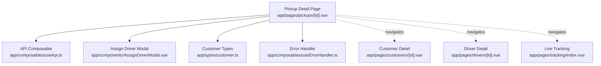
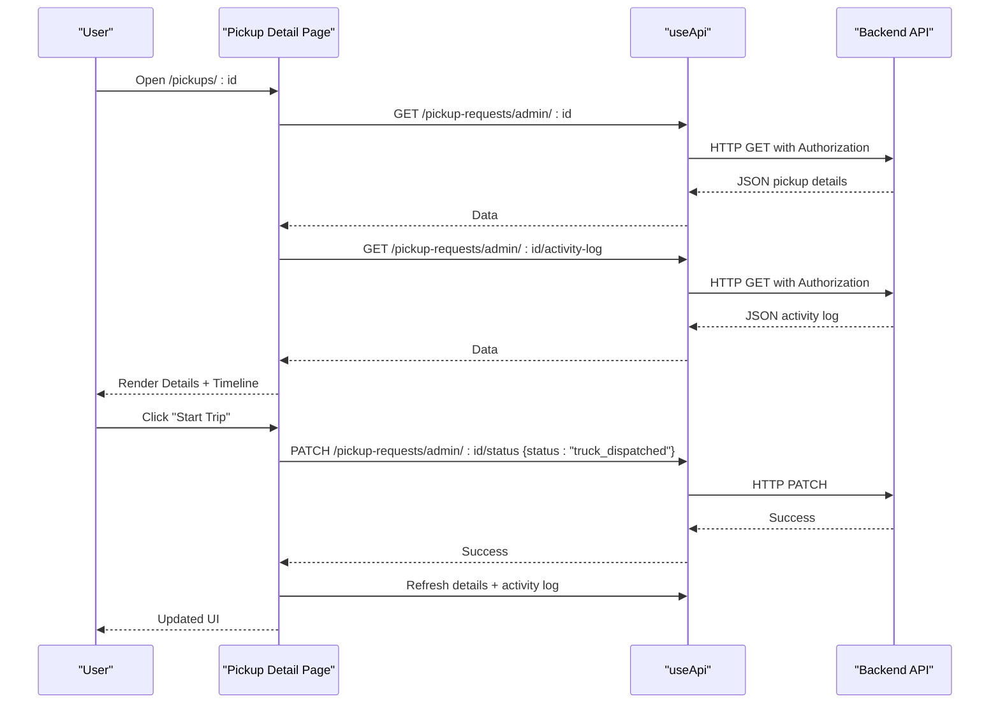
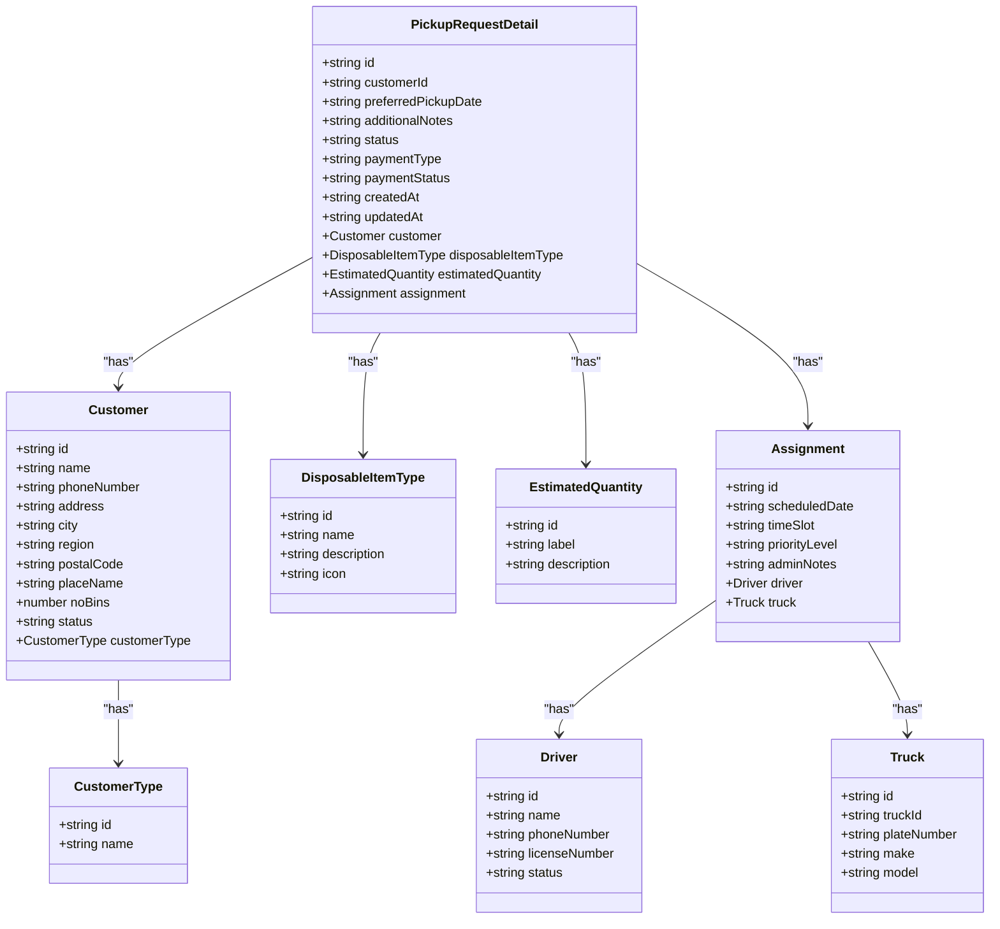
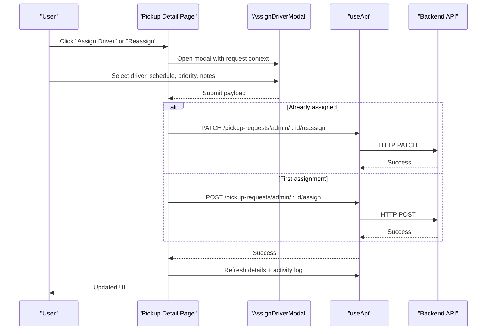
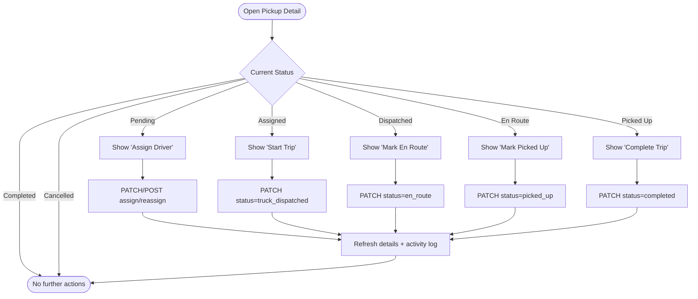
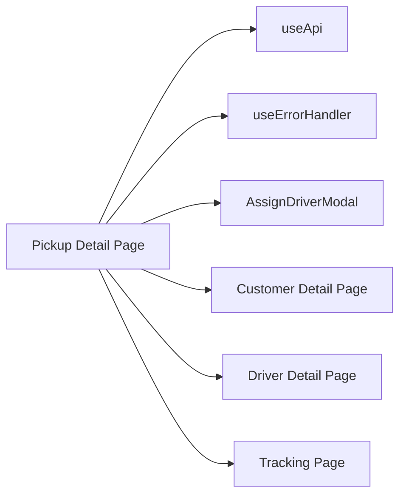

# Pickup Request Detail View

<cite>
**Referenced Files in This Document**
- [app/pages/pickups/[id].vue](file://app/pages/pickups/[id].vue)
- [app/components/AssignDriverModal.vue](file://app/components/AssignDriverModal.vue)
- [app/composables/useApi.ts](file://app/composables/useApi.ts)
- [app/composables/useErrorHandler.ts](file://app/composables/useErrorHandler.ts)
- [app/types/customer.ts](file://app/types/customer.ts)
- [app/pages/customers/[id].vue](file://app/pages/customers/[id].vue)
- [app/pages/drivers/[id].vue](file://app/pages/drivers/[id].vue)
- [app/pages/tracking/index.vue](file://app/pages/tracking/index.vue)
</cite>

## Table of Contents
1. [Introduction](#introduction)
2. [Project Structure](#project-structure)
3. [Core Components](#core-components)
4. [Architecture Overview](#architecture-overview)
5. [Detailed Component Analysis](#detailed-component-analysis)
6. [Dependency Analysis](#dependency-analysis)
7. [Performance Considerations](#performance-considerations)
8. [Troubleshooting Guide](#troubleshooting-guide)
9. [Conclusion](#conclusion)

## Introduction
This document explains the Pickup Request Detail View, a page that displays comprehensive information for an individual pickup request. It covers:
- Detailed information display (pickup metadata, customer profile integration, driver assignment details)
- Pickup history timeline and activity log
- Real-time tracking integration points
- Page layout, data organization, and interactive actions
- Integration with Customer Management, Driver Profiles, and Billing systems
- Data fetching strategies, error handling, and real-time update capabilities

The goal is to help both technical and non-technical users understand how the detail view works, what data it shows, and how to perform key operations from this interface.

## Project Structure
The Pickup Request Detail View is implemented as a Nuxt page component with supporting composables and modals. The relevant files include:
- The main detail page: app/pages/pickups/[id].vue
- Assignment modal: app/components/AssignDriverModal.vue
- API composable: app/composables/useApi.ts
- Error handler composable: app/composables/useErrorHandler.ts
- Customer types: app/types/customer.ts
- Related pages for cross-module navigation: customers/[id].vue, drivers/[id].vue, tracking/index.vue

**Diagram sources**
- [app/pages/pickups/[id].vue](file://app/pages/pickups/[id].vue)
- [app/components/AssignDriverModal.vue](file://app/components/AssignDriverModal.vue)
- [app/composables/useApi.ts](file://app/composables/useApi.ts)
- [app/composables/useErrorHandler.ts](file://app/composables/useErrorHandler.ts)
- [app/types/customer.ts](file://app/types/customer.ts)
- [app/pages/customers/[id].vue](file://app/pages/customers/[id].vue)
- [app/pages/drivers/[id].vue](file://app/pages/drivers/[id].vue)
- [app/pages/tracking/index.vue](file://app/pages/tracking/index.vue)

**Section sources**
- [app/pages/pickups/[id].vue](file://app/pages/pickups/[id].vue)
- [app/components/AssignDriverModal.vue](file://app/components/AssignDriverModal.vue)
- [app/composables/useApi.ts](file://app/composables/useApi.ts)
- [app/composables/useErrorHandler.ts](file://app/composables/useErrorHandler.ts)
- [app/types/customer.ts](file://app/types/customer.ts)
- [app/pages/customers/[id].vue](file://app/pages/customers/[id].vue)
- [app/pages/drivers/[id].vue](file://app/pages/drivers/[id].vue)
- [app/pages/tracking/index.vue](file://app/pages/tracking/index.vue)

## Core Components
- Pickup Detail Page: Loads pickup details and activity log, renders tabs (Details, Activity Log), and exposes action buttons to transition status (Start Trip, Mark En Route, Mark Picked Up, Complete Trip, Cancel). It also opens the Assign/Reassign Driver modal.
- Assign Driver Modal: Presents available drivers and scheduling options; submits assign or reassign requests based on whether a driver is already assigned.
- API Composable: Centralized HTTP client with authentication headers, error handling, and typed wrappers (get/post/put/patch/del).
- Error Handler: Wraps async calls to show toast errors and return null on failure.
- Customer Types: Shared type definitions used across modules for consistent data shapes.

Key responsibilities:
- Fetching and displaying pickup metadata, customer info, and driver/truck assignment
- Rendering a progress timeline and activity log
- Managing state transitions via PATCH endpoints
- Opening modals for assigning/reassigning drivers
- Navigating to related customer and driver profiles

**Section sources**
- [app/pages/pickups/[id].vue](file://app/pages/pickups/[id].vue)
- [app/components/AssignDriverModal.vue](file://app/components/AssignDriverModal.vue)
- [app/composables/useApi.ts](file://app/composables/useApi.ts)
- [app/composables/useErrorHandler.ts](file://app/composables/useErrorHandler.ts)
- [app/types/customer.ts](file://app/types/customer.ts)

## Architecture Overview
The detail view follows a simple client-side architecture:
- UI layer: Vue components render data and handle user interactions
- State management: Local reactive refs and computed properties
- Data access: useApi composable wraps fetch calls with auth and error handling
- Cross-module integration: Navigation links to customer and driver detail pages; optional link to live tracking

**Diagram sources**
- [app/pages/pickups/[id].vue](file://app/pages/pickups/[id].vue)
- [app/composables/useApi.ts](file://app/composables/useApi.ts)

## Detailed Component Analysis

### Pickup Request Detail Page
- Layout: Header card with ID, status badge, quick summary (customer, zone, date/time slot, driver/truck if assigned), and contextual action buttons.
- Stat cards: Payment type, disposable type, payment status, estimated quantity.
- Tabs:
  - Details: Two-column grid showing pickup information and customer/driver sections.
  - Activity Log: Progress timeline and tabular activity entries.
- Actions:
  - Start Trip (when assigned)
  - Mark En Route (when truck dispatched)
  - Mark Picked Up (when en route)
  - Complete Trip (when picked up)
  - Track Driver (when assigned/dispatched/en route/picked up)
  - Assign/Reassign Driver (when pending/assigned/dispatched)
  - Cancel (when not completed/cancelled)

Data model highlights:
- PickupRequestDetail includes nested customer, disposable item type, estimated quantity, and assignment (driver/truck).
- ActivityLogResponse includes timeline milestones and activities array.

Status mapping:
- Status badges are color-coded for Pending, Assigned, Dispatched, En Route, Picked Up, Completed, Cancelled.
- Payment status badges map Active Plan/Paid/Unpaid.

Interactions:
- On mount, fetches pickup details and activity log.
- Each status change triggers refresh of details and activity log.
- Reassign flow uses either POST /assign or PATCH /reassign depending on existing assignment.

Real-time tracking integration:
- A “Track Driver” button is present when a driver is assigned or later in the workflow. The actual map and SSE stream are implemented in the dedicated tracking pages.

Caching and persistence:
- No explicit caching mechanism is implemented in this page; data is fetched on demand.
- No local storage or Pinia store usage for pickup data.

Accessibility and responsiveness:
- Responsive styles adjust grids and buttons for smaller screens.

**Section sources**
- [app/pages/pickups/[id].vue](file://app/pages/pickups/[id].vue)

#### Class Diagram: Pickup Detail Data Model

**Diagram sources**
- [app/pages/pickups/[id].vue](file://app/pages/pickups/[id].vue)

#### Sequence Diagram: Assign/Reassign Flow

**Diagram sources**
- [app/pages/pickups/[id].vue](file://app/pages/pickups/[id].vue)
- [app/components/AssignDriverModal.vue](file://app/components/AssignDriverModal.vue)
- [app/composables/useApi.ts](file://app/composables/useApi.ts)

#### Flowchart: Status Transitions

**Diagram sources**
- [app/pages/pickups/[id].vue](file://app/pages/pickups/[id].vue)

### Assign Driver Modal
- Displays request summary (ID, customer, address, date/time, bin type, payment type/detail, notes).
- Loads active drivers from the backend and allows selecting a driver.
- Supports scheduling date/time slot selection and priority level.
- Emits submit event with structured payload; parent decides whether to call assign or reassign endpoint.

Integration points:
- Uses useApi to fetch drivers list.
- Parent page handles different endpoints based on existing assignment.

**Section sources**
- [app/components/AssignDriverModal.vue](file://app/components/AssignDriverModal.vue)
- [app/composables/useApi.ts](file://app/composables/useApi.ts)

### API Composable and Error Handling
- useApi:
  - Adds Authorization header using stored token.
  - Builds full URL from runtime config base.
  - Handles 401 by logging out and redirecting to login.
  - Treats 200/201/204 as success; otherwise throws with message.
  - Provides typed helpers get/post/put/patch/del wrapped with error handling.
- useErrorHandler:
  - Wraps async functions to catch errors, show toast notifications, and return null on failure.

Usage patterns:
- Pages call api.get/patch/post with descriptive titles for error toasts.
- Errors are logged and surfaced to users without crashing the app.

**Section sources**
- [app/composables/useApi.ts](file://app/composables/useApi.ts)
- [app/composables/useErrorHandler.ts](file://app/composables/useErrorHandler.ts)

### Customer Profile Integration
- The pickup detail view embeds customer fields (name, phone, type, bins) directly from the pickup response.
- For deeper customer insights (e.g., billing, GPS location, full history), navigate to the customer detail page.
- The customer detail page provides:
  - Overview, Pickup History, Billing, GPS Location tabs
  - Pagination for pickup history
  - Summary metrics (total pickups, completed, missed)
  - Billing summaries and invoice listings

Cross-linking:
- From pickup detail, users can open the customer detail page to explore more context.

**Section sources**
- [app/pages/pickups/[id].vue](file://app/pages/pickups/[id].vue)
- [app/pages/customers/[id].vue](file://app/pages/customers/[id].vue)
- [app/types/customer.ts](file://app/types/customer.ts)

### Driver Assignment Details
- When assigned, the pickup detail view shows driver name, phone, license, truck plate, and truck details.
- The driver detail page provides:
  - Current route with stops, progress, estimated completion
  - Route history table
  - Performance metrics and charts
  - Earnings breakdown

Cross-linking:
- From pickup detail, users can open the driver detail page to inspect performance and current route.

**Section sources**
- [app/pages/pickups/[id].vue](file://app/pages/pickups/[id].vue)
- [app/pages/drivers/[id].vue](file://app/pages/drivers/[id].vue)

### Real-Time Tracking Information
- The pickup detail view includes a “Track Driver” button when a driver is assigned or later in the workflow.
- Actual real-time tracking is implemented in the tracking pages:
  - Live Tracking page connects to an SSE stream at /tracking/sse/drivers
  - Updates driver positions on a MapLibre map with custom markers
  - Shows online/offline status, speed, heading, and last recorded time

Integration note:
- While the detail view does not embed the map, it provides a direct path to the tracking interface where real-time updates occur.

**Section sources**
- [app/pages/pickups/[id].vue](file://app/pages/pickups/[id].vue)
- [app/pages/tracking/index.vue](file://app/pages/tracking/index.vue)

## Dependency Analysis
- Pickup Detail Page depends on:
  - useApi for all HTTP requests
  - useErrorHandler for consistent error feedback
  - AssignDriverModal for assignment workflows
  - Customer and Driver detail pages for cross-navigation
  - Tracking pages for real-time monitoring

**Diagram sources**
- [app/pages/pickups/[id].vue](file://app/pages/pickups/[id].vue)
- [app/components/AssignDriverModal.vue](file://app/components/AssignDriverModal.vue)
- [app/composables/useApi.ts](file://app/composables/useApi.ts)
- [app/composables/useErrorHandler.ts](file://app/composables/useErrorHandler.ts)
- [app/pages/customers/[id].vue](file://app/pages/customers/[id].vue)
- [app/pages/drivers/[id].vue](file://app/pages/drivers/[id].vue)
- [app/pages/tracking/index.vue](file://app/pages/tracking/index.vue)

**Section sources**
- [app/pages/pickups/[id].vue](file://app/pages/pickups/[id].vue)
- [app/components/AssignDriverModal.vue](file://app/components/AssignDriverModal.vue)
- [app/composables/useApi.ts](file://app/composables/useApi.ts)
- [app/composables/useErrorHandler.ts](file://app/composables/useErrorHandler.ts)
- [app/pages/customers/[id].vue](file://app/pages/customers/[id].vue)
- [app/pages/drivers/[id].vue](file://app/pages/drivers/[id].vue)
- [app/pages/tracking/index.vue](file://app/pages/tracking/index.vue)

## Performance Considerations
- Data fetching strategy:
  - Two initial requests on mount: pickup details and activity log
  - Subsequent requests triggered by user actions (status changes, assignments)
- No caching:
  - Each action refreshes data immediately after success
- Potential optimizations:
  - Introduce short-lived cache for activity log to reduce redundant reads
  - Debounce rapid status changes to avoid excessive network calls
  - Lazy-load heavy resources (e.g., maps) only when needed
- Real-time updates:
  - Tracking is handled separately via SSE; consider integrating lightweight polling or SSE into the detail view if inline tracking is required

[No sources needed since this section provides general guidance]

## Troubleshooting Guide
Common issues and resolutions:
- Authentication failures:
  - 401 responses trigger logout and redirect to login via useApi
- Network errors:
  - useErrorHandler shows toast messages with descriptive titles
- Missing data:
  - Ensure backend endpoints return expected structures; verify IDs and routes
- Assignment errors:
  - Confirm correct endpoint usage (assign vs reassign) and payload format
- Real-time tracking not updating:
  - Verify SSE connection and authorization headers in tracking pages

**Section sources**
- [app/composables/useApi.ts](file://app/composables/useApi.ts)
- [app/composables/useErrorHandler.ts](file://app/composables/useErrorHandler.ts)
- [app/pages/pickups/[id].vue](file://app/pages/pickups/[id].vue)

## Conclusion
The Pickup Request Detail View provides a comprehensive interface for managing individual pickup requests. It integrates customer and driver information, supports end-to-end status transitions, and offers clear pathways to related modules such as customer profiles, driver details, and real-time tracking. The implementation leverages a centralized API composable and robust error handling to ensure reliability and consistency across the application.

[No sources needed since this section summarizes without analyzing specific files]