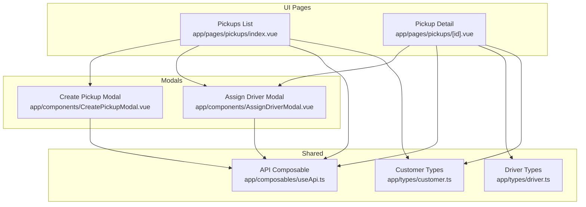
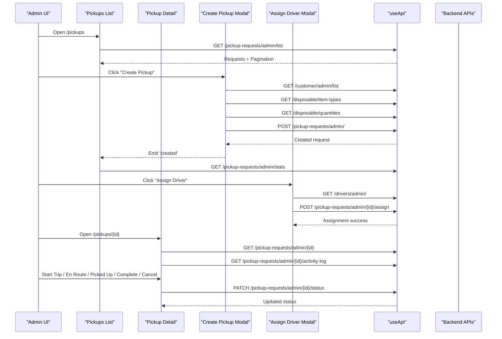
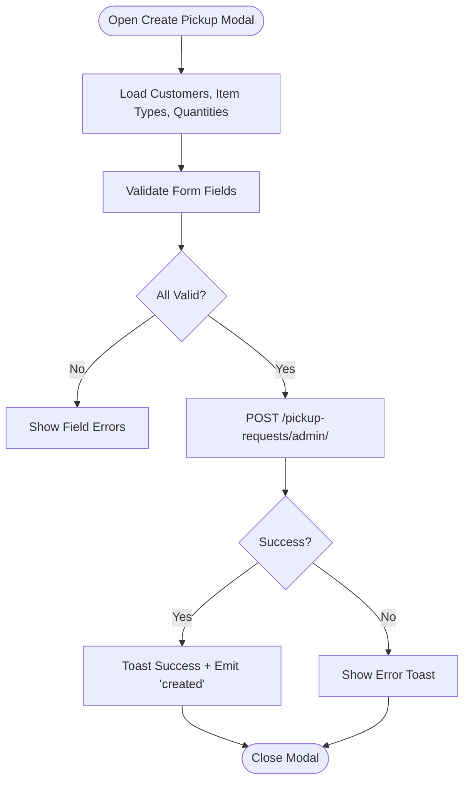
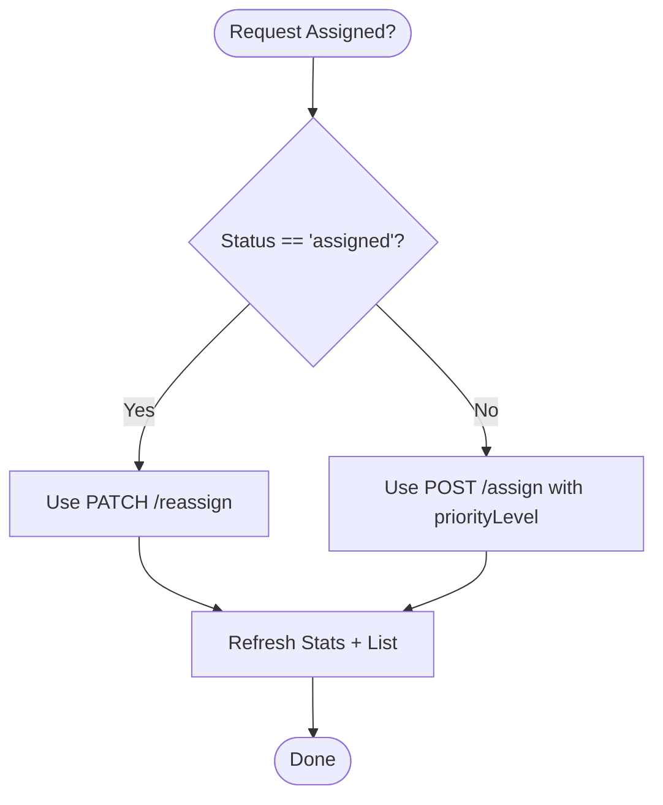
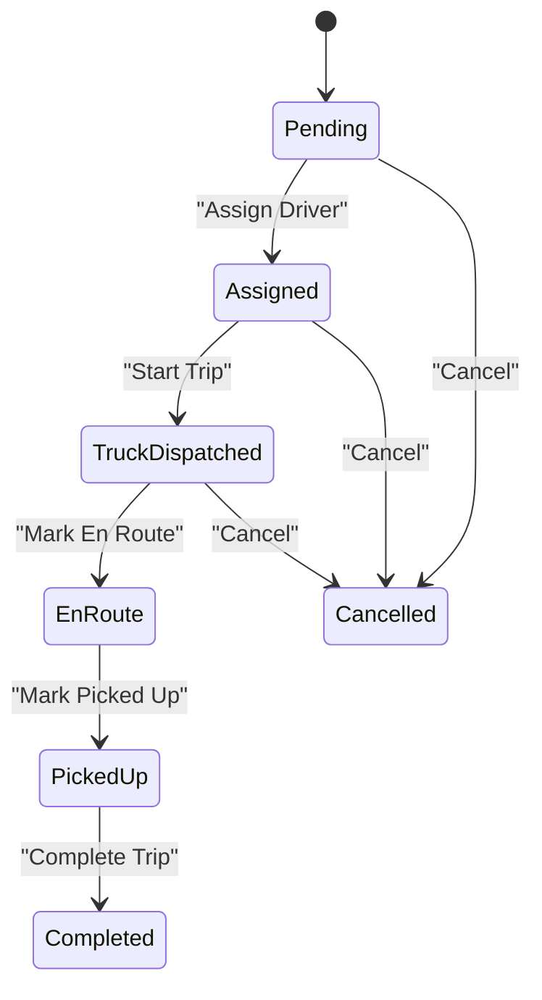
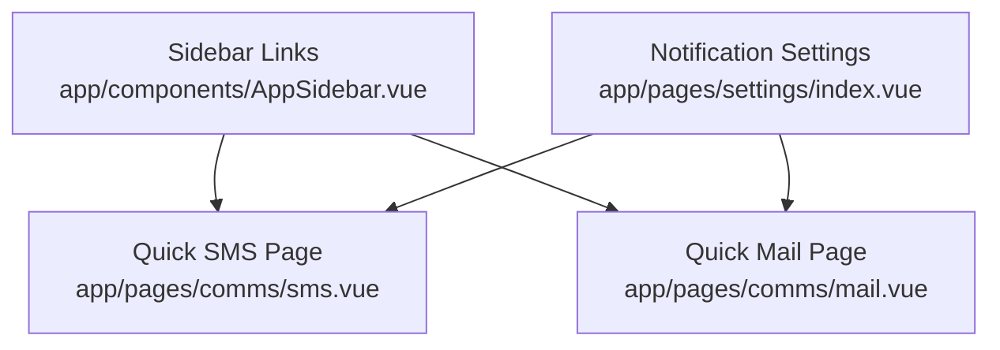
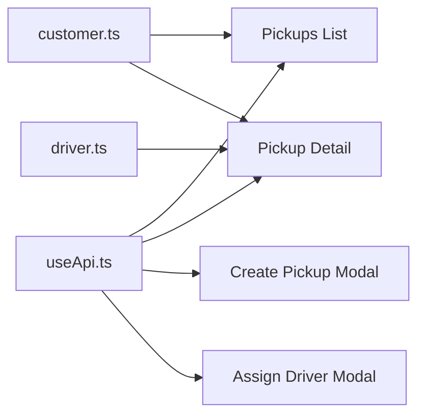

# Pickup Request Processing

<cite>
**Referenced Files in This Document**
- [app/pages/pickups/index.vue](file://app/pages/pickups/index.vue)
- [app/pages/pickups/[id].vue](file://app/pages/pickups/[id].vue)
- [app/components/CreatePickupModal.vue](file://app/components/CreatePickupModal.vue)
- [app/components/AssignDriverModal.vue](file://app/components/AssignDriverModal.vue)
- [app/composables/useApi.ts](file://app/composables/useApi.ts)
- [app/types/driver.ts](file://app/types/driver.ts)
- [app/types/customer.ts](file://app/types/customer.ts)
- [app/pages/customers/[id].vue](file://app/pages/customers/[id].vue)
</cite>

## Table of Contents
1. [Introduction](#introduction)
2. [Project Structure](#project-structure)
3. [Core Components](#core-components)
4. [Architecture Overview](#architecture-overview)
5. [Detailed Component Analysis](#detailed-component-analysis)
6. [Dependency Analysis](#dependency-analysis)
7. [Performance Considerations](#performance-considerations)
8. [Troubleshooting Guide](#troubleshooting-guide)
9. [Conclusion](#conclusion)
10. [Appendices](#appendices)

## Introduction
This document explains the pickup request processing workflow implemented in the console application. It covers how a pickup request is created and validated, how drivers are assigned (including reassignment), how status transitions are managed, and how customer communication features integrate with the system. The lifecycle spans from creation to completion, including real-time status updates via activity logs and timeline visualization.

## Project Structure
The pickup request feature is primarily implemented across:
- A list page for browsing, filtering, and assigning/reassigning requests
- A detail page for managing lifecycle transitions and viewing activity logs
- Modals for creating new requests and assigning drivers
- Shared API utilities and type definitions for driver and customer data

**Diagram sources**
- [app/pages/pickups/index.vue:1-567](file://app/pages/pickups/index.vue#L1-L567)
- [app/pages/pickups/[id].vue](file://app/pages/pickups/[id].vue#L1-L841)
- [app/components/CreatePickupModal.vue:1-293](file://app/components/CreatePickupModal.vue#L1-L293)
- [app/components/AssignDriverModal.vue:1-222](file://app/components/AssignDriverModal.vue#L1-L222)
- [app/composables/useApi.ts:1-91](file://app/composables/useApi.ts#L1-L91)
- [app/types/driver.ts:1-106](file://app/types/driver.ts#L1-L106)
- [app/types/customer.ts:1-103](file://app/types/customer.ts#L1-L103)

**Section sources**
- [app/pages/pickups/index.vue:1-567](file://app/pages/pickups/index.vue#L1-L567)
- [app/pages/pickups/[id].vue:1-841](file://app/pages/pickups/[id].vue#L1-L841)
- [app/components/CreatePickupModal.vue:1-293](file://app/components/CreatePickupModal.vue#L1-L293)
- [app/components/AssignDriverModal.vue:1-222](file://app/components/AssignDriverModal.vue#L1-L222)
- [app/composables/useApi.ts:1-91](file://app/composables/useApi.ts#L1-L91)
- [app/types/driver.ts:1-106](file://app/types/driver.ts#L1-L106)
- [app/types/customer.ts:1-103](file://app/types/customer.ts#L1-L103)

## Core Components
- Pickups List Page: Displays all pickup requests with filters and pagination; supports creating new requests and assigning or reassigning drivers.
- Pickup Detail Page: Shows full request details, timeline, activity log, and provides actions to transition statuses (start trip, en route, picked up, complete, cancel).
- Create Pickup Modal: Validates and submits a new pickup request, loading customers, disposable item types, and estimated quantities.
- Assign Driver Modal: Loads available drivers and collects scheduling and priority information for assignment or reassignment.
- API Composable: Centralized HTTP client with authentication, error handling, and typed helpers.
- Type Definitions: Strongly-typed models for drivers, trucks, and customers used across pages and modals.

**Section sources**
- [app/pages/pickups/index.vue:1-567](file://app/pages/pickups/index.vue#L1-L567)
- [app/pages/pickups/[id].vue:1-L841](file://app/pages/pickups/[id].vue#L1-L841)
- [app/components/CreatePickupModal.vue:1-293](file://app/components/CreatePickupModal.vue#L1-L293)
- [app/components/AssignDriverModal.vue:1-222](file://app/components/AssignDriverModal.vue#L1-L222)
- [app/composables/useApi.ts:1-91](file://app/composables/useApi.ts#L1-L91)
- [app/types/driver.ts:1-106](file://app/types/driver.ts#L1-L106)
- [app/types/customer.ts:1-103](file://app/types/customer.ts#L1-L103)

## Architecture Overview
The frontend orchestrates the entire pickup workflow by calling backend endpoints through a shared API composable. Key flows include:
- Creating a pickup request
- Listing and filtering requests
- Assigning or reassigning drivers
- Transitioning request status
- Viewing detailed activity logs and timeline

**Diagram sources**
- [app/pages/pickups/index.vue:1-567](file://app/pages/pickups/index.vue#L1-L567)
- [app/pages/pickups/[id].vue:1-L841](file://app/pages/pickups/[id].vue#L1-L841)
- [app/components/CreatePickupModal.vue:1-293](file://app/components/CreatePickupModal.vue#L1-L293)
- [app/components/AssignDriverModal.vue:1-222](file://app/components/AssignDriverModal.vue#L1-L222)
- [app/composables/useApi.ts:1-91](file://app/composables/useApi.ts#L1-L91)

## Detailed Component Analysis

### Request Creation and Validation
- Data Loading: The modal loads customers (paginated), disposable item types, and active estimated quantities.
- Validation Rules:
  - Customer selection required
  - Disposable item type required
  - Estimated quantity required
  - Preferred pickup date required
  - Additional notes limited to 500 characters
- Submission: Creates a pickup request with payment type set to subscription and includes additional notes.

**Diagram sources**
- [app/components/CreatePickupModal.vue:1-293](file://app/components/CreatePickupModal.vue#L1-L293)

**Section sources**
- [app/components/CreatePickupModal.vue:1-293](file://app/components/CreatePickupModal.vue#L1-L293)

### Automated Assignment Algorithms
- Current Implementation: Manual driver selection via dropdown. No automated matching algorithm is present in the frontend.
- Available Drivers: Loaded from the drivers admin endpoint and filtered to active or online statuses.
- Optimization Opportunities:
  - Zone-based matching using customer zone and driver zone
  - Time slot capacity constraints
  - Priority-driven dispatch (low, normal, high, urgent)
  - Distance/routing optimization using map SDKs (conceptual)

**Diagram sources**
- [app/pages/pickups/index.vue:1-567](file://app/pages/pickups/index.vue#L1-L567)
- [app/components/AssignDriverModal.vue:1-222](file://app/components/AssignDriverModal.vue#L1-L222)

**Section sources**
- [app/pages/pickups/index.vue:1-567](file://app/pages/pickups/index.vue#L1-L567)
- [app/components/AssignDriverModal.vue:1-222](file://app/components/AssignDriverModal.vue#L1-L222)

### Status Tracking and Workflow Management
- Lifecycle States: pending → assigned → truck_dispatched → en_route → picked_up → completed (or cancelled at various stages).
- Actions:
  - Start Trip: transitions to truck_dispatched
  - Mark En Route: transitions to en_route
  - Mark Picked Up: transitions to picked_up
  - Complete Trip: transitions to completed
  - Cancel: transitions to cancelled
- Activity Log: Fetches timeline and activities for auditability and transparency.

**Diagram sources**
- [app/pages/pickups/[id].vue:1-L841](file://app/pages/pickups/[id].vue#L1-L841)

**Section sources**
- [app/pages/pickups/[id].vue:1-L841](file://app/pages/pickups/[id].vue#L1-L841)

### Customer Communication Integration
- Quick SMS and Mail: Dedicated pages allow sending bulk messages to customers by zone or custom lists.
- Notification Settings: Configuration toggles for email/SMS notifications on events like new pickup, driver assigned, payment received.
- Integration Pattern: While not directly tied to pickup lifecycle automation in the frontend, these tools enable manual or scheduled communications around pickup events.

**Diagram sources**
- [app/components/AppSidebar.vue:21-42](file://app/components/AppSidebar.vue#L21-L42)
- [app/pages/comms/sms.vue:1-158](file://app/pages/comms/sms.vue#L1-L158)
- [app/pages/settings/index.vue:350-363](file://app/pages/settings/index.vue#L350-L363)

**Section sources**
- [app/components/AppSidebar.vue:21-42](file://app/components/AppSidebar.vue#L21-L42)
- [app/pages/comms/sms.vue:1-158](file://app/pages/comms/sms.vue#L1-L158)
- [app/pages/settings/index.vue:350-363](file://app/pages/settings/index.vue#L350-L363)

### Concrete Examples

#### Creating a New Pickup Request
- Steps:
  - Open the Create Pickup modal from the pickups list page
  - Search and select a customer
  - Choose a disposable item type and estimated quantity
  - Set preferred pickup date and optional notes
  - Submit to create the request
- Result:
  - Success toast shown
  - List refreshes and stats update

**Section sources**
- [app/pages/pickups/index.vue:1-567](file://app/pages/pickups/index.vue#L1-L567)
- [app/components/CreatePickupModal.vue:1-293](file://app/components/CreatePickupModal.vue#L1-L293)

#### Assigning a Driver
- Steps:
  - From the list or detail page, open the Assign Driver modal
  - Select an available driver
  - Choose scheduled date and time slot
  - Set priority level (for initial assignment)
  - Add admin notes if needed
  - Submit to assign or reassign
- Behavior:
  - If already assigned, uses reassign endpoint without priority
  - Otherwise, uses assign endpoint with priority

**Section sources**
- [app/pages/pickups/index.vue:1-567](file://app/pages/pickups/index.vue#L1-L567)
- [app/components/AssignDriverModal.vue:1-222](file://app/components/AssignDriverModal.vue#L1-L222)

#### Tracking Request Progress
- Steps:
  - Navigate to the pickup detail page
  - Review timeline steps and activity log entries
  - Use action buttons to transition status as operations progress
- Outcome:
  - Real-time updates reflected in UI after each status change

**Section sources**
- [app/pages/pickups/[id].vue:1-L841](file://app/pages/pickups/[id].vue#L1-L841)

## Dependency Analysis
- API Layer: All HTTP interactions go through useApi, which handles auth headers, error logging, and redirects on 401.
- Data Models: Driver and Customer types define shapes used across pages and modals.
- Cross-Page Integration:
  - List page fetches stats and requests, opens modals, and triggers refreshes
  - Detail page fetches details and activity logs, performs status transitions
  - Customer history integration shows pickup counts and statuses per customer

**Diagram sources**
- [app/composables/useApi.ts:1-91](file://app/composables/useApi.ts#L1-L91)
- [app/types/driver.ts:1-106](file://app/types/driver.ts#L1-L106)
- [app/types/customer.ts:1-103](file://app/types/customer.ts#L1-L103)
- [app/pages/pickups/index.vue:1-567](file://app/pages/pickups/index.vue#L1-L567)
- [app/pages/pickups/[id].vue:1-L841](file://app/pages/pickups/[id].vue#L1-L841)
- [app/components/CreatePickupModal.vue:1-293](file://app/components/CreatePickupModal.vue#L1-L293)
- [app/components/AssignDriverModal.vue:1-222](file://app/components/AssignDriverModal.vue#L1-L222)

**Section sources**
- [app/composables/useApi.ts:1-91](file://app/composables/useApi.ts#L1-L91)
- [app/types/driver.ts:1-106](file://app/types/driver.ts#L1-L106)
- [app/types/customer.ts:1-103](file://app/types/customer.ts#L1-L103)
- [app/pages/pickups/index.vue:1-567](file://app/pages/pickups/index.vue#L1-L567)
- [app/pages/pickups/[id].vue:1-L841](file://app/pages/pickups/[id].vue#L1-L841)
- [app/components/CreatePickupModal.vue:1-293](file://app/components/CreatePickupModal.vue#L1-L293)
- [app/components/AssignDriverModal.vue:1-222](file://app/components/AssignDriverModal.vue#L1-L222)

## Performance Considerations
- Pagination: Both customer list and pickup requests are paginated to reduce payload sizes.
- Parallel Fetching: Initial load uses Promise.all to fetch stats and requests concurrently.
- Filtering Client-Side: Filters applied locally for performance; server-side filtering supported via query parameters.
- Avoid Redundant Calls: Refresh only necessary endpoints after mutations (e.g., stats and list after assignment).

[No sources needed since this section provides general guidance]

## Troubleshooting Guide
- Authentication Failures:
  - 401 responses trigger logout and redirect to login via useApi
- Network Errors:
  - useApi wraps errors with user-friendly messages and logs request/response details
- Assignment Issues:
  - Ensure driver selected is active or online
  - Confirm time slot mapping matches backend expectations
- Status Transitions:
  - Verify current status allows the intended transition
  - Check activity log for recent changes that may affect state

**Section sources**
- [app/composables/useApi.ts:1-91](file://app/composables/useApi.ts#L1-L91)
- [app/pages/pickups/index.vue:1-567](file://app/pages/pickups/index.vue#L1-L567)
- [app/pages/pickups/[id].vue:1-L841](file://app/pages/pickups/[id].vue#L1-L841)

## Conclusion
The pickup request processing workflow is fully implemented in the frontend with clear separation of concerns: list management, detail tracking, modal-driven creation and assignment, and centralized API handling. While driver assignment is currently manual, the architecture supports future enhancements such as automated matching based on zones, priorities, and routing optimization. Customer communication tools complement the operational flow by enabling timely notifications.

[No sources needed since this section summarizes without analyzing specific files]

## Appendices

### API Endpoints Used
- GET /pickup-requests/admin/list
- GET /pickup-requests/admin/stats
- POST /pickup-requests/admin/
- GET /pickup-requests/admin/{id}
- GET /pickup-requests/admin/{id}/activity-log
- PATCH /pickup-requests/admin/{id}/status
- POST /pickup-requests/admin/{id}/assign
- PATCH /pickup-requests/admin/{id}/reassign
- GET /drivers/admin/
- GET /customer/admin/list
- GET /disposable/item-types
- GET /disposable/quantities

**Section sources**
- [app/pages/pickups/index.vue:1-567](file://app/pages/pickups/index.vue#L1-L567)
- [app/pages/pickups/[id].vue:1-L841](file://app/pages/pickups/[id].vue#L1-L841)
- [app/components/CreatePickupModal.vue:1-293](file://app/components/CreatePickupModal.vue#L1-L293)
- [app/components/AssignDriverModal.vue:1-222](file://app/components/AssignDriverModal.vue#L1-L222)

### Customer Pickup History Integration
- Endpoint: GET /pickup-requests/admin/customers/{id}/history
- Usage: Aggregates completed and missed pickups per customer for reporting

**Section sources**
- [app/pages/customers/[id].vue:274-L302](file://app/pages/customers/[id].vue#L274-L302)