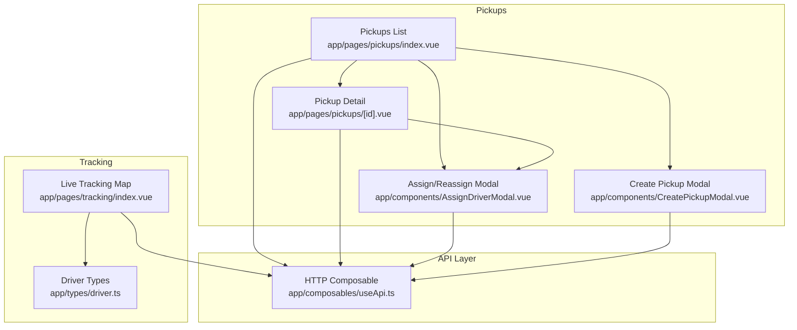
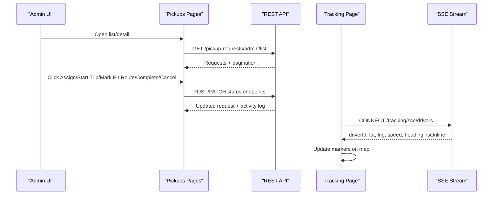
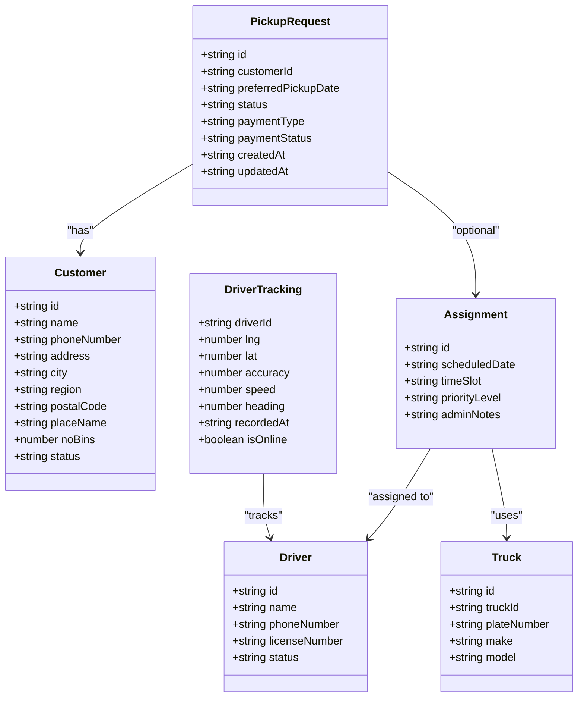
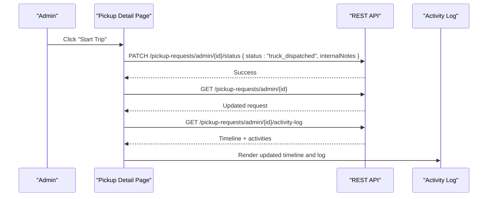
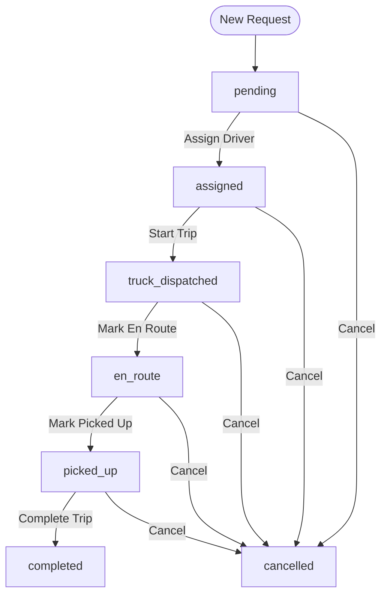
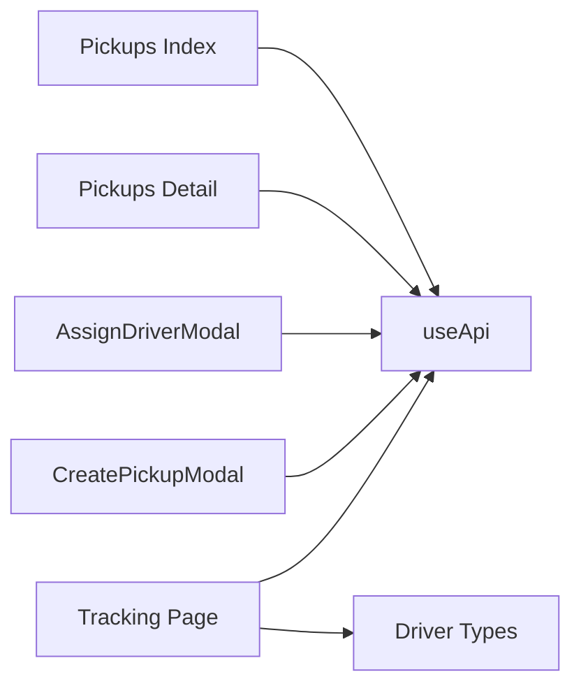

# Status Tracking & Workflow Management

<cite>
**Referenced Files in This Document**
- [index.vue](file://app/pages/pickups/index.vue)
- [id.vue](file://app/pages/pickups/[id].vue)
- [AssignDriverModal.vue](file://app/components/AssignDriverModal.vue)
- [CreatePickupModal.vue](file://app/components/CreatePickupModal.vue)
- [useApi.ts](file://app/composables/useApi.ts)
- [tracking/index.vue](file://app/pages/tracking/index.vue)
- [driver.ts](file://app/types/driver.ts)
</cite>

## Table of Contents
1. [Introduction](#introduction)
2. [Project Structure](#project-structure)
3. [Core Components](#core-components)
4. [Architecture Overview](#architecture-overview)
5. [Detailed Component Analysis](#detailed-component-analysis)
6. [Dependency Analysis](#dependency-analysis)
7. [Performance Considerations](#performance-considerations)
8. [Troubleshooting Guide](#troubleshooting-guide)
9. [Conclusion](#conclusion)
10. [Appendices](#appendices)

## Introduction
This document explains the pickup request status tracking and workflow management system implemented in the console application. It covers the full lifecycle from creation to completion, including intermediate states such as assigned, dispatched, en_route, and picked_up. It documents:
- Status transition rules and how they are enforced by UI actions
- Automated state changes (as reflected by activity log timestamps)
- Manual status updates via admin operations
- Real-time updates and integration with the live tracking module for driver location
- The status badge system and filtering capabilities by status
- API endpoints used for status management and event-driven updates

The goal is to provide both a high-level understanding and code-backed details for developers and operators.

## Project Structure
The relevant parts of the frontend implement:
- Pickup listing and assignment workflows
- Detailed view with timeline and activity log
- Driver assignment modal
- Live tracking map using Server-Sent Events (SSE)

**Diagram sources**
- [index.vue:1-567](file://app/pages/pickups/index.vue#L1-L567)
- [id.vue:1-841](file://app/pages/pickups/[id].vue#L1-L841)
- [AssignDriverModal.vue:1-222](file://app/components/AssignDriverModal.vue#L1-L222)
- [CreatePickupModal.vue:1-293](file://app/components/CreatePickupModal.vue#L1-L293)
- [tracking/index.vue:1-502](file://app/pages/tracking/index.vue#L1-L502)
- [driver.ts:1-106](file://app/types/driver.ts#L1-L106)
- [useApi.ts:1-91](file://app/composables/useApi.ts#L1-L91)

**Section sources**
- [index.vue:1-567](file://app/pages/pickups/index.vue#L1-L567)
- [id.vue:1-841](file://app/pages/pickups/[id].vue#L1-L841)
- [AssignDriverModal.vue:1-222](file://app/components/AssignDriverModal.vue#L1-L222)
- [CreatePickupModal.vue:1-293](file://app/components/CreatePickupModal.vue#L1-L293)
- [tracking/index.vue:1-502](file://app/pages/tracking/index.vue#L1-L502)
- [driver.ts:1-106](file://app/types/driver.ts#L1-L106)
- [useApi.ts:1-91](file://app/composables/useApi.ts#L1-L91)

## Core Components
- Pickup list page: Displays requests, filters by status and payment status, shows status badges, and provides assign/reassign actions.
- Pickup detail page: Shows detailed info, timeline, activity log, and exposes manual status transitions (start trip, mark en route, mark picked up, complete, cancel).
- Assignment modals: Create new pickup requests and assign or reassign drivers with scheduling and priority.
- Tracking page: Connects to SSE stream to display real-time driver locations on a map.
- API composable: Centralized HTTP client with auth headers and error handling.

Key responsibilities:
- State rendering and user interactions
- API calls for CRUD and status updates
- SSE connection for live tracking
- Badge and filter logic for status and payment statuses

**Section sources**
- [index.vue:1-567](file://app/pages/pickups/index.vue#L1-L567)
- [id.vue:1-841](file://app/pages/pickups/[id].vue#L1-L841)
- [AssignDriverModal.vue:1-222](file://app/components/AssignDriverModal.vue#L1-L222)
- [CreatePickupModal.vue:1-293](file://app/components/CreatePickupModal.vue#L1-L293)
- [tracking/index.vue:1-502](file://app/pages/tracking/index.vue#L1-L502)
- [useApi.ts:1-91](file://app/composables/useApi.ts#L1-L91)

## Architecture Overview
The system follows a clear separation between UI components and backend APIs:
- Frontend pages call REST endpoints for listing, creating, assigning, and updating status.
- A dedicated tracking page subscribes to an SSE endpoint for live driver positions.
- Activity logs and timeline reflect automated state changes performed by the backend.

**Diagram sources**
- [index.vue:105-136](file://app/pages/pickups/index.vue#L105-L136)
- [id.vue:290-379](file://app/pages/pickups/[id].vue#L290-L379)
- [tracking/index.vue:251-315](file://app/pages/tracking/index.vue#L251-L315)
- [useApi.ts:1-91](file://app/composables/useApi.ts#L1-L91)

## Detailed Component Analysis

### Lifecycle States and Transition Rules
Supported status values observed in the UI:
- pending
- assigned
- truck_dispatched
- en_route
- picked_up
- completed
- cancelled

Transition rules enforced by UI actions:
- From pending:
  - Assign driver → moves to assigned
- From assigned:
  - Start trip → moves to truck_dispatched
  - Reassign → remains assigned (updates driver/time slot)
- From truck_dispatched:
  - Mark en route → moves to en_route
- From en_route:
  - Mark picked up → moves to picked_up
- From picked_up:
  - Complete trip → moves to completed
- Any non-terminal state:
  - Cancel → moves to cancelled

Automated state changes:
- Activity log and timeline show timestamps for key milestones:
  - Request created
  - Driver assigned
  - Trip started
  - Pickup completed
These indicate backend-driven events that update the request’s status and record audit entries.

Manual status updates:
- Admin can start trip, mark en route, mark picked up, complete, and cancel via PATCH to the status endpoint.

Real-world progression example:
- New request created → pending
- Admin assigns driver → assigned
- Admin starts trip → truck_dispatched
- Driver begins travel → en_route
- Driver arrives and picks up → picked_up
- Admin completes → completed
- At any point before completion/cancelled, admin may cancel

Status badge system:
- Each status maps to a colored badge with label and border/background colors for quick visual identification.

Filtering capabilities:
- Filter buttons allow narrowing the list by status (All, Pending, Assigned, Completed).
- Payment status dropdown allows filtering by Paid, Unpaid, Active Plan.

Integration with tracking module:
- When a request is assigned or later progressed, the “Track Driver” action becomes available, linking to the live tracking page where driver locations are updated in real time via SSE.

**Section sources**
- [index.vue:167-176](file://app/pages/pickups/index.vue#L167-L176)
- [index.vue:492-514](file://app/pages/pickups/index.vue#L492-L514)
- [id.vue:202-214](file://app/pages/pickups/[id].vue#L202-L214)
- [id.vue:290-379](file://app/pages/pickups/[id].vue#L290-L379)
- [id.vue:235-262](file://app/pages/pickups/[id].vue#L235-L262)

#### Class Diagram: Data Models and Relationships

**Diagram sources**
- [id.vue:7-65](file://app/pages/pickups/[id].vue#L7-L65)
- [driver.ts:82-91](file://app/types/driver.ts#L82-L91)

#### Sequence Diagram: Status Update Flow

**Diagram sources**
- [id.vue:290-306](file://app/pages/pickups/[id].vue#L290-L306)
- [id.vue:118-153](file://app/pages/pickups/[id].vue#L118-L153)

#### Flowchart: Status Transitions

**Diagram sources**
- [index.vue:167-176](file://app/pages/pickups/index.vue#L167-L176)
- [id.vue:290-379](file://app/pages/pickups/[id].vue#L290-L379)

### API Endpoints for Status Management
Observed endpoints used by the frontend:
- List and stats
  - GET /pickup-requests/admin/stats
  - GET /pickup-requests/admin/list?status=&paymentStatus=&page=&limit=
- Create
  - POST /pickup-requests/admin/
- Assign/Reassign
  - POST /pickup-requests/admin/{id}/assign
  - PATCH /pickup-requests/admin/{id}/reassign
- Status updates
  - PATCH /pickup-requests/admin/{id}/status
- Details and audit
  - GET /pickup-requests/admin/{id}
  - GET /pickup-requests/admin/{id}/activity-log

Request/response patterns:
- Status update payload includes status and optional internalNotes.
- Assign payload includes driverId, scheduledDate, timeSlot, priorityLevel (for initial assign), and adminNotes.
- Reassign payload omits priorityLevel.

Authentication and errors:
- All requests include Authorization Bearer token via the useApi composable.
- Non-success responses throw typed errors with messages surfaced to users.

**Section sources**
- [index.vue:87-136](file://app/pages/pickups/index.vue#L87-L136)
- [index.vue:187-239](file://app/pages/pickups/index.vue#L187-L239)
- [id.vue:290-379](file://app/pages/pickups/[id].vue#L290-L379)
- [id.vue:118-153](file://app/pages/pickups/[id].vue#L118-L153)
- [CreatePickupModal.vue:131-152](file://app/components/CreatePickupModal.vue#L131-L152)
- [useApi.ts:1-91](file://app/composables/useApi.ts#L1-L91)

### Real-Time Updates and Notification Triggers
- Driver location updates:
  - The tracking page connects to /tracking/sse/drivers using Server-Sent Events.
  - Incoming events contain driverId, lat, lng, speed, heading, recordedAt, and isOnline.
  - The map updates markers dynamically when new data arrives.
- Notification triggers:
  - While not explicitly wired in the analyzed files, the presence of a notifications modal suggests the system supports notification items; however, specific pickup-related triggers are not visible in the provided source.

**Section sources**
- [tracking/index.vue:251-315](file://app/pages/tracking/index.vue#L251-L315)
- [driver.ts:82-91](file://app/types/driver.ts#L82-L91)

### Status Badge System and Filtering
- Status badges:
  - Each status has a distinct color scheme and label for quick recognition.
- Filters:
  - Status filter buttons: All, Pending, Assigned, Completed.
  - Payment status dropdown: All Payment Statuses, Paid, Unpaid, Active Plan.
  - Filters reset pagination and trigger refetch.

**Section sources**
- [index.vue:54-76](file://app/pages/pickups/index.vue#L54-L76)
- [index.vue:167-176](file://app/pages/pickups/index.vue#L167-L176)
- [index.vue:402-424](file://app/pages/pickups/index.vue#L402-L424)

### Integration with Tracking Module
- When a request is assigned or progresses beyond, the detail page exposes a “Track Driver” button.
- The tracking page renders a map with live driver positions sourced from SSE.
- Driver types and tracking data structures are defined centrally.

**Section sources**
- [id.vue:537-543](file://app/pages/pickups/[id].vue#L537-L543)
- [tracking/index.vue:1-502](file://app/pages/tracking/index.vue#L1-L502)
- [driver.ts:82-91](file://app/types/driver.ts#L82-L91)

## Dependency Analysis
Frontend dependencies and relationships:
- Pages depend on the useApi composable for all HTTP interactions.
- Modals encapsulate form logic and emit events to parent pages.
- Tracking page depends on runtime config for API base URL and TomTom SDK initialization.

**Diagram sources**
- [index.vue:85-136](file://app/pages/pickups/index.vue#L85-L136)
- [id.vue:97-153](file://app/pages/pickups/[id].vue#L97-L153)
- [AssignDriverModal.vue:32-56](file://app/components/AssignDriverModal.vue#L32-L56)
- [CreatePickupModal.vue:7-152](file://app/components/CreatePickupModal.vue#L7-L152)
- [tracking/index.vue:7-145](file://app/pages/tracking/index.vue#L7-L145)
- [driver.ts:1-106](file://app/types/driver.ts#L1-L106)
- [useApi.ts:1-91](file://app/composables/useApi.ts#L1-L91)

**Section sources**
- [index.vue:1-567](file://app/pages/pickups/index.vue#L1-L567)
- [id.vue:1-841](file://app/pages/pickups/[id].vue#L1-L841)
- [AssignDriverModal.vue:1-222](file://app/components/AssignDriverModal.vue#L1-L222)
- [CreatePickupModal.vue:1-293](file://app/components/CreatePickupModal.vue#L1-L293)
- [tracking/index.vue:1-502](file://app/pages/tracking/index.vue#L1-L502)
- [driver.ts:1-106](file://app/types/driver.ts#L1-L106)
- [useApi.ts:1-91](file://app/composables/useApi.ts#L1-L91)

## Performance Considerations
- Pagination and server-side filtering reduce payload sizes for large datasets.
- SSE streaming avoids polling overhead for live tracking.
- Local computed filters operate on small in-memory arrays after initial fetch.
- Avoid unnecessary re-renders by keeping reactive state minimal and scoped.

[No sources needed since this section provides general guidance]

## Troubleshooting Guide
Common issues and resolutions:
- Authentication failures:
  - 401 responses trigger logout and redirect to login via the API composable.
- SSE connection problems:
  - Ensure authentication token is present and environment variables are configured.
  - Handle reconnects gracefully; the tracking page provides a reconnect button.
- Map loading errors:
  - Verify container element exists and API keys are set.
- Status update errors:
  - Check network responses and ensure required fields are included in payloads.

Operational checks:
- Confirm endpoints return expected data shapes.
- Validate activity log entries appear after status changes.
- Ensure driver markers update when SSE events arrive.

**Section sources**
- [useApi.ts:39-58](file://app/composables/useApi.ts#L39-L58)
- [tracking/index.vue:251-315](file://app/pages/tracking/index.vue#L251-L315)
- [tracking/index.vue:87-145](file://app/pages/tracking/index.vue#L87-L145)

## Conclusion
The pickup request status tracking and workflow management system provides a robust, user-friendly interface for managing the entire lifecycle of pickups. It enforces clear transition rules through explicit UI actions, records automated changes in an activity log, and integrates real-time driver tracking via SSE. The status badge system and filtering enhance operational visibility, while centralized API handling ensures consistent authentication and error management.

[No sources needed since this section summarizes without analyzing specific files]

## Appendices

### Appendix A: Status Values and Labels
- pending → Pending
- assigned → Assigned
- truck_dispatched → Dispatched
- en_route → En Route
- picked_up → Picked Up
- completed → Completed
- cancelled → Cancelled

**Section sources**
- [index.vue:167-176](file://app/pages/pickups/index.vue#L167-L176)
- [id.vue:202-214](file://app/pages/pickups/[id].vue#L202-L214)

### Appendix B: Key UI Actions and Their Effects
- Assign Driver (from pending) → assigned
- Reassign (from assigned) → assigned (updated driver/time slot)
- Start Trip (from assigned) → truck_dispatched
- Mark En Route (from truck_dispatched) → en_route
- Mark Picked Up (from en_route) → picked_up
- Complete Trip (from picked_up) → completed
- Cancel (non-terminal states) → cancelled

**Section sources**
- [index.vue:492-514](file://app/pages/pickups/index.vue#L492-L514)
- [id.vue:500-562](file://app/pages/pickups/[id].vue#L500-L562)