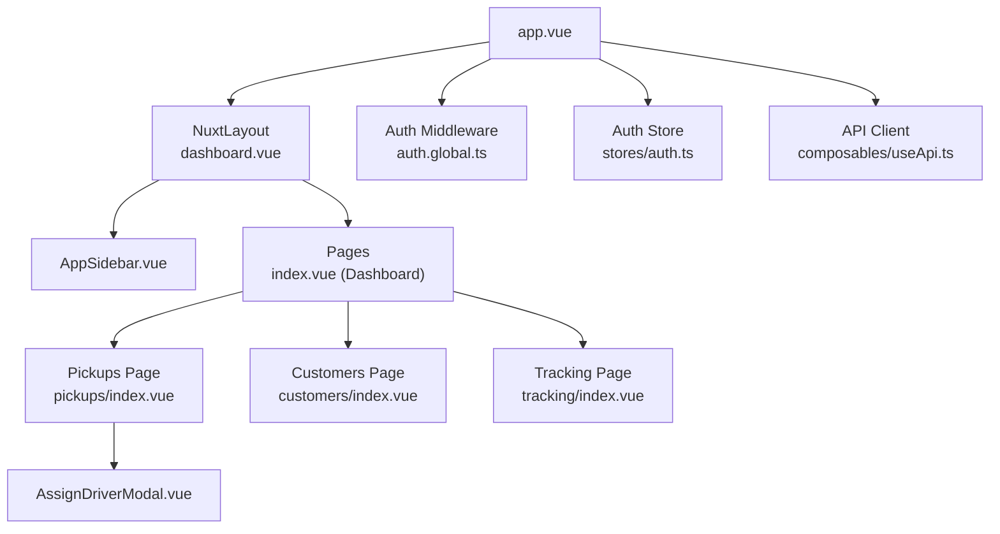
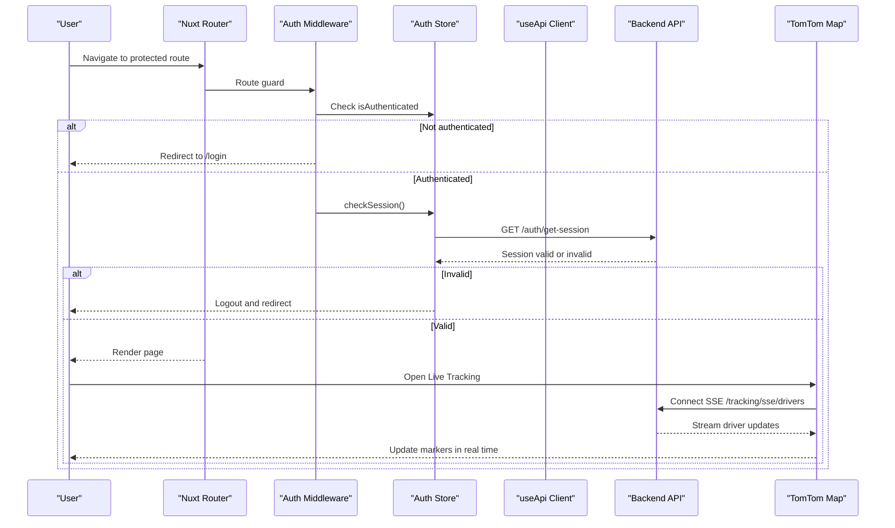
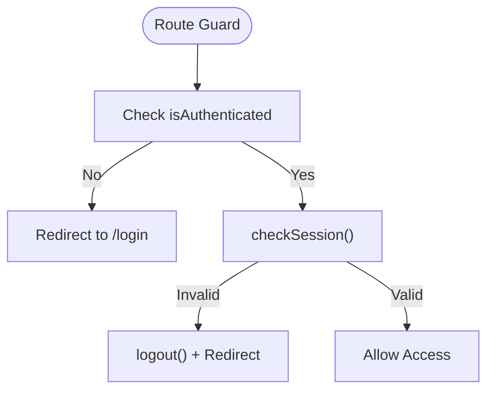
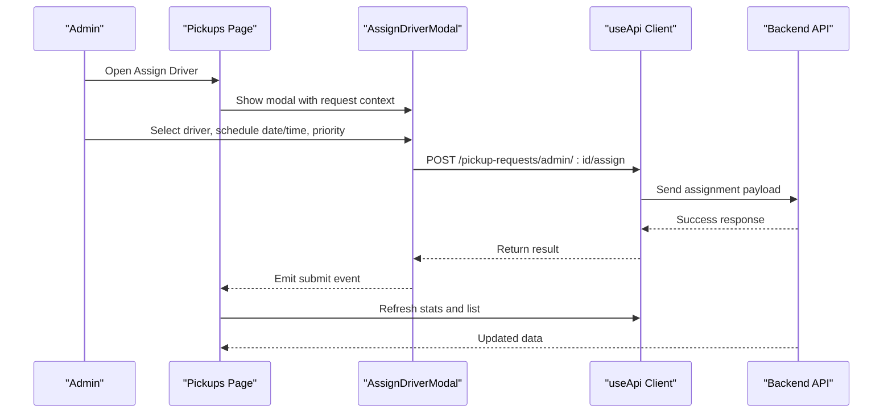
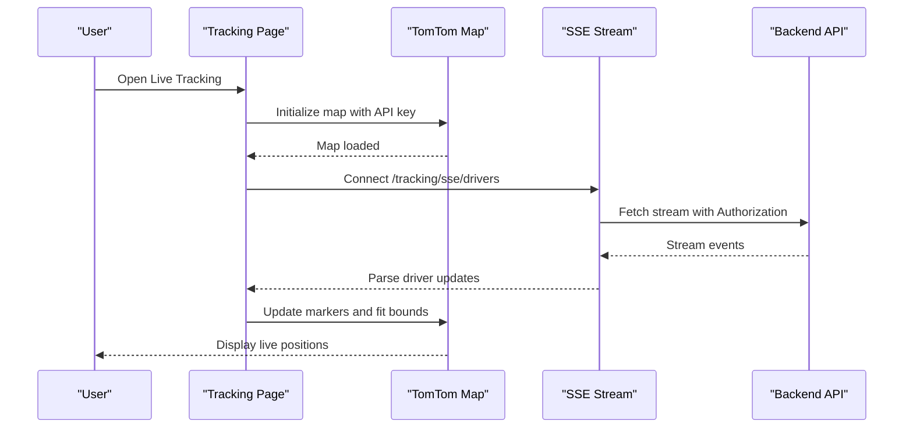
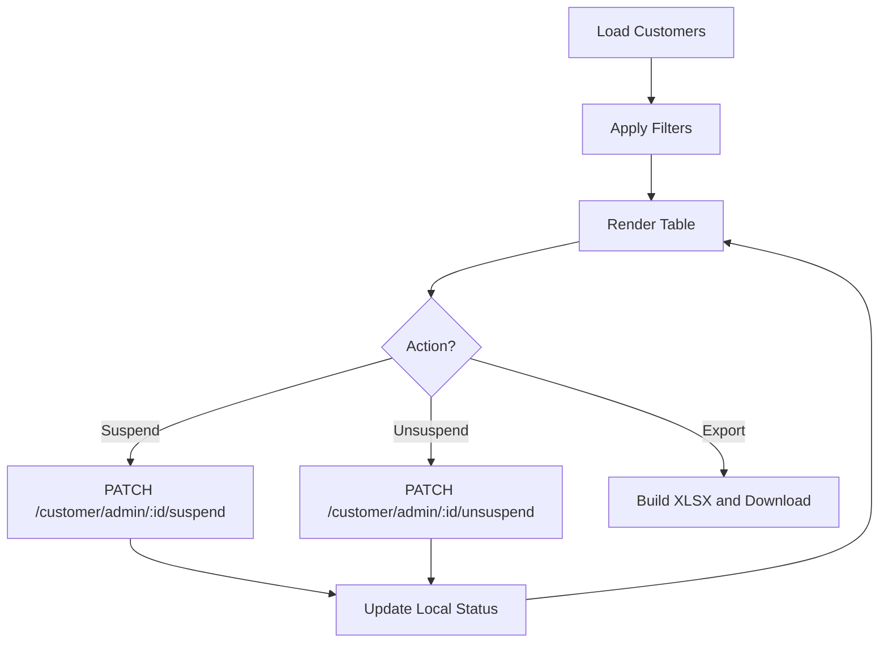
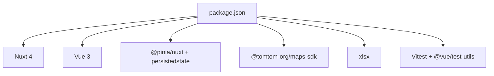

# Project Overview

<cite>
**Referenced Files in This Document**
- [README.md](file://README.md)
- [package.json](file://package.json)
- [nuxt.config.ts](file://nuxt.config.ts)
- [app.vue](file://app/app.vue)
- [auth.global.ts](file://app/middleware/auth.global.ts)
- [useApi.ts](file://app/composables/useApi.ts)
- [auth.ts](file://app/stores/auth.ts)
- [index.vue (Dashboard)](file://app/pages/index.vue)
- [dashboard.vue (Layout)](file://app/layouts/dashboard.vue)
- [AppSidebar.vue](file://app/components/AppSidebar.vue)
- [index.vue (Pickups)](file://app/pages/pickups/index.vue)
- [AssignDriverModal.vue](file://app/components/AssignDriverModal.vue)
- [index.vue (Tracking)](file://app/pages/tracking/index.vue)
- [customers/index.vue](file://app/pages/customers/index.vue)
- [usePermissions.ts](file://app/composables/usePermissions.ts)
</cite>

## Table of Contents
1. Introduction
2. Project Structure
3. Core Components
4. Architecture Overview
5. Detailed Component Analysis
6. Dependency Analysis
7. Performance Considerations
8. Troubleshooting Guide
9. Conclusion

## Introduction
Lacarte Atlas Console is an enterprise-grade waste collection operations management dashboard designed as a centralized control panel for fleet operations, customer lifecycle management, and billing workflows. It enables administrators and fleet managers to oversee daily operations with real-time visibility into driver locations, manage pickup requests from intake through completion, and coordinate driver assignments across the fleet.

Key capabilities include:
- Real-time tracking of drivers and trucks on an interactive map
- Customer management with account status controls and export tools
- Pickup request orchestration including creation, assignment, reassignment, and status tracking
- Billing and payment overview integrated with operational data
- Role-based access control and permission-driven navigation

The application is built with Nuxt.js 4, Vue 3, TypeScript, Pinia state management, and integrates TomTom Maps for live geospatial visualization.

## Project Structure
The project follows a feature-oriented layout within the app directory:
- Pages define top-level routes such as Dashboard, Customers, Drivers & Trucks, Pickup Requests, Live Tracking, Billing, Support, Team, Settings, and Management subpages
- Layouts provide consistent shell components like the dashboard layout with sidebar and header
- Components encapsulate reusable UI elements (modals, pagination, search, toast notifications)
- Composables centralize shared logic (API client, permissions, error handling, currency formatting)
- Stores manage global state (authentication, session, permissions)
- Middleware enforces authentication and route protection
- Configuration defines modules, runtime config, SSR rules, and build optimizations

**Diagram sources**
- [app.vue:1-33](file://app/app.vue#L1-L33)
- [dashboard.vue (Layout):1-25](file://app/layouts/dashboard.vue#L1-L25)
- [AppSidebar.vue:1-319](file://app/components/AppSidebar.vue#L1-L319)
- [index.vue (Dashboard):1-325](file://app/pages/index.vue#L1-L325)
- [index.vue (Pickups):1-567](file://app/pages/pickups/index.vue#L1-L567)
- [customers/index.vue:1-352](file://app/pages/customers/index.vue#L1-L352)
- [index.vue (Tracking):1-502](file://app/pages/tracking/index.vue#L1-L502)
- [AssignDriverModal.vue:1-222](file://app/components/AssignDriverModal.vue#L1-L222)
- [auth.global.ts:1-32](file://app/middleware/auth.global.ts#L1-L32)
- [auth.ts:1-230](file://app/stores/auth.ts#L1-L230)
- [useApi.ts:1-91](file://app/composables/useApi.ts#L1-L91)

**Section sources**
- [README.md:1-76](file://README.md#L1-L76)
- [package.json:1-33](file://package.json#L1-L33)
- [nuxt.config.ts:1-46](file://nuxt.config.ts#L1-L46)
- [app.vue:1-33](file://app/app.vue#L1-L33)

## Core Components
- Authentication and Session Management
  - Centralized store manages user identity, token, team member profile, and session expiry
  - Periodic session checks and warning prompts ensure secure sessions
  - Global middleware protects routes and redirects unauthenticated users
- API Client
  - Typed HTTP wrapper that injects Authorization headers and handles 401 flows
  - Provides convenience methods for GET, POST, PUT, PATCH, DELETE with error wrapping
- Navigation and Permissions
  - Sidebar dynamically filters links based on user permissions
  - Permission composable exposes helpers for role and permission checks
- Dashboards and Operations
  - Dashboard page aggregates key metrics and recent activity
  - Pickup Requests page supports filtering, pagination, and driver assignment workflows
  - Live Tracking page renders TomTom maps with real-time SSE updates for driver positions
  - Customers page provides listing, filtering, suspension/unsuspension, and Excel export

**Section sources**
- [auth.ts:1-230](file://app/stores/auth.ts#L1-L230)
- [auth.global.ts:1-32](file://app/middleware/auth.global.ts#L1-L32)
- [useApi.ts:1-91](file://app/composables/useApi.ts#L1-L91)
- [AppSidebar.vue:1-319](file://app/components/AppSidebar.vue#L1-L319)
- [usePermissions.ts:1-43](file://app/composables/usePermissions.ts#L1-L43)
- [index.vue (Dashboard):1-325](file://app/pages/index.vue#L1-L325)
- [index.vue (Pickups):1-567](file://app/pages/pickups/index.vue#L1-L567)
- [index.vue (Tracking):1-502](file://app/pages/tracking/index.vue#L1-L502)
- [customers/index.vue:1-352](file://app/pages/customers/index.vue#L1-L352)

## Architecture Overview
Atlas Console is a client-side SPA orchestrated by Nuxt 4 with Vue 3 and TypeScript. The application initializes the root component, applies layouts, and renders pages. Authentication is enforced via global middleware and a persisted Pinia store. Data interactions are centralized through a typed API client. Real-time tracking uses Server-Sent Events to stream driver telemetry into the map layer powered by TomTom Maps SDK.

**Diagram sources**
- [auth.global.ts:1-32](file://app/middleware/auth.global.ts#L1-L32)
- [auth.ts:1-230](file://app/stores/auth.ts#L1-L230)
- [useApi.ts:1-91](file://app/composables/useApi.ts#L1-L91)
- [index.vue (Tracking):1-502](file://app/pages/tracking/index.vue#L1-L502)

## Detailed Component Analysis

### Authentication and Session Flow
- The auth store persists tokens and user profiles, sets session expiry, and runs periodic checks
- On 401 responses, the API client logs out and redirects to login
- Middleware ensures only authenticated users can access protected routes and validates sessions on navigation

**Diagram sources**
- [auth.global.ts:1-32](file://app/middleware/auth.global.ts#L1-L32)
- [auth.ts:1-230](file://app/stores/auth.ts#L1-L230)
- [useApi.ts:1-91](file://app/composables/useApi.ts#L1-L91)

**Section sources**
- [auth.ts:1-230](file://app/stores/auth.ts#L1-L230)
- [auth.global.ts:1-32](file://app/middleware/auth.global.ts#L1-L32)
- [useApi.ts:1-91](file://app/composables/useApi.ts#L1-L91)

### Pickup Request Orchestration
- The Pickup Requests page lists requests with filters and pagination
- Admins can assign or reassign drivers using a modal form that posts to dedicated endpoints
- Status badges reflect lifecycle states such as pending, assigned, dispatched, en route, picked up, completed, cancelled

**Diagram sources**
- [index.vue (Pickups):1-567](file://app/pages/pickups/index.vue#L1-L567)
- [AssignDriverModal.vue:1-222](file://app/components/AssignDriverModal.vue#L1-L222)
- [useApi.ts:1-91](file://app/composables/useApi.ts#L1-L91)

**Section sources**
- [index.vue (Pickups):1-567](file://app/pages/pickups/index.vue#L1-L567)
- [AssignDriverModal.vue:1-222](file://app/components/AssignDriverModal.vue#L1-L222)

### Live Tracking with TomTom Maps
- The Tracking page initializes the TomTom map, loads custom truck icons, and subscribes to SSE for real-time driver updates
- Markers update dynamically; clicking a marker shows speed and heading details
- Connection status and reconnect controls improve resilience

**Diagram sources**
- [index.vue (Tracking):1-502](file://app/pages/tracking/index.vue#L1-L502)
- [nuxt.config.ts:1-46](file://nuxt.config.ts#L1-L46)

**Section sources**
- [index.vue (Tracking):1-502](file://app/pages/tracking/index.vue#L1-L502)
- [nuxt.config.ts:1-46](file://nuxt.config.ts#L1-L46)

### Customer Management
- The Customers page supports search, status and plan filters, pagination, and Excel export
- Suspend/Unsuspend actions call backend endpoints and update local state immediately
- Export functionality builds an XLSX file from current dataset

**Diagram sources**
- [customers/index.vue:1-352](file://app/pages/customers/index.vue#L1-L352)

**Section sources**
- [customers/index.vue:1-352](file://app/pages/customers/index.vue#L1-L352)

### Conceptual Overview
This console serves as a centralized control panel for waste collection logistics. Administrators use it to monitor fleet operations, manage customer accounts, and oversee billing. Fleet managers focus on driver assignments, dispatching, and real-time tracking to optimize routes and service levels. The system’s architecture separates concerns across UI, state, networking, and mapping layers, enabling scalable growth and maintainability.

[No sources needed since this section doesn't analyze specific files]

## Dependency Analysis
The application depends on:
- Nuxt 4 and Vue 3 for framework and rendering
- Pinia for state management with persistence plugin
- TomTom Maps SDK for geospatial features
- XLSX for client-side spreadsheet generation
- Vitest and testing utilities for unit tests

**Diagram sources**
- [package.json:1-33](file://package.json#L1-L33)

**Section sources**
- [package.json:1-33](file://package.json#L1-L33)

## Performance Considerations
- Prefer server-side rendering disabled for heavy map and streaming pages to reduce initial load overhead
- Use lazy imports for large libraries (e.g., XLSX) to minimize bundle size
- Debounce filter inputs and pagination changes to avoid excessive network calls
- Reuse computed values for derived UI state (e.g., filtered lists, counts)
- Optimize map updates by batching marker changes and avoiding unnecessary layer rebuilds

[No sources needed since this section provides general guidance]

## Troubleshooting Guide
- Authentication failures
  - If 401 occurs, the API client triggers logout and redirects to login; verify token presence and session validity
- Session warnings
  - The auth store displays a warning before expiry; extend session or log in again
- Map initialization errors
  - Ensure NUXT_PUBLIC_TOMTOM_API_KEY is configured; check container existence and SDK loading
- SSE connection issues
  - Verify authorization header and backend availability; use reconnect controls to restore stream
- Permission-related navigation gaps
  - Confirm user has required permissions; sidebar filters links accordingly

**Section sources**
- [useApi.ts:1-91](file://app/composables/useApi.ts#L1-L91)
- [auth.ts:1-230](file://app/stores/auth.ts#L1-L230)
- [index.vue (Tracking):1-502](file://app/pages/tracking/index.vue#L1-L502)
- [AppSidebar.vue:1-319](file://app/components/AppSidebar.vue#L1-L319)

## Conclusion
Lacarte Atlas Console consolidates critical fleet operations into a single, intuitive dashboard. With robust authentication, a typed API client, permission-aware navigation, and real-time mapping, it empowers administrators and fleet managers to efficiently handle pickup requests, driver assignments, and customer management while maintaining clear visibility into billing and performance metrics. The modular architecture and modern stack position the platform for continued enhancement and scale.

[No sources needed since this section summarizes without analyzing specific files]