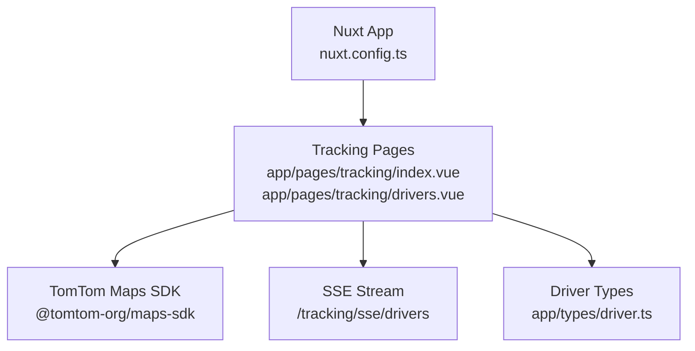
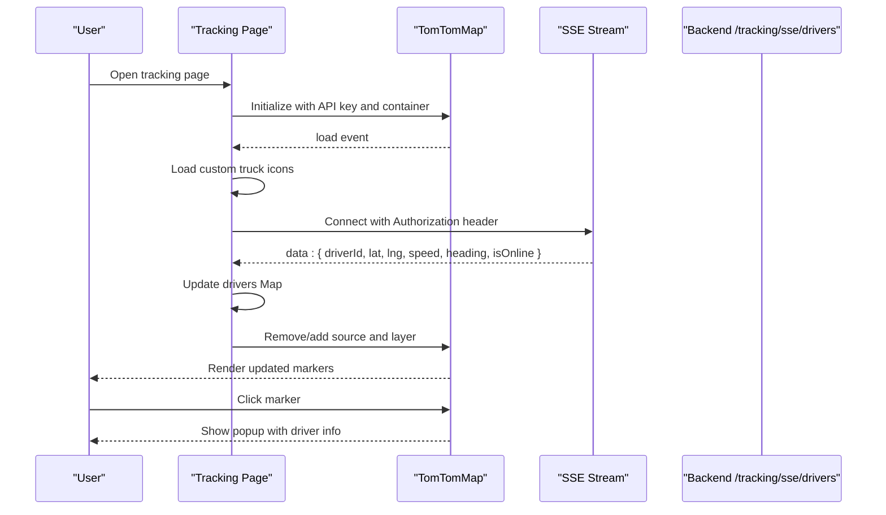
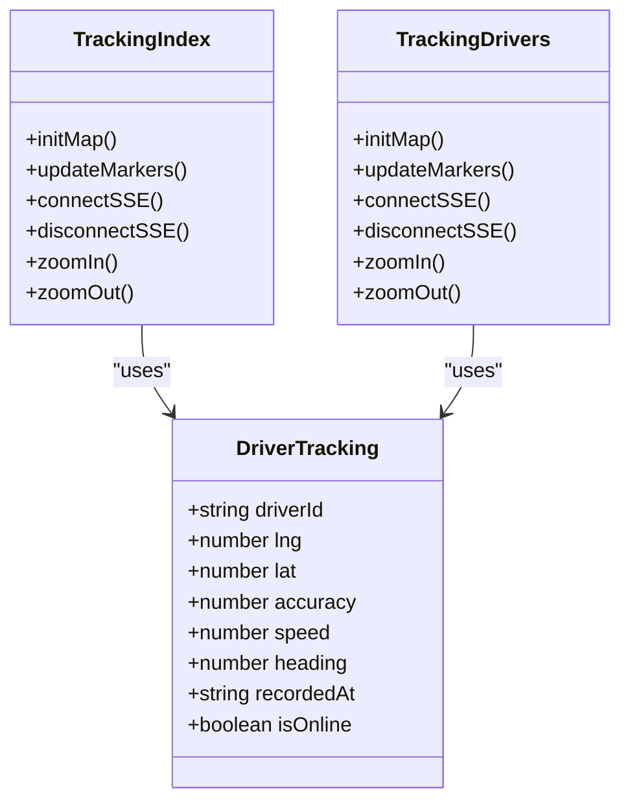
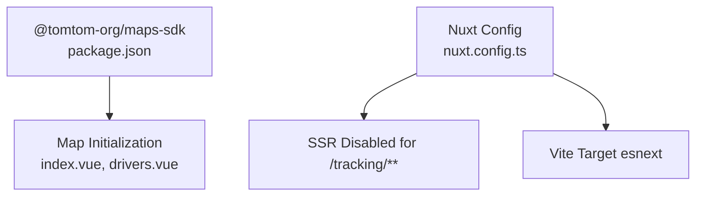

# Real-time Tracking System

<cite>
**Referenced Files in This Document**
- [index.vue](file://app/pages/tracking/index.vue)
- [drivers.vue](file://app/pages/tracking/drivers.vue)
- [driver.ts](file://app/types/driver.ts)
- [nuxt.config.ts](file://nuxt.config.ts)
- [map-setup.md](file://agents/skills/tomtom-maps-sdk-js/docs/map-setup.md)
- [routing.md](file://agents/skills/tomtom-maps-sdk-js/docs/routing.md)
- [traffic.md](file://agents/skills/tomtom-maps-sdk-js/docs/traffic.md)
- [services-config.md](file://agents/skills/tomtom-maps-sdk-js/docs/services-config.md)
- [package.json](file://package.json)
</cite>

## Table of Contents
1. Introduction
2. Project Structure
3. Core Components
4. Architecture Overview
5. Detailed Component Analysis
6. Dependency Analysis
7. Performance Considerations
8. Troubleshooting Guide
9. Conclusion
10. Appendices

## Introduction
This document describes the real-time tracking system built on top of the TomTom Maps SDK. It covers live location monitoring, driver activity tracking, route optimization features, and historical movement analysis. It also documents map integration patterns, real-time data streaming, marker management, interactive map features, performance optimization for large fleets, offline considerations, and mobile responsiveness for field operations.

The system provides two primary views:
- Live Tracking overview page with a fleet-wide map and status indicators
- Driver Tracking detail view with enhanced markers and error handling

Both pages integrate with a server-sent events (SSE) endpoint to receive live updates and render them on a TomTom-powered MapLibre map.

## Project Structure
The tracking feature is implemented as Nuxt 3 pages under app/pages/tracking. The runtime configuration exposes the TomTom API key and API base URL. The project depends on @tomtom-org/maps-sdk for mapping capabilities.

**Diagram sources**
- [nuxt.config.ts:21-26](file://nuxt.config.ts#L21-L26)
- [index.vue:107-123](file://app/pages/tracking/index.vue#L107-L123)
- [drivers.vue:137-152](file://app/pages/tracking/drivers.vue#L137-L152)
- [driver.ts:82-91](file://app/types/driver.ts#L82-L91)

**Section sources**
- [nuxt.config.ts:21-26](file://nuxt.config.ts#L21-L26)
- [package.json:14-25](file://package.json#L14-L25)

## Core Components
- Live Tracking Page: Initializes the TomTom map, loads custom truck icons, connects to SSE, renders driver markers, and handles user interactions.
- Driver Tracking Page: Similar functionality with improved error states and alternative icon generation via Canvas.
- Data Model: DriverTracking type defines fields used by both pages for rendering and interaction.
- Configuration: Nuxt runtime config exposes public keys and API base URL; tracking routes are disabled for SSR to ensure client-side map initialization.

Key responsibilities:
- Map initialization and lifecycle management
- Custom marker creation and fallbacks
- Real-time stream ingestion and state updates
- Interactive popups and zoom controls
- Error and connection state UI

**Section sources**
- [index.vue:107-145](file://app/pages/tracking/index.vue#L107-L145)
- [drivers.vue:137-178](file://app/pages/tracking/drivers.vue#L137-L178)
- [driver.ts:82-91](file://app/types/driver.ts#L82-L91)
- [nuxt.config.ts:39-44](file://nuxt.config.ts#L39-L44)

## Architecture Overview
The system follows a client-driven architecture:
- Nuxt pages initialize the TomTom map using the configured API key.
- After the map loads, custom icons are registered.
- An SSE connection streams driver updates from the backend.
- Each update updates an in-memory Map of drivers and triggers marker refresh.
- Users can click markers to see details and use zoom controls.

**Diagram sources**
- [index.vue:107-145](file://app/pages/tracking/index.vue#L107-L145)
- [index.vue:251-315](file://app/pages/tracking/index.vue#L251-L315)
- [drivers.vue:137-178](file://app/pages/tracking/drivers.vue#L137-L178)
- [drivers.vue:285-353](file://app/pages/tracking/drivers.vue#L285-L353)

## Detailed Component Analysis

### Live Tracking Page (index.vue)
Responsibilities:
- Dynamically import TomTom SDK modules and configure the API key.
- Create a map instance with style and initial viewport.
- Register custom SVG-based truck icons or fall back to colored circles.
- Establish SSE connection to fetch live driver positions.
- Build GeoJSON FeatureCollection and add/update layers.
- Handle click/hover events to show popups and cursor changes.
- Fit bounds to include all visible drivers.

Real-time data flow:
- ConnectSSE uses Fetch with Accept: text/event-stream and Authorization header.
- Streams chunks, buffers lines, parses JSON payloads, and updates the drivers Map.
- On each update, if the map style is loaded, it rebuilds the source and layer.

Marker management:
- Removes existing source and layer before re-adding to avoid duplicates.
- Uses symbol layer with dynamic icon-image based on online/offline state.
- Rotates icons according to heading and aligns rotation to map.

Interactivity:
- Clicking a marker shows a popup with online status, speed, and heading.
- Hover changes cursor to pointer.
- Zoom controls allow manual zoom in/out.

Error handling:
- Missing API key or container results in immediate error messages.
- Map load errors set a persistent error overlay.
- SSE errors display a non-blocking banner with retry option.

Performance considerations:
- Rebuilds only necessary source and layer on updates.
- Uses computed lists to derive counts and arrays efficiently.
- Avoids unnecessary DOM queries by caching references.

Mobile responsiveness:
- Container height is explicitly set to ensure proper rendering.
- Icons and popups are sized for readability on small screens.

**Section sources**
- [index.vue:107-145](file://app/pages/tracking/index.vue#L107-L145)
- [index.vue:147-249](file://app/pages/tracking/index.vue#L147-L249)
- [index.vue:251-315](file://app/pages/tracking/index.vue#L251-L315)
- [index.vue:325-352](file://app/pages/tracking/index.vue#L325-L352)

### Driver Tracking Page (drivers.vue)
Responsibilities:
- Similar to index.vue but with improved error states and alternative icon generation using Canvas.
- Provides a separate error banner for SSE issues without blocking the map.
- Adds additional layout properties for better marker alignment.

Icon generation:
- Generates PNG images via Canvas for online/offline states.
- Registers images with pixelRatio: 2 for crisp rendering on high-DPI displays.

Marker management:
- Uses symbol layer with icon-anchor: center for precise positioning.
- Falls back to circle layer when icons fail to load.

Interactivity:
- Same click/hover behavior as index.vue.
- Zoom controls mirror index.vue.

Error handling:
- Distinct mapFailed flag for full-screen failure overlays.
- Non-blocking SSE error banner with Retry button.

**Section sources**
- [drivers.vue:137-178](file://app/pages/tracking/drivers.vue#L137-L178)
- [drivers.vue:180-283](file://app/pages/tracking/drivers.vue#L180-L283)
- [drivers.vue:285-353](file://app/pages/tracking/drivers.vue#L285-L353)
- [drivers.vue:363-390](file://app/pages/tracking/drivers.vue#L363-L390)

### Data Model (DriverTracking)
Fields used across pages:
- driverId: unique identifier for the driver
- lng, lat: coordinates for positioning
- accuracy: positional accuracy
- speed: current speed
- heading: direction in degrees
- recordedAt: timestamp of last update
- isOnline: boolean indicating connectivity

These fields drive marker placement, rotation, and popup content.

**Section sources**
- [driver.ts:82-91](file://app/types/driver.ts#L82-L91)

### Configuration and Routing
- RuntimeConfig exposes apiBase and tomtomApiKey for client usage.
- Route rules disable SSR for /tracking/** to ensure client-only map initialization.
- Vite build target is esnext to support MapLibre native class fields.

**Section sources**
- [nuxt.config.ts:21-26](file://nuxt.config.ts#L21-L26)
- [nuxt.config.ts:32-38](file://nuxt.config.ts#L32-L38)
- [nuxt.config.ts:39-44](file://nuxt.config.ts#L39-L44)

## Architecture Overview
The following diagram maps the code-level relationships between pages, types, and SDK usage.

**Diagram sources**
- [index.vue:107-145](file://app/pages/tracking/index.vue#L107-L145)
- [drivers.vue:137-178](file://app/pages/tracking/drivers.vue#L137-L178)
- [driver.ts:82-91](file://app/types/driver.ts#L82-L91)

## Detailed Component Analysis

### Map Integration Patterns
- Dynamic imports: Both pages dynamically import TomTomConfig and TomTomMap to reduce initial bundle size.
- Style selection: standardLight is used consistently.
- MapLibre access: Direct access via map.mapLibreMap for adding sources/layers and handling events.
- Icon registration: Images added with pixelRatio: 2 for sharpness.

Best practices observed:
- Wait for map 'load' event before registering icons and updating markers.
- Remove existing source/layer before re-adding to prevent duplication.
- Use computed values for derived lists and counts.

**Section sources**
- [index.vue:107-123](file://app/pages/tracking/index.vue#L107-L123)
- [drivers.vue:137-152](file://app/pages/tracking/drivers.vue#L137-L152)
- [map-setup.md:191-211](file://agents/skills/tomtom-maps-sdk-js/docs/map-setup.md#L191-L211)

### Real-time Data Streaming
- SSE connection established with Authorization header.
- TextDecoder reads chunks; buffer accumulates lines until newline.
- Parses JSON payloads and updates the drivers Map keyed by driverId.
- Rebuilds GeoJSON source and layer after each update if map style is loaded.

Robustness:
- AbortController allows clean disconnection and reconnection.
- Connection state tracked and exposed in UI.
- Errors handled gracefully with informative messages.

**Section sources**
- [index.vue:251-315](file://app/pages/tracking/index.vue#L251-L315)
- [drivers.vue:285-353](file://app/pages/tracking/drivers.vue#L285-L353)

### Marker Management
- Source removal and addition ensures fresh rendering.
- Symbol layer with dynamic icon-image based on isOnline property.
- Rotation aligned to heading for directional awareness.
- Fallback circle layer when custom icons fail to load.

Interactions:
- Click handler creates a popup with driver details.
- Mouseenter/mouseleave toggles cursor to pointer.

**Section sources**
- [index.vue:147-249](file://app/pages/tracking/index.vue#L147-L249)
- [drivers.vue:180-283](file://app/pages/tracking/drivers.vue#L180-L283)

### Interactive Map Features
- Zoom controls implemented via mapLibreMap.zoomIn/zoomOut.
- fitBounds called with computed min/max coordinates to frame all drivers.
- Popups provide contextual information on demand.

**Section sources**
- [index.vue:234-249](file://app/pages/tracking/index.vue#L234-L249)
- [drivers.vue:268-283](file://app/pages/tracking/drivers.vue#L268-L283)

### Route Optimization Features
While not directly implemented in the tracking pages, the SDK documentation demonstrates how to compute routes with traffic-aware options and visualize them. You can extend the tracking system by:
- Calculating routes between waypoints using calculateRoute with costModel.
- Displaying routes and waypoints via RoutingModule.
- Enabling turn-by-turn guidance and incident overlays.

References:
- Traffic and routing options
- Waypoint insertion utilities
- EV routing and charging stops

**Section sources**
- [routing.md:115-130](file://agents/skills/tomtom-maps-sdk-js/docs/routing.md#L115-L130)
- [routing.md:393-437](file://agents/skills/tomtom-maps-sdk-js/docs/routing.md#L393-L437)
- [routing.md:167-210](file://agents/skills/tomtom-maps-sdk-js/docs/routing.md#L167-L210)

### Historical Movement Analysis
Historical analytics can be integrated using trafficAreaAnalytics to retrieve region-level metrics over time. This supports dashboards and reports for congestion, speed, and travel time trends.

Implementation steps:
- Obtain region boundary via geocodeOne and geometryData.
- Query trafficAreaAnalytics with date range and metrics.
- Visualize results using TrafficAreaAnalyticsModule.

**Section sources**
- [traffic.md:220-253](file://agents/skills/tomtom-maps-sdk-js/docs/traffic.md#L220-L253)
- [traffic.md:261-333](file://agents/skills/tomtom-maps-sdk-js/docs/traffic.md#L261-L333)

### Practical Examples

#### Displaying Live Vehicle Locations
- Initialize map with API key and container.
- Connect to SSE endpoint with Authorization header.
- On each message, update the drivers Map and rebuild the GeoJSON source and layer.
- Use symbol layer with icon-image bound to isOnline property.

**Section sources**
- [index.vue:107-145](file://app/pages/tracking/index.vue#L107-L145)
- [index.vue:251-315](file://app/pages/tracking/index.vue#L251-L315)
- [index.vue:147-204](file://app/pages/tracking/index.vue#L147-L204)

#### Implementing Custom Map Markers
- Generate SVG or Canvas-based images for online/offline states.
- Register images with map.addImage using pixelRatio: 2.
- Add symbol layer referencing icon-image names.
- Provide fallback circle layer if image loading fails.

**Section sources**
- [index.vue:19-81](file://app/pages/tracking/index.vue#L19-L81)
- [drivers.vue:21-109](file://app/pages/tracking/drivers.vue#L21-L109)
- [drivers.vue:211-238](file://app/pages/tracking/drivers.vue#L211-L238)

#### Handling Real-time Updates
- Use AbortController to manage connection lifecycle.
- Buffer incoming bytes and split by newline to parse complete messages.
- Update state and trigger marker refresh only when map style is loaded.
- Provide reconnect functionality with visual feedback.

**Section sources**
- [index.vue:251-315](file://app/pages/tracking/index.vue#L251-L315)
- [drivers.vue:285-353](file://app/pages/tracking/drivers.vue#L285-L353)
- [drivers.vue:363-372](file://app/pages/tracking/drivers.vue#L363-L372)

## Dependency Analysis
External dependencies relevant to tracking:
- @tomtom-org/maps-sdk: core mapping and services
- Nuxt modules: UI, Pinia, persisted state
- Vue ecosystem: Vue 3 and Router

Build configuration:
- Vite target esnext required for MapLibre compatibility
- SSR disabled for tracking routes to ensure client-only initialization

**Diagram sources**
- [package.json:14-25](file://package.json#L14-L25)
- [nuxt.config.ts:32-38](file://nuxt.config.ts#L32-L38)
- [nuxt.config.ts:39-44](file://nuxt.config.ts#L39-L44)

**Section sources**
- [package.json:14-25](file://package.json#L14-L25)
- [nuxt.config.ts:32-38](file://nuxt.config.ts#L32-L38)
- [nuxt.config.ts:39-44](file://nuxt.config.ts#L39-L44)

## Performance Considerations
For large fleets:
- Batch updates: Consider debouncing frequent updates to reduce layer rebuilds.
- Spatial partitioning: Use clustering or tile-based filtering to limit visible markers at low zoom levels.
- Efficient GeoJSON: Only include necessary properties and filter out invalid points.
- Image caching: Preload and cache custom icons to avoid repeated network requests.
- Layer reuse: Keep source alive and update data instead of removing/re-adding frequently.

Offline capabilities:
- Cache recent driver positions locally (e.g., IndexedDB) to display last known locations when disconnected.
- Queue updates while offline and replay upon reconnection.
- Use static map tiles or preloaded styles for basic navigation without live data.

Mobile responsiveness:
- Ensure container has explicit height to prevent zero-size rendering.
- Use appropriate icon sizes and popup layouts for touch interactions.
- Minimize heavy computations on the main thread; offload where possible.

[No sources needed since this section provides general guidance]

## Troubleshooting Guide
Common issues and resolutions:
- Missing API key: Verify NUXT_PUBLIC_TOMTOM_API_KEY is set and accessible via runtime config.
- Map container not found: Ensure the element exists and has CSS height defined.
- Map failed to load: Check console for errors; confirm style ID and container availability.
- SSE connection errors: Validate Authorization header and backend endpoint; implement retry logic.
- Icons not appearing: Confirm images are successfully loaded and registered; use fallback circle layer.

Operational tips:
- Use map error events to surface user-friendly messages.
- Track connected state and provide manual reconnect controls.
- Log parsing errors for malformed SSE messages.

**Section sources**
- [index.vue:87-145](file://app/pages/tracking/index.vue#L87-L145)
- [drivers.vue:115-178](file://app/pages/tracking/drivers.vue#L115-L178)
- [index.vue:251-315](file://app/pages/tracking/index.vue#L251-L315)
- [drivers.vue:285-353](file://app/pages/tracking/drivers.vue#L285-L353)

## Conclusion
The real-time tracking system integrates seamlessly with the TomTom Maps SDK to deliver live fleet visibility. It leverages SSE for efficient streaming, robust marker management, and interactive map features. With thoughtful extensions—such as route optimization and historical analytics—the system can evolve into a comprehensive operational dashboard. Performance optimizations and offline strategies will further enhance reliability for field operations.

[No sources needed since this section summarizes without analyzing specific files]

## Appendices

### Services Configuration Reference
Global configuration and per-call overrides enable flexible API key management and request customization.

**Section sources**
- [services-config.md:12-32](file://agents/skills/tomtom-maps-sdk-js/docs/services-config.md#L12-L32)
- [services-config.md:36-58](file://agents/skills/tomtom-maps-sdk-js/docs/services-config.md#L36-L58)