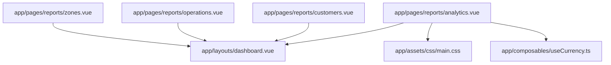
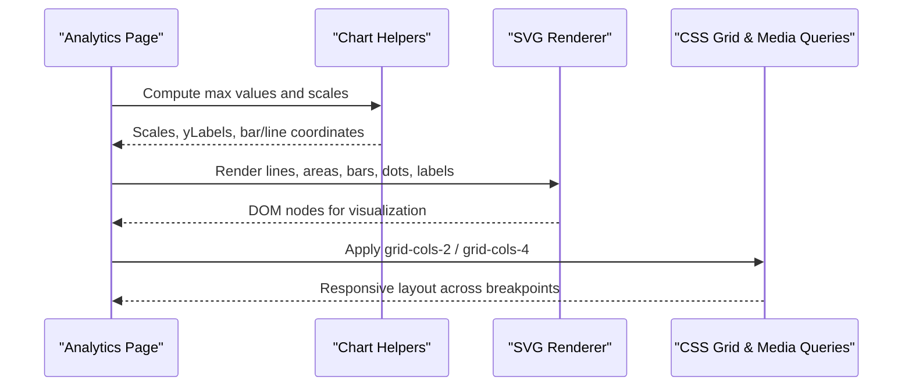
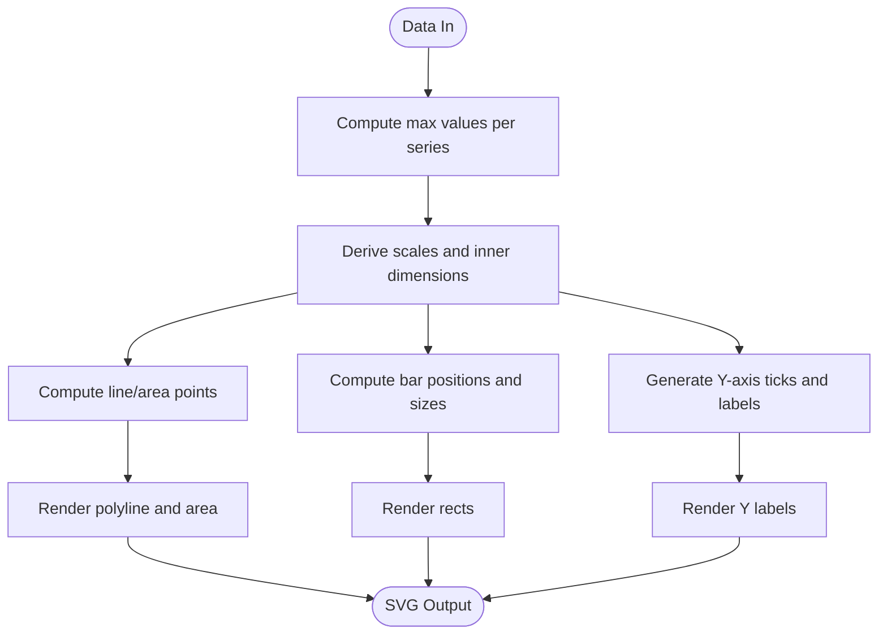
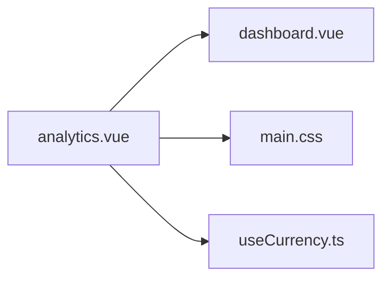

# Analytics Dashboard

<cite>
**Referenced Files in This Document**
- [analytics.vue](file://app/pages/reports/analytics.vue)
- [customers.vue](file://app/pages/reports/customers.vue)
- [operations.vue](file://app/pages/reports/operations.vue)
- [zones.vue](file://app/pages/reports/zones.vue)
- [dashboard.vue](file://app/layouts/dashboard.vue)
- [main.css](file://app/assets/css/main.css)
- [useCurrency.ts](file://app/composables/useCurrency.ts)
</cite>

## Table of Contents
1. [Introduction](#introduction)
2. [Project Structure](#project-structure)
3. [Core Components](#core-components)
4. [Architecture Overview](#architecture-overview)
5. [Detailed Component Analysis](#detailed-component-analysis)
6. [Dependency Analysis](#dependency-analysis)
7. [Performance Considerations](#performance-considerations)
8. [Troubleshooting Guide](#troubleshooting-guide)
9. [Conclusion](#conclusion)
10. [Appendices](#appendices)

## Introduction
This document provides comprehensive documentation for the analytics dashboard component and related reporting pages. It focuses on:
- Key performance indicators (KPIs): bank deposits, revenue tracking, and paid customer metrics
- Custom SVG chart implementations for revenue trends, pickup frequency, customer growth, and shop sales
- Data aggregation patterns, chart rendering logic, and responsive design considerations
- Practical examples for extending the dashboard with new KPI cards, custom charts, and real-time updates
- Performance optimization strategies for large datasets and accessibility guidance for data visualization

The analytics dashboard is implemented as a Nuxt page using Vue 3 Composition API and pure SVG for charting. The layout and global styles provide responsive grids and consistent typography.

## Project Structure
The analytics dashboard is primarily implemented in the reports section under pages. Supporting files include the dashboard layout, global CSS utilities, and a currency formatting composable.

**Diagram sources**
- [analytics.vue:1-274](file://app/pages/reports/analytics.vue#L1-L274)
- [dashboard.vue:1-25](file://app/layouts/dashboard.vue#L1-L25)
- [main.css:1-206](file://app/assets/css/main.css#L1-L206)
- [useCurrency.ts:1-12](file://app/composables/useCurrency.ts#L1-L12)

**Section sources**
- [analytics.vue:1-274](file://app/pages/reports/analytics.vue#L1-L274)
- [dashboard.vue:1-25](file://app/layouts/dashboard.vue#L1-L25)
- [main.css:1-206](file://app/assets/css/main.css#L1-L206)
- [useCurrency.ts:1-12](file://app/composables/useCurrency.ts#L1-L12)

## Core Components
- KPI stat cards: Bank Deposits, Revenue, Paid Customers, and Revenue Breakdown
- Charts:
  - Revenue Trend (line + area)
  - Pickup Frequency (bar)
  - Customer Growth (line + area)
  - Shop Sales (bar)
- Layout and responsiveness via grid classes and viewport-based media queries
- Currency formatting utility for consistent number display

Key responsibilities:
- Define static or computed datasets for KPIs and charts
- Compute chart geometry (margins, scales, labels)
- Render SVG elements (lines, areas, bars, dots, text)
- Apply responsive grid layouts and typography

**Section sources**
- [analytics.vue:6-84](file://app/pages/reports/analytics.vue#L6-L84)
- [analytics.vue:86-140](file://app/pages/reports/analytics.vue#L86-L140)
- [analytics.vue:143-273](file://app/pages/reports/analytics.vue#L143-L273)
- [main.css:46-56](file://app/assets/css/main.css#L46-L56)
- [main.css:86-159](file://app/assets/css/main.css#L86-L159)
- [useCurrency.ts:1-12](file://app/composables/useCurrency.ts#L1-L12)

## Architecture Overview
The analytics page composes multiple visualizations within a responsive grid. Each chart uses shared helper functions to compute positions and labels based on dataset values and fixed chart dimensions. The layout wraps content in a dashboard shell that handles mobile sidebar behavior and main content scrolling.

**Diagram sources**
- [analytics.vue:86-140](file://app/pages/reports/analytics.vue#L86-L140)
- [analytics.vue:205-269](file://app/pages/reports/analytics.vue#L205-L269)
- [main.css:46-56](file://app/assets/css/main.css#L46-L56)
- [main.css:86-159](file://app/assets/css/main.css#L86-L159)

## Detailed Component Analysis

### KPI Cards Implementation
- Bank Deposits: Shows deposited vs non-deposit amounts
- Revenue: Actual vs expected monthly revenue
- Paid Customers: Paid vs expected counts
- Revenue Breakdown: Payment method distribution with percentages

Implementation pattern:
- Array of card objects with title, icon metadata, and rows
- Template iterates over cards and rows to render structured content
- Colors and icons are defined per card for visual distinction

Practical example: Adding a new KPI card
- Extend the statCards array with a new object containing title, icon, background color, icon color, and rows
- Ensure each row includes label and value; optionally add color for emphasis

**Section sources**
- [analytics.vue:6-44](file://app/pages/reports/analytics.vue#L6-L44)
- [analytics.vue:162-200](file://app/pages/reports/analytics.vue#L162-L200)

### Chart Rendering Logic
Shared helpers:
- linePoints: Converts dataset to polyline points
- areaPoints: Extends line points to close the area polygon
- dotX/dotY: Computes point coordinates for markers
- barX/barW/barY/barH: Computes rectangle positioning and sizing
- yLabels: Generates Y-axis tick labels and positions
- xLabelX: Centers X-axis labels for both line and bar charts
- fmtY: Formats Y-axis values with compact notation

Rendering flow:
- Compute maximum values from datasets
- Generate grid lines and Y-axis labels
- Draw area polygons and polylines for trend lines
- Draw rectangles for bar charts
- Place dots at data points and X-axis labels

**Diagram sources**
- [analytics.vue:93-140](file://app/pages/reports/analytics.vue#L93-L140)
- [analytics.vue:205-269](file://app/pages/reports/analytics.vue#L205-L269)

**Section sources**
- [analytics.vue:86-140](file://app/pages/reports/analytics.vue#L86-L140)
- [analytics.vue:205-269](file://app/pages/reports/analytics.vue#L205-L269)

### Revenue Trend (Line + Area)
- Dataset: Monthly revenue values
- Visuals: Light area fill, colored polyline, circular markers, month labels
- Scaling: Based on maximum revenue value

Accessibility note:
- Add descriptive titles and aria attributes to the SVG container and elements for screen readers

**Section sources**
- [analytics.vue:46-54](file://app/pages/reports/analytics.vue#L46-L54)
- [analytics.vue:205-223](file://app/pages/reports/analytics.vue#L205-L223)

### Pickup Frequency (Bar)
- Dataset: Monthly pickup counts
- Visuals: Rounded rectangles with semi-transparent fills
- Scaling: Based on maximum pickup count

**Section sources**
- [analytics.vue:56-64](file://app/pages/reports/analytics.vue#L56-L64)
- [analytics.vue:225-239](file://app/pages/reports/analytics.vue#L225-L239)

### Customer Growth (Line + Area)
- Dataset: Monthly active customers
- Visuals: Blue area and polyline with markers
- Scaling: Based on maximum customer count

**Section sources**
- [analytics.vue:66-74](file://app/pages/reports/analytics.vue#L66-L74)
- [analytics.vue:241-253](file://app/pages/reports/analytics.vue#L241-L253)

### Shop Sales (Bar)
- Dataset: Monthly shop revenue
- Visuals: Green-toned rounded rectangles
- Scaling: Based on maximum shop sales

**Section sources**
- [analytics.vue:76-84](file://app/pages/reports/analytics.vue#L76-L84)
- [analytics.vue:255-269](file://app/pages/reports/analytics.vue#L255-L269)

### Related Report Pages Patterns
- Customers report: Similar chart helpers, grouped bar chart for new vs churned, donut chart for plan split, payment status breakdown, and top customers table
- Operations report: Bar chart for pickup volume, line chart for completion rate, driver performance table
- Zones report: Period filter (week/month/quarter), min/max range scaling for line charts

These pages demonstrate reusable patterns for adding new chart types and tables.

**Section sources**
- [customers.vue:4-27](file://app/pages/reports/customers.vue#L4-L27)
- [customers.vue:127-221](file://app/pages/reports/customers.vue#L127-L221)
- [operations.vue:4-27](file://app/pages/reports/operations.vue#L4-L27)
- [operations.vue:96-124](file://app/pages/reports/operations.vue#L96-L124)
- [zones.vue:21-38](file://app/pages/reports/zones.vue#L21-L38)
- [zones.vue:83-102](file://app/pages/reports/zones.vue#L83-L102)

### Responsive Design Considerations
- Grid classes:
  - grid-cols-4 for KPI cards
  - grid-cols-2 for chart panels
- Media queries:
  - Tablet breakpoint collapses columns to two
  - Mobile breakpoint stacks all columns to one and reduces padding
- ViewBox-based SVGs scale fluidly with container width

Best practices:
- Keep chart viewBox fixed while allowing CSS width to be 100%
- Use relative units and avoid hard-coded pixel widths for containers
- Test readability of labels at smaller breakpoints

**Section sources**
- [main.css:46-56](file://app/assets/css/main.css#L46-L56)
- [main.css:86-159](file://app/assets/css/main.css#L86-L159)
- [analytics.vue:205-269](file://app/pages/reports/analytics.vue#L205-L269)

### Accessibility Compliance for Data Visualization
Recommendations:
- Provide accessible titles and descriptions for each chart using <title> and <desc> inside SVG
- Add role="img" and aria-label to SVG containers
- Ensure sufficient color contrast for lines, bars, and labels
- Include keyboard-accessible controls if interactive filters are added
- Use semantic HTML for headings and captions around charts

[No sources needed since this section provides general guidance]

## Dependency Analysis
The analytics page depends on:
- Layout shell for structure and mobile navigation
- Global CSS for responsive grids and typography
- Currency composable for consistent formatting

**Diagram sources**
- [analytics.vue:1-10](file://app/pages/reports/analytics.vue#L1-L10)
- [dashboard.vue:1-25](file://app/layouts/dashboard.vue#L1-L25)
- [main.css:1-206](file://app/assets/css/main.css#L1-L206)
- [useCurrency.ts:1-12](file://app/composables/useCurrency.ts#L1-L12)

**Section sources**
- [analytics.vue:1-10](file://app/pages/reports/analytics.vue#L1-L10)
- [dashboard.vue:1-25](file://app/layouts/dashboard.vue#L1-L25)
- [main.css:1-206](file://app/assets/css/main.css#L1-L206)
- [useCurrency.ts:1-12](file://app/composables/useCurrency.ts#L1-L12)

## Performance Considerations
Optimization strategies for large datasets:
- Precompute derived values (max values, scales, labels) once per update cycle
- Memoize expensive computations using computed properties where applicable
- Limit visible data points by aggregating or sampling when necessary
- Avoid excessive re-renders by keeping datasets immutable and updating only changed fields
- Use requestAnimationFrame for heavy animations if interactivity is added
- Prefer lightweight SVG operations; batch element creation and minimize DOM thrashing

[No sources needed since this section provides general guidance]

## Troubleshooting Guide
Common issues and resolutions:
- Incorrect chart scaling: Verify max values and ensure datasets contain numeric values
- Misaligned labels: Check inner dimensions and padding constants; confirm index calculations for xLabelX
- Overlapping bars: Adjust bar width calculation and spacing constants
- Responsive misalignment: Confirm grid class usage and verify media query breakpoints
- Currency formatting inconsistencies: Ensure useCurrency is used consistently for monetary values

**Section sources**
- [analytics.vue:86-140](file://app/pages/reports/analytics.vue#L86-L140)
- [main.css:86-159](file://app/assets/css/main.css#L86-L159)
- [useCurrency.ts:1-12](file://app/composables/useCurrency.ts#L1-L12)

## Conclusion
The analytics dashboard leverages simple, maintainable SVG charting with clear helper functions and responsive CSS grids. KPI cards present essential business metrics, while charts visualize trends and distributions. By following the provided patterns, you can extend the dashboard with new KPIs, custom chart types, and real-time data integrations while maintaining performance and accessibility standards.

[No sources needed since this section summarizes without analyzing specific files]

## Appendices

### Practical Examples

#### Adding a New KPI Card
- Extend the statCards array with a new object including title, icon metadata, and rows
- Ensure each row has label and value; optionally set color for emphasis
- Reference: [analytics.vue:6-44](file://app/pages/reports/analytics.vue#L6-L44)

#### Creating a Custom Chart Type
- Define a dataset array with labeled entries and numeric values
- Implement or reuse helper functions for coordinates and labels
- Render appropriate SVG elements (rects for bars, polyline/polygon for lines/areas)
- Reference: [analytics.vue:86-140](file://app/pages/reports/analytics.vue#L86-L140), [analytics.vue:205-269](file://app/pages/reports/analytics.vue#L205-L269)

#### Integrating Real-Time Data Updates
- Replace static datasets with reactive state (ref or computed)
- Subscribe to real-time events and update datasets incrementally
- Debounce frequent updates to reduce re-render cost
- Reference: [analytics.vue:46-84](file://app/pages/reports/analytics.vue#L46-L84)

#### Using Currency Formatting
- Import and use the currency composable for consistent monetary display
- Reference: [useCurrency.ts:1-12](file://app/composables/useCurrency.ts#L1-L12)