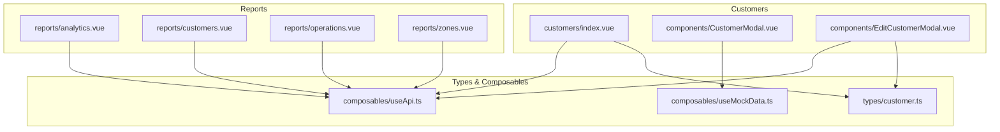
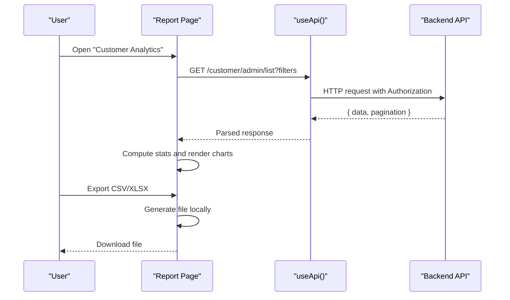
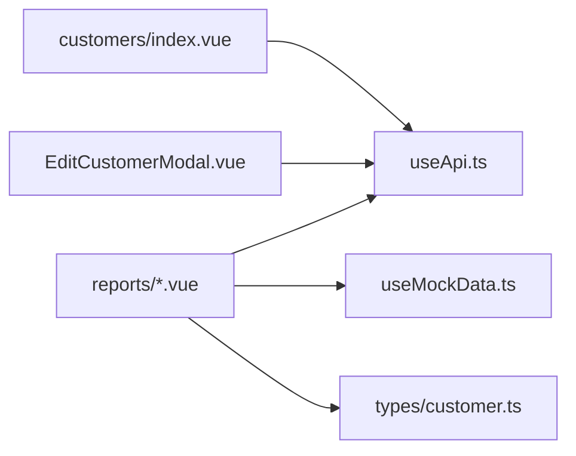

# Customer Analytics

<cite>
**Referenced Files in This Document**
- [analytics.vue](file://app/pages/reports/analytics.vue)
- [customers.vue](file://app/pages/reports/customers.vue)
- [operations.vue](file://app/pages/reports/operations.vue)
- [zones.vue](file://app/pages/reports/zones.vue)
- [index.vue](file://app/pages/customers/index.vue)
- [CustomerModal.vue](file://app/components/CustomerModal.vue)
- [EditCustomerModal.vue](file://app/components/EditCustomerModal.vue)
- [customer.ts](file://app/types/customer.ts)
- [useApi.ts](file://app/composables/useApi.ts)
- [useMockData.ts](file://app/composables/useMockData.ts)
</cite>

## Table of Contents
1. [Introduction](#introduction)
2. [Project Structure](#project-structure)
3. [Core Components](#core-components)
4. [Architecture Overview](#architecture-overview)
5. [Detailed Component Analysis](#detailed-component-analysis)
6. [Dependency Analysis](#dependency-analysis)
7. [Performance Considerations](#performance-considerations)
8. [Troubleshooting Guide](#troubleshooting-guide)
9. [Conclusion](#conclusion)
10. [Appendices](#appendices)

## Introduction
This document explains the customer analytics and insights reporting capabilities implemented in the console application. It covers:
- Customer segmentation analysis
- Lifetime value calculations
- Churn rate monitoring
- Satisfaction metrics tracking
- Behavior analysis algorithms
- Cohort analysis implementation
- Predictive analytics features
- Practical examples for identifying high-value customers, analyzing subscription patterns, and generating customer health scores
- Data privacy considerations and GDPR compliance

The current implementation provides a robust front-end analytics dashboard with static data and charting utilities, along with API integration points for fetching live customer data. Advanced analytics (lifetime value, churn, satisfaction, predictive models) are conceptualized here as extensions to the existing UI and data flows.

## Project Structure
The analytics feature spans multiple pages under reports and customer management:
- Reports dashboards: overall business analytics, customer analytics, operations analytics, zone performance
- Customer management: list, add, edit, suspend/unsuspend
- Types and composables: shared types, API client, mock reference data

**Diagram sources**
- [analytics.vue:1-274](file://app/pages/reports/analytics.vue#L1-L274)
- [customers.vue:1-262](file://app/pages/reports/customers.vue#L1-L262)
- [operations.vue:1-164](file://app/pages/reports/operations.vue#L1-L164)
- [zones.vue:1-245](file://app/pages/reports/zones.vue#L1-L245)
- [index.vue:1-352](file://app/pages/customers/index.vue#L1-L352)
- [CustomerModal.vue:1-216](file://app/components/CustomerModal.vue#L1-L216)
- [EditCustomerModal.vue:1-242](file://app/components/EditCustomerModal.vue#L1-L242)
- [customer.ts:1-103](file://app/types/customer.ts#L1-L103)
- [useApi.ts:1-91](file://app/composables/useApi.ts#L1-L91)
- [useMockData.ts:1-61](file://app/composables/useMockData.ts#L1-L61)

**Section sources**
- [analytics.vue:1-274](file://app/pages/reports/analytics.vue#L1-L274)
- [customers.vue:1-262](file://app/pages/reports/customers.vue#L1-L262)
- [operations.vue:1-164](file://app/pages/reports/operations.vue#L1-L164)
- [zones.vue:1-245](file://app/pages/reports/zones.vue#L1-L245)
- [index.vue:1-352](file://app/pages/customers/index.vue#L1-L352)
- [CustomerModal.vue:1-216](file://app/components/CustomerModal.vue#L1-L216)
- [EditCustomerModal.vue:1-242](file://app/components/EditCustomerModal.vue#L1-L242)
- [customer.ts:1-103](file://app/types/customer.ts#L1-L103)
- [useApi.ts:1-91](file://app/composables/useApi.ts#L1-L91)
- [useMockData.ts:1-61](file://app/composables/useMockData.ts#L1-L61)

## Core Components
- Reports dashboards provide KPIs and charts for revenue, pickups, growth, and operational metrics.
- Customer analytics page shows total customers, new vs churned trends, plan distribution, payment status, and top customers table.
- Operations analytics focuses on pickup volume, completion rates, and driver performance.
- Zone performance breaks down metrics by geographic zones with trend lines and tables.
- Customer management supports listing, filtering, exporting, and account lifecycle actions (suspend/unsuspend).
- Modal components handle adding/editing customer details and reference data loading.

Key responsibilities:
- Present analytical visuals using SVG-based helpers
- Fetch and display paginated customer lists
- Provide export functionality for offline analysis
- Maintain consistent type contracts for customer entities and pickup history

**Section sources**
- [analytics.vue:1-274](file://app/pages/reports/analytics.vue#L1-L274)
- [customers.vue:1-262](file://app/pages/reports/customers.vue#L1-L262)
- [operations.vue:1-164](file://app/pages/reports/operations.vue#L1-L164)
- [zones.vue:1-245](file://app/pages/reports/zones.vue#L1-L245)
- [index.vue:1-352](file://app/pages/customers/index.vue#L1-L352)
- [CustomerModal.vue:1-216](file://app/components/CustomerModal.vue#L1-L216)
- [EditCustomerModal.vue:1-242](file://app/components/EditCustomerModal.vue#L1-L242)
- [customer.ts:1-103](file://app/types/customer.ts#L1-L103)

## Architecture Overview
The analytics architecture is a Vue/Nuxt frontend that renders dashboards and tables, optionally calling backend APIs via a typed HTTP client. Reference data can be loaded from mock sources during development.

**Diagram sources**
- [customers.vue:1-262](file://app/pages/reports/customers.vue#L1-L262)
- [index.vue:1-352](file://app/pages/customers/index.vue#L1-L352)
- [useApi.ts:1-91](file://app/composables/useApi.ts#L1-L91)

## Detailed Component Analysis

### Customer Analytics Dashboard
- Displays KPIs: total customers, new this month, churned, retention rate
- Charts: customer growth line, new vs churned grouped bars
- Plan distribution donut and payment status breakdown
- Top customers table with plan badges and totals

Implementation highlights:
- Chart helper functions compute coordinates for lines, areas, dots, and bars
- Static datasets drive visualizations; these can be replaced with computed values from API responses
- Payment status uses progress bars with color-coded percentages

Practical usage:
- Identify high-value customers via the top customers table (total paid, pickups)
- Analyze subscription patterns through plan split and payment status
- Monitor churn rate via churned metric and new vs churned bar chart

**Section sources**
- [customers.vue:1-262](file://app/pages/reports/customers.vue#L1-L262)

### Business Analytics Dashboard
- Stat cards for bank deposits, revenue, paid customers
- Revenue breakdown by payment method
- Trend charts for revenue, pickup frequency, customer growth, shop sales

Implementation highlights:
- Shared chart helpers for area and line rendering
- Formatted Y-axis labels and grid lines
- Color-coded segments for revenue breakdown

Practical usage:
- Track revenue trends and compare actual vs expected monthly targets
- Correlate pickup frequency with customer growth
- Evaluate shop sales contribution to overall revenue

**Section sources**
- [analytics.vue:1-274](file://app/pages/reports/analytics.vue#L1-L274)

### Operations Analytics Dashboard
- KPIs: total pickups, completion rate, active trucks, average pickup time
- Bar chart for monthly pickup volume
- Line chart for completion rate trend
- Driver performance table with completion and average time

Practical usage:
- Assess operational efficiency and identify drivers needing support
- Monitor completion rate improvements over time
- Align resource allocation based on pickup volumes

**Section sources**
- [operations.vue:1-164](file://app/pages/reports/operations.vue#L1-L164)

### Zone Performance Dashboard
- Summary stats across zones: active zones, total customers, total pickups, average completion
- Bar charts for pickups and revenue by zone
- Completion rate trend line per selected zone
- Zone breakdown table with missed pickups and performance indicators

Practical usage:
- Compare zone-level performance and allocate resources accordingly
- Investigate zones with higher missed pickups or lower completion rates
- Track revenue contributions by zone

**Section sources**
- [zones.vue:1-245](file://app/pages/reports/zones.vue#L1-L245)

### Customer Management and Lifecycle
- Paginated customer list with search and filters (status, plan)
- Suspend/unsuspend workflows with confirmation dialogs
- Excel export using xlsx library
- Add/Edit modals for customer details and reference data

API interactions:
- List customers via admin endpoint with pagination parameters
- Suspend/unsuspend via PATCH endpoints
- Edit modal loads customer types and zones via public endpoints

Privacy-sensitive fields:
- Phone number, address, city, region, postal code, country, place name

**Section sources**
- [index.vue:1-352](file://app/pages/customers/index.vue#L1-L352)
- [CustomerModal.vue:1-216](file://app/components/CustomerModal.vue#L1-L216)
- [EditCustomerModal.vue:1-242](file://app/components/EditCustomerModal.vue#L1-L242)
- [useApi.ts:1-91](file://app/composables/useApi.ts#L1-L91)

### Data Models and Contracts
- Customer entity includes identifiers, contact info, location, timestamps, and relationships to user, type, and zone
- Pickup history entries include preferred date, status, payment type/status, and associated driver/item/quantity metadata
- Paginated response envelope standardizes list endpoints

These types ensure consistent data handling across dashboards and modals.

**Section sources**
- [customer.ts:1-103](file://app/types/customer.ts#L1-L103)

## Dependency Analysis
- Pages depend on useApi for network requests and error handling
- Modals may rely on useMockData for reference options during development
- Types define contracts for customer and pickup history data
- Chart helpers are duplicated across report pages for consistency

**Diagram sources**
- [index.vue:1-352](file://app/pages/customers/index.vue#L1-L352)
- [EditCustomerModal.vue:1-242](file://app/components/EditCustomerModal.vue#L1-L242)
- [analytics.vue:1-274](file://app/pages/reports/analytics.vue#L1-L274)
- [customers.vue:1-262](file://app/pages/reports/customers.vue#L1-L262)
- [operations.vue:1-164](file://app/pages/reports/operations.vue#L1-L164)
- [zones.vue:1-245](file://app/pages/reports/zones.vue#L1-L245)
- [useApi.ts:1-91](file://app/composables/useApi.ts#L1-L91)
- [useMockData.ts:1-61](file://app/composables/useMockData.ts#L1-L61)
- [customer.ts:1-103](file://app/types/customer.ts#L1-L103)

**Section sources**
- [index.vue:1-352](file://app/pages/customers/index.vue#L1-L352)
- [EditCustomerModal.vue:1-242](file://app/components/EditCustomerModal.vue#L1-L242)
- [analytics.vue:1-274](file://app/pages/reports/analytics.vue#L1-L274)
- [customers.vue:1-262](file://app/pages/reports/customers.vue#L1-L262)
- [operations.vue:1-164](file://app/pages/reports/operations.vue#L1-L164)
- [zones.vue:1-245](file://app/pages/reports/zones.vue#L1-L245)
- [useApi.ts:1-91](file://app/composables/useApi.ts#L1-L91)
- [useMockData.ts:1-61](file://app/composables/useMockData.ts#L1-L61)
- [customer.ts:1-103](file://app/types/customer.ts#L1-L103)

## Performance Considerations
- Chart rendering uses lightweight SVG paths; avoid excessive re-renders by memoizing computed datasets
- Pagination reduces payload size for large customer lists
- Export functionality generates files client-side; consider streaming for very large exports
- Debounce search inputs to minimize repeated API calls
- Cache reference data (customer types, zones) to reduce redundant requests

[No sources needed since this section provides general guidance]

## Troubleshooting Guide
Common issues and resolutions:
- Authentication failures: The API client logs and redirects on 401; ensure tokens are present and refreshed
- Network errors: useApi wraps requests with error handlers; check toast messages and console logs
- Missing reference data: Edit modal fetches types and zones; verify endpoints availability
- Export failures: Ensure xlsx module loads successfully; handle import errors gracefully

Operational checks:
- Verify API base URL configuration
- Confirm authorization headers are attached
- Validate response shapes match expected types

**Section sources**
- [useApi.ts:1-91](file://app/composables/useApi.ts#L1-L91)
- [EditCustomerModal.vue:1-242](file://app/components/EditCustomerModal.vue#L1-L242)
- [index.vue:1-352](file://app/pages/customers/index.vue#L1-L352)

## Conclusion
The console provides a comprehensive set of analytics dashboards and customer management tools. While current implementations rely on static datasets for visualization, the structure supports seamless integration with live APIs. Extending the system with advanced analytics—such as lifetime value, churn prediction, satisfaction scoring, cohort analysis, and predictive modeling—can be achieved by computing derived metrics from the existing data contracts and integrating them into the dashboards.

[No sources needed since this section summarizes without analyzing specific files]

## Appendices

### Customer Segmentation Analysis
Segmentation dimensions available in the data model:
- Customer type (e.g., regular, commercial, estate, industrial)
- Zone assignment
- Plan type (subscription vs pay-as-you-go)
- Status (active, overdue, inactive)
- Geographic attributes (city, region, postal code, country)

Implementation approach:
- Group customers by type and zone
- Aggregate metrics (pickups, revenue, balance) per segment
- Visualize distributions using bar/donut charts similar to existing plan split

**Section sources**
- [customer.ts:1-103](file://app/types/customer.ts#L1-L103)
- [customers.vue:1-262](file://app/pages/reports/customers.vue#L1-L262)

### Lifetime Value Calculations
Conceptual formula:
- LTV = Average Order Value × Purchase Frequency × Customer Lifespan
- For subscriptions: LTV ≈ Monthly Recurring Revenue × Gross Margin × Expected Months Retained

Data requirements:
- Historical payments and balances
- Subscription plan durations and renewal behavior
- Churn events and retention timelines

Integration points:
- Compute LTV per customer and aggregate by segment
- Display top LTV customers alongside top paid customers

**Section sources**
- [customer.ts:1-103](file://app/types/customer.ts#L1-L103)
- [customers.vue:1-262](file://app/pages/reports/customers.vue#L1-L262)

### Churn Rate Monitoring
Churn calculation:
- Monthly churn rate = Churned customers / Total customers at start of period

Monitoring:
- Track churned count and churn rate in KPIs
- Visualize new vs churned trends to detect anomalies

Actionable insights:
- Investigate causes of churn by segment and zone
- Implement retention campaigns targeting at-risk cohorts

**Section sources**
- [customers.vue:1-262](file://app/pages/reports/customers.vue#L1-L262)

### Satisfaction Metrics Tracking
Satisfaction proxies:
- Completion rate (operational efficiency)
- Missed pickups per zone
- Payment status distribution (paid, pending, overdue)
- Support ticket volume (if integrated)

Tracking approach:
- Aggregate completion rates and missed pickups by zone
- Correlate payment delays with satisfaction signals

**Section sources**
- [operations.vue:1-164](file://app/pages/reports/operations.vue#L1-L164)
- [zones.vue:1-245](file://app/pages/reports/zones.vue#L1-L245)
- [customers.vue:1-262](file://app/pages/reports/customers.vue#L1-L262)

### Customer Behavior Analysis Algorithms
Behavioral signals:
- Pickup frequency and recency
- Payment punctuality and balance trends
- Plan changes and engagement levels

Algorithm outline:
- Score each customer based on weighted factors (frequency, recency, monetary value, payment reliability)
- Normalize scores and classify into tiers (high, medium, low)

Visualization:
- Scatter plots or tiered tables
- Segment-specific dashboards

**Section sources**
- [customer.ts:1-103](file://app/types/customer.ts#L1-L103)
- [customers.vue:1-262](file://app/pages/reports/customers.vue#L1-L262)

### Cohort Analysis Implementation
Cohorts:
- Acquisition month
- Plan type at signup
- Zone assignment

Analysis steps:
- Group customers by cohort
- Track retention curves and revenue per cohort over time
- Compare cohorts to identify successful acquisition strategies

Implementation:
- Extend existing charts to show cohort retention lines
- Add cohort selection controls

**Section sources**
- [customers.vue:1-262](file://app/pages/reports/customers.vue#L1-L262)

### Predictive Analytics Features
Predictions:
- Churn probability based on recent activity and payment behavior
- Next best action recommendations (upsell, re-engagement)

Approach:
- Train models on historical behavior and outcomes
- Integrate predictions into dashboards as risk scores and alerts

**Section sources**
- [customer.ts:1-103](file://app/types/customer.ts#L1-L103)
- [customers.vue:1-262](file://app/pages/reports/customers.vue#L1-L262)

### Practical Examples

#### Identifying High-Value Customers
- Use top customers table to rank by total paid and pickups
- Cross-reference with LTV estimates and plan type
- Prioritize retention efforts for high-value segments

**Section sources**
- [customers.vue:1-262](file://app/pages/reports/customers.vue#L1-L262)

#### Analyzing Subscription Patterns
- Review plan split and payment status
- Monitor churned vs new customers to assess plan stability
- Investigate overdue payments and their impact on churn

**Section sources**
- [customers.vue:1-262](file://app/pages/reports/customers.vue#L1-L262)

#### Generating Customer Health Scores
- Combine behavioral signals (pickup frequency, recency), financial signals (balance, payment status), and operational signals (completion rate)
- Weight and normalize to produce a composite score
- Display health tiers in customer list and detail views

**Section sources**
- [customer.ts:1-103](file://app/types/customer.ts#L1-L103)
- [customers.vue:1-262](file://app/pages/reports/customers.vue#L1-L262)

### Data Privacy Considerations and GDPR Compliance
Sensitive data handled:
- Personal identifiers (name, email, phone)
- Location information (address, city, region, postal code, country, place name, coordinates)
- Account status and financial indicators (balance, payment status)

Compliance guidelines:
- Minimize data collection to what is necessary for analytics
- Anonymize or pseudonymize data where possible
- Provide mechanisms for data access, correction, and deletion upon request
- Log consent and purpose limitations for processing personal data
- Secure storage and transmission (HTTPS, token-based auth)
- Implement data retention policies and automated purging
- Conduct privacy impact assessments for new analytics features

Operational safeguards:
- Restrict access to sensitive fields via role-based permissions
- Audit logs for data access and modifications
- Mask PII in exports unless explicitly authorized

**Section sources**
- [customer.ts:1-103](file://app/types/customer.ts#L1-L103)
- [index.vue:1-352](file://app/pages/customers/index.vue#L1-L352)
- [useApi.ts:1-91](file://app/composables/useApi.ts#L1-L91)