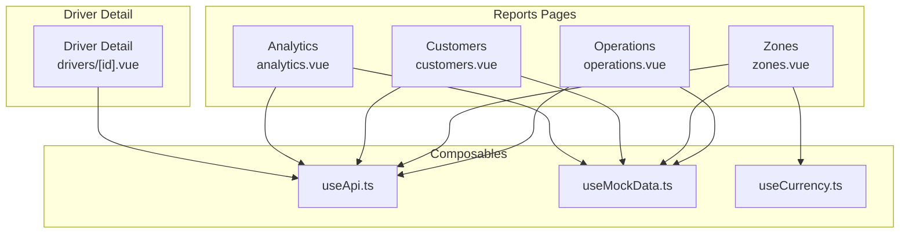
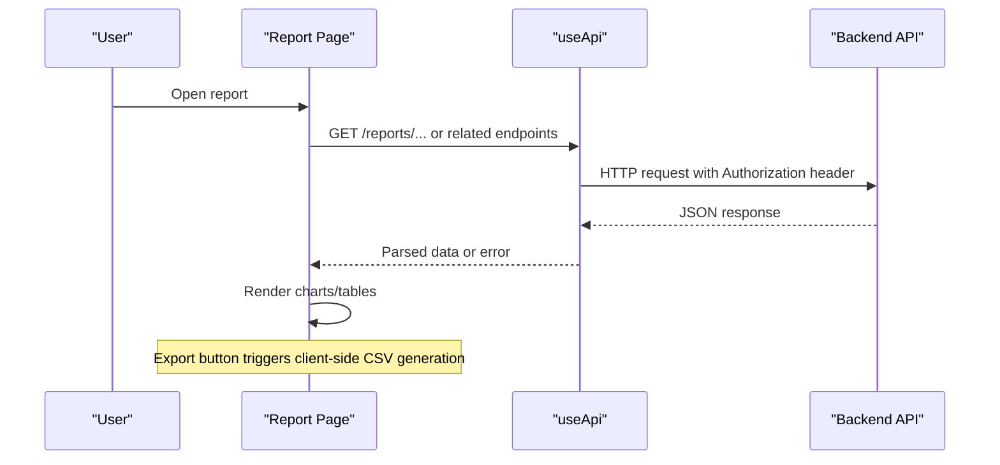
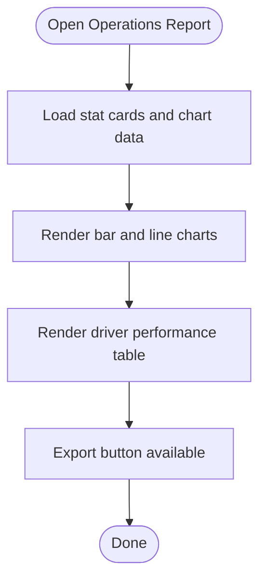
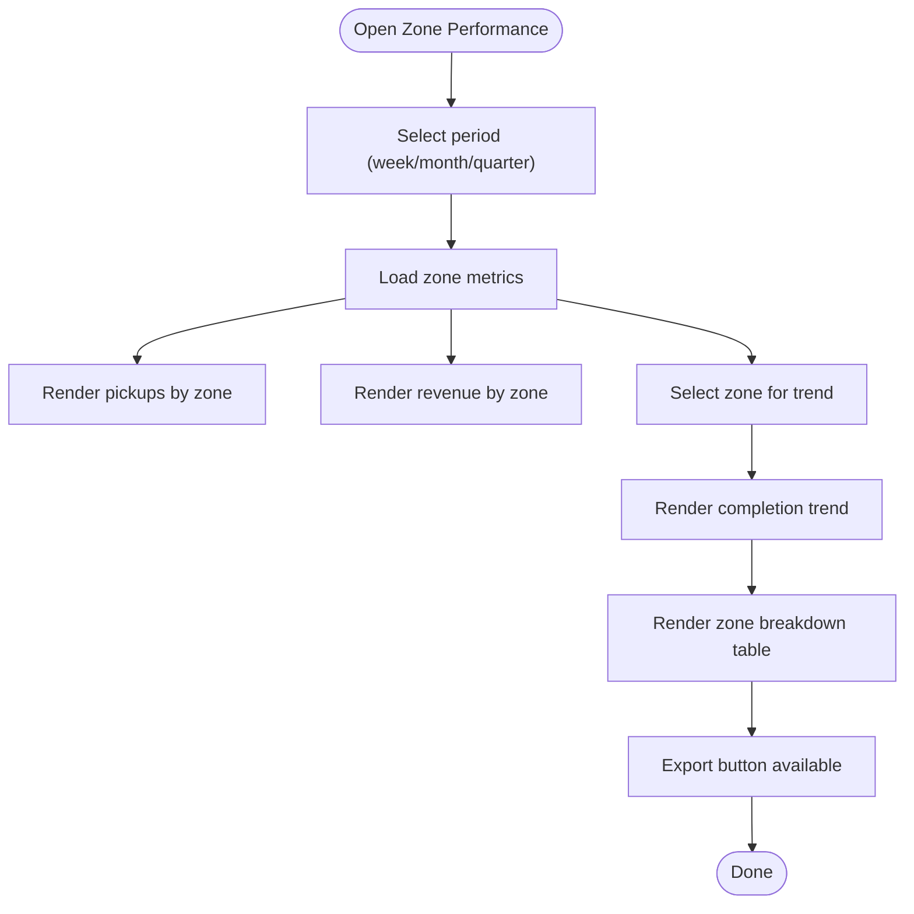
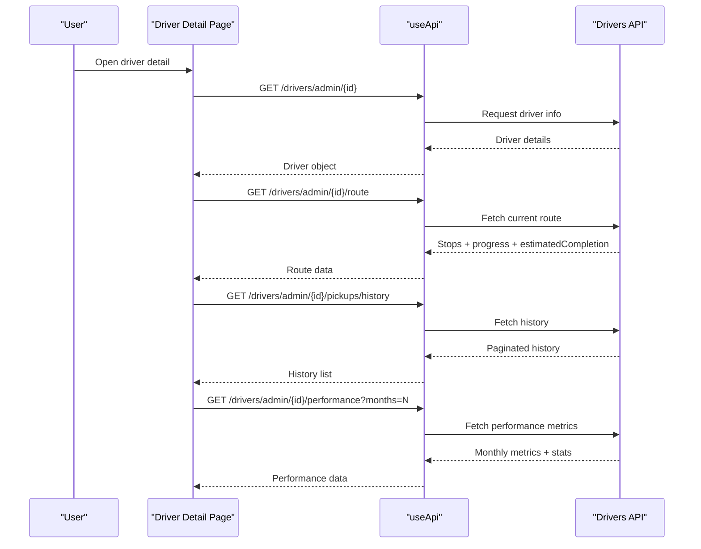
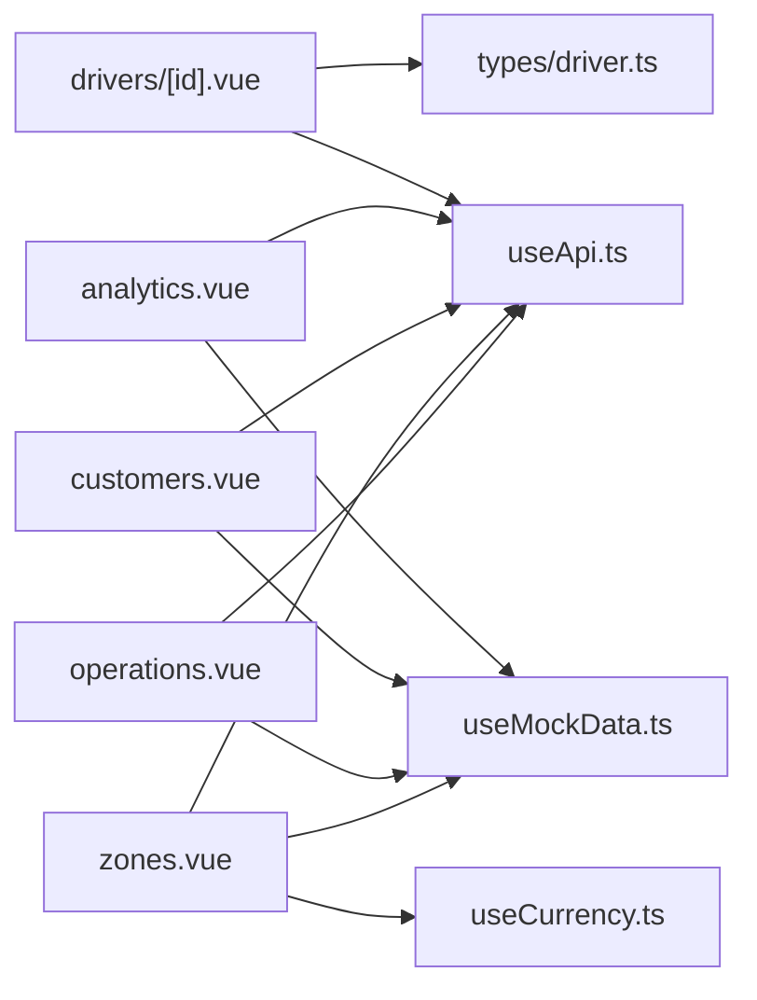

# Operations Reports

<cite>
**Referenced Files in This Document**
- [operations.vue](file://app/pages/reports/operations.vue)
- [analytics.vue](file://app/pages/reports/analytics.vue)
- [zones.vue](file://app/pages/reports/zones.vue)
- [customers.vue](file://app/pages/reports/customers.vue)
- [useApi.ts](file://app/composables/useApi.ts)
- [useMockData.ts](file://app/composables/useMockData.ts)
- [useCurrency.ts](file://app/composables/useCurrency.ts)
- [driver-detail.vue](file://app/pages/drivers/[id].vue)
- [driver-types.ts](file://app/types/driver.ts)
</cite>

## Table of Contents
1. [Introduction](#introduction)
2. [Project Structure](#project-structure)
3. [Core Components](#core-components)
4. [Architecture Overview](#architecture-overview)
5. [Detailed Component Analysis](#detailed-component-analysis)
6. [Dependency Analysis](#dependency-analysis)
7. [Performance Considerations](#performance-considerations)
8. [Troubleshooting Guide](#troubleshooting-guide)
9. [Conclusion](#conclusion)
10. [Appendices](#appendices)

## Introduction
This document describes the operations reporting system with a focus on operational metrics collection, fleet utilization analysis, driver performance tracking, and service level monitoring. It explains how data sources are used, how filtering by date ranges and zones is implemented, and how export capabilities are provided for operational data. It also includes examples for generating daily operational summaries, analyzing pickup completion rates, and monitoring resource allocation efficiency, along with guidance for real-time updates and performance considerations for large-scale datasets.

## Project Structure
The operations reports are implemented as Nuxt pages under the reports directory. Each page focuses on a specific dimension:
- Operations Analytics: high-level KPIs, monthly pickup volume, completion rate trends, and driver performance table
- Zone Performance: per-zone metrics, period filters (week/month/quarter), and completion trend selection
- Customer Analytics: growth, retention, plan distribution, payment status, and top customers
- General Analytics: revenue, pickup frequency, customer growth, and shop sales charts

**Diagram sources**
- [operations.vue:1-164](file://app/pages/reports/operations.vue#L1-L164)
- [zones.vue:1-245](file://app/pages/reports/zones.vue#L1-L245)
- [customers.vue:1-262](file://app/pages/reports/customers.vue#L1-L262)
- [analytics.vue:1-274](file://app/pages/reports/analytics.vue#L1-L274)
- [useApi.ts:1-91](file://app/composables/useApi.ts#L1-L91)
- [useMockData.ts:1-61](file://app/composables/useMockData.ts#L1-L61)
- [useCurrency.ts:1-12](file://app/composables/useCurrency.ts#L1-L12)
- [driver-detail.vue:1-200](file://app/pages/drivers/[id].vue#L1-L200)

**Section sources**
- [operations.vue:1-164](file://app/pages/reports/operations.vue#L1-L164)
- [zones.vue:1-245](file://app/pages/reports/zones.vue#L1-L245)
- [customers.vue:1-262](file://app/pages/reports/customers.vue#L1-L262)
- [analytics.vue:1-274](file://app/pages/reports/analytics.vue#L1-L274)
- [useApi.ts:1-91](file://app/composables/useApi.ts#L1-L91)
- [useMockData.ts:1-61](file://app/composables/useMockData.ts#L1-L61)
- [useCurrency.ts:1-12](file://app/composables/useCurrency.ts#L1-L12)
- [driver-detail.vue:1-200](file://app/pages/drivers/[id].vue#L1-L200)

## Core Components
- Operations Analytics page provides:
  - Stat cards for total pickups, completion rate, active trucks, average pickup time
  - Monthly pickup volume bar chart
  - Completion rate line chart
  - Driver performance table with zone, pickups, completion %, average time, and status
- Zones page provides:
  - Period filter (week/month/quarter)
  - Per-zone totals and averages
  - Bar charts for pickups and revenue by zone
  - Completion trend line for selected zone
  - Zone breakdown table including missed pickups and performance progress bars
- Customers page provides:
  - Growth, new vs churned, plan split, payment status, and top customers
- Analytics page provides:
  - Revenue trend, pickup frequency, customer growth, and shop sales charts

These components use shared chart helper functions to render SVG-based visualizations and rely on composables for API calls, currency formatting, and mock reference data.

**Section sources**
- [operations.vue:1-164](file://app/pages/reports/operations.vue#L1-L164)
- [zones.vue:1-245](file://app/pages/reports/zones.vue#L1-L245)
- [customers.vue:1-262](file://app/pages/reports/customers.vue#L1-L262)
- [analytics.vue:1-274](file://app/pages/reports/analytics.vue#L1-L274)
- [useCurrency.ts:1-12](file://app/composables/useCurrency.ts#L1-L12)
- [useMockData.ts:1-61](file://app/composables/useMockData.ts#L1-L61)

## Architecture Overview
The reporting system follows a client-side architecture:
- Pages define UI and local state for charts and tables
- Composables provide HTTP requests with authentication and error handling
- Mock data supplies static reference sets for zones, trucks, and plans
- Currency formatting composable standardizes monetary values

**Diagram sources**
- [useApi.ts:1-91](file://app/composables/useApi.ts#L1-L91)
- [operations.vue:1-164](file://app/pages/reports/operations.vue#L1-L164)
- [zones.vue:1-245](file://app/pages/reports/zones.vue#L1-L245)

## Detailed Component Analysis

### Operations Analytics
- Operational KPIs:
  - Total Pickups (Month), Completion Rate, Active Trucks, Avg Pickup Time
- Data Sources:
  - Static arrays for stats, pickup volume, completion rate, and driver performance
- Filtering:
  - No explicit date range or zone filters on this page; intended for monthly overview
- Export:
  - Export button present; implementation not wired to backend in this file
- Visualization:
  - SVG bar chart for monthly pickup volume
  - SVG area/line chart for completion rate
  - Table for driver performance with color-coded completion thresholds

**Diagram sources**
- [operations.vue:1-164](file://app/pages/reports/operations.vue#L1-L164)

**Section sources**
- [operations.vue:1-164](file://app/pages/reports/operations.vue#L1-L164)

### Zone Performance
- Operational KPIs:
  - Active Zones, Total Customers, Total Pickups, Average Completion
- Data Sources:
  - Static zone dataset with customers, pickups, completion, revenue, drivers, missed pickups
- Filtering:
  - Period toggle (week/month/quarter)
  - Zone selector for completion trend
- Export:
  - Export button present; implementation not wired to backend in this file
- Visualization:
  - Bar charts for pickups and revenue by zone
  - Line chart for completion trend with selectable zone
  - Table with performance progress bars and color-coded missed pickups

**Diagram sources**
- [zones.vue:1-245](file://app/pages/reports/zones.vue#L1-L245)

**Section sources**
- [zones.vue:1-245](file://app/pages/reports/zones.vue#L1-L245)

### Driver Performance Tracking
- Metrics:
  - Monthly pickups, monthly completion rate, average time per stop, on-time rate, customer rating
- Data Sources:
  - Driver detail page fetches current route, pickup history, and performance via API
- Real-time Updates:
  - Current route and estimated completion are loaded from the driver’s live route endpoint
- Visualization:
  - Charts for monthly pickups and completion rates
  - Stats for average time per stop, on-time rate, and customer rating

**Diagram sources**
- [driver-detail.vue:1-200](file://app/pages/drivers/[id].vue#L1-L200)
- [useApi.ts:1-91](file://app/composables/useApi.ts#L1-L91)

**Section sources**
- [driver-detail.vue:1-200](file://app/pages/drivers/[id].vue#L1-L200)
- [driver-types.ts:1-106](file://app/types/driver.ts#L1-L106)

### Service Level Monitoring
- Service levels are reflected through:
  - Completion rate trends (monthly)
  - Missed pickups per zone
  - Average pickup time and on-time rate at driver level
- Monitoring approach:
  - Use zone completion trend and missed pickups to identify underperforming areas
  - Use driver on-time rate and average time per stop to assess individual SLA adherence

**Section sources**
- [zones.vue:1-245](file://app/pages/reports/zones.vue#L1-L245)
- [driver-detail.vue:1-200](file://app/pages/drivers/[id].vue#L1-L200)

## Dependency Analysis
- Reporting pages depend on:
  - useApi for authenticated HTTP requests
  - useCurrency for consistent GHS formatting
  - useMockData for static reference data (zones, trucks, plans)
- Driver detail depends on:
  - useApi for fetching route, history, and performance
  - Types defined in driver types for structured data models

**Diagram sources**
- [operations.vue:1-164](file://app/pages/reports/operations.vue#L1-L164)
- [zones.vue:1-245](file://app/pages/reports/zones.vue#L1-L245)
- [customers.vue:1-262](file://app/pages/reports/customers.vue#L1-L262)
- [analytics.vue:1-274](file://app/pages/reports/analytics.vue#L1-L274)
- [useApi.ts:1-91](file://app/composables/useApi.ts#L1-L91)
- [useCurrency.ts:1-12](file://app/composables/useCurrency.ts#L1-L12)
- [useMockData.ts:1-61](file://app/composables/useMockData.ts#L1-L61)
- [driver-detail.vue:1-200](file://app/pages/drivers/[id].vue#L1-L200)
- [driver-types.ts:1-106](file://app/types/driver.ts#L1-L106)

**Section sources**
- [useApi.ts:1-91](file://app/composables/useApi.ts#L1-L91)
- [useMockData.ts:1-61](file://app/composables/useMockData.ts#L1-L61)
- [useCurrency.ts:1-12](file://app/composables/useCurrency.ts#L1-L12)
- [driver-types.ts:1-106](file://app/types/driver.ts#L1-L106)

## Performance Considerations
- Rendering:
  - SVG-based charts compute points and labels on each render; consider memoizing computed values for large datasets
- Data Volume:
  - For large-scale operational datasets, prefer server-side aggregation and pagination
  - Avoid loading entire histories into memory; use incremental loads or virtualized lists
- Real-time Updates:
  - Use polling or WebSocket integration for live route and performance metrics
  - Debounce frequent updates to reduce re-renders
- Export:
  - Generate CSV client-side for small exports; for large datasets, trigger server-generated downloads

[No sources needed since this section provides general guidance]

## Troubleshooting Guide
- Authentication Errors:
  - The API composable handles 401 responses by logging out and redirecting to login
- Network Failures:
  - Non-success statuses throw errors; wrapped methods show toast notifications
- Missing Data:
  - Ensure backend endpoints return expected structures; check console logs for request/response details

**Section sources**
- [useApi.ts:1-91](file://app/composables/useApi.ts#L1-L91)

## Conclusion
The operations reporting system provides comprehensive dashboards for operational metrics, fleet utilization, driver performance, and service level monitoring. While many views currently use static data, the architecture supports integration with backend APIs for real-time updates and scalable analytics. Export buttons are present across key pages, enabling quick access to operational data. Future enhancements should focus on server-side aggregation, robust filtering, and real-time streaming for large-scale operational datasets.

[No sources needed since this section summarizes without analyzing specific files]

## Appendices

### Examples and Use Cases

- Generating Daily Operational Summaries
  - Use the Operations Analytics page to review monthly totals and trends; extend with a daily view by adding date range filters and aggregating daily pickups and completion rates
  - Reference: [operations.vue:1-164](file://app/pages/reports/operations.vue#L1-L164)

- Analyzing Pickup Completion Rates
  - Review the completion rate line chart and zone completion trends; compare missed pickups per zone to identify bottlenecks
  - References: [operations.vue:1-164](file://app/pages/reports/operations.vue#L1-L164), [zones.vue:1-245](file://app/pages/reports/zones.vue#L1-L245)

- Monitoring Resource Allocation Efficiency
  - Examine active trucks, average pickup time, and driver on-time rate; correlate with zone workload and missed pickups
  - References: [operations.vue:1-164](file://app/pages/reports/operations.vue#L1-L164), [driver-detail.vue:1-200](file://app/pages/drivers/[id].vue#L1-L200)

### Data Sources for Operational KPIs
- Static datasets:
  - Zones, trucks, customer types, subscription plans
  - Reference: [useMockData.ts:1-61](file://app/composables/useMockData.ts#L1-L61)
- Live data:
  - Driver route, pickup history, performance metrics
  - Reference: [driver-detail.vue:1-200](file://app/pages/drivers/[id].vue#L1-L200)

### Filtering Mechanisms
- Date ranges:
  - Not explicitly implemented in current pages; can be added by introducing date inputs and passing parameters to API endpoints
- Zones:
  - Zone selection dropdown for completion trend
  - Reference: [zones.vue:1-245](file://app/pages/reports/zones.vue#L1-L245)

### Export Capabilities
- Export buttons are present on Operations, Zones, and Analytics pages; client-side CSV generation patterns exist elsewhere in the app
- Reference patterns:
  - Export button usage: [operations.vue:1-164](file://app/pages/reports/operations.vue#L1-L164), [zones.vue:1-245](file://app/pages/reports/zones.vue#L1-L245), [analytics.vue:1-274](file://app/pages/reports/analytics.vue#L1-L274)
  - Client-side CSV export example: [inventory/index.vue:86-109](file://app/pages/inventory/index.vue#L86-L109)

### Real-time Data Updates
- Driver detail page demonstrates fetching live route and estimated completion
- Recommendation:
  - Implement periodic polling or WebSocket subscriptions for continuous updates in reports

**Section sources**
- [useMockData.ts:1-61](file://app/composables/useMockData.ts#L1-L61)
- [driver-detail.vue:1-200](file://app/pages/drivers/[id].vue#L1-L200)
- [operations.vue:1-164](file://app/pages/reports/operations.vue#L1-L164)
- [zones.vue:1-245](file://app/pages/reports/zones.vue#L1-L245)
- [analytics.vue:1-274](file://app/pages/reports/analytics.vue#L1-L274)
- [inventory/index.vue:86-109](file://app/pages/inventory/index.vue#L86-L109)