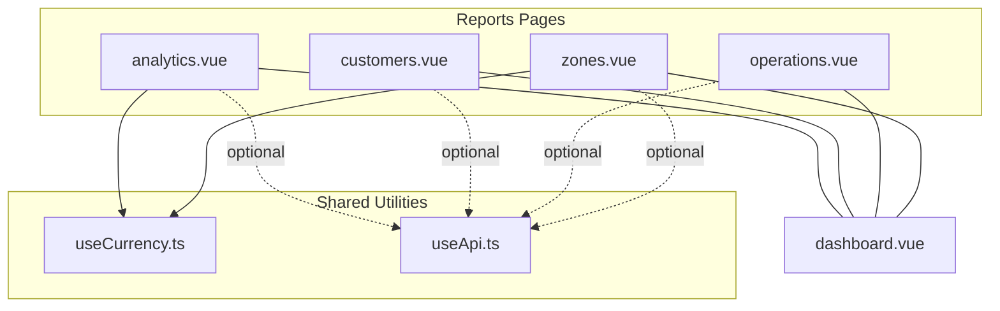
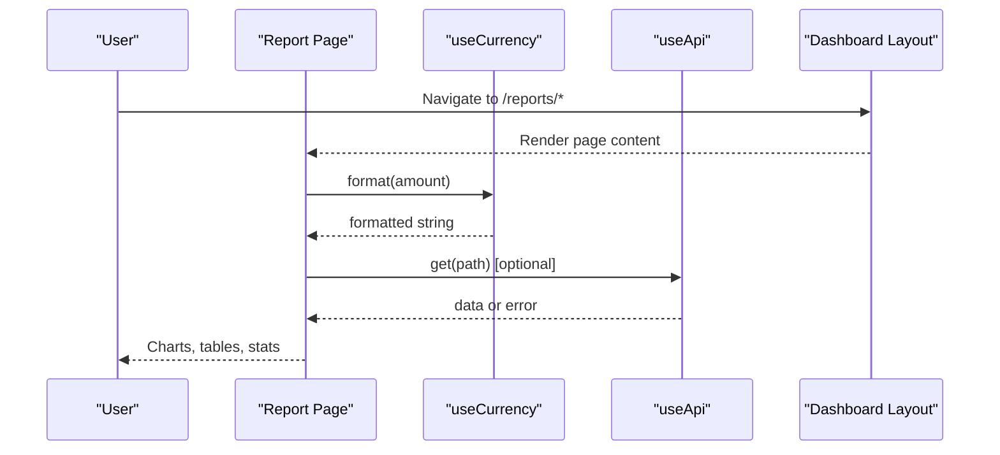
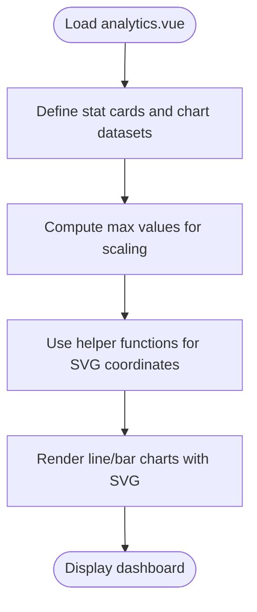
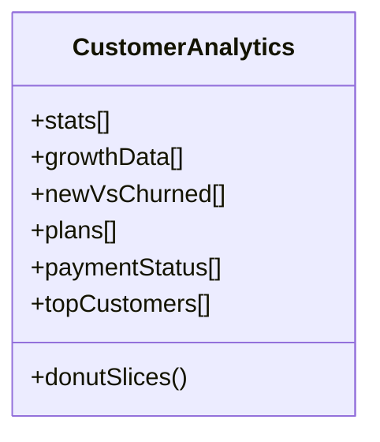
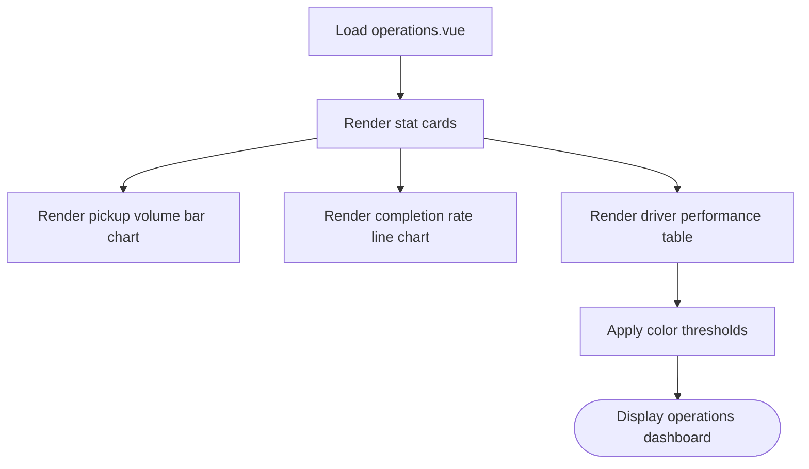
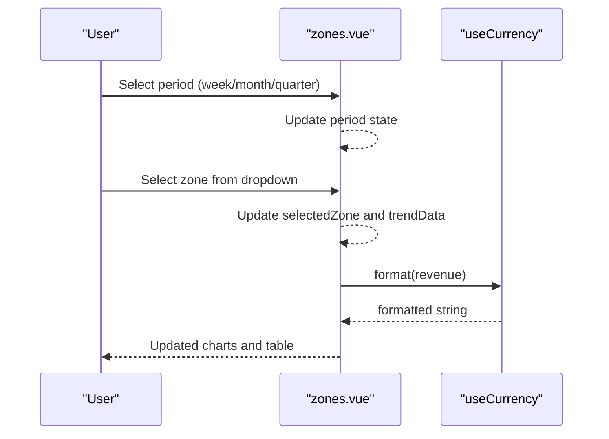
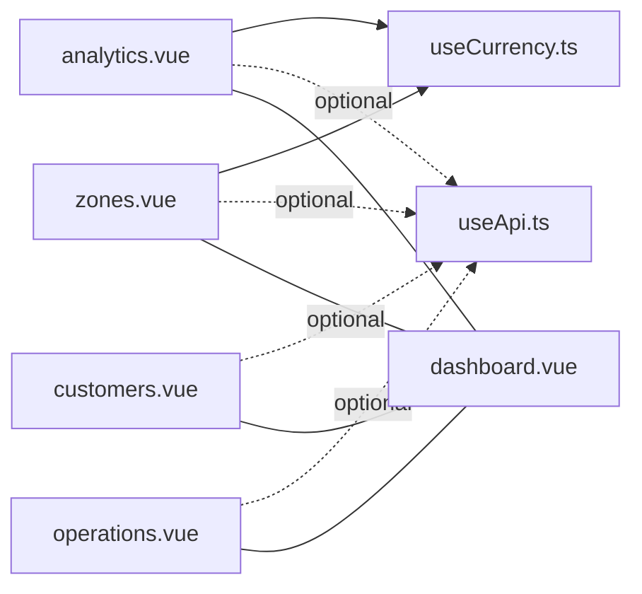

# Reports & Analytics

<cite>
**Referenced Files in This Document**
- [analytics.vue](file://app/pages/reports/analytics.vue)
- [customers.vue](file://app/pages/reports/customers.vue)
- [operations.vue](file://app/pages/reports/operations.vue)
- [zones.vue](file://app/pages/reports/zones.vue)
- [useCurrency.ts](file://app/composables/useCurrency.ts)
- [useApi.ts](file://app/composables/useApi.ts)
- [dashboard.vue](file://app/layouts/dashboard.vue)
</cite>

## Table of Contents
1. [Introduction](#introduction)
2. [Project Structure](#project-structure)
3. [Core Components](#core-components)
4. [Architecture Overview](#architecture-overview)
5. [Detailed Component Analysis](#detailed-component-analysis)
6. [Dependency Analysis](#dependency-analysis)
7. [Performance Considerations](#performance-considerations)
8. [Troubleshooting Guide](#troubleshooting-guide)
9. [Conclusion](#conclusion)
10. [Appendices](#appendices)

## Introduction
This document describes the reporting and analytics system implemented as a set of Nuxt pages under the reports section. It covers business intelligence dashboards, operational metrics and KPIs, custom report generation patterns, and data export capabilities. The system uses inline SVG charts for visualizations, composable utilities for currency formatting and API access, and a dashboard layout for consistent presentation.

The current implementation presents static sample datasets within each page to demonstrate:
- Business intelligence dashboards (revenue trends, revenue breakdown, shop sales)
- Operational metrics and KPIs (pickup volume, completion rate, driver performance)
- Customer analytics (growth, new vs churned, plan distribution, payment status)
- Zone performance (pickups by zone, revenue by zone, completion trend per zone)

It also includes UI affordances for exporting reports and filtering by period where applicable.

## Project Structure
The reporting feature is organized as four dedicated pages, each focused on a specific domain:
- Analytics overview with financial and operational highlights
- Customer analytics with growth and retention insights
- Operations analytics with pickup and completion metrics
- Zone performance with regional breakdowns and trends

All pages share a common dashboard layout that provides header/sidebar context and scrollable content area.

**Diagram sources**
- [analytics.vue:1-274](file://app/pages/reports/analytics.vue#L1-L274)
- [customers.vue:1-262](file://app/pages/reports/customers.vue#L1-L262)
- [operations.vue:1-164](file://app/pages/reports/operations.vue#L1-L164)
- [zones.vue:1-245](file://app/pages/reports/zones.vue#L1-L245)
- [useCurrency.ts:1-12](file://app/composables/useCurrency.ts#L1-L12)
- [useApi.ts:1-91](file://app/composables/useApi.ts#L1-L91)
- [dashboard.vue:1-25](file://app/layouts/dashboard.vue#L1-L25)

**Section sources**
- [analytics.vue:1-274](file://app/pages/reports/analytics.vue#L1-L274)
- [customers.vue:1-262](file://app/pages/reports/customers.vue#L1-L262)
- [operations.vue:1-164](file://app/pages/reports/operations.vue#L1-L164)
- [zones.vue:1-245](file://app/pages/reports/zones.vue#L1-L245)
- [dashboard.vue:1-25](file://app/layouts/dashboard.vue#L1-L25)

## Core Components
- Revenue and operational dashboards:
  - Stat cards summarizing key figures (e.g., deposits, revenue, paid customers)
  - Multi-series line and bar charts rendered via inline SVG
  - Area fills and grid lines for readability
- Customer analytics:
  - Growth line chart, grouped bars for new vs churned
  - Donut chart for plan distribution using stroke-dasharray segments
  - Payment status progress bars and top customer table
- Operations analytics:
  - Pickup volume bar chart and completion rate line chart
  - Driver performance table with color-coded completion thresholds
- Zone performance:
  - Period filter toggle (week/month/quarter)
  - Bar charts for pickups and revenue by zone
  - Completion trend line chart with zone selector dropdown
  - Zone breakdown table with color-coded metrics and progress bars

Data aggregation patterns:
- Local arrays define time series and categorical distributions
- Computed values derive totals and averages across zones
- Chart helpers compute coordinates, labels, and scales for SVG rendering

Export capabilities:
- Export buttons are present on each page; they provide a clear user action for downloading reports or data

Filtering mechanisms:
- Zones page includes a period toggle and a zone selector dropdown to change displayed trends

**Section sources**
- [analytics.vue:6-141](file://app/pages/reports/analytics.vue#L6-L141)
- [customers.vue:29-92](file://app/pages/reports/customers.vue#L29-L92)
- [operations.vue:29-61](file://app/pages/reports/operations.vue#L29-L61)
- [zones.vue:40-78](file://app/pages/reports/zones.vue#L40-L78)

## Architecture Overview
The reporting system follows a simple, component-driven architecture:
- Each report page encapsulates its own dataset and visualization logic
- Shared composables provide currency formatting and HTTP request utilities
- The dashboard layout ensures consistent navigation and responsive behavior

**Diagram sources**
- [analytics.vue:1-274](file://app/pages/reports/analytics.vue#L1-L274)
- [customers.vue:1-262](file://app/pages/reports/customers.vue#L1-L262)
- [operations.vue:1-164](file://app/pages/reports/operations.vue#L1-L164)
- [zones.vue:1-245](file://app/pages/reports/zones.vue#L1-L245)
- [useCurrency.ts:1-12](file://app/composables/useCurrency.ts#L1-L12)
- [useApi.ts:1-91](file://app/composables/useApi.ts#L1-L91)
- [dashboard.vue:1-25](file://app/layouts/dashboard.vue#L1-L25)

## Detailed Component Analysis

### Analytics Overview
- Purpose: Provide high-level financial and operational insights
- Key elements:
  - Stat cards for bank deposits, revenue, paid customers
  - Revenue breakdown by payment method
  - Line chart for revenue trend over months
  - Bar chart for pickup frequency
  - Line chart for customer growth
  - Bar chart for shop sales
- Data aggregation:
  - Arrays define monthly values; max values computed for scaling
  - Helper functions calculate points, areas, and labels for SVG
- Visualization:
  - Inline SVG with polyline/polygon/rect elements
  - Grid lines and axis labels generated programmatically

**Diagram sources**
- [analytics.vue:46-141](file://app/pages/reports/analytics.vue#L46-L141)

**Section sources**
- [analytics.vue:6-141](file://app/pages/reports/analytics.vue#L6-L141)
- [analytics.vue:143-274](file://app/pages/reports/analytics.vue#L143-L274)

### Customer Analytics
- Purpose: Track acquisition, retention, and payment behavior
- Key elements:
  - Stat cards for total customers, new this month, churned, retention rate
  - Growth line chart
  - Grouped bar chart comparing new vs churned
  - Donut chart for plan distribution
  - Payment status progress bars
  - Top customers table with badges and status indicators
- Data aggregation:
  - Monthly arrays for growth and new/churned
  - Computed donut slices from percentages and circumference
- Visualization:
  - SVG line/area for growth
  - SVG grouped bars for acquisition vs churn
  - SVG donut using stroke-dasharray segments

**Diagram sources**
- [customers.vue:29-92](file://app/pages/reports/customers.vue#L29-L92)
- [customers.vue:55-70](file://app/pages/reports/customers.vue#L55-L70)

**Section sources**
- [customers.vue:29-92](file://app/pages/reports/customers.vue#L29-L92)
- [customers.vue:94-262](file://app/pages/reports/customers.vue#L94-L262)

### Operations Analytics
- Purpose: Monitor operational efficiency and driver performance
- Key elements:
  - Stat cards for total pickups, completion rate, active trucks, average pickup time
  - Bar chart for monthly pickup volume
  - Line chart for completion rate trend
  - Driver performance table with color-coded completion and status badges
- Data aggregation:
  - Monthly arrays for volume and completion rates
  - Max value computed for scaling
- Visualization:
  - SVG bar chart for volume
  - SVG line/area chart for completion rate
  - Table rows styled based on thresholds

**Diagram sources**
- [operations.vue:29-61](file://app/pages/reports/operations.vue#L29-L61)
- [operations.vue:96-124](file://app/pages/reports/operations.vue#L96-L124)
- [operations.vue:126-160](file://app/pages/reports/operations.vue#L126-L160)

**Section sources**
- [operations.vue:29-61](file://app/pages/reports/operations.vue#L29-L61)
- [operations.vue:96-160](file://app/pages/reports/operations.vue#L96-L160)

### Zone Performance
- Purpose: Analyze regional performance and trends
- Key elements:
  - Period filter toggle (week/month/quarter)
  - Summary stats for active zones, total customers, total pickups, average completion
  - Bar charts for pickups by zone and revenue by zone
  - Completion trend line chart with zone selector dropdown
  - Zone breakdown table with color-coded metrics and progress bars
- Data aggregation:
  - Zone array with aggregated metrics
  - Computed totals and averages across zones
  - Trend data keyed by zone name
- Visualization:
  - SVG bar charts with per-zone colors
  - SVG line/area chart with range-based y-axis labels
  - Table with dynamic styling based on thresholds

**Diagram sources**
- [zones.vue:40-78](file://app/pages/reports/zones.vue#L40-L78)
- [zones.vue:165-188](file://app/pages/reports/zones.vue#L165-L188)
- [useCurrency.ts:1-12](file://app/composables/useCurrency.ts#L1-L12)

**Section sources**
- [zones.vue:40-78](file://app/pages/reports/zones.vue#L40-L78)
- [zones.vue:80-245](file://app/pages/reports/zones.vue#L80-L245)

## Dependency Analysis
- Currency formatting:
  - useCurrency provides localized currency formatting used in analytics and zones pages
- API integration:
  - useApi offers typed wrappers for GET/POST/PUT/PATCH/DELETE and handles authentication and error responses
- Layout:
  - dashboard.vue wraps report pages with sidebar/header and responsive behavior

**Diagram sources**
- [analytics.vue:1-274](file://app/pages/reports/analytics.vue#L1-L274)
- [customers.vue:1-262](file://app/pages/reports/customers.vue#L1-L262)
- [operations.vue:1-164](file://app/pages/reports/operations.vue#L1-L164)
- [zones.vue:1-245](file://app/pages/reports/zones.vue#L1-L245)
- [useCurrency.ts:1-12](file://app/composables/useCurrency.ts#L1-L12)
- [useApi.ts:1-91](file://app/composables/useApi.ts#L1-L91)
- [dashboard.vue:1-25](file://app/layouts/dashboard.vue#L1-L25)

**Section sources**
- [useCurrency.ts:1-12](file://app/composables/useCurrency.ts#L1-L12)
- [useApi.ts:1-91](file://app/composables/useApi.ts#L1-L91)
- [dashboard.vue:1-25](file://app/layouts/dashboard.vue#L1-L25)

## Performance Considerations
- Rendering large datasets:
  - Prefer server-side aggregation and pagination to reduce client-side computation
  - Use virtualized lists for large tables when integrating real APIs
- Real-time updates:
  - Introduce polling or WebSocket subscriptions to refresh metrics periodically
  - Debounce user interactions (period toggles, zone selection) to avoid excessive re-renders
- Customizable interfaces:
  - Extract reusable chart components to minimize duplication and enable configuration options
  - Cache computed aggregates using memoization or composables to prevent redundant calculations

[No sources needed since this section provides general guidance]

## Troubleshooting Guide
- Authentication errors:
  - When the API returns 401, the session is cleared and the user is redirected to login
- Network failures:
  - Non-successful statuses throw descriptive errors; ensure proper error handling in callers
- Currency formatting issues:
  - Verify locale and currency settings in the currency formatter if outputs appear incorrect

**Section sources**
- [useApi.ts:39-58](file://app/composables/useApi.ts#L39-L58)
- [useCurrency.ts:1-12](file://app/composables/useCurrency.ts#L1-L12)

## Conclusion
The reporting and analytics system provides a cohesive set of dashboards for finance, operations, customers, and zones. It leverages lightweight inline SVG charts, composable utilities for formatting and API calls, and a consistent dashboard layout. While currently using static datasets, the structure supports easy migration to live data sources, real-time updates, and scalable charting solutions.

[No sources needed since this section summarizes without analyzing specific files]

## Appendices

### Practical Examples

- Generating operational reports:
  - Use the operations page to review pickup volume and completion rate trends, then click Export to download the report
  - Reference: [operations.vue:66-80](file://app/pages/reports/operations.vue#L66-L80)

- Analyzing customer metrics:
  - Review growth, new vs churned, plan distribution, and payment status on the customer analytics page
  - Reference: [customers.vue:94-221](file://app/pages/reports/customers.vue#L94-L221)

- Monitoring zone performance:
  - Toggle period filters and select a zone to view completion trends; review zone breakdown table for detailed metrics
  - Reference: [zones.vue:89-101](file://app/pages/reports/zones.vue#L89-L101), [zones.vue:165-188](file://app/pages/reports/zones.vue#L165-L188), [zones.vue:190-241](file://app/pages/reports/zones.vue#L190-L241)

- Exporting data for external analysis:
  - Click Export buttons on any report page to initiate downloads
  - References:
    - [analytics.vue:152-160](file://app/pages/reports/analytics.vue#L152-L160)
    - [customers.vue:103-111](file://app/pages/reports/customers.vue#L103-L111)
    - [operations.vue:72-80](file://app/pages/reports/operations.vue#L72-L80)
    - [zones.vue:97-101](file://app/pages/reports/zones.vue#L97-L101)

### Data Aggregation Patterns

- Time series arrays define monthly values; max values computed for scaling
- Computed totals and averages aggregate across zones
- Chart helpers compute coordinates, labels, and scales for SVG rendering

References:
- [analytics.vue:46-141](file://app/pages/reports/analytics.vue#L46-L141)
- [zones.vue:52-78](file://app/pages/reports/zones.vue#L52-L78)

### Filtering Mechanisms

- Period toggle (week/month/quarter) updates displayed metrics
- Zone selector dropdown changes completion trend data

References:
- [zones.vue:40-78](file://app/pages/reports/zones.vue#L40-L78)
- [zones.vue:165-188](file://app/pages/reports/zones.vue#L165-L188)