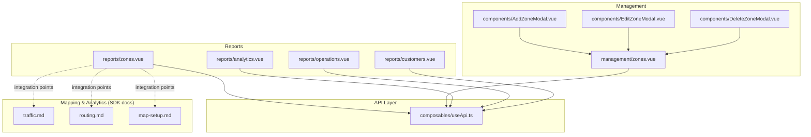
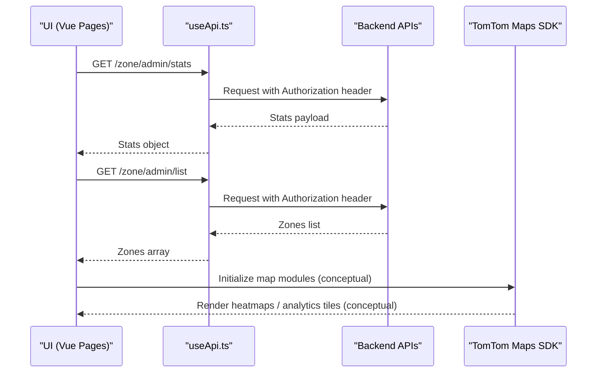
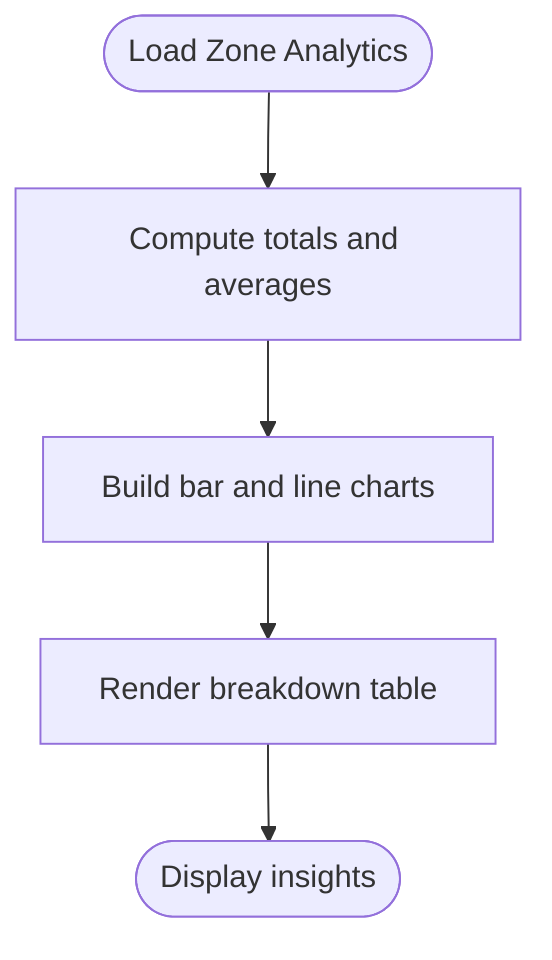
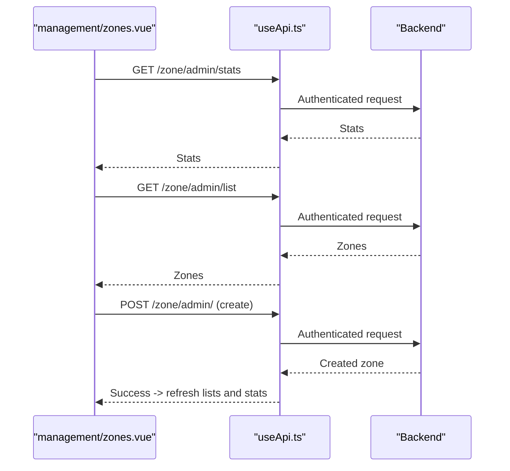
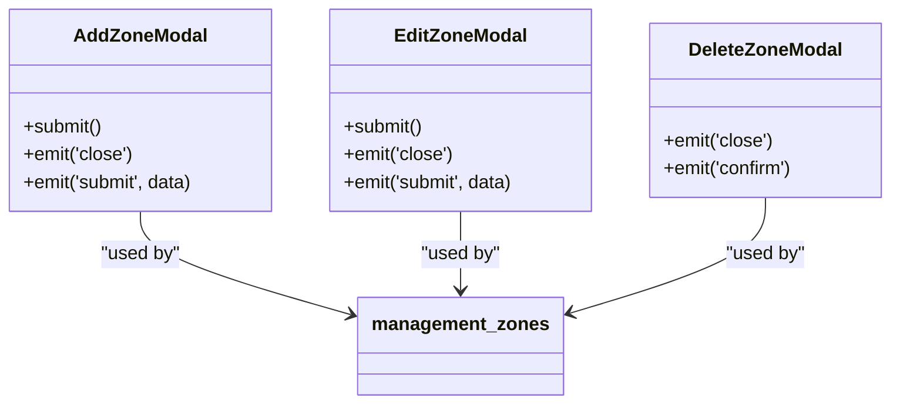
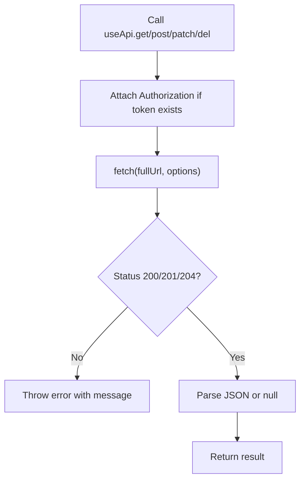
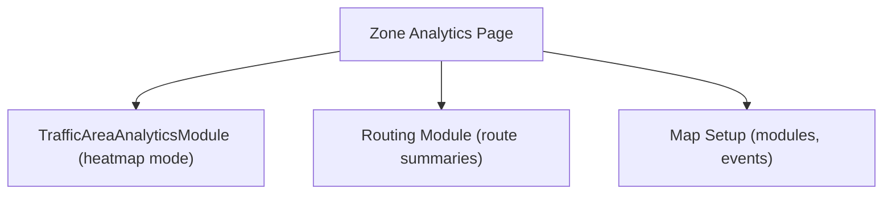
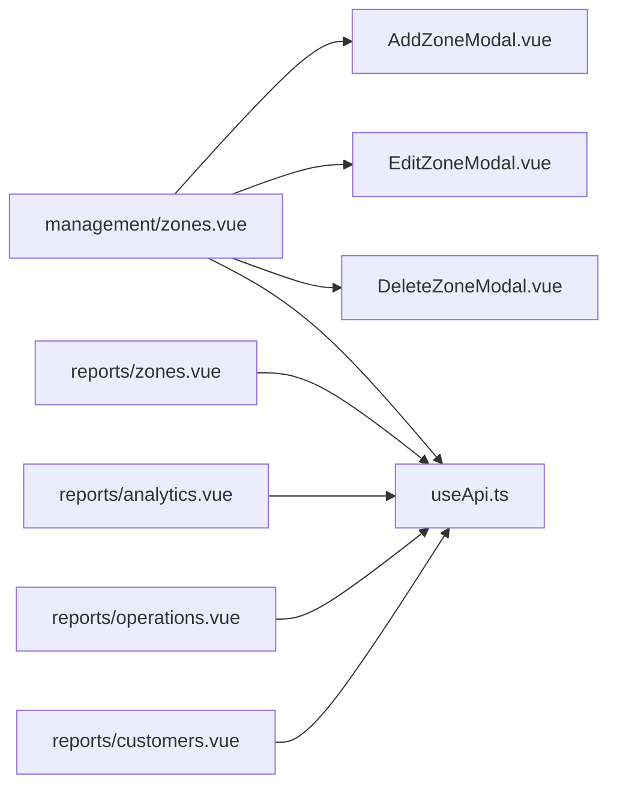

# Zone Performance

<cite>
**Referenced Files in This Document**
- [zones.vue](file://app/pages/reports/zones.vue)
- [zones.vue](file://app/pages/management/zones.vue)
- [AddZoneModal.vue](file://app/components/AddZoneModal.vue)
- [EditZoneModal.vue](file://app/components/EditZoneModal.vue)
- [DeleteZoneModal.vue](file://app/components/DeleteZoneModal.vue)
- [useApi.ts](file://app/composables/useApi.ts)
- [analytics.vue](file://app/pages/reports/analytics.vue)
- [operations.vue](file://app/pages/reports/operations.vue)
- [customers.vue](file://app/pages/reports/customers.vue)
- [traffic.md](file://agents/skills/tomtom-maps-sdk-js/docs/traffic.md)
- [routing.md](file://agents/skills/tomtom-maps-sdk-js/docs/routing.md)
- [map-setup.md](file://agents/skills/tomtom-maps-sdk-js/docs/map-setup.md)
</cite>

## Table of Contents
1. Introduction
2. Project Structure
3. Core Components
4. Architecture Overview
5. Detailed Component Analysis
6. Dependency Analysis
7. Performance Considerations
8. Troubleshooting Guide
9. Conclusion
10. Appendices

## Introduction
This document explains the zone-based performance analytics and geographic reporting features available in the application. It covers:
- Zone utilization metrics (pickups, completion rate, revenue, missed pickups)
- Density analysis and regional comparisons
- Route optimization effectiveness indicators
- Geospatial data processing and map integration points
- Heat map generation concepts via mapping SDK capabilities
- Territorial analysis workflows for identifying underperforming areas and optimizing resource allocation

The documentation is designed to be accessible to both technical and non-technical readers, with progressive complexity layers and diagrams that map to actual code where applicable.

## Project Structure
The zone performance feature spans two primary pages and supporting components:
- Reports page for zone analytics and KPIs
- Management page for CRUD operations on zones and area definitions
- Modal components for adding, editing, and deleting zones
- API composable for authenticated requests
- Additional reports pages for broader operational context

**Diagram sources**
- [zones.vue:1-245](file://app/pages/reports/zones.vue#L1-L245)
- [zones.vue:1-360](file://app/pages/management/zones.vue#L1-L360)
- [AddZoneModal.vue:1-87](file://app/components/AddZoneModal.vue#L1-L87)
- [EditZoneModal.vue:1-105](file://app/components/EditZoneModal.vue#L1-L105)
- [DeleteZoneModal.vue:1-37](file://app/components/DeleteZoneModal.vue#L1-L37)
- [useApi.ts:1-91](file://app/composables/useApi.ts#L1-L91)
- [analytics.vue:1-274](file://app/pages/reports/analytics.vue#L1-L274)
- [operations.vue:1-164](file://app/pages/reports/operations.vue#L1-L164)
- [customers.vue:1-262](file://app/pages/reports/customers.vue#L1-L262)
- [traffic.md:220-333](file://agents/skills/tomtom-maps-sdk-js/docs/traffic.md#L220-L333)
- [routing.md:1-57](file://agents/skills/tomtom-maps-sdk-js/docs/routing.md#L1-L57)
- [map-setup.md:1-280](file://agents/skills/tomtom-maps-sdk-js/docs/map-setup.md#L1-L280)

**Section sources**
- [zones.vue:1-245](file://app/pages/reports/zones.vue#L1-L245)
- [zones.vue:1-360](file://app/pages/management/zones.vue#L1-L360)
- [AddZoneModal.vue:1-87](file://app/components/AddZoneModal.vue#L1-L87)
- [EditZoneModal.vue:1-105](file://app/components/EditZoneModal.vue#L1-L105)
- [DeleteZoneModal.vue:1-37](file://app/components/DeleteZoneModal.vue#L1-L37)
- [useApi.ts:1-91](file://app/composables/useApi.ts#L1-L91)
- [analytics.vue:1-274](file://app/pages/reports/analytics.vue#L1-L274)
- [operations.vue:1-164](file://app/pages/reports/operations.vue#L1-L164)
- [customers.vue:1-262](file://app/pages/reports/customers.vue#L1-L262)

## Core Components
- Zone Analytics Page (Reports): Presents per-zone pickup counts, revenue, completion trends, and a breakdown table with color-coded performance indicators.
- Zone Management Page: Provides search, filtering, pagination, and CRUD operations for zones including activation toggling.
- Zone Modals: Add, Edit, Delete modals encapsulate form handling and submission flows.
- API Composable: Centralized HTTP client with authentication headers, error handling, and typed helpers.
- Supporting Reports Pages: Provide broader operational and customer analytics context useful for cross-referencing zone performance.

Key responsibilities:
- Data fetching and state management for zones and stats
- Local chart rendering using SVG primitives
- User interactions for creating, updating, and deleting zones
- Error handling and user feedback via toasts

**Section sources**
- [zones.vue:1-245](file://app/pages/reports/zones.vue#L1-L245)
- [zones.vue:1-360](file://app/pages/management/zones.vue#L1-L360)
- [AddZoneModal.vue:1-87](file://app/components/AddZoneModal.vue#L1-L87)
- [EditZoneModal.vue:1-105](file://app/components/EditZoneModal.vue#L1-L105)
- [DeleteZoneModal.vue:1-37](file://app/components/DeleteZoneModal.vue#L1-L37)
- [useApi.ts:1-91](file://app/composables/useApi.ts#L1-L91)

## Architecture Overview
The system follows a Vue 3 + Nuxt pattern with server-side API calls through a centralized composable. The zone analytics page renders charts locally and displays tabular breakdowns. The management page orchestrates CRUD operations and updates aggregated stats. Mapping and geospatial analytics are supported by the TomTom Maps SDK, which provides traffic area analytics and routing tools suitable for density and route optimization visualization.

**Diagram sources**
- [zones.vue:32-51](file://app/pages/management/zones.vue#L32-L51)
- [useApi.ts:9-67](file://app/composables/useApi.ts#L9-L67)
- [traffic.md:261-333](file://agents/skills/tomtom-maps-sdk-js/docs/traffic.md#L261-L333)

## Detailed Component Analysis

### Zone Analytics Page (Reports)
- Displays summary KPIs: active zones, total customers, total pickups, average completion.
- Bar charts for pickups and revenue by zone.
- Line chart for monthly completion trend with zone selector.
- Breakdown table with color-coded missed pickups and completion progress bars.

Data model (per zone):
- name, color, customers, pickups, completion, revenue, drivers, missedPickups

Processing logic:
- Aggregations computed from local dataset
- Chart helpers compute positions and labels for SVG elements
- Conditional coloring based on thresholds

**Diagram sources**
- [zones.vue:44-77](file://app/pages/reports/zones.vue#L44-L77)
- [zones.vue:126-188](file://app/pages/reports/zones.vue#L126-L188)
- [zones.vue:190-241](file://app/pages/reports/zones.vue#L190-L241)

**Section sources**
- [zones.vue:1-245](file://app/pages/reports/zones.vue#L1-L245)

### Zone Management Page
- Fetches zone list and aggregate stats concurrently.
- Supports search by name or area tags, status filter, and pagination.
- Actions: add, edit, delete, toggle active/inactive.
- Updates stats after mutations.

API endpoints used:
- GET /zone/admin/stats
- GET /zone/admin/list
- POST /zone/admin/
- PATCH /zone/admin/{id}
- DELETE /zone/admin/{id}
- PATCH /zone/admin/{id}/toggle

**Diagram sources**
- [zones.vue:32-51](file://app/pages/management/zones.vue#L32-L51)
- [zones.vue:84-145](file://app/pages/management/zones.vue#L84-L145)
- [useApi.ts:69-90](file://app/composables/useApi.ts#L69-L90)

**Section sources**
- [zones.vue:1-360](file://app/pages/management/zones.vue#L1-L360)
- [useApi.ts:1-91](file://app/composables/useApi.ts#L1-L91)

### Zone Modals (Add, Edit, Delete)
- AddZoneModal: Validates required fields, parses newline-separated areas into an array, emits submit event.
- EditZoneModal: Prepopulates form with existing zone data, validates, emits updated payload.
- DeleteZoneModal: Confirmation dialog; triggers deletion flow when confirmed.

**Diagram sources**
- [AddZoneModal.vue:15-25](file://app/components/AddZoneModal.vue#L15-L25)
- [EditZoneModal.vue:33-43](file://app/components/EditZoneModal.vue#L33-L43)
- [DeleteZoneModal.vue:1-37](file://app/components/DeleteZoneModal.vue#L1-L37)
- [zones.vue:344-356](file://app/pages/management/zones.vue#L344-L356)

**Section sources**
- [AddZoneModal.vue:1-87](file://app/components/AddZoneModal.vue#L1-L87)
- [EditZoneModal.vue:1-105](file://app/components/EditZoneModal.vue#L1-L105)
- [DeleteZoneModal.vue:1-37](file://app/components/DeleteZoneModal.vue#L1-L37)
- [zones.vue:344-356](file://app/pages/management/zones.vue#L344-L356)

### API Composable
- Adds Authorization header if token present.
- Handles 401 by logging out and redirecting to login.
- Treats 200/201/204 as success; otherwise throws errors with message extraction.
- Provides typed wrappers: get, post, put, patch, del.

**Diagram sources**
- [useApi.ts:9-67](file://app/composables/useApi.ts#L9-L67)

**Section sources**
- [useApi.ts:1-91](file://app/composables/useApi.ts#L1-L91)

### Geographic Reporting and Map Integration Points
While the current implementation uses static datasets and SVG charts, the repository includes comprehensive documentation for integrating TomTom Maps SDK features such as:
- Traffic area analytics with heatmap display modes
- Routing calculations for route optimization effectiveness
- Map setup and module patterns for layer control and events

These can be leveraged to enhance zone analytics with:
- Heat maps of pickup density or missed pickups by zone
- Isochrone/reachable range overlays for service coverage
- Route summaries and traffic sections to evaluate efficiency

**Diagram sources**
- [traffic.md:261-333](file://agents/skills/tomtom-maps-sdk-js/docs/traffic.md#L261-L333)
- [routing.md:1-57](file://agents/skills/tomtom-maps-sdk-js/docs/routing.md#L1-L57)
- [map-setup.md:131-145](file://agents/skills/tomtom-maps-sdk-js/docs/map-setup.md#L131-L145)

**Section sources**
- [traffic.md:220-333](file://agents/skills/tomtom-maps-sdk-js/docs/traffic.md#L220-L333)
- [routing.md:1-57](file://agents/skills/tomtom-maps-sdk-js/docs/routing.md#L1-L57)
- [map-setup.md:1-280](file://agents/skills/tomtom-maps-sdk-js/docs/map-setup.md#L1-L280)

## Dependency Analysis
- Zone Analytics depends on local data structures and chart helper functions.
- Zone Management depends on useApi for all backend interactions and on modal components for user input.
- All report pages share similar chart helper patterns and styling conventions.
- Mapping SDK documentation files provide integration blueprints but are not directly imported in the current pages.

**Diagram sources**
- [zones.vue:1-360](file://app/pages/management/zones.vue#L1-L360)
- [AddZoneModal.vue:1-87](file://app/components/AddZoneModal.vue#L1-L87)
- [EditZoneModal.vue:1-105](file://app/components/EditZoneModal.vue#L1-L105)
- [DeleteZoneModal.vue:1-37](file://app/components/DeleteZoneModal.vue#L1-L37)
- [useApi.ts:1-91](file://app/composables/useApi.ts#L1-L91)
- [zones.vue:1-245](file://app/pages/reports/zones.vue#L1-L245)
- [analytics.vue:1-274](file://app/pages/reports/analytics.vue#L1-L274)
- [operations.vue:1-164](file://app/pages/reports/operations.vue#L1-L164)
- [customers.vue:1-262](file://app/pages/reports/customers.vue#L1-L262)

**Section sources**
- [zones.vue:1-360](file://app/pages/management/zones.vue#L1-L360)
- [zones.vue:1-245](file://app/pages/reports/zones.vue#L1-L245)
- [useApi.ts:1-91](file://app/composables/useApi.ts#L1-L91)

## Performance Considerations
- Prefer server-side aggregation for large datasets to reduce client computation.
- Use virtualization or pagination for large tables and lists.
- Cache frequently accessed stats and zone lists to minimize repeated network calls.
- For map visualizations, leverage SDK-provided modules and filters to avoid heavy custom rendering.
- Debounce search inputs and filter changes to limit re-renders.

[No sources needed since this section provides general guidance]

## Troubleshooting Guide
Common issues and resolutions:
- Authentication failures: The API composable logs out and redirects on 401; ensure tokens are valid and persisted.
- Network errors: Non-success statuses throw errors with messages; check console logs and backend responses.
- Empty states: Ensure backend returns expected shapes; the management page normalizes arrays from various response formats.
- Map rendering issues: When integrating maps, verify container height and build target compatibility as documented.

**Section sources**
- [useApi.ts:39-67](file://app/composables/useApi.ts#L39-L67)
- [zones.vue:37-45](file://app/pages/management/zones.vue#L37-L45)
- [map-setup.md:38-52](file://agents/skills/tomtom-maps-sdk-js/docs/map-setup.md#L38-L52)

## Conclusion
The zone performance feature provides clear dashboards for monitoring utilization, completion rates, and revenue across zones, alongside robust management capabilities for defining territories. While current analytics rely on local datasets and SVG charts, the included mapping SDK documentation offers strong pathways to integrate heat maps, density analysis, and route optimization visuals. Adopting these integrations will significantly enrich territorial analysis and support data-driven resource allocation decisions.

[No sources needed since this section summarizes without analyzing specific files]

## Appendices

### Example Workflows

#### Analyzing Pickup Efficiency by Zone
- Review the breakdown table to identify zones with high missed pickups and low completion percentages.
- Cross-reference with driver performance and average pickup times in the operations analytics page.
- Use the completion trend chart to observe improvements or regressions over time.

**Section sources**
- [zones.vue:190-241](file://app/pages/reports/zones.vue#L190-L241)
- [operations.vue:126-160](file://app/pages/reports/operations.vue#L126-L160)

#### Identifying Underperforming Areas
- Filter zones by inactive status and review customer and driver counts.
- Compare revenue and pickup volumes to spot low-yield zones.
- Investigate missed pickups and completion rates to pinpoint operational bottlenecks.

**Section sources**
- [zones.vue:53-72](file://app/pages/management/zones.vue#L53-L72)
- [zones.vue:126-188](file://app/pages/reports/zones.vue#L126-L188)

#### Optimizing Resource Allocation Across Territories
- Adjust zone boundaries and area tags via management modals to better align with demand clusters.
- Activate/deactivate zones based on seasonal demand and capacity constraints.
- Integrate map heat maps and reachable ranges to visualize coverage gaps and reallocate drivers accordingly.

**Section sources**
- [AddZoneModal.vue:15-25](file://app/components/AddZoneModal.vue#L15-L25)
- [EditZoneModal.vue:33-43](file://app/components/EditZoneModal.vue#L33-L43)
- [traffic.md:261-333](file://agents/skills/tomtom-maps-sdk-js/docs/traffic.md#L261-L333)