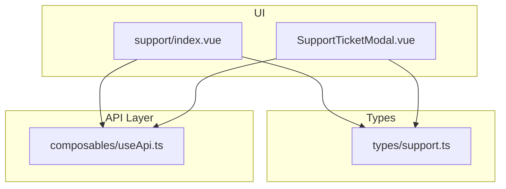
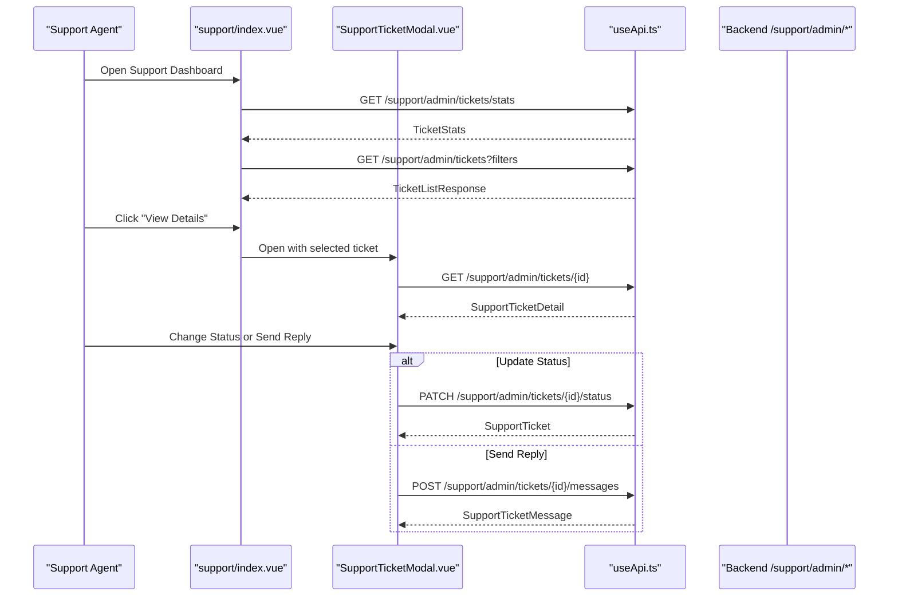
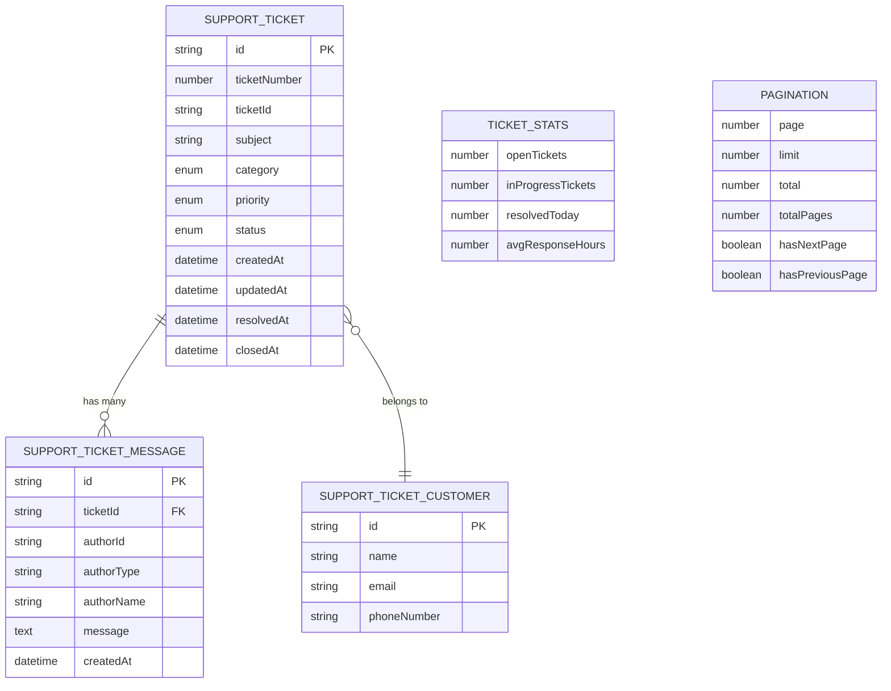
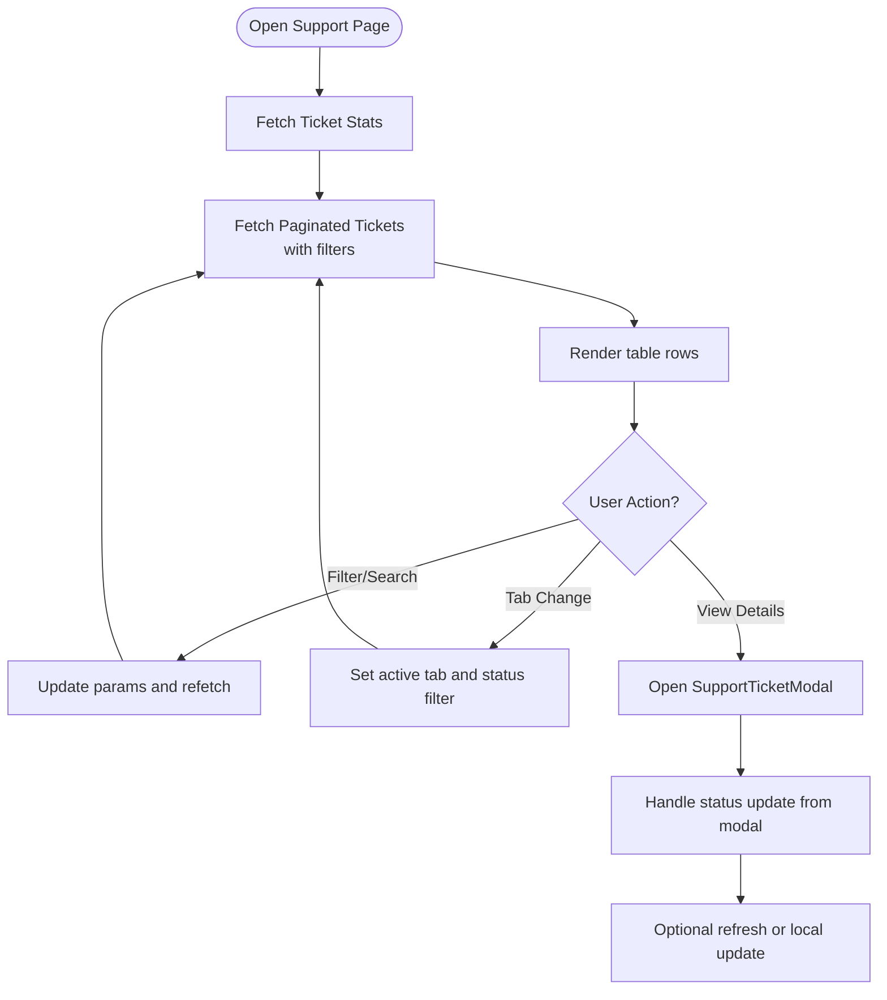
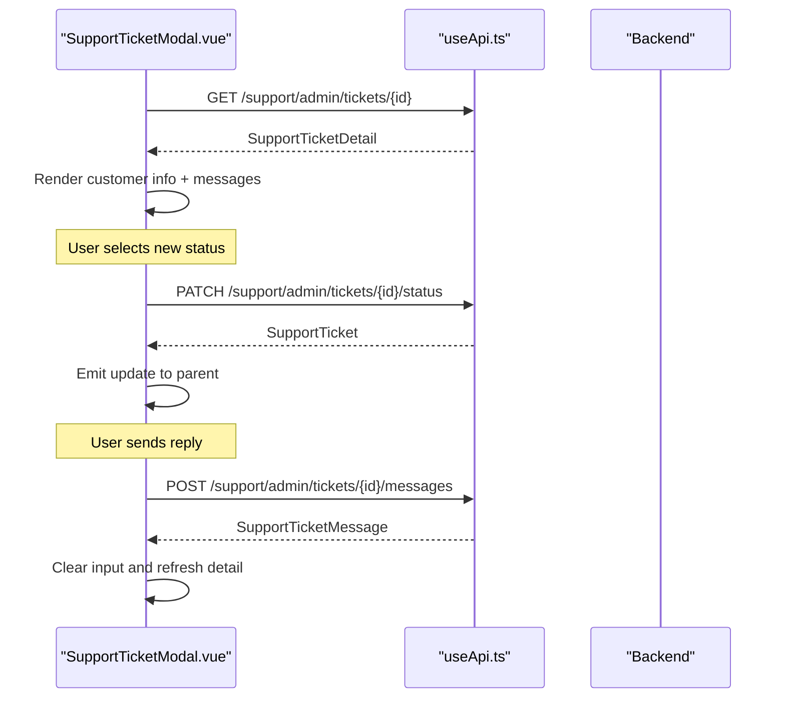
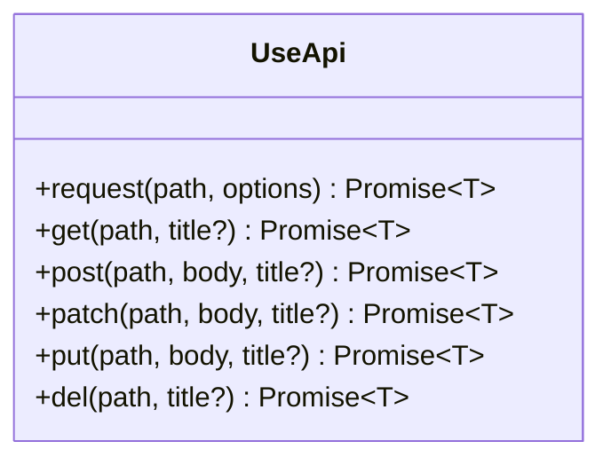
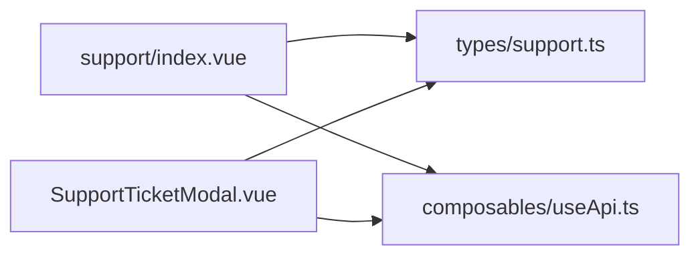
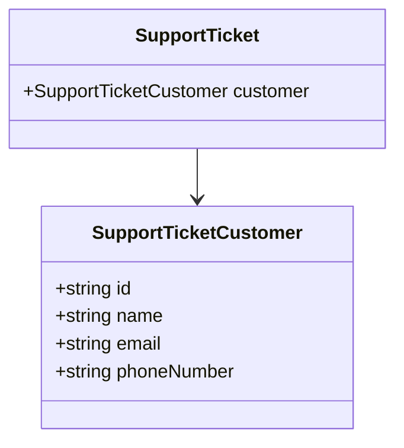

# Support Ticket System

<cite>
**Referenced Files in This Document**
- [SupportTicketModal.vue](file://app/components/SupportTicketModal.vue)
- [support/index.vue](file://app/pages/support/index.vue)
- [support.ts](file://app/types/support.ts)
- [useApi.ts](file://app/composables/useApi.ts)
- [customer.ts](file://app/types/customer.ts)
</cite>

## Table of Contents
1. [Introduction](#introduction)
2. [Project Structure](#project-structure)
3. [Core Components](#core-components)
4. [Architecture Overview](#architecture-overview)
5. [Detailed Component Analysis](#detailed-component-analysis)
6. [Dependency Analysis](#dependency-analysis)
7. [Performance Considerations](#performance-considerations)
8. [Troubleshooting Guide](#troubleshooting-guide)
9. [Conclusion](#conclusion)
10. [Appendices](#appendices)

## Introduction
This document explains the support ticket system implemented in the application. It covers how tickets are listed, viewed, updated, and replied to; how status and priority are managed; how customer context is integrated; and what analytics are available for support operations. The documentation also provides concrete examples of common workflows such as creating a reply, changing ticket status, filtering tickets, and generating support reports.

## Project Structure
The support feature is primarily implemented in:
- A dashboard page that lists tickets with filters and pagination
- A modal component that displays ticket details, conversation history, and allows replies and status updates
- Shared TypeScript types defining the data model
- An API composable used by both components to call backend endpoints

**Diagram sources**
- [support/index.vue:1-20](file://app/pages/support/index.vue#L1-L20)
- [SupportTicketModal.vue:1-20](file://app/components/SupportTicketModal.vue#L1-L20)
- [support.ts:1-20](file://app/types/support.ts#L1-L20)
- [useApi.ts:1-20](file://app/composables/useApi.ts#L1-L20)

**Section sources**
- [support/index.vue:1-20](file://app/pages/support/index.vue#L1-L20)
- [SupportTicketModal.vue:1-20](file://app/components/SupportTicketModal.vue#L1-L20)
- [support.ts:1-20](file://app/types/support.ts#L1-L20)
- [useApi.ts:1-20](file://app/composables/useApi.ts#L1-L20)

## Core Components
- Support list page (dashboard): Provides search, filter by status/priority/category, tabs for quick views, and pagination. It fetches summary statistics and paginated ticket lists.
- Support ticket modal: Displays full ticket detail, customer information, conversation thread, and supports sending replies and updating status.
- Types: Define the shape of tickets, messages, stats, and pagination.
- API composable: Centralizes HTTP calls, authentication headers, error handling, and typed helpers.

Key responsibilities:
- Listing and filtering tickets
- Viewing detailed conversations
- Updating ticket status
- Sending staff replies
- Displaying support metrics

**Section sources**
- [support/index.vue:83-155](file://app/pages/support/index.vue#L83-L155)
- [SupportTicketModal.vue:96-145](file://app/components/SupportTicketModal.vue#L96-L145)
- [support.ts:12-80](file://app/types/support.ts#L12-L80)
- [useApi.ts:9-67](file://app/composables/useApi.ts#L9-L67)

## Architecture Overview
The support module follows a simple client-side architecture:
- Pages and components use the shared API composable to call backend endpoints under /support/admin/tickets.
- Data models are strictly typed using TypeScript interfaces.
- UI state is reactive and synchronized with server responses.

**Diagram sources**
- [support/index.vue:83-155](file://app/pages/support/index.vue#L83-L155)
- [SupportTicketModal.vue:96-145](file://app/components/SupportTicketModal.vue#L96-L145)
- [useApi.ts:9-67](file://app/composables/useApi.ts#L9-L67)

## Detailed Component Analysis

### Data Model
The support data model defines tickets, messages, categories, priorities, statuses, and pagination.

**Diagram sources**
- [support.ts:12-80](file://app/types/support.ts#L12-L80)

**Section sources**
- [support.ts:12-80](file://app/types/support.ts#L12-L80)

### Support List Page
Responsibilities:
- Fetch and display high-level stats
- Filter and paginate tickets
- Provide quick tabs for All/Open/In Progress/Resolved
- Open the ticket modal for detailed view

Key behaviors:
- Stats endpoint returns counts and average response time
- Tickets endpoint supports query parameters for status, priority, category, search, page, and limit
- Tabs synchronize with status filter and reset pagination on change
- Modal update events keep the list in sync after status changes

**Diagram sources**
- [support/index.vue:83-155](file://app/pages/support/index.vue#L83-L155)
- [support/index.vue:134-155](file://app/pages/support/index.vue#L134-L155)
- [support/index.vue:220-226](file://app/pages/support/index.vue#L220-L226)

**Section sources**
- [support/index.vue:83-155](file://app/pages/support/index.vue#L83-L155)
- [support/index.vue:134-155](file://app/pages/support/index.vue#L134-L155)
- [support/index.vue:220-226](file://app/pages/support/index.vue#L220-L226)

### Support Ticket Modal
Responsibilities:
- Load full ticket detail including conversation
- Display customer info and ticket metadata
- Allow staff to send replies and update status
- Keep UI consistent with server state

Key behaviors:
- On mount, fetches detail via GET /support/admin/tickets/{id}
- Status dropdown maps between UI-friendly values and API values
- Sending a reply posts a message and can include an optional status update
- On failure, reverts UI to previous status to stay in sync

**Diagram sources**
- [SupportTicketModal.vue:96-145](file://app/components/SupportTicketModal.vue#L96-L145)

**Section sources**
- [SupportTicketModal.vue:96-145](file://app/components/SupportTicketModal.vue#L96-L145)

### API Integration
The API composable centralizes:
- Authorization header injection
- Base URL composition
- Error handling and user-facing error messages
- Typed convenience methods (get, post, patch, etc.)

**Diagram sources**
- [useApi.ts:9-89](file://app/composables/useApi.ts#L9-L89)

**Section sources**
- [useApi.ts:9-89](file://app/composables/useApi.ts#L9-L89)

## Dependency Analysis
- The support page depends on the API composable and types for listing and filtering tickets.
- The modal depends on the API composable and types for detail retrieval, status updates, and messaging.
- Both components rely on the same set of endpoints under /support/admin/tickets.

**Diagram sources**
- [support/index.vue:1-20](file://app/pages/support/index.vue#L1-L20)
- [SupportTicketModal.vue:1-20](file://app/components/SupportTicketModal.vue#L1-L20)
- [support.ts:1-20](file://app/types/support.ts#L1-L20)
- [useApi.ts:1-20](file://app/composables/useApi.ts#L1-L20)

**Section sources**
- [support/index.vue:1-20](file://app/pages/support/index.vue#L1-L20)
- [SupportTicketModal.vue:1-20](file://app/components/SupportTicketModal.vue#L1-L20)
- [support.ts:1-20](file://app/types/support.ts#L1-L20)
- [useApi.ts:1-20](file://app/composables/useApi.ts#L1-L20)

## Performance Considerations
- Pagination: The list endpoint supports page and limit parameters to avoid loading large datasets at once.
- Selective fetching: Detail is loaded only when opening the modal, reducing initial payload size.
- Local updates: After status changes, the list is updated locally to avoid unnecessary refetches.
- Error resilience: The API composable handles non-successful responses and prevents inconsistent UI states.

[No sources needed since this section provides general guidance]

## Troubleshooting Guide
Common issues and resolutions:
- Authentication failures: If the backend returns 401, the API composable logs out and redirects to login. Ensure the session token is present and valid.
- Network errors: Non-2xx responses throw descriptive errors; check browser console logs for request/response details.
- Inconsistent UI after failed status update: The modal reverts to the previous status if the PATCH fails. Verify network connectivity and permissions.
- Empty conversation: If no messages are returned, ensure the ticket ID is correct and the detail endpoint is accessible.

Operational tips:
- Use the search and filter controls to narrow down tickets quickly.
- Use tabs to focus on specific statuses like Open or In Progress.
- When replying, optionally update the status to reflect progress.

**Section sources**
- [useApi.ts:39-67](file://app/composables/useApi.ts#L39-L67)
- [SupportTicketModal.vue:106-121](file://app/components/SupportTicketModal.vue#L106-L121)

## Conclusion
The support ticket system provides a focused admin interface for managing customer inquiries. It offers robust filtering, clear status management, threaded conversations, and basic analytics. The implementation is modular, type-safe, and integrates cleanly with the shared API layer.

[No sources needed since this section summarizes without analyzing specific files]

## Appendices

### API Endpoints Used
- GET /support/admin/tickets/stats
- GET /support/admin/tickets
- GET /support/admin/tickets/{id}
- PATCH /support/admin/tickets/{id}/status
- POST /support/admin/tickets/{id}/messages

**Section sources**
- [support/index.vue:83-155](file://app/pages/support/index.vue#L83-L155)
- [SupportTicketModal.vue:96-145](file://app/components/SupportTicketModal.vue#L96-L145)

### Status Management
Supported statuses:
- open
- in_progress
- resolved
- closed

Status mapping:
- UI uses “in-progress” while API expects “in_progress”. Conversion functions handle this mapping.

**Section sources**
- [support.ts:27-28](file://app/types/support.ts#L27-L28)
- [SupportTicketModal.vue:33-39](file://app/components/SupportTicketModal.vue#L33-L39)

### Priority Handling
Supported priorities:
- low
- medium
- high
- urgent

Visual indicators differentiate urgency levels in both list and detail views.

**Section sources**
- [support.ts:30-31](file://app/types/support.ts#L30-L31)
- [support/index.vue:179-184](file://app/pages/support/index.vue#L179-L184)
- [SupportTicketModal.vue:147-152](file://app/components/SupportTicketModal.vue#L147-L152)

### Ticket Categorization
Categories supported:
- missed_pickup
- billing
- service_request
- equipment_issue
- schedule_change
- other

These categories appear in filters and are displayed with human-readable labels.

**Section sources**
- [support.ts:33-40](file://app/types/support.ts#L33-L40)
- [support/index.vue:31-39](file://app/pages/support/index.vue#L31-L39)

### Customer Context Integration
Each ticket includes a customer object with name, email, and phone number. This contextual information helps agents respond efficiently.

**Diagram sources**
- [support.ts:4-9](file://app/types/support.ts#L4-L9)
- [support.ts:12-25](file://app/types/support.ts#L12-L25)

**Section sources**
- [support.ts:4-9](file://app/types/support.ts#L4-L9)
- [support.ts:12-25](file://app/types/support.ts#L12-L25)

### Workflows and Examples

#### Example: Create a Support Ticket
Note: The current frontend does not expose a “Create Ticket” form. Creation is typically handled by the customer-facing flow or external integrations. Once created, tickets appear in the Support dashboard and can be managed there.

[No sources needed since this section describes conceptual workflow]

#### Example: Assign a Ticket to a Team Member
Note: There is no explicit assignment field in the current data model. Agents can collaborate via the conversation thread and status updates. Future enhancements could add assignee fields and team routing.

[No sources needed since this section describes conceptual workflow]

#### Example: Track Resolution Progress
- Open a ticket from the list
- Review conversation and customer info
- Update status to “In Progress”, then “Resolved” as work advances
- Optionally send replies with status changes

**Section sources**
- [support/index.vue:220-226](file://app/pages/support/index.vue#L220-L226)
- [SupportTicketModal.vue:106-145](file://app/components/SupportTicketModal.vue#L106-L145)

#### Example: Generate Support Reports
- View high-level metrics: open tickets, in-progress tickets, resolved today, average response hours
- Use filters to analyze subsets by status, priority, or category
- Export functionality exists in the broader Reports & Analytics area for business insights

**Section sources**
- [support/index.vue:83-95](file://app/pages/support/index.vue#L83-L95)
- [support/index.vue:237-279](file://app/pages/support/index.vue#L237-L279)

### Escalation Procedures
Current implementation does not include automated escalation rules. Recommended approach:
- Use priority and category to identify critical cases
- Monitor average response hours and in-progress counts
- Implement manual escalation steps based on SLAs and thresholds

[No sources needed since this section provides general guidance]