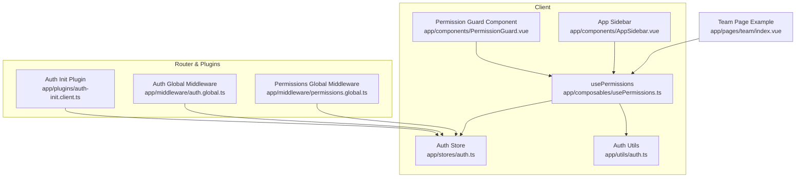
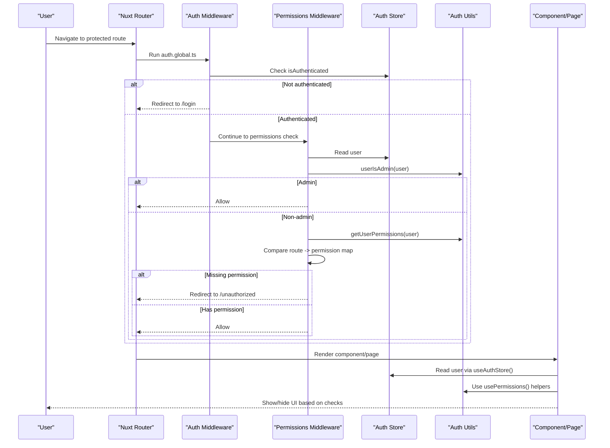
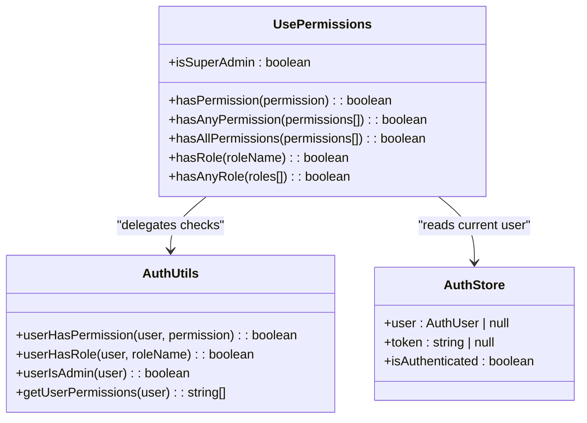
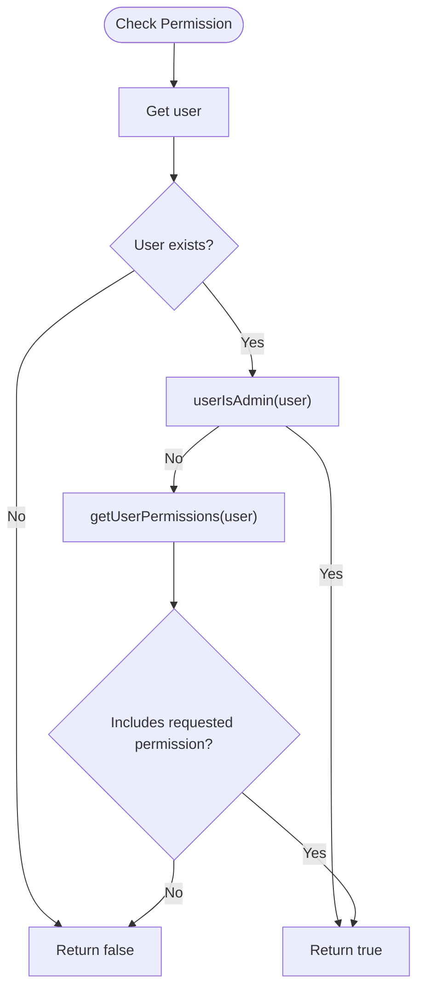
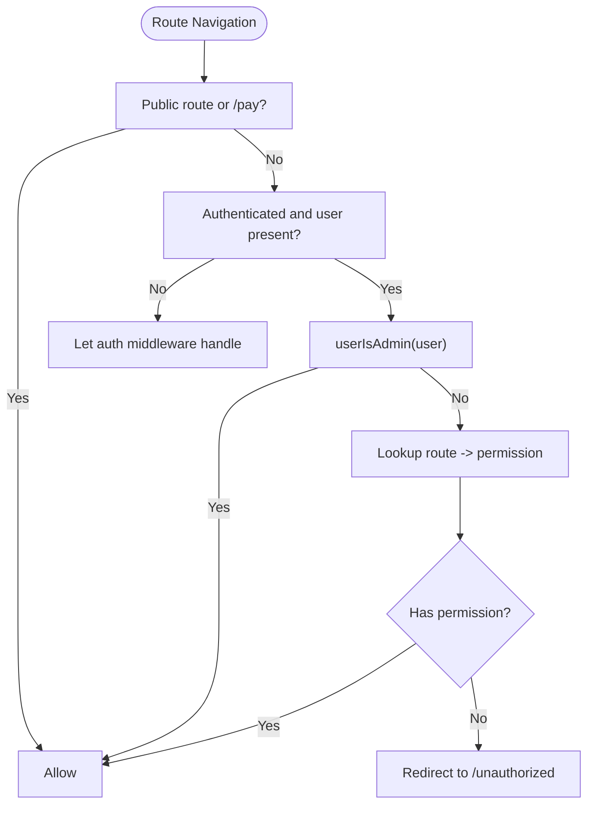
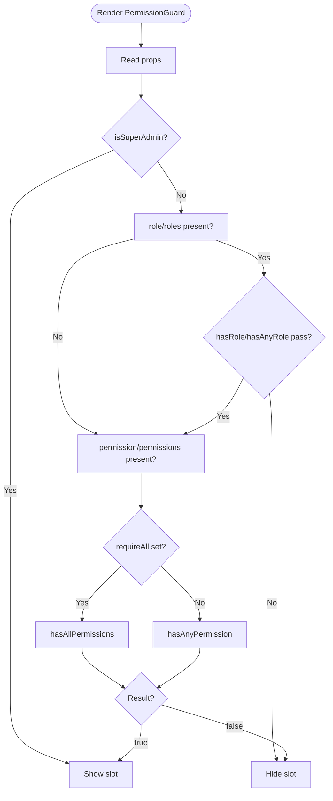
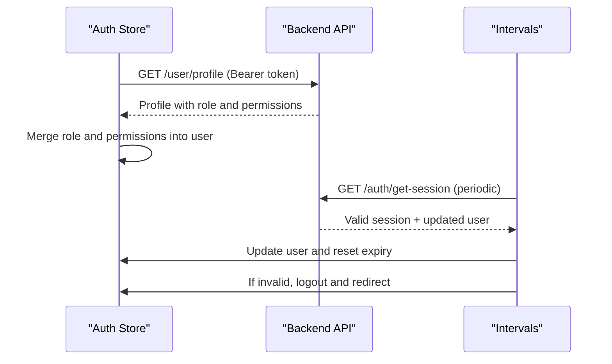
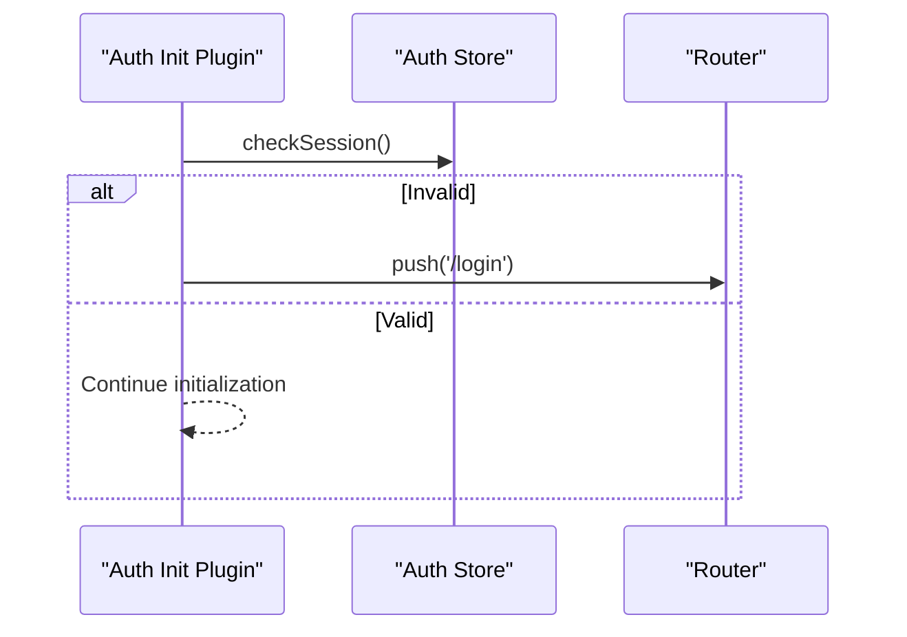
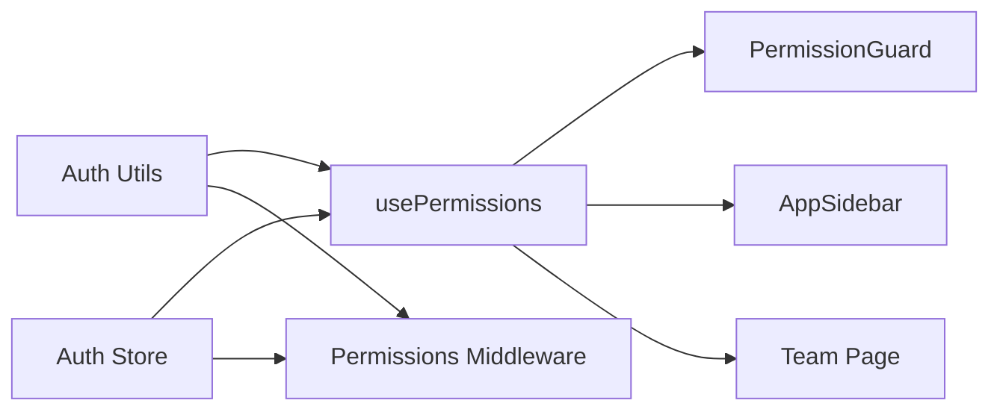

# Permission Configuration

<cite>
**Referenced Files in This Document**
- [usePermissions.ts](file://app/composables/usePermissions.ts)
- [auth.ts](file://app/utils/auth.ts)
- [permissions.global.ts](file://app/middleware/permissions.global.ts)
- [PermissionGuard.vue](file://app/components/PermissionGuard.vue)
- [auth.ts](file://app/stores/auth.ts)
- [auth.global.ts](file://app/middleware/auth.global.ts)
- [auth-init.client.ts](file://app/plugins/auth-init.client.ts)
- [AppSidebar.vue](file://app/components/AppSidebar.vue)
- [team/index.vue](file://app/pages/team/index.vue)
</cite>

## Table of Contents
1. [Introduction](#introduction)
2. [Project Structure](#project-structure)
3. [Core Components](#core-components)
4. [Architecture Overview](#architecture-overview)
5. [Detailed Component Analysis](#detailed-component-analysis)
6. [Dependency Analysis](#dependency-analysis)
7. [Performance Considerations](#performance-considerations)
8. [Troubleshooting Guide](#troubleshooting-guide)
9. [Conclusion](#conclusion)
10. [Appendices](#appendices)

## Introduction
This document explains the permission configuration system used across the application. It covers how permissions are structured, validated, and cached; how role-based access control (RBAC) is implemented; and how permissions influence route guards and component visibility. You will learn to use the usePermissions composable for permission checks, integrate with authentication utilities, implement custom permission rules, and handle dynamic permission updates.

## Project Structure
The permission system spans composables, utilities, middleware, components, store, and plugins:
- Composable: usePermissions provides a unified API for permission and role checks.
- Utilities: auth helpers normalize roles and evaluate permissions.
- Middleware: global route guards enforce authentication and route-level permissions.
- Store: auth store manages user session, token, and profile data including roles and permissions.
- Plugin: initializes session on app load.
- Components: PermissionGuard wraps UI elements based on permissions; AppSidebar filters navigation by permissions.
- Pages: example pages demonstrate runtime authorization checks.

**Diagram sources**
- [auth.ts:1-230](file://app/stores/auth.ts#L1-L230)
- [auth.ts:1-58](file://app/utils/auth.ts#L1-L58)
- [usePermissions.ts:1-43](file://app/composables/usePermissions.ts#L1-L43)
- [PermissionGuard.vue:1-38](file://app/components/PermissionGuard.vue#L1-L38)
- [AppSidebar.vue:1-319](file://app/components/AppSidebar.vue#L1-L319)
- [auth.global.ts:1-32](file://app/middleware/auth.global.ts#L1-L32)
- [permissions.global.ts:1-59](file://app/middleware/permissions.global.ts#L1-L59)
- [auth-init.client.ts:1-25](file://app/plugins/auth-init.client.ts#L1-L25)
- [team/index.vue:1-399](file://app/pages/team/index.vue#L1-L399)

**Section sources**
- [usePermissions.ts:1-43](file://app/composables/usePermissions.ts#L1-L43)
- [auth.ts:1-58](file://app/utils/auth.ts#L1-L58)
- [permissions.global.ts:1-59](file://app/middleware/permissions.global.ts#L1-L59)
- [PermissionGuard.vue:1-38](file://app/components/PermissionGuard.vue#L1-L38)
- [auth.ts:1-230](file://app/stores/auth.ts#L1-L230)
- [auth.global.ts:1-32](file://app/middleware/auth.global.ts#L1-L32)
- [auth-init.client.ts:1-25](file://app/plugins/auth-init.client.ts#L1-L25)
- [AppSidebar.vue:1-319](file://app/components/AppSidebar.vue#L1-L319)
- [team/index.vue:1-399](file://app/pages/team/index.vue#L1-L399)

## Core Components
- usePermissions composable: exposes hasPermission, hasAnyPermission, hasAllPermissions, hasRole, hasAnyRole, and isSuperAdmin. It delegates to auth utilities and reads from the auth store.
- Auth utilities: provide normalization and checks for admin roles, permissions, and roles. Admins implicitly have all permissions.
- Permissions middleware: enforces route-level permissions using a mapping table and redirects unauthorized users.
- PermissionGuard component: renders children only if the current user satisfies role or permission requirements.
- Auth store: persists token, loads user profile, augments user with role and permissions, and maintains session validity.

Key behaviors:
- Role normalization supports both string and object shapes and ignores underscores/case differences.
- Admin roles bypass permission checks at utility and middleware levels.
- Route-level permissions are defined centrally and enforced globally.
- UI components can reactively hide/show features based on permissions.

**Section sources**
- [usePermissions.ts:1-43](file://app/composables/usePermissions.ts#L1-L43)
- [auth.ts:1-58](file://app/utils/auth.ts#L1-L58)
- [permissions.global.ts:1-59](file://app/middleware/permissions.global.ts#L1-L59)
- [PermissionGuard.vue:1-38](file://app/components/PermissionGuard.vue#L1-L38)
- [auth.ts:1-230](file://app/stores/auth.ts#L1-L230)

## Architecture Overview
The permission architecture combines server-fetched user context with client-side checks:
- On login or page navigation, the auth middleware ensures the user is authenticated.
- The permissions middleware enforces route-level permissions before rendering pages.
- The auth plugin validates sessions on app startup.
- The auth store fetches the team member profile to populate role and permissions into the user object.
- Components and composables read from the store and apply permission logic.

**Diagram sources**
- [auth.global.ts:1-32](file://app/middleware/auth.global.ts#L1-L32)
- [permissions.global.ts:1-59](file://app/middleware/permissions.global.ts#L1-L59)
- [auth.ts:1-230](file://app/stores/auth.ts#L1-L230)
- [auth.ts:1-58](file://app/utils/auth.ts#L1-L58)
- [usePermissions.ts:1-43](file://app/composables/usePermissions.ts#L1-L43)

## Detailed Component Analysis

### usePermissions Composable
Responsibilities:
- Provide simple APIs for permission and role checks.
- Aggregate multiple checks: single permission, any/all permissions, specific/any roles, and super admin shortcut.
- Reactively derive isSuperAdmin from the current user.

Implementation highlights:
- Delegates to auth utilities for actual checks.
- Reads current user from the auth store.
- Exposes computed isSuperAdmin for reactive UI updates.

**Diagram sources**
- [usePermissions.ts:1-43](file://app/composables/usePermissions.ts#L1-L43)
- [auth.ts:1-58](file://app/utils/auth.ts#L1-L58)
- [auth.ts:1-230](file://app/stores/auth.ts#L1-L230)

**Section sources**
- [usePermissions.ts:1-43](file://app/composables/usePermissions.ts#L1-L43)
- [auth.ts:1-58](file://app/utils/auth.ts#L1-L58)
- [auth.ts:1-230](file://app/stores/auth.ts#L1-L230)

### Auth Utilities
Responsibilities:
- Normalize roles to lowercase and remove underscores for consistent comparisons.
- Determine admin status based on normalized role names.
- Extract permissions from user objects.
- Implement permission and role checks with admin overrides.

Key functions:
- normalizeRole: handles string or object roles.
- isAdminRole: recognizes “super admin” and “admin”.
- userIsAdmin: convenience wrapper around admin role checks.
- getUserPermissions: returns the array of permission strings.
- userHasPermission: grants implicit access to admins; otherwise checks explicit permissions.
- userHasRole: compares normalized roles case-insensitively.

**Diagram sources**
- [auth.ts:1-58](file://app/utils/auth.ts#L1-L58)

**Section sources**
- [auth.ts:1-58](file://app/utils/auth.ts#L1-L58)

### Permissions Middleware
Responsibilities:
- Skip public routes and payment-related paths.
- Ensure user is authenticated (delegates to auth middleware).
- Grant immediate access to admins.
- Enforce route-to-permission mappings for non-admins.
- Redirect unauthorized users to an error page.

Route mapping:
- Centralized mapping of top-level routes to required permissions.
- Uses startsWith matching to cover nested routes under each prefix.

**Diagram sources**
- [permissions.global.ts:1-59](file://app/middleware/permissions.global.ts#L1-L59)
- [auth.ts:1-58](file://app/utils/auth.ts#L1-L58)

**Section sources**
- [permissions.global.ts:1-59](file://app/middleware/permissions.global.ts#L1-L59)
- [auth.ts:1-58](file://app/utils/auth.ts#L1-L58)

### PermissionGuard Component
Responsibilities:
- Conditionally render child content based on props:
  - Single permission or array of permissions (with requireAll option).
  - Single role or array of roles.
  - Super admin override.

Behavior:
- If isSuperAdmin is true, always allow.
- Otherwise, evaluate role checks first, then permission checks.
- For arrays of permissions, honor requireAll to switch between any/all semantics.

**Diagram sources**
- [PermissionGuard.vue:1-38](file://app/components/PermissionGuard.vue#L1-L38)
- [usePermissions.ts:1-43](file://app/composables/usePermissions.ts#L1-L43)

**Section sources**
- [PermissionGuard.vue:1-38](file://app/components/PermissionGuard.vue#L1-L38)
- [usePermissions.ts:1-43](file://app/composables/usePermissions.ts#L1-L43)

### Auth Store and Session Management
Responsibilities:
- Persist token and user state.
- Fetch team member profile to augment user with role and permissions.
- Maintain session expiry and periodically refresh.
- Handle logout and cleanup.

Integration points:
- On setAuth, fetch profile and start session timers.
- On periodic checks, refresh session and update user data.
- On invalid session, log out and redirect.

**Diagram sources**
- [auth.ts:1-230](file://app/stores/auth.ts#L1-L230)

**Section sources**
- [auth.ts:1-230](file://app/stores/auth.ts#L1-L230)

### Auth Middleware and Initialization
- Auth middleware protects routes by ensuring authentication and validating sessions during navigation.
- Auth init plugin validates session on app load and redirects if invalid.

**Diagram sources**
- [auth-init.client.ts:1-25](file://app/plugins/auth-init.client.ts#L1-L25)
- [auth.global.ts:1-32](file://app/middleware/auth.global.ts#L1-L32)
- [auth.ts:1-230](file://app/stores/auth.ts#L1-L230)

**Section sources**
- [auth-init.client.ts:1-25](file://app/plugins/auth-init.client.ts#L1-L25)
- [auth.global.ts:1-32](file://app/middleware/auth.global.ts#L1-L32)
- [auth.ts:1-230](file://app/stores/auth.ts#L1-L230)

### Practical Usage Examples

#### Using usePermissions in Components
- Import the composable and call helper methods to gate UI or logic.
- Combine with isSuperAdmin for admin overrides.

Example references:
- Filtering sidebar links by permission.
- Checking admin privileges in a page.

**Section sources**
- [AppSidebar.vue:1-319](file://app/components/AppSidebar.vue#L1-L319)
- [team/index.vue:1-399](file://app/pages/team/index.vue#L1-L399)

#### Creating Custom Permission Rules
- Define new permission strings and add them to the route mapping in the permissions middleware.
- Use hasPermission or hasAnyPermission in components to enforce feature visibility.
- For complex business rules, wrap checks in local functions that combine multiple conditions.

References:
- Route permission mapping in middleware.
- Permission checks in components.

**Section sources**
- [permissions.global.ts:1-59](file://app/middleware/permissions.global.ts#L1-L59)
- [usePermissions.ts:1-43](file://app/composables/usePermissions.ts#L1-L43)
- [AppSidebar.vue:1-319](file://app/components/AppSidebar.vue#L1-L319)

#### Handling Dynamic Permission Updates
- When the backend updates a user’s role or permissions, the auth store refetches the profile and merges the new values into the user object.
- Reactive dependencies (computed refs and watchers) automatically re-evaluate permission checks.
- To force-refresh after a role change, call the store method to fetch the profile again.

References:
- Profile fetching and merging logic.
- Periodic session refresh updating user data.

**Section sources**
- [auth.ts:1-230](file://app/stores/auth.ts#L1-L230)

## Dependency Analysis
- usePermissions depends on:
  - Auth utilities for core checks.
  - Auth store for current user context.
- Permissions middleware depends on:
  - Auth store for user state.
  - Auth utilities for admin and permission checks.
- PermissionGuard depends on:
  - usePermissions composable.
- AppSidebar depends on:
  - usePermissions composable for filtering navigation.
- Team page depends on:
  - usePermissions composable for runtime authorization checks.

**Diagram sources**
- [usePermissions.ts:1-43](file://app/composables/usePermissions.ts#L1-L43)
- [auth.ts:1-58](file://app/utils/auth.ts#L1-L58)
- [auth.ts:1-230](file://app/stores/auth.ts#L1-L230)
- [PermissionGuard.vue:1-38](file://app/components/PermissionGuard.vue#L1-L38)
- [AppSidebar.vue:1-319](file://app/components/AppSidebar.vue#L1-L319)
- [team/index.vue:1-399](file://app/pages/team/index.vue#L1-L399)
- [permissions.global.ts:1-59](file://app/middleware/permissions.global.ts#L1-L59)

**Section sources**
- [usePermissions.ts:1-43](file://app/composables/usePermissions.ts#L1-L43)
- [auth.ts:1-58](file://app/utils/auth.ts#L1-L58)
- [auth.ts:1-230](file://app/stores/auth.ts#L1-L230)
- [PermissionGuard.vue:1-38](file://app/components/PermissionGuard.vue#L1-L38)
- [AppSidebar.vue:1-319](file://app/components/AppSidebar.vue#L1-L319)
- [team/index.vue:1-399](file://app/pages/team/index.vue#L1-L399)
- [permissions.global.ts:1-59](file://app/middleware/permissions.global.ts#L1-L59)

## Performance Considerations
- Permission checks are O(n) over the number of permissions when using any/all checks; keep permission sets reasonably sized.
- Admin shortcuts avoid unnecessary lookups.
- Route-level checks run once per navigation; ensure the mapping remains concise.
- Avoid frequent recomputation by leveraging computed properties and caching results where appropriate.
- Periodic session checks occur every few minutes; ensure network calls are efficient and idempotent.

[No sources needed since this section provides general guidance]

## Troubleshooting Guide
Common issues and resolutions:
- Unauthorized redirects:
  - Verify the route mapping includes the correct permission for the path.
  - Confirm the user’s permissions include the required string.
  - Check that admin roles are correctly recognized.
- UI not showing expected controls:
  - Ensure the component uses the correct permission strings.
  - Validate that the user object contains up-to-date permissions.
- Session expired unexpectedly:
  - Review periodic session checks and backend responses.
  - Confirm token persistence and storage behavior.

Operational references:
- Route permission mapping and logging.
- Admin checks and permission extraction.
- Session validation and refresh flows.

**Section sources**
- [permissions.global.ts:1-59](file://app/middleware/permissions.global.ts#L1-L59)
- [auth.ts:1-58](file://app/utils/auth.ts#L1-L58)
- [auth.ts:1-230](file://app/stores/auth.ts#L1-L230)

## Conclusion
The permission system integrates role-based and permission-based access control through a clear separation of concerns:
- Auth utilities define canonical checks and normalization.
- The auth store centralizes user context and session management.
- Middleware enforces route-level security.
- The composable and guard component provide convenient, reactive APIs for UI and logic gating.
By following the patterns outlined here, you can extend permissions, create custom rules, and maintain consistent access control across the application.

[No sources needed since this section summarizes without analyzing specific files]

## Appendices

### Permission Naming Conventions
- Use dot-separated names for clarity (e.g., customers.view, communications.send).
- Keep permission strings stable and descriptive.
- Align route mappings with feature modules.

[No sources needed since this section provides general guidance]

### Adding a New Protected Route
Steps:
- Add a mapping entry in the permissions middleware for the route prefix and required permission.
- Optionally filter navigation entries in the sidebar using hasPermission.
- Wrap sensitive UI with PermissionGuard or inline checks using usePermissions.

**Section sources**
- [permissions.global.ts:1-59](file://app/middleware/permissions.global.ts#L1-L59)
- [AppSidebar.vue:1-319](file://app/components/AppSidebar.vue#L1-L319)
- [PermissionGuard.vue:1-38](file://app/components/PermissionGuard.vue#L1-L38)
- [usePermissions.ts:1-43](file://app/composables/usePermissions.ts#L1-L43)