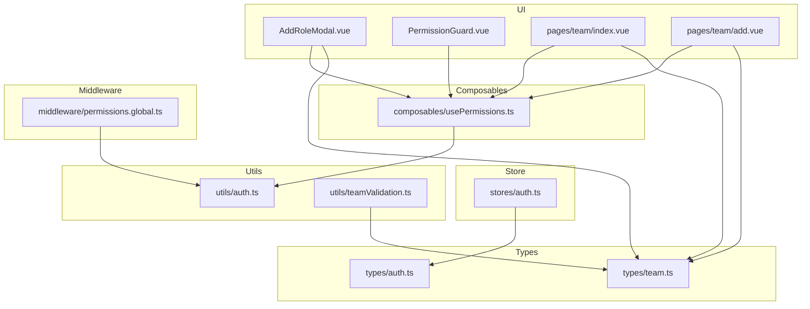
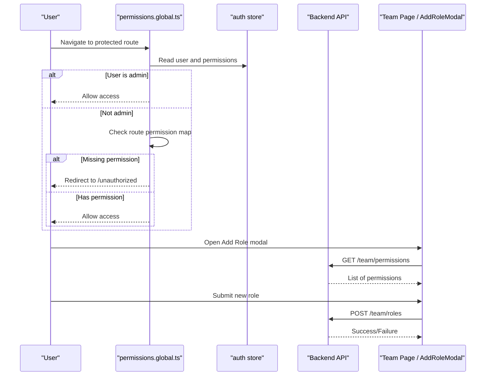
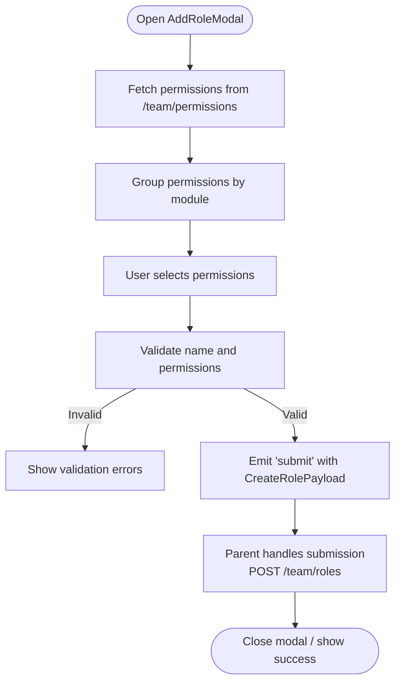
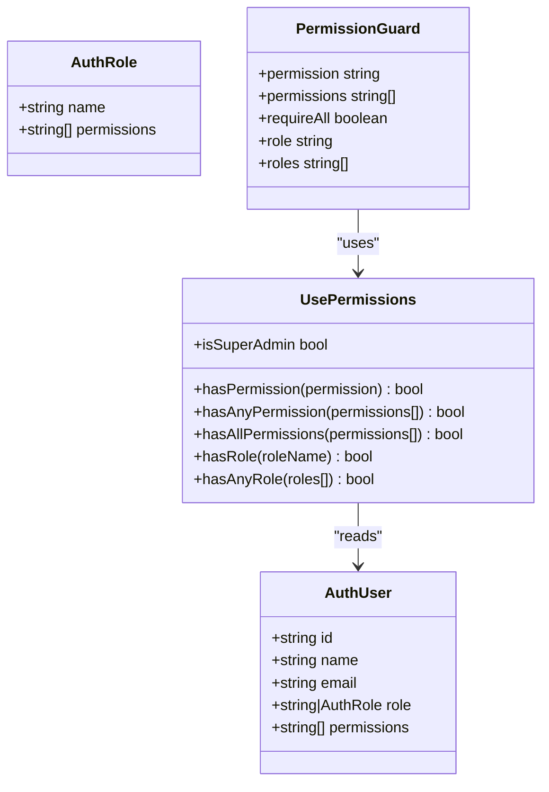
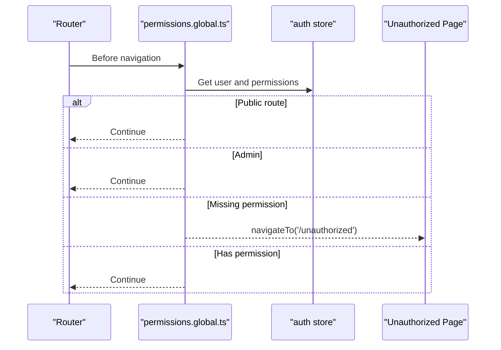
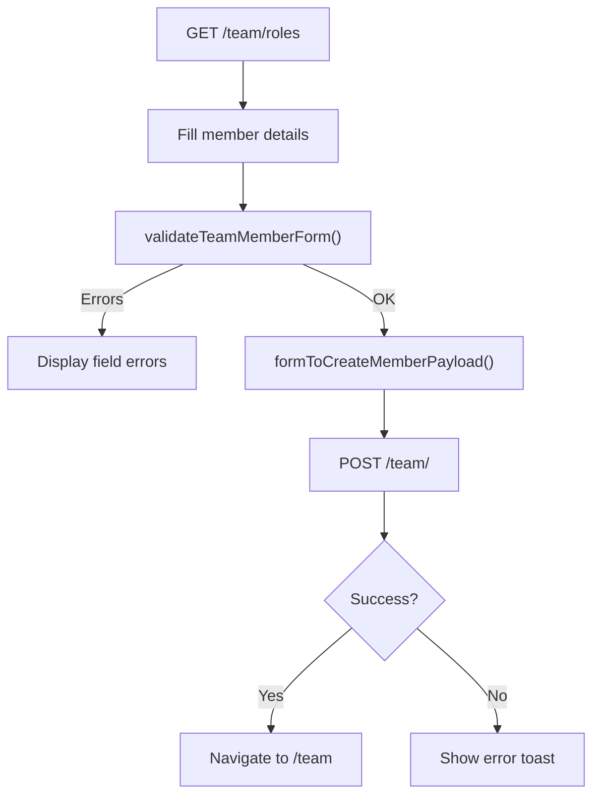
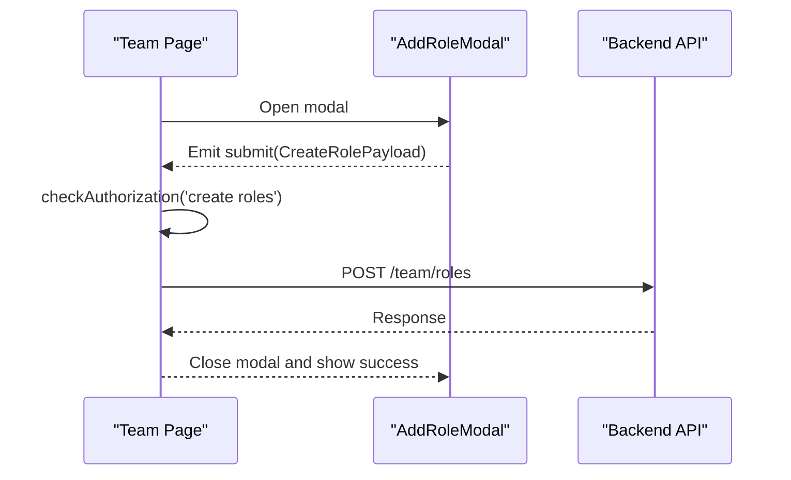
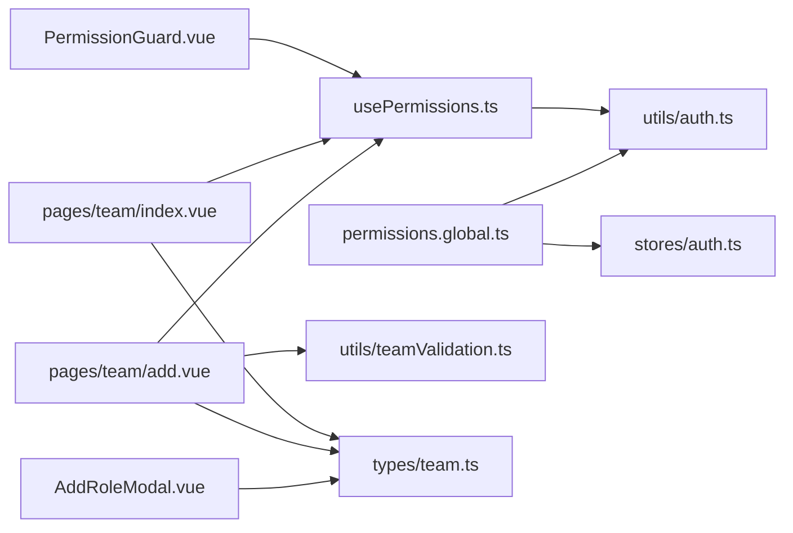

# Role & Permission System

<cite>
**Referenced Files in This Document**
- [AddRoleModal.vue](file://app/components/AddRoleModal.vue)
- [usePermissions.ts](file://app/composables/usePermissions.ts)
- [auth.ts](file://app/utils/auth.ts)
- [permissions.global.ts](file://app/middleware/permissions.global.ts)
- [PermissionGuard.vue](file://app/components/PermissionGuard.vue)
- [teamValidation.ts](file://app/utils/teamValidation.ts)
- [auth.ts (store)](file://app/stores/auth.ts)
- [team.ts (types)](file://app/types/team.ts)
- [auth.ts (types)](file://app/types/auth.ts)
- [team/index.vue](file://app/pages/team/index.vue)
- [team/add.vue](file://app/pages/team/add.vue)
</cite>

## Table of Contents
1. [Introduction](#introduction)
2. [Project Structure](#project-structure)
3. [Core Components](#core-components)
4. [Architecture Overview](#architecture-overview)
5. [Detailed Component Analysis](#detailed-component-analysis)
6. [Dependency Analysis](#dependency-analysis)
7. [Performance Considerations](#performance-considerations)
8. [Troubleshooting Guide](#troubleshooting-guide)
9. [Conclusion](#conclusion)
10. [Appendices](#appendices)

## Introduction
This document explains the role-based access control (RBAC) system implemented in the application. It covers how roles are created, modified, and deleted; how permissions are structured and validated; how route-level and component-level checks are enforced; and how team validation utilities ensure data integrity during role assignment. Practical examples demonstrate creating custom roles, assigning permissions to team members, and implementing permission checks in components. Security considerations, caching strategies, and best practices for granular access control are also included.

## Project Structure
The RBAC system spans UI components, composables, middleware, stores, types, and utilities:
- UI layer: AddRoleModal for role creation, PermissionGuard for conditional rendering, Team pages for operations
- Composables: usePermissions for convenient permission/role checks
- Middleware: permissions.global.ts enforces route-level permissions
- Store: auth store manages user session, profile, and cached permissions
- Types: shared models for users, roles, permissions, and payloads
- Utilities: auth helpers and team validation functions

**Diagram sources**
- [AddRoleModal.vue](file://app/components/AddRoleModal.vue)
- [PermissionGuard.vue](file://app/components/PermissionGuard.vue)
- [team/index.vue](file://app/pages/team/index.vue)
- [team/add.vue](file://app/pages/team/add.vue)
- [usePermissions.ts](file://app/composables/usePermissions.ts)
- [permissions.global.ts](file://app/middleware/permissions.global.ts)
- [auth.ts (store)](file://app/stores/auth.ts)
- [team.ts (types)](file://app/types/team.ts)
- [auth.ts (types)](file://app/types/auth.ts)
- [auth.ts](file://app/utils/auth.ts)
- [teamValidation.ts](file://app/utils/teamValidation.ts)

**Section sources**
- [AddRoleModal.vue](file://app/components/AddRoleModal.vue)
- [usePermissions.ts](file://app/composables/usePermissions.ts)
- [permissions.global.ts](file://app/middleware/permissions.global.ts)
- [PermissionGuard.vue](file://app/components/PermissionGuard.vue)
- [teamValidation.ts](file://app/utils/teamValidation.ts)
- [auth.ts (store)](file://app/stores/auth.ts)
- [team.ts (types)](file://app/types/team.ts)
- [auth.ts (types)](file://app/types/auth.ts)
- [team/index.vue](file://app/pages/team/index.vue)
- [team/add.vue](file://app/pages/team/add.vue)

## Core Components
- AddRoleModal: Presents a grouped list of available permissions fetched from the backend, supports group selection, validates inputs, and emits a CreateRolePayload to the parent.
- usePermissions: Provides hasPermission, hasAnyPermission, hasAllPermissions, hasRole, hasAnyRole, and isSuperAdmin by delegating to auth utilities and the current user in the store.
- PermissionGuard: A declarative wrapper that renders content only if the user satisfies role or permission requirements.
- permissions.global.ts: Enforces route-level permissions using a mapping of routes to required permissions. Admins bypass these checks.
- Auth store: Manages authentication state, fetches the user profile (including role and permissions), and maintains session validity.
- Validation utilities: Provide robust client-side validation for team member and role forms.

Key responsibilities:
- Role creation flow: AddRoleModal -> Team page handler -> API call to create role
- Permission checks: Route middleware + component guards + composable helpers
- Data integrity: Validation utilities ensure correct form data before submission

**Section sources**
- [AddRoleModal.vue](file://app/components/AddRoleModal.vue)
- [usePermissions.ts](file://app/composables/usePermissions.ts)
- [PermissionGuard.vue](file://app/components/PermissionGuard.vue)
- [permissions.global.ts](file://app/middleware/permissions.global.ts)
- [auth.ts (store)](file://app/stores/auth.ts)
- [teamValidation.ts](file://app/utils/teamValidation.ts)

## Architecture Overview
The RBAC architecture combines server-provided permissions with client-side enforcement:
- On login/session refresh, the store fetches the user profile and augments the user object with role and permissions.
- Route middleware checks permissions for protected routes and redirects unauthorized users.
- Components can conditionally render or enable actions based on permissions using PermissionGuard or usePermissions.
- Role management UI allows administrators to create roles with selected permissions.

**Diagram sources**
- [permissions.global.ts](file://app/middleware/permissions.global.ts)
- [auth.ts (store)](file://app/stores/auth.ts)
- [AddRoleModal.vue](file://app/components/AddRoleModal.vue)
- [team/index.vue](file://app/pages/team/index.vue)

## Detailed Component Analysis

### AddRoleModal Workflow
- Loads available permissions from the backend and groups them by module for display.
- Supports selecting individual permissions or toggling entire groups.
- Validates name and at least one selected permission.
- Emits a CreateRolePayload to the parent (Team page) which transforms it into the backend payload and posts to /team/roles.

**Diagram sources**
- [AddRoleModal.vue](file://app/components/AddRoleModal.vue)
- [team/index.vue](file://app/pages/team/index.vue)

**Section sources**
- [AddRoleModal.vue](file://app/components/AddRoleModal.vue)
- [team/index.vue](file://app/pages/team/index.vue)

### Permission Checks and Hierarchy
- Admin/Super Admin bypass all permission checks.
- Non-admin users must have explicit permissions for routes and features.
- The permission hierarchy is flat: permissions are strings like customers.view, drivers.view, etc., and admins implicitly have all permissions.

**Diagram sources**
- [auth.ts (types)](file://app/types/auth.ts)
- [usePermissions.ts](file://app/composables/usePermissions.ts)
- [PermissionGuard.vue](file://app/components/PermissionGuard.vue)

**Section sources**
- [usePermissions.ts](file://app/composables/usePermissions.ts)
- [PermissionGuard.vue](file://app/components/PermissionGuard.vue)
- [auth.ts (types)](file://app/types/auth.ts)

### Route-Level Enforcement
- The global middleware maps routes to required permissions.
- If a user lacks the required permission, they are redirected to /unauthorized.
- Public routes (/login, /forgot-password, /unauthorized, and /pay/*) are skipped.

**Diagram sources**
- [permissions.global.ts](file://app/middleware/permissions.global.ts)
- [auth.ts (store)](file://app/stores/auth.ts)

**Section sources**
- [permissions.global.ts](file://app/middleware/permissions.global.ts)

### Team Member Assignment and Validation
- The add member page loads available roles and uses validation utilities to ensure data integrity before submission.
- Payload transformation converts form fields into the expected backend structure.

**Diagram sources**
- [team/add.vue](file://app/pages/team/add.vue)
- [teamValidation.ts](file://app/utils/teamValidation.ts)

**Section sources**
- [team/add.vue](file://app/pages/team/add.vue)
- [teamValidation.ts](file://app/utils/teamValidation.ts)

### Role Creation Flow
- The Team page opens AddRoleModal, receives the CreateRolePayload, performs authorization checks, transforms the payload, and calls the backend to create the role.

**Diagram sources**
- [team/index.vue](file://app/pages/team/index.vue)
- [AddRoleModal.vue](file://app/components/AddRoleModal.vue)

**Section sources**
- [team/index.vue](file://app/pages/team/index.vue)
- [AddRoleModal.vue](file://app/components/AddRoleModal.vue)

## Dependency Analysis
- usePermissions depends on utils/auth for normalization and checks.
- PermissionGuard depends on usePermissions for declarative checks.
- Route middleware depends on utils/auth and the auth store for current user context.
- Team pages depend on types/team for payloads and models.
- Validation utilities depend on shared validation logic and types.

**Diagram sources**
- [usePermissions.ts](file://app/composables/usePermissions.ts)
- [auth.ts](file://app/utils/auth.ts)
- [PermissionGuard.vue](file://app/components/PermissionGuard.vue)
- [permissions.global.ts](file://app/middleware/permissions.global.ts)
- [auth.ts (store)](file://app/stores/auth.ts)
- [team/index.vue](file://app/pages/team/index.vue)
- [team/add.vue](file://app/pages/team/add.vue)
- [teamValidation.ts](file://app/utils/teamValidation.ts)
- [team.ts (types)](file://app/types/team.ts)
- [AddRoleModal.vue](file://app/components/AddRoleModal.vue)

**Section sources**
- [usePermissions.ts](file://app/composables/usePermissions.ts)
- [auth.ts](file://app/utils/auth.ts)
- [PermissionGuard.vue](file://app/components/PermissionGuard.vue)
- [permissions.global.ts](file://app/middleware/permissions.global.ts)
- [auth.ts (store)](file://app/stores/auth.ts)
- [team/index.vue](file://app/pages/team/index.vue)
- [team/add.vue](file://app/pages/team/add.vue)
- [teamValidation.ts](file://app/utils/teamValidation.ts)
- [team.ts (types)](file://app/types/team.ts)
- [AddRoleModal.vue](file://app/components/AddRoleModal.vue)

## Performance Considerations
- Cache permissions in the auth store after fetching the user profile to avoid repeated network calls.
- Avoid redundant permission checks by leveraging computed properties in composables and guards.
- Defer heavy UI updates until after permission checks complete to prevent flicker.
- Batch API requests where possible (e.g., load roles and stats concurrently).

[No sources needed since this section provides general guidance]

## Troubleshooting Guide
Common issues and resolutions:
- Unauthorized redirects: Ensure the user has the required permission for the route or is an admin. Verify the route-permission mapping in the middleware.
- Missing permissions in UI: Confirm the auth store has loaded the user profile and permissions. Refresh the session if necessary.
- Role creation failures: Check client-side validation messages and backend responses. Inspect the transformed payload sent to /team/roles.
- Team member addition errors: Review validation errors and duplicate email handling. Use the toast notifications for non-validation errors.

**Section sources**
- [permissions.global.ts](file://app/middleware/permissions.global.ts)
- [auth.ts (store)](file://app/stores/auth.ts)
- [team/index.vue](file://app/pages/team/index.vue)
- [team/add.vue](file://app/pages/team/add.vue)

## Conclusion
The RBAC system combines server-provided permissions with robust client-side enforcement through middleware and component guards. Roles are created via a guided UI that groups permissions by module, while validation utilities ensure data integrity during team member assignment. Admins bypass permission checks, and non-admins must hold explicit permissions for routes and features. Following the recommended security and performance practices will help maintain a secure, scalable access control model.

[No sources needed since this section summarizes without analyzing specific files]

## Appendices

### Practical Examples

- Creating a custom role:
  - Open the Team page, click Add Role, select desired permissions grouped by module, provide a name and optional description, then submit. The parent handler transforms the payload and posts to /team/roles.
  - References: [AddRoleModal.vue](file://app/components/AddRoleModal.vue), [team/index.vue](file://app/pages/team/index.vue)

- Assigning permissions to team members:
  - On the Add Team Member page, select a role from the dropdown (loaded from /team/roles), fill personal details, validate the form, and submit. Errors are displayed inline for validation issues and via toast for other failures.
  - References: [team/add.vue](file://app/pages/team/add.vue), [teamValidation.ts](file://app/utils/teamValidation.ts)

- Implementing permission checks in components:
  - Use PermissionGuard to conditionally render sections based on a single permission, multiple permissions (any/all), or roles. Alternatively, use usePermissions for imperative checks.
  - References: [PermissionGuard.vue](file://app/components/PermissionGuard.vue), [usePermissions.ts](file://app/composables/usePermissions.ts)

### Security Considerations
- Always enforce server-side authorization for sensitive operations; client-side checks are for UX and progressive enhancement.
- Treat admin privileges as powerful and restrict their usage to trusted users.
- Normalize role names consistently to avoid mismatches across systems.
- Keep permission keys stable and versioned to avoid breaking changes.

[No sources needed since this section provides general guidance]

### Permission Caching Strategies
- Cache permissions in the auth store after fetching the user profile.
- Invalidate cache on logout or when the session expires.
- Optionally cache the permissions list endpoint briefly to reduce load during role creation flows.

[No sources needed since this section provides general guidance]

### Best Practices for Granular Access Control
- Prefer fine-grained permissions (e.g., resource.action) over coarse roles where feasible.
- Centralize permission mappings in middleware and keep them synchronized with UI controls.
- Use declarative guards (PermissionGuard) for readability and consistency.
- Validate all inputs on both client and server sides to maintain data integrity.

[No sources needed since this section provides general guidance]