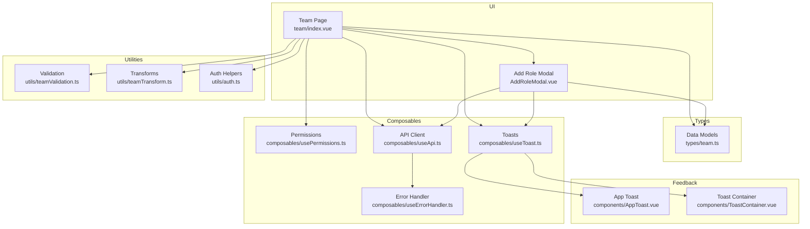
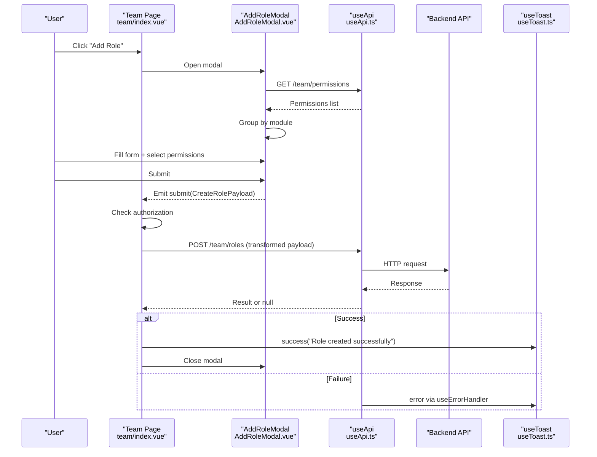
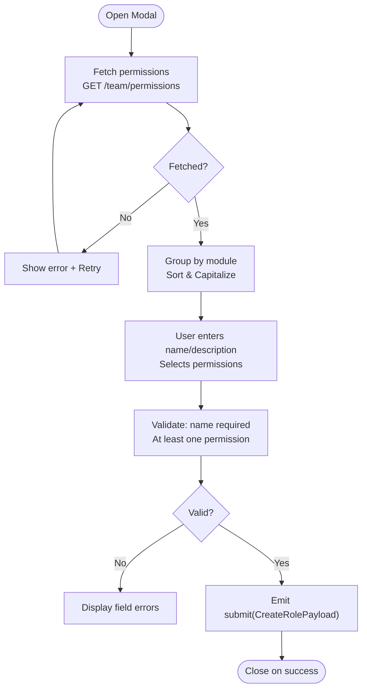
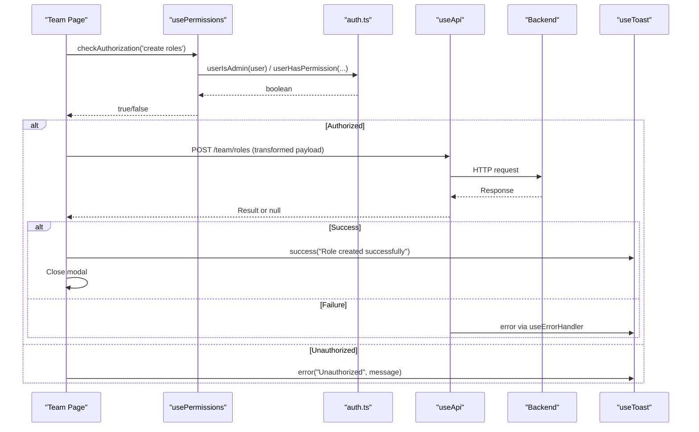
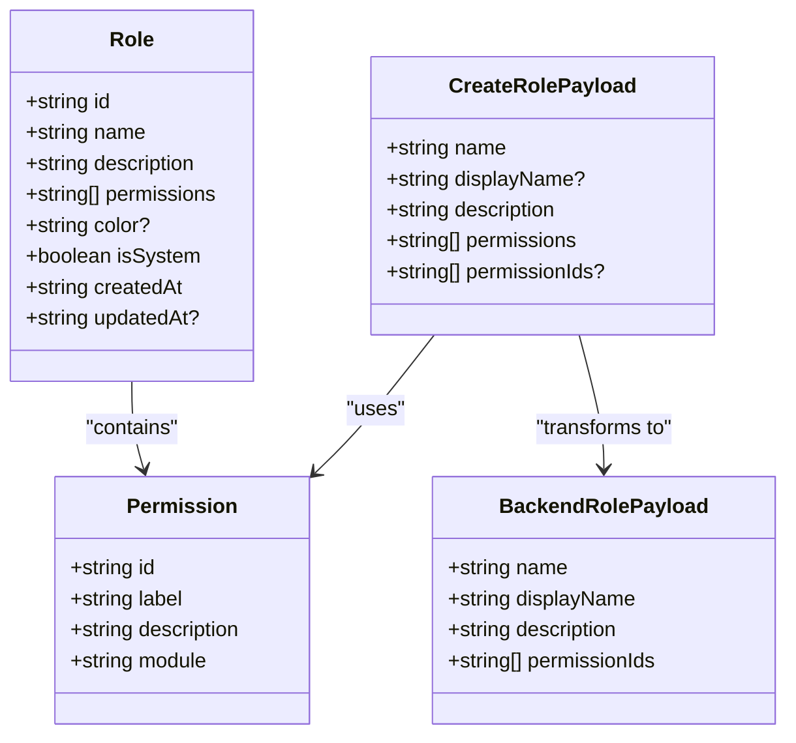
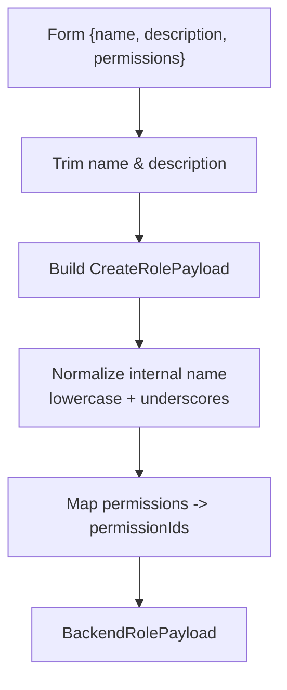
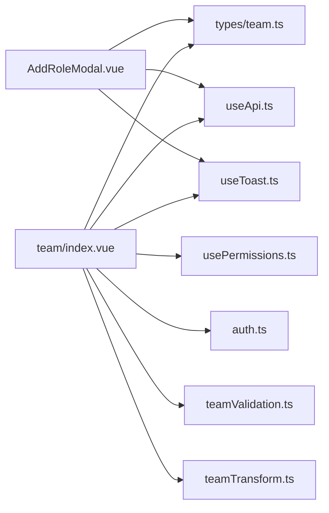

# Role Management

<cite>
**Referenced Files in This Document**
- [AddRoleModal.vue](file://app/components/AddRoleModal.vue)
- [team/index.vue](file://app/pages/team/index.vue)
- [team.ts](file://app/types/team.ts)
- [teamValidation.ts](file://app/utils/teamValidation.ts)
- [teamTransform.ts](file://app/utils/teamTransform.ts)
- [usePermissions.ts](file://app/composables/usePermissions.ts)
- [auth.ts](file://app/utils/auth.ts)
- [useApi.ts](file://app/composables/useApi.ts)
- [useErrorHandler.ts](file://app/composables/useErrorHandler.ts)
- [useToast.ts](file://app/composables/useToast.ts)
- [AppToast.vue](file://app/components/AppToast.vue)
- [ToastContainer.vue](file://app/components/ToastContainer.vue)
</cite>

## Table of Contents
1. [Introduction](#introduction)
2. [Project Structure](#project-structure)
3. [Core Components](#core-components)
4. [Architecture Overview](#architecture-overview)
5. [Detailed Component Analysis](#detailed-component-analysis)
6. [Dependency Analysis](#dependency-analysis)
7. [Performance Considerations](#performance-considerations)
8. [Troubleshooting Guide](#troubleshooting-guide)
9. [Conclusion](#conclusion)

## Introduction
This document explains the role management system with a focus on creating custom roles through the UI. It covers the AddRoleModal component, form validation, permission assignment interface, data models, payload transformation, and persistence to the backend. It also documents error handling patterns, loading states, and user feedback mechanisms used during role creation.

## Project Structure
The role management feature spans several layers:
- UI components for role creation and team listing
- Data types defining roles, permissions, and payloads
- Utilities for validation and transformation
- Composables for API calls, authorization checks, and toast notifications

**Diagram sources**
- [team/index.vue:1-120](file://app/pages/team/index.vue#L1-L120)
- [AddRoleModal.vue:1-120](file://app/components/AddRoleModal.vue#L1-L120)
- [team.ts:1-65](file://app/types/team.ts#L1-L65)
- [teamValidation.ts:1-122](file://app/utils/teamValidation.ts#L1-L122)
- [teamTransform.ts:1-88](file://app/utils/teamTransform.ts#L1-L88)
- [usePermissions.ts:1-43](file://app/composables/usePermissions.ts#L1-L43)
- [auth.ts:1-58](file://app/utils/auth.ts#L1-L58)
- [useApi.ts:1-91](file://app/composables/useApi.ts#L1-L91)
- [useErrorHandler.ts:1-28](file://app/composables/useErrorHandler.ts#L1-L28)
- [useToast.ts:1-36](file://app/composables/useToast.ts#L1-L36)
- [AppToast.vue:1-37](file://app/components/AppToast.vue#L1-L37)
- [ToastContainer.vue:1-40](file://app/components/ToastContainer.vue#L1-L40)

**Section sources**
- [team/index.vue:1-120](file://app/pages/team/index.vue#L1-L120)
- [AddRoleModal.vue:1-120](file://app/components/AddRoleModal.vue#L1-L120)
- [team.ts:1-65](file://app/types/team.ts#L1-L65)
- [teamValidation.ts:1-122](file://app/utils/teamValidation.ts#L1-L122)
- [teamTransform.ts:1-88](file://app/utils/teamTransform.ts#L1-L88)
- [usePermissions.ts:1-43](file://app/composables/usePermissions.ts#L1-L43)
- [auth.ts:1-58](file://app/utils/auth.ts#L1-L58)
- [useApi.ts:1-91](file://app/composables/useApi.ts#L1-L91)
- [useErrorHandler.ts:1-28](file://app/composables/useErrorHandler.ts#L1-L28)
- [useToast.ts:1-36](file://app/composables/useToast.ts#L1-L36)
- [AppToast.vue:1-37](file://app/components/AppToast.vue#L1-L37)
- [ToastContainer.vue:1-40](file://app/components/ToastContainer.vue#L1-L40)

## Core Components
- AddRoleModal: Presents a modal form to create a new role, including name, description, and a grouped permission selector. It fetches available permissions from the backend, groups them by module, and emits a submit event with validated data.
- Team Page (team/index.vue): Hosts the AddRoleModal, enforces authorization, transforms the form into a backend-compatible payload, persists the role via API, and provides success feedback.

Key responsibilities:
- AddRoleModal: UI state, permission fetching, grouping, selection, client-side validation, and emitting submit events.
- Team Page: Authorization checks, payload transformation, API call, success flow, and user feedback.

**Section sources**
- [AddRoleModal.vue:1-153](file://app/components/AddRoleModal.vue#L1-L153)
- [team/index.vue:46-90](file://app/pages/team/index.vue#L46-L90)

## Architecture Overview
The role creation workflow involves:
- User opens the Add Role modal from the Team page.
- The modal loads available permissions from the backend and groups them by module.
- User fills in role details and selects permissions.
- On submit, the Team page validates authorization, transforms the payload, and posts it to the backend.
- Success triggers a toast notification and closes the modal. Errors are surfaced via toasts or inline validation messages.

**Diagram sources**
- [team/index.vue:46-90](file://app/pages/team/index.vue#L46-L90)
- [AddRoleModal.vue:58-93](file://app/components/AddRoleModal.vue#L58-L93)
- [useApi.ts:69-80](file://app/composables/useApi.ts#L69-L80)
- [useToast.ts:14-36](file://app/composables/useToast.ts#L14-L36)

## Detailed Component Analysis

### AddRoleModal Component
- Props and Emits
  - Props: submitting flag to disable interactions during submission.
  - Emits: close and submit(CreateRolePayload).
- Form State
  - Fields: name, description, permissions (array of selected permission IDs).
- Permission Loading and Grouping
  - Fetches permissions from /team/permissions using useApi.get.
  - Transforms backend response to frontend Permission shape.
  - Groups permissions by module, sorts modules alphabetically, and capitalizes labels.
- Validation
  - Name must be non-empty.
  - At least one permission must be selected.
  - Inline errors displayed under fields.
- Submission Flow
  - Validates form; if valid, emits submit with CreateRolePayload.
- UI States
  - Loading spinner while fetching permissions.
  - Error state with retry button when permission fetch fails.
  - Disabled controls while submitting.

**Diagram sources**
- [AddRoleModal.vue:58-93](file://app/components/AddRoleModal.vue#L58-L93)
- [AddRoleModal.vue:95-107](file://app/components/AddRoleModal.vue#L95-L107)
- [AddRoleModal.vue:109-136](file://app/components/AddRoleModal.vue#L109-L136)
- [AddRoleModal.vue:150-152](file://app/components/AddRoleModal.vue#L150-L152)

**Section sources**
- [AddRoleModal.vue:1-153](file://app/components/AddRoleModal.vue#L1-L153)
- [AddRoleModal.vue:155-287](file://app/components/AddRoleModal.vue#L155-L287)

### Team Page Role Creation Handler
- Authorization
  - Uses hasAdminPrivileges() which relies on isSuperAdmin and hasPermission('team.manage').
  - If unauthorized, shows an error toast and aborts.
- Payload Transformation
  - Converts the modal’s CreateRolePayload into a backend-compatible object:
    - name: normalized internal identifier (lowercase, underscores).
    - displayName: original human-readable name.
    - description: trimmed or empty string.
    - permissionIds: array of selected permission IDs.
- Persistence
  - Calls api.post('/team/roles', payload).
  - On success: shows success toast and closes modal.
  - On failure: useApi wraps errors with useErrorHandler to show toasts automatically.

**Diagram sources**
- [team/index.vue:46-90](file://app/pages/team/index.vue#L46-L90)
- [usePermissions.ts:1-43](file://app/composables/usePermissions.ts#L1-L43)
- [auth.ts:22-46](file://app/utils/auth.ts#L22-L46)
- [useApi.ts:69-80](file://app/composables/useApi.ts#L69-L80)
- [useToast.ts:14-36](file://app/composables/useToast.ts#L14-L36)

**Section sources**
- [team/index.vue:46-90](file://app/pages/team/index.vue#L46-L90)
- [team/index.vue:255-270](file://app/pages/team/index.vue#L255-L270)
- [usePermissions.ts:1-43](file://app/composables/usePermissions.ts#L1-L43)
- [auth.ts:1-58](file://app/utils/auth.ts#L1-L58)

### Data Models and Payloads
- Role
  - id, name, description, permissions, color (optional), isSystem, timestamps.
- Permission
  - id, label, description, module.
- CreateRolePayload
  - name, displayName (optional), description, permissions, permissionIds (optional).
- Backend Mapping
  - The Team page maps CreateRolePayload to a backend object with name, displayName, description, and permissionIds.

**Diagram sources**
- [team.ts:22-38](file://app/types/team.ts#L22-L38)
- [team.ts:58-64](file://app/types/team.ts#L58-L64)
- [team/index.vue:59-71](file://app/pages/team/index.vue#L59-L71)

**Section sources**
- [team.ts:1-65](file://app/types/team.ts#L1-L65)
- [team/index.vue:59-71](file://app/pages/team/index.vue#L59-L71)

### Validation and Transformation Utilities
- Validation
  - validateRoleForm ensures name is non-empty and at least one permission is selected.
- Transformation
  - formToCreateRolePayload trims name and description and preserves permissions order.
  - Team page additionally normalizes the internal name to lowercase with underscores and maps permissions to permissionIds.

**Diagram sources**
- [teamValidation.ts:106-121](file://app/utils/teamValidation.ts#L106-L121)
- [teamTransform.ts:77-87](file://app/utils/teamTransform.ts#L77-L87)
- [team/index.vue:59-71](file://app/pages/team/index.vue#L59-L71)

**Section sources**
- [teamValidation.ts:106-121](file://app/utils/teamValidation.ts#L106-L121)
- [teamTransform.ts:77-87](file://app/utils/teamTransform.ts#L77-L87)
- [team/index.vue:59-71](file://app/pages/team/index.vue#L59-L71)

### Practical Examples and Workflows
- Creating a Custom Role via UI
  - Open Team page, click “Add Role”.
  - Enter a descriptive role name and optional description.
  - Select at least one permission from grouped modules.
  - Click “Create Role”; on success, a toast confirms creation and the modal closes.
- Handling Role Submission Events
  - The modal emits submit(CreateRolePayload); the Team page handles authorization, transforms the payload, and persists via API.
- Managing Role Lifecycle Operations
  - While this document focuses on creation, similar patterns apply to update/delete operations elsewhere in the codebase.

[No sources needed since this section summarizes workflows without analyzing specific files]

## Dependency Analysis
- AddRoleModal depends on:
  - useApi for fetching permissions.
  - useToast for potential error feedback.
  - Types from team.ts for Permission and CreateRolePayload.
- Team Page depends on:
  - usePermissions and auth utilities for authorization.
  - useApi for persisting roles.
  - useToast for success/error feedback.
  - Validation and transform utilities for robustness.

**Diagram sources**
- [AddRoleModal.vue:1-120](file://app/components/AddRoleModal.vue#L1-L120)
- [team/index.vue:1-120](file://app/pages/team/index.vue#L1-L120)
- [team.ts:1-65](file://app/types/team.ts#L1-L65)
- [usePermissions.ts:1-43](file://app/composables/usePermissions.ts#L1-L43)
- [auth.ts:1-58](file://app/utils/auth.ts#L1-L58)
- [useApi.ts:1-91](file://app/composables/useApi.ts#L1-L91)
- [useToast.ts:1-36](file://app/composables/useToast.ts#L1-L36)
- [teamValidation.ts:1-122](file://app/utils/teamValidation.ts#L1-L122)
- [teamTransform.ts:1-88](file://app/utils/teamTransform.ts#L1-L88)

**Section sources**
- [AddRoleModal.vue:1-120](file://app/components/AddRoleModal.vue#L1-L120)
- [team/index.vue:1-120](file://app/pages/team/index.vue#L1-L120)
- [team.ts:1-65](file://app/types/team.ts#L1-L65)
- [usePermissions.ts:1-43](file://app/composables/usePermissions.ts#L1-L43)
- [auth.ts:1-58](file://app/utils/auth.ts#L1-L58)
- [useApi.ts:1-91](file://app/composables/useApi.ts#L1-L91)
- [useToast.ts:1-36](file://app/composables/useToast.ts#L1-L36)
- [teamValidation.ts:1-122](file://app/utils/teamValidation.ts#L1-L122)
- [teamTransform.ts:1-88](file://app/utils/teamTransform.ts#L1-L88)

## Performance Considerations
- Permission Fetching
  - Permissions are fetched once on mount and cached in component state. Grouping and sorting are computed efficiently.
- UI Responsiveness
  - Submitting state disables inputs and buttons to prevent duplicate submissions.
- Network Efficiency
  - Single POST request for role creation; no redundant requests.
- Potential Optimizations
  - Debounce permission search if the list grows large.
  - Cache permissions globally (e.g., store) to avoid refetching across modals.

[No sources needed since this section provides general guidance]

## Troubleshooting Guide
- Authorization Failures
  - If the current user lacks admin privileges or required permissions, the Team page shows an error toast and prevents role creation.
- Permission Loading Errors
  - If fetching permissions fails, the modal displays an error state with a retry button.
- API Errors
  - useApi throws on non-success status codes; useErrorHandler wraps these with toasts.
  - 401 responses trigger logout and redirect to login.
- Validation Errors
  - Inline errors appear for missing role name or missing permissions.

**Section sources**
- [team/index.vue:255-270](file://app/pages/team/index.vue#L255-L270)
- [AddRoleModal.vue:87-93](file://app/components/AddRoleModal.vue#L87-L93)
- [useApi.ts:39-58](file://app/composables/useApi.ts#L39-L58)
- [useErrorHandler.ts:10-28](file://app/composables/useErrorHandler.ts#L10-L28)
- [teamValidation.ts:106-121](file://app/utils/teamValidation.ts#L106-L121)

## Conclusion
The role management system provides a clear, secure, and user-friendly way to create custom roles. The AddRoleModal encapsulates form logic and permission selection, while the Team page orchestrates authorization, payload transformation, and persistence. Robust error handling and feedback ensure a smooth experience even when issues occur.