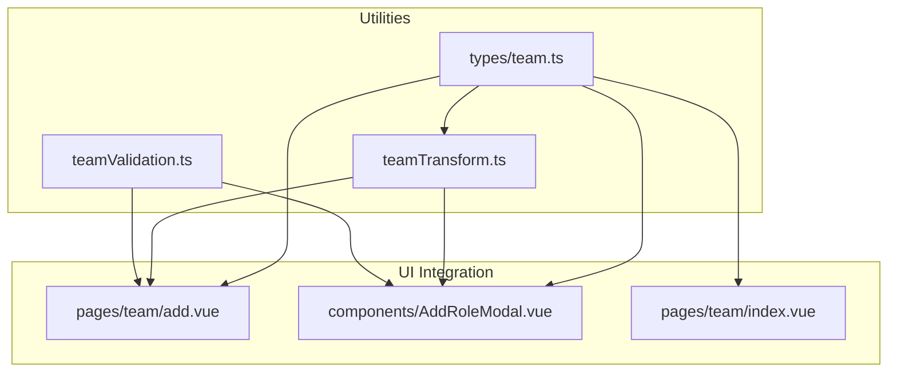
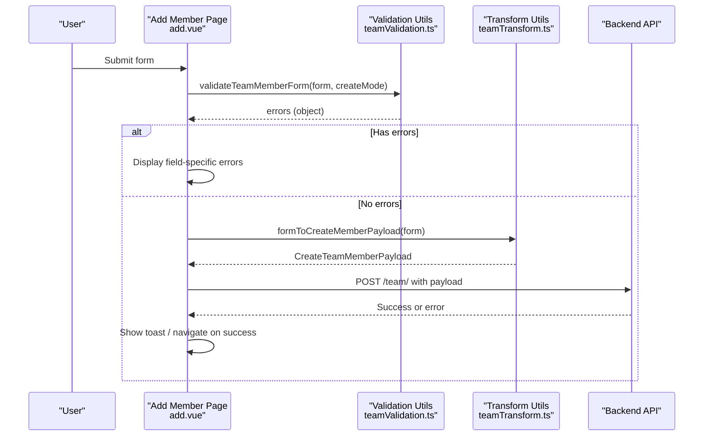
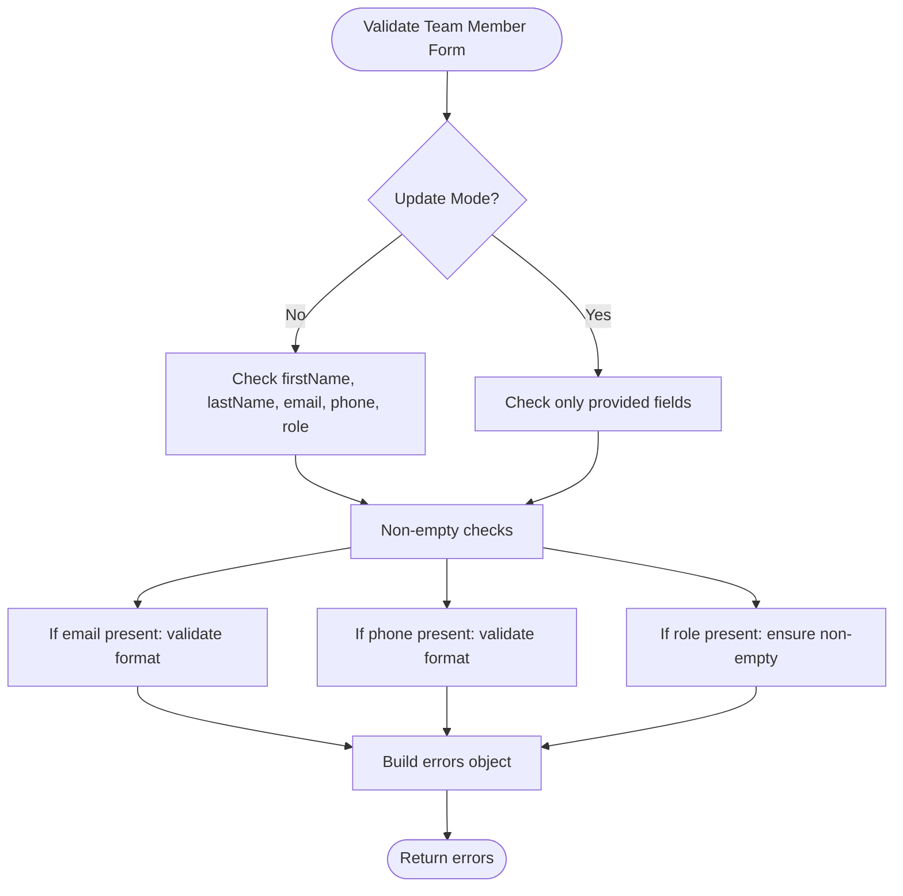
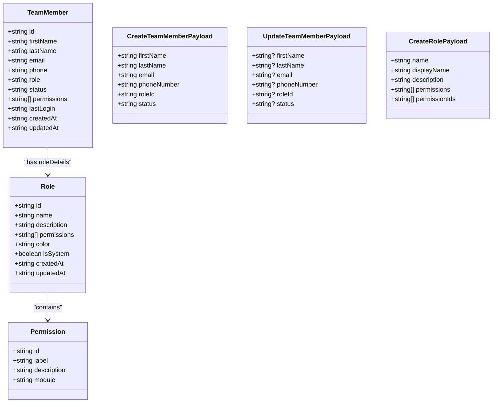
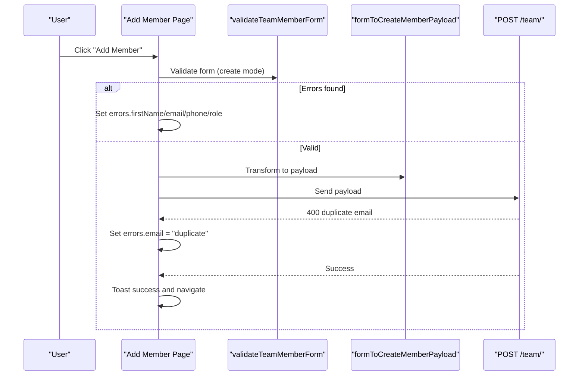
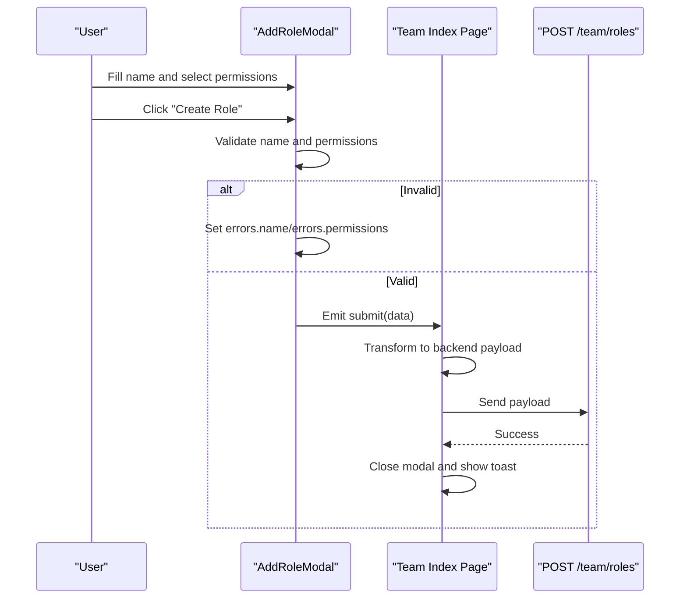
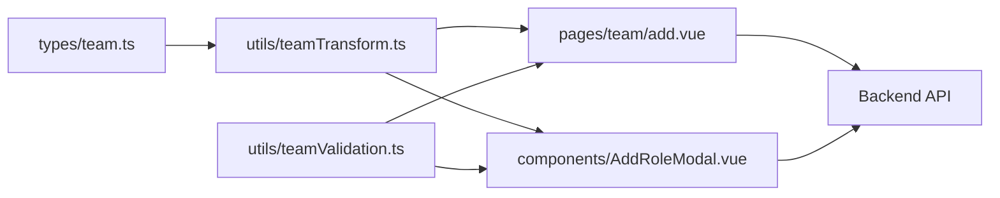

# Team Validation System

<cite>
**Referenced Files in This Document**
- [teamValidation.ts](file://app/utils/teamValidation.ts)
- [teamTransform.ts](file://app/utils/teamTransform.ts)
- [team.ts](file://app/types/team.ts)
- [add.vue](file://app/pages/team/add.vue)
- [AddRoleModal.vue](file://app/components/AddRoleModal.vue)
- [index.vue](file://app/pages/team/index.vue)
- [team-validation-email.test.ts](file://app/utils/__tests__/team-validation-email.test.ts)
- [team-validation-phone.test.ts](file://app/utils/__tests__/team-validation-phone.test.ts)
- [team-validation-non-empty.test.ts](file://app/utils/__tests__/team-validation-non-empty.test.ts)
- [team-validation-errors.test.ts](file://app/utils/__tests__/team-validation-errors.test.ts)
- [add-member.test.ts](file://app/pages/team/__tests__/add-member.test.ts)
- [add-role.test.ts](file://app/pages/team/__tests__/add-role.test.ts)
</cite>

## Table of Contents
1. [Introduction](#introduction)
2. [Project Structure](#project-structure)
3. [Core Components](#core-components)
4. [Architecture Overview](#architecture-overview)
5. [Detailed Component Analysis](#detailed-component-analysis)
6. [Dependency Analysis](#dependency-analysis)
7. [Performance Considerations](#performance-considerations)
8. [Troubleshooting Guide](#troubleshooting-guide)
9. [Conclusion](#conclusion)
10. [Appendices](#appendices)

## Introduction
This document explains the team validation and transformation utilities used across the application for team member data, role assignments, and permission configurations. It covers:
- Validation functions for required fields, email format, phone format, and role forms
- Data transformation helpers that normalize inputs and map to API payloads
- Practical examples of validating inputs, transforming structures, and integrating with form components
- Error message generation, validation state management, and UI integration patterns

The goal is to provide a clear, accessible guide for developers implementing or extending team-related features while ensuring consistency between client-side validation and backend expectations.

## Project Structure
The team validation and transformation logic is organized into focused modules:
- Validation utilities: app/utils/teamValidation.ts
- Transformation utilities: app/utils/teamTransform.ts
- Shared types: app/types/team.ts
- UI integration points:
  - Add member page: app/pages/team/add.vue
  - Add role modal: app/components/AddRoleModal.vue
  - Team list (role creation flow): app/pages/team/index.vue
- Tests:
  - Unit tests for validation rules and error messages
  - Page-level tests for add member and add role flows

**Diagram sources**
- [teamValidation.ts:1-122](file://app/utils/teamValidation.ts#L1-L122)
- [teamTransform.ts:1-88](file://app/utils/teamTransform.ts#L1-L88)
- [team.ts:1-65](file://app/types/team.ts#L1-L65)
- [add.vue:1-450](file://app/pages/team/add.vue#L1-L450)
- [AddRoleModal.vue:1-287](file://app/components/AddRoleModal.vue#L1-L287)
- [index.vue:1-200](file://app/pages/team/index.vue#L1-L200)

**Section sources**
- [teamValidation.ts:1-122](file://app/utils/teamValidation.ts#L1-L122)
- [teamTransform.ts:1-88](file://app/utils/teamTransform.ts#L1-L88)
- [team.ts:1-65](file://app/types/team.ts#L1-L65)
- [add.vue:1-450](file://app/pages/team/add.vue#L1-L450)
- [AddRoleModal.vue:1-287](file://app/components/AddRoleModal.vue#L1-L287)
- [index.vue:1-200](file://app/pages/team/index.vue#L1-L200)

## Core Components
This section summarizes the key validation and transformation functions and their responsibilities.

- Validation functions
  - Non-empty field check
  - Email format validation
  - Phone format validation
  - Team member form validation (create vs update modes)
  - Role form validation (name and permissions)

- Transformation functions
  - Create team member payload mapping
  - Update team member payload mapping (partial updates)
  - Create role payload mapping

- Shared types
  - TeamMember, Role, Permission
  - CreateTeamMemberPayload, UpdateTeamMemberPayload, CreateRolePayload

Key behaviors:
- Validation returns an object keyed by field names with human-readable error messages; empty object means valid.
- Transform functions normalize input (trimming, lowercasing emails) and map to backend payload shapes.
- Update payloads include only provided fields to support partial updates.

**Section sources**
- [teamValidation.ts:1-122](file://app/utils/teamValidation.ts#L1-L122)
- [teamTransform.ts:1-88](file://app/utils/teamTransform.ts#L1-L88)
- [team.ts:1-65](file://app/types/team.ts#L1-L65)

## Architecture Overview
The validation and transformation system integrates tightly with Vue pages and modals:
- Pages call validation functions before submission
- On success, pages transform form data to API payloads using transformation helpers
- Errors are stored in reactive objects and displayed next to corresponding fields
- Authorization checks gate operations before validation and API calls

**Diagram sources**
- [add.vue:96-151](file://app/pages/team/add.vue#L96-L151)
- [teamValidation.ts:49-99](file://app/utils/teamValidation.ts#L49-L99)
- [teamTransform.ts:10-27](file://app/utils/teamTransform.ts#L10-L27)

## Detailed Component Analysis

### Validation Utilities
Responsibilities:
- Enforce non-empty strings for required fields
- Validate email format with a simple regex
- Validate phone numbers by digit count after stripping non-digits
- Provide composite validations for team member and role forms

Behavior highlights:
- For team member form, create mode validates all required fields; update mode validates only provided fields
- Returns descriptive error messages per field
- Role form requires name and at least one permission

**Diagram sources**
- [teamValidation.ts:49-99](file://app/utils/teamValidation.ts#L49-L99)

**Section sources**
- [teamValidation.ts:1-122](file://app/utils/teamValidation.ts#L1-L122)
- [team-validation-email.test.ts:1-166](file://app/utils/__tests__/team-validation-email.test.ts#L1-L166)
- [team-validation-phone.test.ts:1-183](file://app/utils/__tests__/team-validation-phone.test.ts#L1-L183)
- [team-validation-non-empty.test.ts:1-251](file://app/utils/__tests__/team-validation-non-empty.test.ts#L1-L251)
- [team-validation-errors.test.ts:1-261](file://app/utils/__tests__/team-validation-errors.test.ts#L1-L261)

### Transformation Utilities
Responsibilities:
- Normalize user input (trim whitespace, lowercase emails)
- Map frontend form shapes to backend payload interfaces
- Support partial updates by including only provided fields

Key mappings:
- Create member: maps form fields to CreateTeamMemberPayload
- Update member: maps optional fields to UpdateTeamMemberPayload
- Create role: maps role form to CreateRolePayload

**Diagram sources**
- [team.ts:1-65](file://app/types/team.ts#L1-L65)

**Section sources**
- [teamTransform.ts:1-88](file://app/utils/teamTransform.ts#L1-L88)
- [team.ts:1-65](file://app/types/team.ts#L1-L65)

### UI Integration: Add Member Page
Integration pattern:
- Reactive form state holds user inputs
- On submit:
  - Clear previous errors
  - Run validation
  - If invalid, populate reactive errors object and abort
  - If valid, transform to payload and send request
  - Handle server-side validation errors (e.g., duplicate email) by setting field-specific errors
  - On success, show toast and navigate

Error handling:
- Client-side errors mapped to fields
- Server-side duplicate email mapped to email field error
- Other errors shown via toast

**Diagram sources**
- [add.vue:96-151](file://app/pages/team/add.vue#L96-L151)
- [teamValidation.ts:49-99](file://app/utils/teamValidation.ts#L49-L99)
- [teamTransform.ts:10-27](file://app/utils/teamTransform.ts#L10-L27)

**Section sources**
- [add.vue:1-450](file://app/pages/team/add.vue#L1-L450)
- [add-member.test.ts:1-123](file://app/pages/team/__tests__/add-member.test.ts#L1-L123)

### UI Integration: Add Role Modal
Integration pattern:
- Local reactive form with name, description, and selected permissions
- Simple inline validation ensures name is non-empty and at least one permission is selected
- Emits validated data to parent for submission
- Parent transforms and sends request to backend

Note: The modal performs its own lightweight validation rather than importing the shared validator. This is acceptable for small forms but can be unified if desired.

**Diagram sources**
- [AddRoleModal.vue:95-107](file://app/components/AddRoleModal.vue#L95-L107)
- [index.vue:46-90](file://app/pages/team/index.vue#L46-L90)

**Section sources**
- [AddRoleModal.vue:1-287](file://app/components/AddRoleModal.vue#L1-L287)
- [index.vue:1-200](file://app/pages/team/index.vue#L1-L200)
- [add-role.test.ts:1-107](file://app/pages/team/__tests__/add-role.test.ts#L1-L107)

## Dependency Analysis
- Validation depends only on primitive checks and regex; no external libraries
- Transformation depends on shared types to ensure payload shape correctness
- UI components depend on both validation and transformation modules
- Tests cover property-based behavior and expected error messages

**Diagram sources**
- [team.ts:1-65](file://app/types/team.ts#L1-L65)
- [teamTransform.ts:1-88](file://app/utils/teamTransform.ts#L1-L88)
- [teamValidation.ts:1-122](file://app/utils/teamValidation.ts#L1-L122)
- [add.vue:1-450](file://app/pages/team/add.vue#L1-L450)
- [AddRoleModal.vue:1-287](file://app/components/AddRoleModal.vue#L1-L287)

**Section sources**
- [team.ts:1-65](file://app/types/team.ts#L1-L65)
- [teamValidation.ts:1-122](file://app/utils/teamValidation.ts#L1-L122)
- [teamTransform.ts:1-88](file://app/utils/teamTransform.ts#L1-L88)
- [add.vue:1-450](file://app/pages/team/add.vue#L1-L450)
- [AddRoleModal.vue:1-287](file://app/components/AddRoleModal.vue#L1-L287)

## Performance Considerations
- Validation runs synchronously on the client and is lightweight; it should not block UI
- Avoid re-validating unchanged fields; rely on component-level guards (e.g., only validate when submitting)
- Transformation is O(n) over form fields; negligible cost for typical form sizes
- Keep error messages static strings to avoid recomputation during render

[No sources needed since this section provides general guidance]

## Troubleshooting Guide
Common issues and resolutions:
- Duplicate email on create
  - Symptom: Server returns a 400-like error indicating duplication
  - Resolution: Map server error to the email field’s error message in the page handler
- Empty or whitespace-only fields
  - Symptom: Required field errors appear immediately after submit
  - Resolution: Ensure validation runs in create mode and that UI clears previous errors before each submit
- Invalid email or phone formats
  - Symptom: Field-specific format errors
  - Resolution: Use the provided validators; consider adding real-time feedback on blur for better UX
- Missing permissions in role creation
  - Symptom: “At least one permission is required” error
  - Resolution: Ensure at least one permission is selected before emitting submit event from the modal

**Section sources**
- [add.vue:138-151](file://app/pages/team/add.vue#L138-L151)
- [teamValidation.ts:49-99](file://app/utils/teamValidation.ts#L49-L99)
- [teamValidation.ts:106-121](file://app/utils/teamValidation.ts#L106-L121)
- [AddRoleModal.vue:95-107](file://app/components/AddRoleModal.vue#L95-L107)

## Conclusion
The team validation and transformation system provides a consistent, testable foundation for managing team members and roles. Validation functions enforce required fields and basic formats, while transformation helpers normalize inputs and align them with backend expectations. UI components integrate these utilities to deliver clear error feedback and robust submission flows. Following the patterns outlined here will help maintain consistency and reliability across team-related features.

[No sources needed since this section summarizes without analyzing specific files]

## Appendices

### Practical Examples

- Validating team member inputs
  - Call the team member form validator with create mode to require all fields
  - Inspect returned errors object to display messages next to fields
  - Reference: [teamValidation.ts:49-99](file://app/utils/teamValidation.ts#L49-L99)

- Transforming team data structures
  - Convert form to CreateTeamMemberPayload using the transformer
  - Trim whitespace and lowercase email automatically
  - Reference: [teamTransform.ts:10-27](file://app/utils/teamTransform.ts#L10-L27)

- Implementing custom validation rules
  - Extend the existing validators by adding new helper functions (e.g., validateUsername)
  - Integrate into validateTeamMemberForm or create a dedicated validator for new fields
  - Reference: [teamValidation.ts:1-48](file://app/utils/teamValidation.ts#L1-L48)

- Error message generation and validation state management
  - Maintain a reactive errors object keyed by field names
  - Clear previous errors before validation
  - Merge new errors into the reactive object for immediate UI updates
  - Reference: [add.vue:105-114](file://app/pages/team/add.vue#L105-L114)

- Integrating with form components
  - Bind v-model to form fields
  - Display errors conditionally below inputs
  - Disable submit while submitting to prevent double submissions
  - Reference: [add.vue:310-393](file://app/pages/team/add.vue#L310-L393)

**Section sources**
- [teamValidation.ts:1-122](file://app/utils/teamValidation.ts#L1-L122)
- [teamTransform.ts:1-88](file://app/utils/teamTransform.ts#L1-L88)
- [add.vue:105-114](file://app/pages/team/add.vue#L105-L114)
- [add.vue:310-393](file://app/pages/team/add.vue#L310-L393)