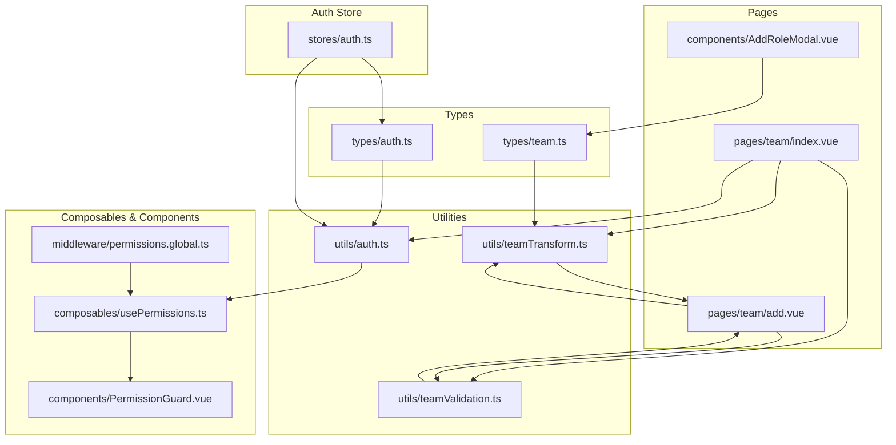
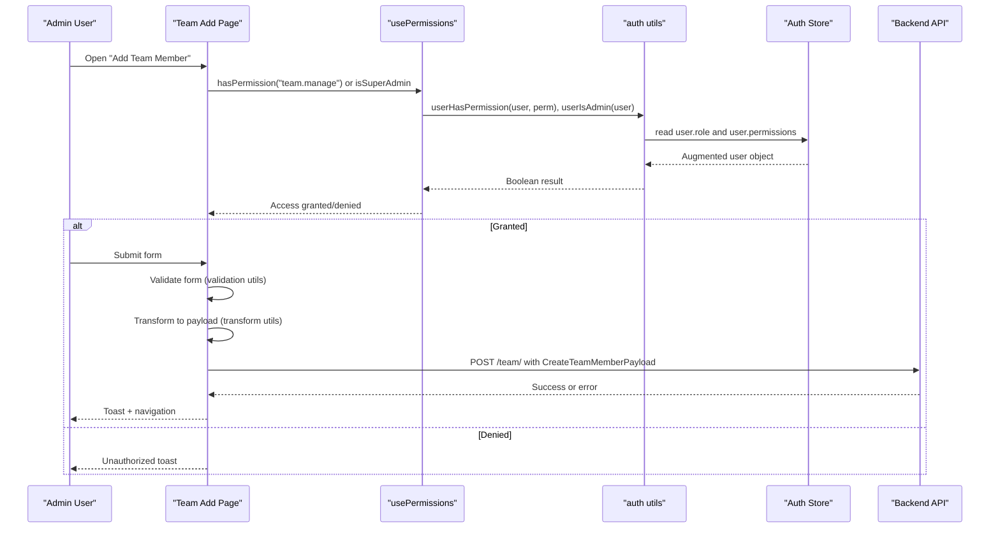
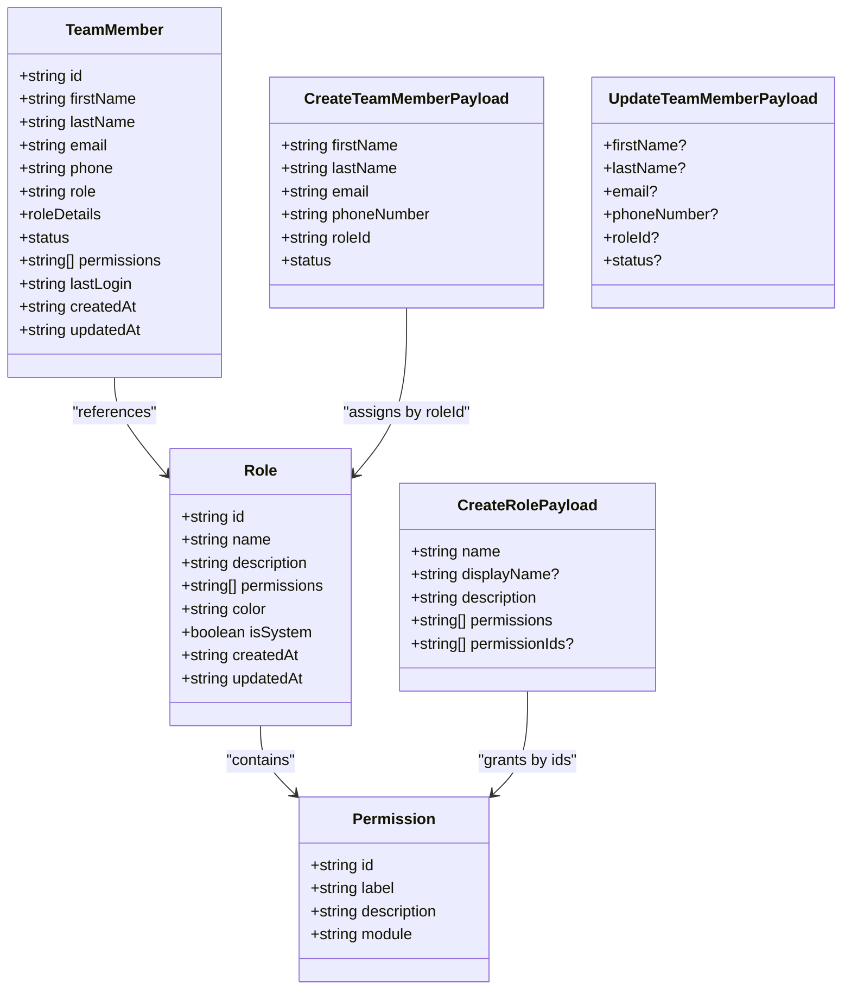
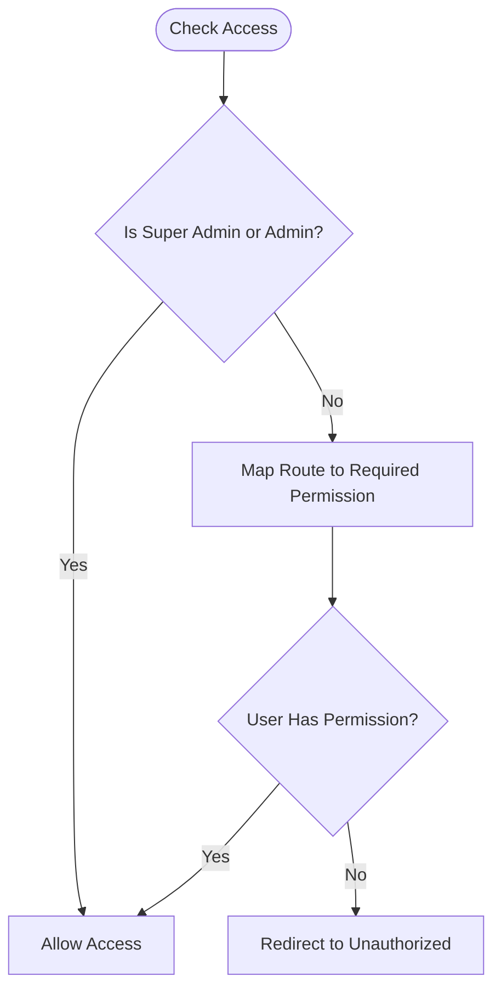
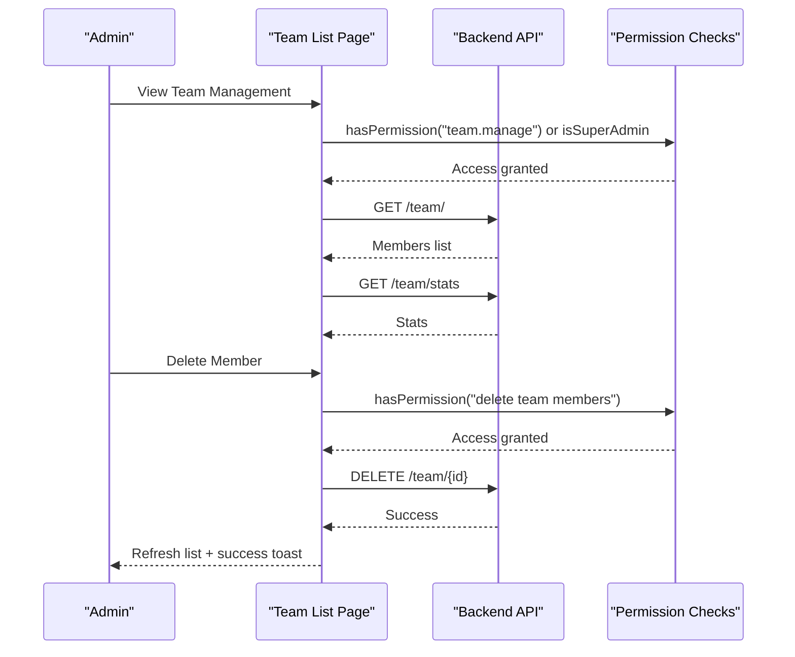
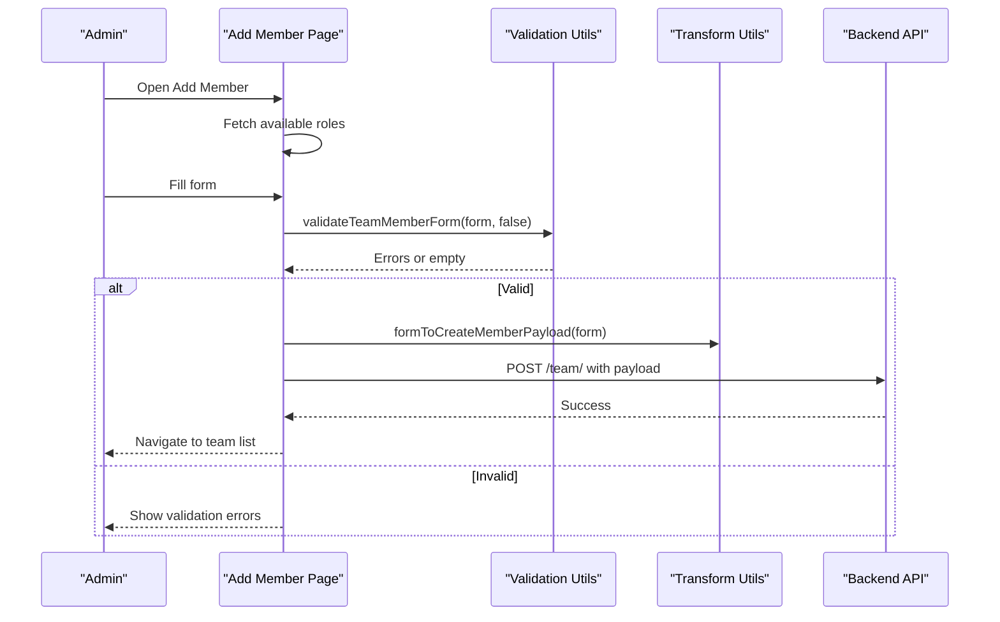
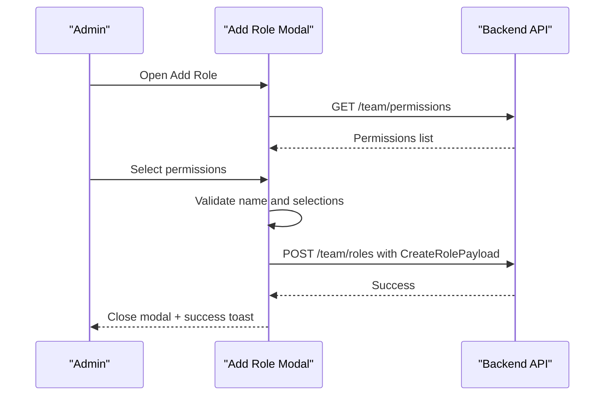
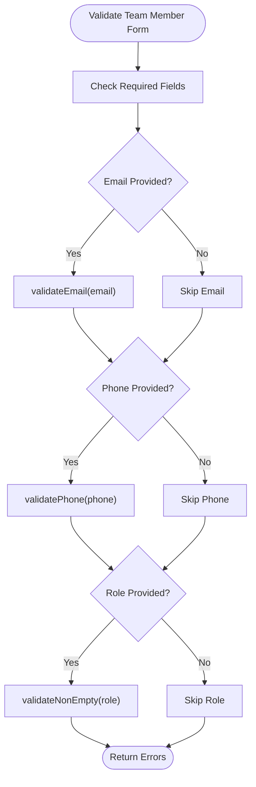
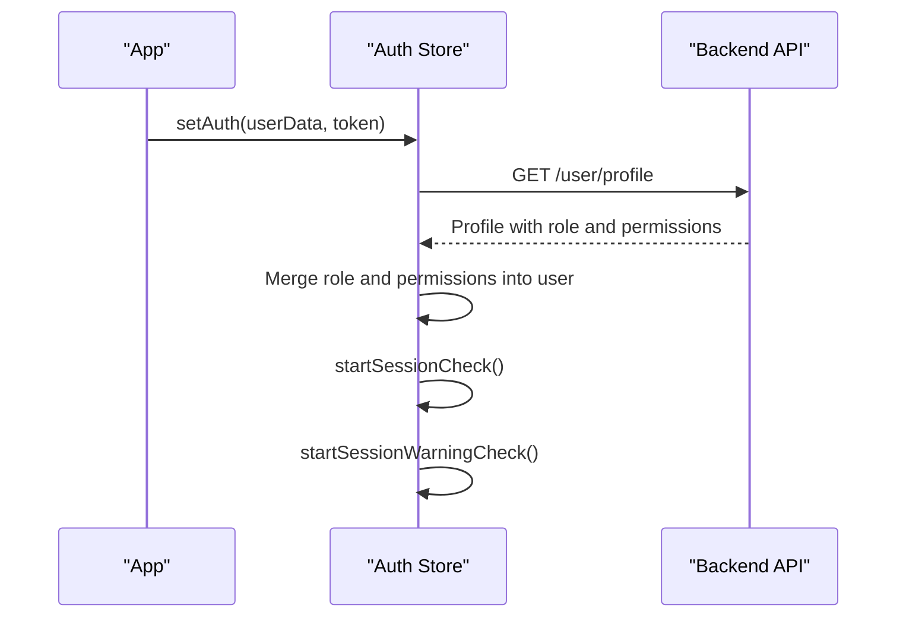
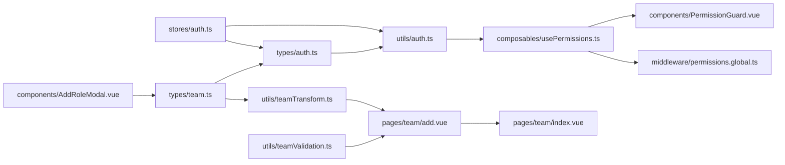

# Team Administration

<cite>
**Referenced Files in This Document**
- [team.ts](file://app/types/team.ts)
- [auth.ts](file://app/utils/auth.ts)
- [usePermissions.ts](file://app/composables/usePermissions.ts)
- [PermissionGuard.vue](file://app/components/PermissionGuard.vue)
- [permissions.global.ts](file://app/middleware/permissions.global.ts)
- [index.vue (Team List)](file://app/pages/team/index.vue)
- [add.vue (Add Member)](file://app/pages/team/add.vue)
- [AddRoleModal.vue](file://app/components/AddRoleModal.vue)
- [teamValidation.ts](file://app/utils/teamValidation.ts)
- [teamTransform.ts](file://app/utils/teamTransform.ts)
- [auth store](file://app/stores/auth.ts)
- [auth types](file://app/types/auth.ts)
</cite>

## Table of Contents
1. [Introduction](#introduction)
2. [Project Structure](#project-structure)
3. [Core Components](#core-components)
4. [Architecture Overview](#architecture-overview)
5. [Detailed Component Analysis](#detailed-component-analysis)
6. [Dependency Analysis](#dependency-analysis)
7. [Performance Considerations](#performance-considerations)
8. [Troubleshooting Guide](#troubleshooting-guide)
9. [Conclusion](#conclusion)
10. [Appendices](#appendices)

## Introduction
This document explains the team administration system implemented in the application. It covers user management and roles, permission configuration, team member profiles, and access control policies. It also documents the data model for team members, the role-based permission system, validation utilities, and practical workflows such as adding team members, configuring roles and permissions, and managing access levels. Security considerations for administrative access control are included to guide safe implementation and operation.

## Project Structure
The team administration feature spans several layers:
- Types define the core data models for team members, roles, and permissions.
- Utilities provide validation and transformation logic for forms and API payloads.
- Composables and components implement permission checks and UI guards.
- Middleware enforces route-level access control based on permissions.
- Pages implement the team list and add-member flows.
- The auth store manages session state and augments the current user with role and permissions from the profile endpoint.

**Diagram sources**
- [team.ts:1-65](file://app/types/team.ts#L1-L65)
- [auth.ts:1-58](file://app/utils/auth.ts#L1-L58)
- [usePermissions.ts:1-43](file://app/composables/usePermissions.ts#L1-L43)
- [PermissionGuard.vue:1-38](file://app/components/PermissionGuard.vue#L1-L38)
- [permissions.global.ts:1-59](file://app/middleware/permissions.global.ts#L1-L59)
- [index.vue (Team List):1-605](file://app/pages/team/index.vue#L1-L605)
- [add.vue (Add Member):1-450](file://app/pages/team/add.vue#L1-L450)
- [AddRoleModal.vue:1-287](file://app/components/AddRoleModal.vue#L1-L287)
- [teamValidation.ts:1-122](file://app/utils/teamValidation.ts#L1-L122)
- [teamTransform.ts:1-88](file://app/utils/teamTransform.ts#L1-L88)
- [auth store:1-230](file://app/stores/auth.ts#L1-L230)
- [auth types:1-64](file://app/types/auth.ts#L1-L64)

**Section sources**
- [team.ts:1-65](file://app/types/team.ts#L1-L65)
- [auth.ts:1-58](file://app/utils/auth.ts#L1-L58)
- [usePermissions.ts:1-43](file://app/composables/usePermissions.ts#L1-L43)
- [PermissionGuard.vue:1-38](file://app/components/PermissionGuard.vue#L1-L38)
- [permissions.global.ts:1-59](file://app/middleware/permissions.global.ts#L1-L59)
- [index.vue (Team List):1-605](file://app/pages/team/index.vue#L1-L605)
- [add.vue (Add Member):1-450](file://app/pages/team/add.vue#L1-L450)
- [AddRoleModal.vue:1-287](file://app/components/AddRoleModal.vue#L1-L287)
- [teamValidation.ts:1-122](file://app/utils/teamValidation.ts#L1-L122)
- [teamTransform.ts:1-88](file://app/utils/teamTransform.ts#L1-L88)
- [auth store:1-230](file://app/stores/auth.ts#L1-L230)
- [auth types:1-64](file://app/types/auth.ts#L1-L64)

## Core Components
- Data Models: TeamMember, Role, Permission, and related payloads define the shape of team data and API contracts.
- Validation Utilities: Functions validate non-empty fields, email format, phone format, and composite form objects for team members and roles.
- Transformation Utilities: Convert UI form inputs into backend-compatible payloads, handling trimming, lowercasing, and field mapping.
- Permission System: A composable wraps utility functions that check permissions and roles against the current user’s augmented profile.
- Access Control: Route middleware enforces page-level permissions; a component guard enables fine-grained UI visibility.

Key responsibilities:
- Types establish strict contracts for team entities and payloads.
- Validation ensures input correctness before submission.
- Transformations normalize data for consistent API calls.
- Permissions utilities centralize authorization logic and simplify checks across the app.
- Middleware and guards enforce security at both route and component levels.

**Section sources**
- [team.ts:1-65](file://app/types/team.ts#L1-L65)
- [teamValidation.ts:1-122](file://app/utils/teamValidation.ts#L1-L122)
- [teamTransform.ts:1-88](file://app/utils/teamTransform.ts#L1-L88)
- [usePermissions.ts:1-43](file://app/composables/usePermissions.ts#L1-L43)
- [PermissionGuard.vue:1-38](file://app/components/PermissionGuard.vue#L1-L38)
- [permissions.global.ts:1-59](file://app/middleware/permissions.global.ts#L1-L59)

## Architecture Overview
The team administration architecture follows a layered approach:
- Presentation Layer: Pages and modals render forms and lists, orchestrate user interactions, and display feedback.
- Business Logic Layer: Validation and transformation utilities ensure data integrity and correct payload shapes.
- Authorization Layer: Auth utilities compute admin status, role matching, and permission checks; the composable exposes convenient methods; middleware and guards enforce access.
- State Management: The auth store persists tokens, manages sessions, and augments the current user with role and permissions from the profile endpoint.

**Diagram sources**
- [add.vue (Add Member):1-450](file://app/pages/team/add.vue#L1-L450)
- [usePermissions.ts:1-43](file://app/composables/usePermissions.ts#L1-L43)
- [auth.ts:1-58](file://app/utils/auth.ts#L1-L58)
- [auth store:1-230](file://app/stores/auth.ts#L1-L230)
- [teamValidation.ts:1-122](file://app/utils/teamValidation.ts#L1-L122)
- [teamTransform.ts:1-88](file://app/utils/teamTransform.ts#L1-L88)

## Detailed Component Analysis

### Data Model and Roles
The data model defines:
- TeamMember: Represents a team member with identity, contact info, role reference, status, permissions, and timestamps.
- Role: Defines a role with name, description, permissions, color, and system flags.
- Permission: Describes a granular permission with label, description, and module grouping.
- Payloads: CreateTeamMemberPayload, UpdateTeamMemberPayload, CreateRolePayload specify request shapes.

**Diagram sources**
- [team.ts:1-65](file://app/types/team.ts#L1-L65)

**Section sources**
- [team.ts:1-65](file://app/types/team.ts#L1-L65)

### Permission System and Access Control
Authorization is implemented through:
- Utility functions that normalize roles, detect admin roles, extract permissions, and perform checks.
- A composable that exposes convenient methods for checking single or multiple permissions and roles.
- A component guard that conditionally renders content based on permissions and roles.
- Global middleware that maps routes to required permissions and redirects unauthorized users.

**Diagram sources**
- [auth.ts:1-58](file://app/utils/auth.ts#L1-L58)
- [usePermissions.ts:1-43](file://app/composables/usePermissions.ts#L1-L43)
- [PermissionGuard.vue:1-38](file://app/components/PermissionGuard.vue#L1-L38)
- [permissions.global.ts:1-59](file://app/middleware/permissions.global.ts#L1-L59)

**Section sources**
- [auth.ts:1-58](file://app/utils/auth.ts#L1-L58)
- [usePermissions.ts:1-43](file://app/composables/usePermissions.ts#L1-L43)
- [PermissionGuard.vue:1-38](file://app/components/PermissionGuard.vue#L1-L38)
- [permissions.global.ts:1-59](file://app/middleware/permissions.global.ts#L1-L59)

### Team Member Lifecycle Management
Lifecycle operations include:
- Listing team members and statistics.
- Adding new members via a dedicated form with validation and transformation.
- Deleting members with confirmation and authorization checks.
- Updating member details via an edit flow (route present).

**Diagram sources**
- [index.vue (Team List):1-605](file://app/pages/team/index.vue#L1-L605)
- [usePermissions.ts:1-43](file://app/composables/usePermissions.ts#L1-L43)
- [auth.ts:1-58](file://app/utils/auth.ts#L1-L58)

**Section sources**
- [index.vue (Team List):1-605](file://app/pages/team/index.vue#L1-L605)

### Adding Team Members
The add-member workflow includes:
- Authorization checks before rendering and submitting.
- Client-side validation using validation utilities.
- Transformation of form data to API payload.
- Submission via raw request to handle specific validation errors.
- Success navigation and error handling with toasts.

**Diagram sources**
- [add.vue (Add Member):1-450](file://app/pages/team/add.vue#L1-L450)
- [teamValidation.ts:1-122](file://app/utils/teamValidation.ts#L1-L122)
- [teamTransform.ts:1-88](file://app/utils/teamTransform.ts#L1-L88)

**Section sources**
- [add.vue (Add Member):1-450](file://app/pages/team/add.vue#L1-L450)
- [teamValidation.ts:1-122](file://app/utils/teamValidation.ts#L1-L122)
- [teamTransform.ts:1-88](file://app/utils/teamTransform.ts#L1-L88)

### Configuring Roles and Permissions
Role creation involves:
- Loading available permissions grouped by module.
- Selecting one or more permissions and validating the selection.
- Submitting a role creation payload to the backend.

**Diagram sources**
- [AddRoleModal.vue:1-287](file://app/components/AddRoleModal.vue#L1-L287)
- [team.ts:1-65](file://app/types/team.ts#L1-L65)

**Section sources**
- [AddRoleModal.vue:1-287](file://app/components/AddRoleModal.vue#L1-L287)
- [team.ts:1-65](file://app/types/team.ts#L1-L65)

### Validation Utilities
Validation utilities provide:
- Non-empty string checks.
- Email format validation with regex.
- Phone number validation allowing various formats.
- Composite validation for team member and role forms.

**Diagram sources**
- [teamValidation.ts:1-122](file://app/utils/teamValidation.ts#L1-L122)

**Section sources**
- [teamValidation.ts:1-122](file://app/utils/teamValidation.ts#L1-L122)

### Authentication and Session Management
The auth store:
- Persists token and user state.
- Fetches team member profile to augment user with role and permissions.
- Manages session expiry and periodic refresh.
- Provides logout and session warning functionality.

**Diagram sources**
- [auth store:1-230](file://app/stores/auth.ts#L1-L230)
- [auth types:1-64](file://app/types/auth.ts#L1-L64)

**Section sources**
- [auth store:1-230](file://app/stores/auth.ts#L1-L230)
- [auth types:1-64](file://app/types/auth.ts#L1-L64)

## Dependency Analysis
The following diagram shows key dependencies between modules:

**Diagram sources**
- [team.ts:1-65](file://app/types/team.ts#L1-L65)
- [teamTransform.ts:1-88](file://app/utils/teamTransform.ts#L1-L88)
- [auth.ts:1-58](file://app/utils/auth.ts#L1-L58)
- [usePermissions.ts:1-43](file://app/composables/usePermissions.ts#L1-L43)
- [PermissionGuard.vue:1-38](file://app/components/PermissionGuard.vue#L1-L38)
- [permissions.global.ts:1-59](file://app/middleware/permissions.global.ts#L1-L59)
- [teamValidation.ts:1-122](file://app/utils/teamValidation.ts#L1-L122)
- [add.vue (Add Member):1-450](file://app/pages/team/add.vue#L1-L450)
- [index.vue (Team List):1-605](file://app/pages/team/index.vue#L1-L605)
- [AddRoleModal.vue:1-287](file://app/components/AddRoleModal.vue#L1-L287)
- [auth store:1-230](file://app/stores/auth.ts#L1-L230)
- [auth types:1-64](file://app/types/auth.ts#L1-L64)

**Section sources**
- [team.ts:1-65](file://app/types/team.ts#L1-L65)
- [teamTransform.ts:1-88](file://app/utils/teamTransform.ts#L1-L88)
- [auth.ts:1-58](file://app/utils/auth.ts#L1-L58)
- [usePermissions.ts:1-43](file://app/composables/usePermissions.ts#L1-L43)
- [PermissionGuard.vue:1-38](file://app/components/PermissionGuard.vue#L1-L38)
- [permissions.global.ts:1-59](file://app/middleware/permissions.global.ts#L1-L59)
- [teamValidation.ts:1-122](file://app/utils/teamValidation.ts#L1-L122)
- [add.vue (Add Member):1-450](file://app/pages/team/add.vue#L1-L450)
- [index.vue (Team List):1-605](file://app/pages/team/index.vue#L1-L605)
- [AddRoleModal.vue:1-287](file://app/components/AddRoleModal.vue#L1-L287)
- [auth store:1-230](file://app/stores/auth.ts#L1-L230)
- [auth types:1-64](file://app/types/auth.ts#L1-L64)

## Performance Considerations
- Minimize redundant API calls by caching roles and permissions where appropriate.
- Debounce search/filter operations if added to the team list.
- Use skeleton loaders to improve perceived performance during initial loads.
- Avoid heavy computations in reactive contexts; prefer computed properties for derived data.
- Ensure network requests use proper error handling to prevent repeated retries on transient failures.

[No sources needed since this section provides general guidance]

## Troubleshooting Guide
Common issues and resolutions:
- Unauthorized access: Verify the current user has the required permission or is an admin. Check route mappings and middleware behavior.
- Validation errors: Inspect client-side validation outputs and ensure form fields meet requirements.
- Duplicate email: Handle server-side duplicate detection and map errors to the email field.
- Missing permissions: Confirm the backend returns permissions and they are merged into the user object by the auth store.

**Section sources**
- [permissions.global.ts:1-59](file://app/middleware/permissions.global.ts#L1-L59)
- [teamValidation.ts:1-122](file://app/utils/teamValidation.ts#L1-L122)
- [add.vue (Add Member):1-450](file://app/pages/team/add.vue#L1-L450)
- [auth store:1-230](file://app/stores/auth.ts#L1-L230)

## Conclusion
The team administration system implements a robust role-based access control model with clear separation of concerns. Data models define precise contracts, validation utilities ensure input correctness, and transformation utilities standardize payloads. Authorization is enforced at both route and component levels, while the auth store maintains session state and augments user context with roles and permissions. The documented workflows provide practical guidance for adding members, configuring roles, and managing access levels securely.

[No sources needed since this section summarizes without analyzing specific files]

## Appendices

### Practical Examples

- Adding a team member:
  - Navigate to the add member page.
  - Ensure you have admin privileges or the team.manage permission.
  - Fill in personal information and select a role.
  - Submit the form; the system validates input, transforms it, and posts to the backend.
  - On success, navigate back to the team list.

- Configuring roles and permissions:
  - Open the add role modal.
  - Provide a role name and description.
  - Select one or more permissions grouped by module.
  - Submit to create the role; the backend assigns permissions accordingly.

- Managing user access levels:
  - Use the team list to view members, their roles, and statuses.
  - Delete members after confirming authorization.
  - Edit member details via the edit route when necessary.

**Section sources**
- [add.vue (Add Member):1-450](file://app/pages/team/add.vue#L1-L450)
- [AddRoleModal.vue:1-287](file://app/components/AddRoleModal.vue#L1-L287)
- [index.vue (Team List):1-605](file://app/pages/team/index.vue#L1-L605)

### Security Considerations for Administrative Access Control
- Enforce route-level permissions via middleware to prevent unauthorized navigation.
- Use component guards to hide sensitive UI elements from users without required permissions.
- Treat super admins and admins as having implicit full access; ensure this policy is consistently applied.
- Validate all inputs on the client and rely on server-side validation for authoritative checks.
- Normalize roles and permissions to avoid case sensitivity and formatting inconsistencies.
- Manage sessions securely with expiry checks and warnings to mitigate stale token risks.

**Section sources**
- [permissions.global.ts:1-59](file://app/middleware/permissions.global.ts#L1-L59)
- [PermissionGuard.vue:1-38](file://app/components/PermissionGuard.vue#L1-L38)
- [auth.ts:1-58](file://app/utils/auth.ts#L1-L58)
- [auth store:1-230](file://app/stores/auth.ts#L1-L230)