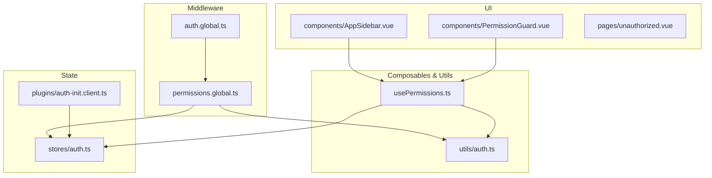
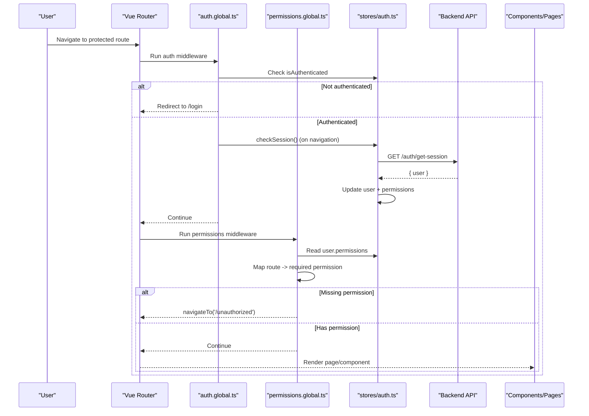
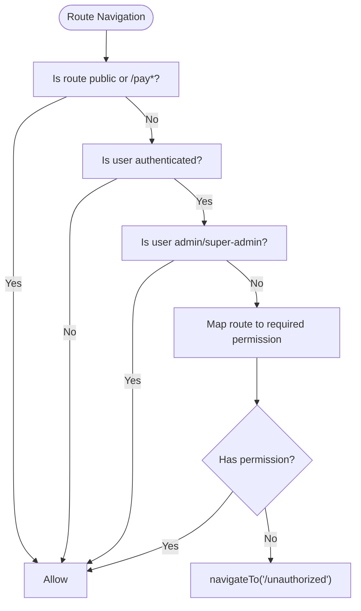
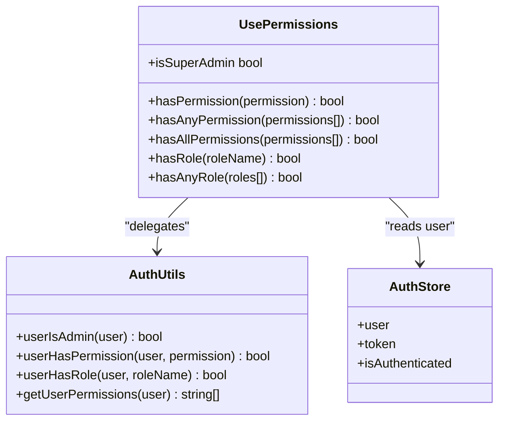
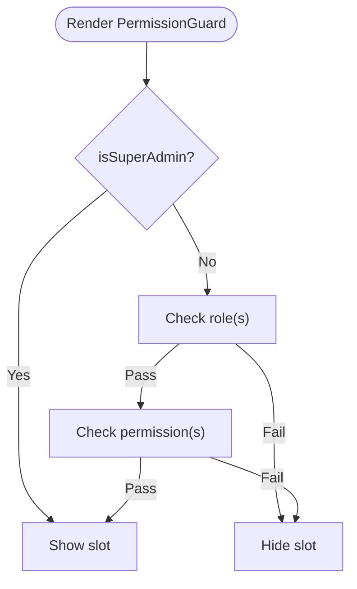
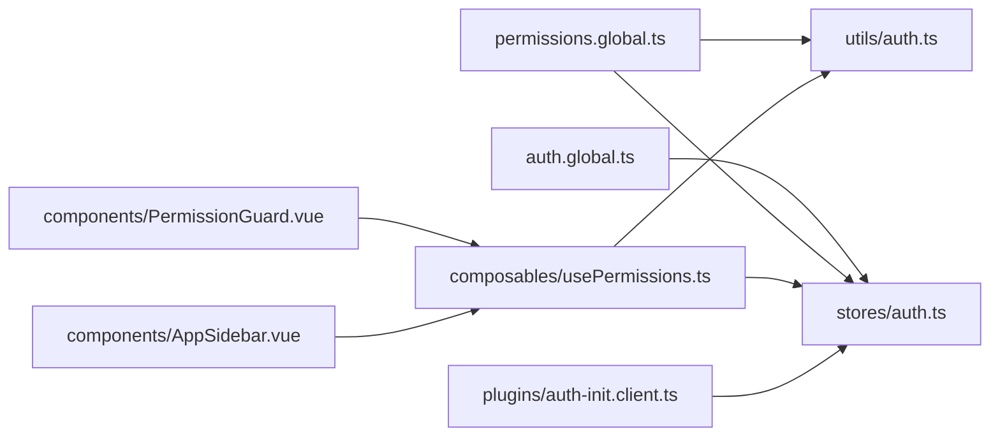

# Team Authorization Middleware

<cite>
**Referenced Files in This Document**
- [auth.global.ts](file://app/middleware/auth.global.ts)
- [permissions.global.ts](file://app/middleware/permissions.global.ts)
- [usePermissions.ts](file://app/composables/usePermissions.ts)
- [PermissionGuard.vue](file://app/components/PermissionGuard.vue)
- [auth.ts](file://app/utils/auth.ts)
- [auth.ts (store)](file://app/stores/auth.ts)
- [auth-init.client.ts](file://app/plugins/auth-init.client.ts)
- [AppSidebar.vue](file://app/components/AppSidebar.vue)
- [unauthorized.vue](file://app/pages/unauthorized.vue)
- [team/index.vue](file://app/pages/team/index.vue)
</cite>

## Table of Contents
1. [Introduction](#introduction)
2. [Project Structure](#project-structure)
3. [Core Components](#core-components)
4. [Architecture Overview](#architecture-overview)
5. [Detailed Component Analysis](#detailed-component-analysis)
6. [Dependency Analysis](#dependency-analysis)
7. [Performance Considerations](#performance-considerations)
8. [Troubleshooting Guide](#troubleshooting-guide)
9. [Conclusion](#conclusion)

## Introduction
This document explains the team authorization middleware system, including global permission checks, route protection mechanisms, and permission evaluation logic. It details how the usePermissions composable integrates with Vue Router guards, the middleware pipeline, permission caching strategies, and performance optimizations. Practical examples are provided for protecting routes, checking permissions in components, and implementing conditional UI rendering based on user roles. Error handling, unauthorized access scenarios, and debugging guidance are also included.

## Project Structure
The authorization system spans several layers:
- Global middlewares enforce authentication and route-level permissions.
- A composables layer provides a convenient API to check permissions and roles.
- Utility functions implement core permission evaluation logic.
- The auth store manages session state and fetches role/permission data.
- A plugin initializes session checks on app load.
- UI components render conditionally based on permissions.

**Diagram sources**
- [auth.global.ts:1-32](file://app/middleware/auth.global.ts#L1-L32)
- [permissions.global.ts:1-59](file://app/middleware/permissions.global.ts#L1-L59)
- [usePermissions.ts:1-43](file://app/composables/usePermissions.ts#L1-L43)
- [auth.ts:1-58](file://app/utils/auth.ts#L1-L58)
- [auth.ts (store):1-230](file://app/stores/auth.ts#L1-L230)
- [auth-init.client.ts:1-25](file://app/plugins/auth-init.client.ts#L1-L25)
- [AppSidebar.vue:1-319](file://app/components/AppSidebar.vue#L1-L319)
- [PermissionGuard.vue:1-38](file://app/components/PermissionGuard.vue#L1-L38)
- [unauthorized.vue:1-58](file://app/pages/unauthorized.vue#L1-L58)

**Section sources**
- [auth.global.ts:1-32](file://app/middleware/auth.global.ts#L1-L32)
- [permissions.global.ts:1-59](file://app/middleware/permissions.global.ts#L1-L59)
- [usePermissions.ts:1-43](file://app/composables/usePermissions.ts#L1-L43)
- [auth.ts:1-58](file://app/utils/auth.ts#L1-L58)
- [auth.ts (store):1-230](file://app/stores/auth.ts#L1-L230)
- [auth-init.client.ts:1-25](file://app/plugins/auth-init.client.ts#L1-L25)
- [AppSidebar.vue:1-319](file://app/components/AppSidebar.vue#L1-L319)
- [PermissionGuard.vue:1-38](file://app/components/PermissionGuard.vue#L1-L38)
- [unauthorized.vue:1-58](file://app/pages/unauthorized.vue#L1-L58)

## Core Components
- Global Auth Middleware: Ensures users are authenticated before accessing protected routes and validates sessions during navigation.
- Global Permissions Middleware: Enforces route-level permissions by mapping paths to required permissions and redirecting unauthorized users.
- usePermissions Composable: Provides methods to check single or multiple permissions and roles, plus an admin shortcut.
- Permission Guard Component: Renders content conditionally based on permissions and roles.
- Auth Utilities: Implements normalized role comparison and permission checks, including implicit admin privileges.
- Auth Store: Manages token, user profile, session expiry, periodic checks, and server-side profile sync.
- Auth Init Plugin: Validates session on app startup if already authenticated.
- Unauthorized Page: Dedicated error page for insufficient permissions.

**Section sources**
- [auth.global.ts:1-32](file://app/middleware/auth.global.ts#L1-L32)
- [permissions.global.ts:1-59](file://app/middleware/permissions.global.ts#L1-L59)
- [usePermissions.ts:1-43](file://app/composables/usePermissions.ts#L1-L43)
- [PermissionGuard.vue:1-38](file://app/components/PermissionGuard.vue#L1-L38)
- [auth.ts:1-58](file://app/utils/auth.ts#L1-L58)
- [auth.ts (store):1-230](file://app/stores/auth.ts#L1-L230)
- [auth-init.client.ts:1-25](file://app/plugins/auth-init.client.ts#L1-L25)
- [unauthorized.vue:1-58](file://app/pages/unauthorized.vue#L1-L58)

## Architecture Overview
The authorization flow combines client-side guards with server-backed session validation and profile synchronization.

**Diagram sources**
- [auth.global.ts:1-32](file://app/middleware/auth.global.ts#L1-L32)
- [permissions.global.ts:1-59](file://app/middleware/permissions.global.ts#L1-L59)
- [auth.ts (store):90-120](file://app/stores/auth.ts#L90-L120)

## Detailed Component Analysis

### Global Auth Middleware
- Purpose: Gate non-public routes behind authentication and validate active sessions during navigation.
- Behavior:
  - Public routes include login, forgot-password, unauthorized, and payment pages.
  - If not authenticated, redirects to login.
  - On inter-route navigation, calls session verification; invalid sessions redirect to login.
- Integration: Runs before permissions middleware.

**Section sources**
- [auth.global.ts:1-32](file://app/middleware/auth.global.ts#L1-L32)
- [auth.ts (store):90-120](file://app/stores/auth.ts#L90-L120)

### Global Permissions Middleware
- Purpose: Enforce route-level permissions using a path-to-permission map.
- Behavior:
  - Skips public routes and payment pages.
  - Admins bypass all checks.
  - For each route prefix, verifies the required permission against current user’s permissions.
  - Redirects to unauthorized page when missing.
- Route mappings: Examples include customers, drivers, pickups, tracking, billing, shop, inventory, support, team, reports, management, communications.

**Diagram sources**
- [permissions.global.ts:1-59](file://app/middleware/permissions.global.ts#L1-L59)
- [auth.ts:22-25](file://app/utils/auth.ts#L22-L25)

**Section sources**
- [permissions.global.ts:1-59](file://app/middleware/permissions.global.ts#L1-L59)
- [auth.ts:22-25](file://app/utils/auth.ts#L22-L25)

### usePermissions Composable
- Purpose: Provide a simple API to evaluate permissions and roles within components.
- Methods:
  - hasPermission(permission): Boolean check.
  - hasAnyPermission(permissions[]): Any match.
  - hasAllPermissions(permissions[]): All must match.
  - hasRole(roleName): Case-insensitive role check with underscore normalization.
  - hasAnyRole(roles[]): Any role match.
  - isSuperAdmin: Computed boolean for admin-level roles.
- Implementation: Delegates to utils/auth helpers and reads from the auth store.

**Diagram sources**
- [usePermissions.ts:1-43](file://app/composables/usePermissions.ts#L1-L43)
- [auth.ts:1-58](file://app/utils/auth.ts#L1-L58)
- [auth.ts (store):1-230](file://app/stores/auth.ts#L1-L230)

**Section sources**
- [usePermissions.ts:1-43](file://app/composables/usePermissions.ts#L1-L43)
- [auth.ts:1-58](file://app/utils/auth.ts#L1-L58)
- [auth.ts (store):1-230](file://app/stores/auth.ts#L1-L230)

### Permission Guard Component
- Purpose: Conditionally render UI blocks based on permissions and roles.
- Props:
  - permission: Single permission string.
  - permissions: Array of permissions.
  - requireAll: When true, requires all permissions; otherwise any.
  - role: Single role name.
  - roles: Array of role names.
- Logic:
  - Super admins always have access.
  - Role checks precede permission checks.
  - Supports both single and multiple permission/role checks.

**Diagram sources**
- [PermissionGuard.vue:1-38](file://app/components/PermissionGuard.vue#L1-L38)
- [usePermissions.ts:1-43](file://app/composables/usePermissions.ts#L1-L43)

**Section sources**
- [PermissionGuard.vue:1-38](file://app/components/PermissionGuard.vue#L1-L38)
- [usePermissions.ts:1-43](file://app/composables/usePermissions.ts#L1-L43)

### Auth Utilities
- normalizeRole: Normalizes role strings and objects to lowercase, space-separated values.
- isAdminRole: Recognizes super admin and admin roles.
- userIsAdmin: Determines if a user is admin-level.
- getUserPermissions: Extracts permission list from user object.
- userHasPermission: Implicitly grants all permissions to admins; otherwise checks explicit permissions.
- userHasRole: Compares normalized roles case-insensitively.

**Section sources**
- [auth.ts:1-58](file://app/utils/auth.ts#L1-L58)

### Auth Store
- Responsibilities:
  - Stores user, token, team member profile, and session expiry.
  - Fetches team member profile to augment user with role and permissions.
  - Periodically checks session validity and warns near expiry.
  - Handles logout and sign-out flow.
- Session Management:
  - Initial session check on app load via plugin.
  - Periodic checks every 5 minutes.
  - Warning shown 2 minutes before expiry.

**Section sources**
- [auth.ts (store):1-230](file://app/stores/auth.ts#L1-L230)
- [auth-init.client.ts:1-25](file://app/plugins/auth-init.client.ts#L1-L25)

### App Sidebar Conditional Rendering
- Uses usePermissions to filter navigation links based on required permissions.
- Groups (Management, Communications) show only if at least one sub-link is accessible.

**Section sources**
- [AppSidebar.vue:1-319](file://app/components/AppSidebar.vue#L1-L319)
- [usePermissions.ts:1-43](file://app/composables/usePermissions.ts#L1-L43)

### Unauthorized Page
- Displays a friendly message and actions to go back or return to dashboard.
- Used as the destination for permission-denied navigations.

**Section sources**
- [unauthorized.vue:1-58](file://app/pages/unauthorized.vue#L1-L58)

### Example: Team Page Authorization Checks
- Demonstrates component-level authorization checks before performing operations.
- Uses isSuperAdmin and hasPermission to gate sensitive actions.
- Shows toast feedback for unauthorized attempts.

**Section sources**
- [team/index.vue:1-605](file://app/pages/team/index.vue#L1-L605)
- [usePermissions.ts:1-43](file://app/composables/usePermissions.ts#L1-L43)

## Dependency Analysis
The following diagram shows key dependencies between modules involved in authorization.

**Diagram sources**
- [auth.global.ts:1-32](file://app/middleware/auth.global.ts#L1-L32)
- [permissions.global.ts:1-59](file://app/middleware/permissions.global.ts#L1-L59)
- [usePermissions.ts:1-43](file://app/composables/usePermissions.ts#L1-L43)
- [auth.ts:1-58](file://app/utils/auth.ts#L1-L58)
- [auth.ts (store):1-230](file://app/stores/auth.ts#L1-L230)
- [PermissionGuard.vue:1-38](file://app/components/PermissionGuard.vue#L1-L38)
- [AppSidebar.vue:1-319](file://app/components/AppSidebar.vue#L1-L319)
- [auth-init.client.ts:1-25](file://app/plugins/auth-init.client.ts#L1-L25)

**Section sources**
- [auth.global.ts:1-32](file://app/middleware/auth.global.ts#L1-L32)
- [permissions.global.ts:1-59](file://app/middleware/permissions.global.ts#L1-L59)
- [usePermissions.ts:1-43](file://app/composables/usePermissions.ts#L1-L43)
- [auth.ts:1-58](file://app/utils/auth.ts#L1-L58)
- [auth.ts (store):1-230](file://app/stores/auth.ts#L1-L230)
- [PermissionGuard.vue:1-38](file://app/components/PermissionGuard.vue#L1-L38)
- [AppSidebar.vue:1-319](file://app/components/AppSidebar.vue#L1-L319)
- [auth-init.client.ts:1-25](file://app/plugins/auth-init.client.ts#L1-L25)

## Performance Considerations
- Minimal overhead: Permission checks are pure computations over local state; no network calls occur during route permission evaluation.
- Cached user data: The auth store persists user and permissions locally, avoiding repeated parsing or API calls for checks.
- Efficient filtering: Sidebar filters compute once per reactive change and avoid redundant evaluations.
- Session polling cadence: Periodic checks run every 5 minutes to balance security and performance.
- Early exits: Admin shortcuts and public route skips reduce unnecessary processing.

[No sources needed since this section provides general guidance]

## Troubleshooting Guide
Common issues and resolutions:
- Redirected to login unexpectedly:
  - Verify session validity and ensure token exists.
  - Check that initial session check succeeded on app load.
- Access denied to a specific route:
  - Confirm the route is mapped to a required permission in the permissions middleware.
  - Ensure the user’s permissions array includes the required permission.
- Admin users still blocked:
  - Validate role normalization and admin detection logic.
- UI elements not visible:
  - Review PermissionGuard props and ensure correct permission/role names.
  - Confirm sidebar link permissions align with user’s permissions.

Debugging tips:
- Inspect console logs for auth and permissions messages.
- Add temporary logging around permission checks in components.
- Verify the user object structure and permissions after profile fetch.

**Section sources**
- [auth.global.ts:1-32](file://app/middleware/auth.global.ts#L1-L32)
- [permissions.global.ts:1-59](file://app/middleware/permissions.global.ts#L1-L59)
- [auth.ts (store):1-230](file://app/stores/auth.ts#L1-L230)
- [PermissionGuard.vue:1-38](file://app/components/PermissionGuard.vue#L1-L38)
- [AppSidebar.vue:1-319](file://app/components/AppSidebar.vue#L1-L319)

## Conclusion
The team authorization middleware system provides a robust, layered approach to securing routes and UI elements. Global middlewares enforce authentication and route-level permissions, while composables and guard components enable flexible, fine-grained control in the UI. The design balances security with performance through efficient checks and cached user data. With clear error handling and dedicated unauthorized flows, it offers a reliable foundation for role-based access control across the application.