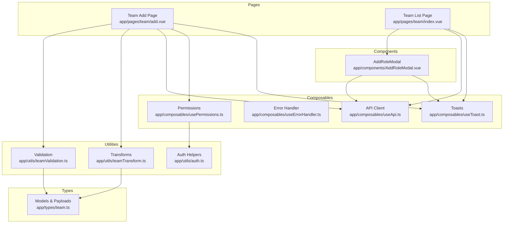
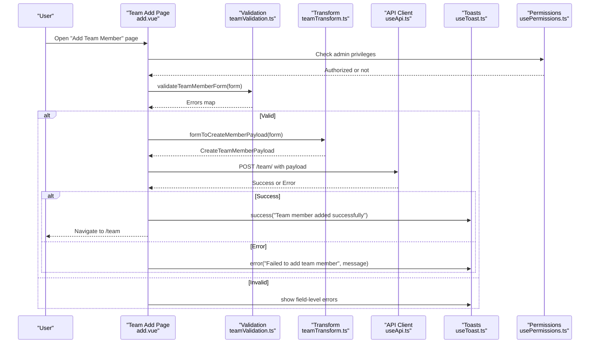
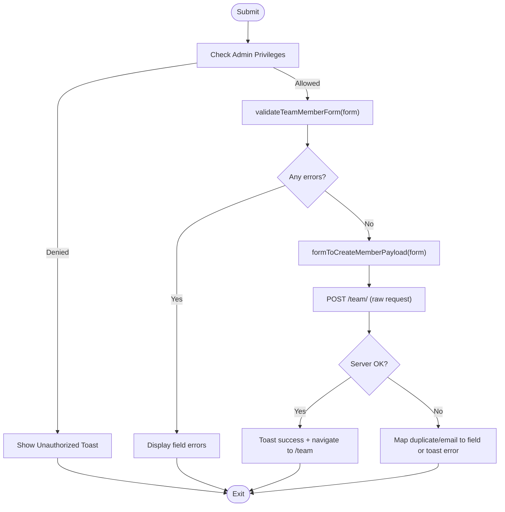
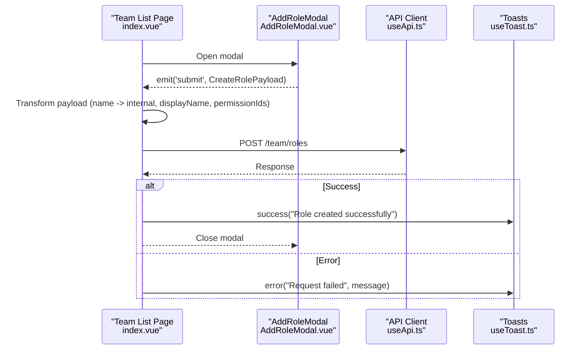
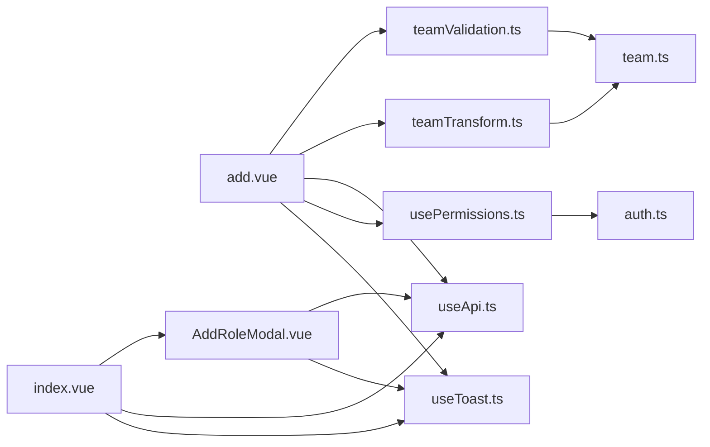

# Team Member Creation

<cite>
**Referenced Files in This Document**
- [add.vue](file://app/pages/team/add.vue)
- [index.vue](file://app/pages/team/index.vue)
- [AddRoleModal.vue](file://app/components/AddRoleModal.vue)
- [teamValidation.ts](file://app/utils/teamValidation.ts)
- [teamTransform.ts](file://app/utils/teamTransform.ts)
- [team.ts](file://app/types/team.ts)
- [useApi.ts](file://app/composables/useApi.ts)
- [usePermissions.ts](file://app/composables/usePermissions.ts)
- [auth.ts](file://app/utils/auth.ts)
- [useErrorHandler.ts](file://app/composables/useErrorHandler.ts)
- [useToast.ts](file://app/composables/useToast.ts)
</cite>

## Table of Contents
1. [Introduction](#introduction)
2. [Project Structure](#project-structure)
3. [Core Components](#core-components)
4. [Architecture Overview](#architecture-overview)
5. [Detailed Component Analysis](#detailed-component-analysis)
6. [Dependency Analysis](#dependency-analysis)
7. [Performance Considerations](#performance-considerations)
8. [Troubleshooting Guide](#troubleshooting-guide)
9. [Conclusion](#conclusion)

## Introduction
This document explains the end-to-end workflow for creating a new team member, including form validation, role assignment, permission configuration via roles, and API integration. It also documents the AddRoleModal component used to create custom roles with granular permissions, how form data is transformed into API payloads, and how errors are handled across the flow. The relationship between team members and roles is clarified, along with how permissions are inherited through roles during creation.

## Project Structure
The team member creation feature spans pages, components, utilities, types, and composables:
- Page: Team member creation form (add.vue)
- Modal: Role creation dialog (AddRoleModal.vue)
- Utilities: Validation rules and payload transformation
- Types: Shared interfaces for members, roles, permissions, and payloads
- Composables: API client, error handling, toast notifications, and permission checks
- Auth helpers: Role and permission evaluation logic



**Diagram sources**
- [add.vue:1-450](file://app/pages/team/add.vue#L1-L450)
- [index.vue:1-605](file://app/pages/team/index.vue#L1-L605)
- [AddRoleModal.vue:1-287](file://app/components/AddRoleModal.vue#L1-L287)
- [teamValidation.ts:1-122](file://app/utils/teamValidation.ts#L1-L122)
- [teamTransform.ts:1-88](file://app/utils/teamTransform.ts#L1-L88)
- [team.ts:1-65](file://app/types/team.ts#L1-L65)
- [useApi.ts:1-91](file://app/composables/useApi.ts#L1-L91)
- [useErrorHandler.ts:1-29](file://app/composables/useErrorHandler.ts#L1-L29)
- [useToast.ts:1-37](file://app/composables/useToast.ts#L1-L37)
- [usePermissions.ts:1-43](file://app/composables/usePermissions.ts#L1-L43)
- [auth.ts:1-58](file://app/utils/auth.ts#L1-L58)

**Section sources**
- [add.vue:1-450](file://app/pages/team/add.vue#L1-L450)
- [index.vue:1-605](file://app/pages/team/index.vue#L1-L605)
- [AddRoleModal.vue:1-287](file://app/components/AddRoleModal.vue#L1-L287)
- [teamValidation.ts:1-122](file://app/utils/teamValidation.ts#L1-L122)
- [teamTransform.ts:1-88](file://app/utils/teamTransform.ts#L1-L88)
- [team.ts:1-65](file://app/types/team.ts#L1-L65)
- [useApi.ts:1-91](file://app/composables/useApi.ts#L1-L91)
- [usePermissions.ts:1-43](file://app/composables/usePermissions.ts#L1-L43)
- [auth.ts:1-58](file://app/utils/auth.ts#L1-L58)
- [useErrorHandler.ts:1-29](file://app/composables/useErrorHandler.ts#L1-L29)
- [useToast.ts:1-37](file://app/composables/useToast.ts#L1-L37)

## Core Components
- Team Add Page (add.vue): Orchestrates member creation, authorization checks, validation, payload transformation, and API submission.
- AddRoleModal (AddRoleModal.vue): Allows admins to create roles by selecting permissions grouped by module; emits validated role data to parent.
- Validation (teamValidation.ts): Provides reusable validators for non-empty fields, email format, phone format, and composite form validation.
- Transform (teamTransform.ts): Converts UI forms into backend-compatible payloads (CreateTeamMemberPayload, CreateRolePayload).
- Types (team.ts): Defines shared models and payloads for members, roles, permissions, and API requests.
- API Client (useApi.ts): Centralized HTTP client with auth header injection, status handling, and typed convenience methods.
- Permissions (usePermissions.ts + auth.ts): Evaluates user privileges and role-based access control.
- Error Handling (useErrorHandler.ts + useToast.ts): Global error toasts and consistent error UX.

**Section sources**
- [add.vue:1-450](file://app/pages/team/add.vue#L1-L450)
- [AddRoleModal.vue:1-287](file://app/components/AddRoleModal.vue#L1-L287)
- [teamValidation.ts:1-122](file://app/utils/teamValidation.ts#L1-L122)
- [teamTransform.ts:1-88](file://app/utils/teamTransform.ts#L1-L88)
- [team.ts:1-65](file://app/types/team.ts#L1-L65)
- [useApi.ts:1-91](file://app/composables/useApi.ts#L1-L91)
- [usePermissions.ts:1-43](file://app/composables/usePermissions.ts#L1-L43)
- [auth.ts:1-58](file://app/utils/auth.ts#L1-L58)
- [useErrorHandler.ts:1-29](file://app/composables/useErrorHandler.ts#L1-L29)
- [useToast.ts:1-37](file://app/composables/useToast.ts#L1-L37)

## Architecture Overview
The member creation flow integrates UI, validation, transformation, and API layers with robust error handling and authorization checks.



**Diagram sources**
- [add.vue:96-151](file://app/pages/team/add.vue#L96-L151)
- [teamValidation.ts:49-99](file://app/utils/teamValidation.ts#L49-L99)
- [teamTransform.ts:10-27](file://app/utils/teamTransform.ts#L10-L27)
- [useApi.ts:9-67](file://app/composables/useApi.ts#L9-L67)
- [useToast.ts:14-36](file://app/composables/useToast.ts#L14-L36)
- [usePermissions.ts:1-43](file://app/composables/usePermissions.ts#L1-L43)

## Detailed Component Analysis

### Team Add Page (add.vue)
Responsibilities:
- Authorization: Ensures the current user has admin privileges before allowing member creation.
- Data loading: Fetches available roles from the API to populate the role selector.
- Validation: Uses centralized validation utilities to enforce required fields and formats.
- Transformation: Converts form state into a backend-compatible CreateTeamMemberPayload.
- Submission: Posts to the team endpoint using the raw request method to handle specific server-side validation errors inline.
- UX: Displays success toasts on success and contextual error messages on failure.

Key behaviors:
- On mount, checks authorization and fetches roles.
- On submit, clears previous errors, validates, transforms, and posts.
- Handles duplicate email or other server validation errors by mapping them to form fields.
- Navigates back to the team list upon successful creation.



**Diagram sources**
- [add.vue:96-151](file://app/pages/team/add.vue#L96-L151)
- [teamValidation.ts:49-99](file://app/utils/teamValidation.ts#L49-L99)
- [teamTransform.ts:10-27](file://app/utils/teamTransform.ts#L10-L27)
- [useApi.ts:9-67](file://app/composables/useApi.ts#L9-L67)

**Section sources**
- [add.vue:1-450](file://app/pages/team/add.vue#L1-L450)

### AddRoleModal (AddRoleModal.vue)
Responsibilities:
- Loads available permissions from the API and groups them by module for display.
- Provides group-level and individual permission toggles.
- Validates role name and at least one selected permission.
- Emits a CreateRolePayload to the parent for creation.

Data flow:
- On mount, fetches permissions and maps backend response to frontend Permission model.
- Maintains local form state for name, description, and selected permission IDs.
- Validates and emits submit event with transformed payload.

```mermaid
classDiagram
class AddRoleModal {
-form : {name, description, permissions[]}
-loading : boolean
-loadError : boolean
-allPermissions : Permission[]
+fetchPermissions()
+validate() bool
+submit() void
+togglePermission(id) void
+toggleGroup(group) void
+isGroupSelected(group) bool
+isGroupPartial(group) bool
}
class Permission {
+id : string
+label : string
+description : string
+module : string
}
AddRoleModal --> Permission : "uses"
```

**Diagram sources**
- [AddRoleModal.vue:1-287](file://app/components/AddRoleModal.vue#L1-L287)
- [team.ts:33-38](file://app/types/team.ts#L33-L38)

**Section sources**
- [AddRoleModal.vue:1-287](file://app/components/AddRoleModal.vue#L1-L287)

### Team List Integration (index.vue)
Responsibilities:
- Hosts the AddRoleModal and handles role creation submission.
- Transforms modal payload to backend expectations (internal name, displayName, permissionIds).
- Creates roles via API and shows success feedback.



**Diagram sources**
- [index.vue:46-90](file://app/pages/team/index.vue#L46-L90)
- [AddRoleModal.vue:1-287](file://app/components/AddRoleModal.vue#L1-L287)
- [useApi.ts:70-89](file://app/composables/useApi.ts#L70-L89)
- [useToast.ts:14-36](file://app/composables/useToast.ts#L14-L36)

**Section sources**
- [index.vue:1-605](file://app/pages/team/index.vue#L1-L605)

### Validation Rules (teamValidation.ts)
Rules implemented:
- Non-empty check for all required fields.
- Email format validation using a regex that requires @, domain part, and no spaces.
- Phone number validation ensuring 10–15 digits after stripping non-digits.
- Composite validation for both create and update contexts.

Usage:
- Called by the Team Add Page before submission.
- Returns an errors map keyed by field names for inline display.

**Section sources**
- [teamValidation.ts:1-122](file://app/utils/teamValidation.ts#L1-L122)

### Form Data Transformation (teamTransform.ts)
Patterns:
- Trimming whitespace from text fields.
- Lowercasing email addresses.
- Mapping UI field names to backend field names (e.g., phone -> phoneNumber, role -> roleId).
- For updates, only includes provided fields.

Outputs:
- CreateTeamMemberPayload for member creation.
- UpdateTeamMemberPayload for member edits.
- CreateRolePayload for role creation.

**Section sources**
- [teamTransform.ts:1-88](file://app/utils/teamTransform.ts#L1-L88)

### Types and Contracts (team.ts)
Contracts:
- TeamMember: Display model for listing and editing.
- Role: Role definition including permissions array.
- Permission: Permission metadata used in role creation UI.
- CreateTeamMemberPayload: Backend contract for adding members.
- UpdateTeamMemberPayload: Backend contract for partial updates.
- CreateRolePayload: Backend contract for creating roles.

**Section sources**
- [team.ts:1-65](file://app/types/team.ts#L1-L65)

### API Integration (useApi.ts)
Features:
- Adds Authorization header when token exists.
- Normalizes success responses (200, 201, 204).
- Throws descriptive errors for non-success statuses.
- Redirects to login on 401 and logs out the session.
- Provides convenience methods (get, post, put, patch, del) wrapped with error handling.

Integration points:
- Team Add Page uses raw request for fine-grained error mapping.
- Team List Page uses convenience methods for role operations.

**Section sources**
- [useApi.ts:1-91](file://app/composables/useApi.ts#L1-L91)

### Authorization and Permissions (usePermissions.ts + auth.ts)
Mechanics:
- Super admins implicitly have all permissions.
- Non-admin users must have explicit permissions.
- Role normalization supports case-insensitive matching and underscores.

Usage:
- Team Add Page checks team.manage or super admin before rendering and submitting.
- Team List Page gates role creation and deletion behind admin checks.

**Section sources**
- [usePermissions.ts:1-43](file://app/composables/usePermissions.ts#L1-L43)
- [auth.ts:1-58](file://app/utils/auth.ts#L1-L58)

### Error Handling Strategy (useErrorHandler.ts + useToast.ts)
Approach:
- Global error handler wraps async operations and shows toasts automatically.
- Toast system provides success/error/warning/info notifications with auto-dismiss.
- Specific flows (like member creation) may handle certain errors inline (e.g., duplicate email mapped to field).

**Section sources**
- [useErrorHandler.ts:1-29](file://app/composables/useErrorHandler.ts#L1-L29)
- [useToast.ts:1-37](file://app/composables/useToast.ts#L1-L37)

## Dependency Analysis
Relationships among core modules:



**Diagram sources**
- [add.vue:1-450](file://app/pages/team/add.vue#L1-L450)
- [index.vue:1-605](file://app/pages/team/index.vue#L1-L605)
- [AddRoleModal.vue:1-287](file://app/components/AddRoleModal.vue#L1-L287)
- [teamValidation.ts:1-122](file://app/utils/teamValidation.ts#L1-L122)
- [teamTransform.ts:1-88](file://app/utils/teamTransform.ts#L1-L88)
- [team.ts:1-65](file://app/types/team.ts#L1-L65)
- [useApi.ts:1-91](file://app/composables/useApi.ts#L1-L91)
- [usePermissions.ts:1-43](file://app/composables/usePermissions.ts#L1-L43)
- [auth.ts:1-58](file://app/utils/auth.ts#L1-L58)
- [useToast.ts:1-37](file://app/composables/useToast.ts#L1-L37)

**Section sources**
- [add.vue:1-450](file://app/pages/team/add.vue#L1-L450)
- [index.vue:1-605](file://app/pages/team/index.vue#L1-L605)
- [AddRoleModal.vue:1-287](file://app/components/AddRoleModal.vue#L1-L287)
- [teamValidation.ts:1-122](file://app/utils/teamValidation.ts#L1-L122)
- [teamTransform.ts:1-88](file://app/utils/teamTransform.ts#L1-L88)
- [team.ts:1-65](file://app/types/team.ts#L1-L65)
- [useApi.ts:1-91](file://app/composables/useApi.ts#L1-L91)
- [usePermissions.ts:1-43](file://app/composables/usePermissions.ts#L1-L43)
- [auth.ts:1-58](file://app/utils/auth.ts#L1-L58)
- [useToast.ts:1-37](file://app/composables/useToast.ts#L1-L37)

## Performance Considerations
- Defer heavy computations: Grouping permissions by module is computed and should remain efficient given typical permission counts.
- Avoid redundant network calls: Roles and permissions are fetched once per view lifecycle; consider caching if frequently revisited.
- Minimize re-renders: Keep form state minimal and avoid unnecessary reactive updates during submission.
- Use raw requests selectively: Only where server validation errors need to be mapped to fields; otherwise prefer convenience methods for cleaner code.

[No sources needed since this section provides general guidance]

## Troubleshooting Guide
Common issues and resolutions:
- Duplicate email: The member creation flow maps server duplicate email errors to the email field for inline display.
- Unauthorized access: If the user lacks team.manage or is not a super admin, a toast informs them and the operation is blocked.
- Session expired: The API client redirects to login on 401 and throws a clear message.
- Network/server errors: Non-success responses throw errors; global error handler shows toasts unless handled inline.

Operational tips:
- Verify roles are loaded before submitting; ensure GET /team/roles returns expected data.
- Confirm permission IDs are valid when creating roles; mismatched IDs will cause server-side validation failures.
- Inspect console logs around API calls for detailed diagnostics.

**Section sources**
- [add.vue:96-151](file://app/pages/team/add.vue#L96-L151)
- [useApi.ts:39-67](file://app/composables/useApi.ts#L39-L67)
- [usePermissions.ts:1-43](file://app/composables/usePermissions.ts#L1-L43)
- [useErrorHandler.ts:10-28](file://app/composables/useErrorHandler.ts#L10-L28)

## Conclusion
The team member creation workflow combines robust client-side validation, clear data transformation, secure authorization checks, and resilient API integration. Roles act as containers for permissions, which are inherited by members upon assignment. The AddRoleModal enables administrators to define precise permission sets, while the member creation page ensures only authorized users can assign roles and onboard new members. Consistent error handling and user feedback provide a smooth experience across edge cases.