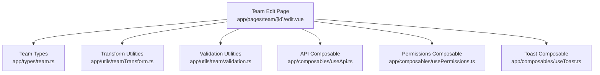
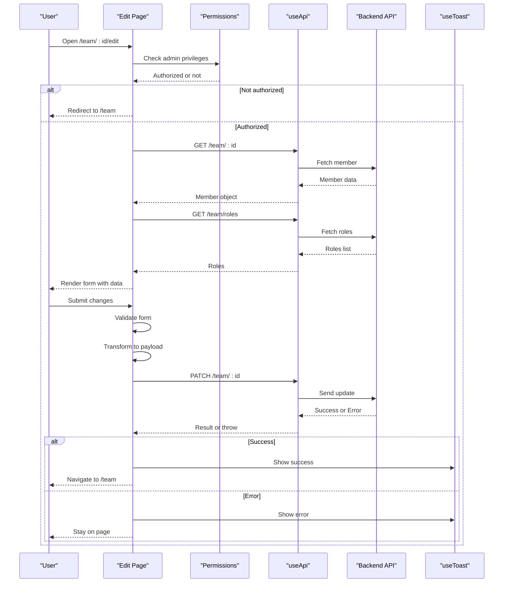
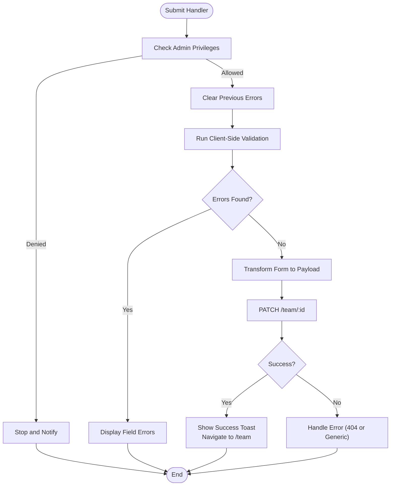
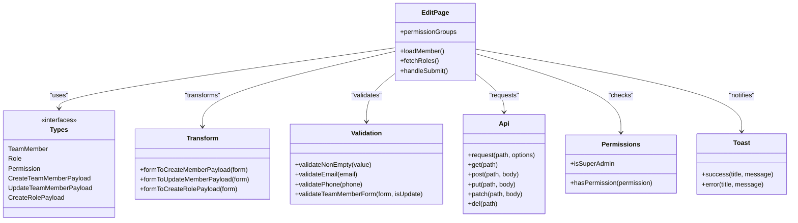

# Team Member Editing

<cite>
**Referenced Files in This Document**
- [edit.vue](file://app/pages/team/[id]/edit.vue)
- [team.ts](file://app/types/team.ts)
- [teamTransform.ts](file://app/utils/teamTransform.ts)
- [teamValidation.ts](file://app/utils/teamValidation.ts)
- [useApi.ts](file://app/composables/useApi.ts)
- [usePermissions.ts](file://app/composables/usePermissions.ts)
- [useToast.ts](file://app/composables/useToast.ts)
</cite>

## Table of Contents
1. [Introduction](#introduction)
2. [Project Structure](#project-structure)
3. [Core Components](#core-components)
4. [Architecture Overview](#architecture-overview)
5. [Detailed Component Analysis](#detailed-component-analysis)
6. [Dependency Analysis](#dependency-analysis)
7. [Performance Considerations](#performance-considerations)
8. [Troubleshooting Guide](#troubleshooting-guide)
9. [Conclusion](#conclusion)

## Introduction
This document explains the team member editing functionality, focusing on the edit page structure, data binding patterns, update workflows, and validation. It covers how existing member data is loaded and bound to the form, how changes are tracked and transformed for API updates, and how authorization and error handling are implemented. Examples include updating personal information, changing roles, and toggling status.

## Project Structure
The team member editing feature is centered around a single Nuxt page component that orchestrates loading, validation, transformation, and submission. Supporting utilities provide type definitions, validation rules, and data transformation between frontend forms and backend payloads. Composables handle API calls, permissions, and toast notifications.

**Diagram sources**
- [edit.vue:1-470](file://app/pages/team/[id]/edit.vue#L1-L470)
- [team.ts:1-65](file://app/types/team.ts#L1-L65)
- [teamTransform.ts:1-88](file://app/utils/teamTransform.ts#L1-L88)
- [teamValidation.ts:1-122](file://app/utils/teamValidation.ts#L1-L122)
- [useApi.ts:1-91](file://app/composables/useApi.ts#L1-L91)
- [usePermissions.ts:1-43](file://app/composables/usePermissions.ts#L1-L43)
- [useToast.ts:1-37](file://app/composables/useToast.ts#L1-L37)

**Section sources**
- [edit.vue:1-470](file://app/pages/team/[id]/edit.vue#L1-L470)
- [team.ts:1-65](file://app/types/team.ts#L1-L65)
- [teamTransform.ts:1-88](file://app/utils/teamTransform.ts#L1-L88)
- [teamValidation.ts:1-122](file://app/utils/teamValidation.ts#L1-L122)
- [useApi.ts:1-91](file://app/composables/useApi.ts#L1-L91)
- [usePermissions.ts:1-43](file://app/composables/usePermissions.ts#L1-L43)
- [useToast.ts:1-37](file://app/composables/useToast.ts#L1-L37)

## Core Components
- Team Edit Page: Loads member details, populates a reactive form, validates inputs, transforms data, and submits updates via PATCH. Displays read-only permissions grouped by module.
- Types: Defines interfaces for TeamMember, Role, Permission, CreateTeamMemberPayload, UpdateTeamMemberPayload, and CreateRolePayload.
- Transform Utilities: Convert form objects into API-compatible payloads, trimming whitespace and normalizing email casing; only included fields are sent for updates.
- Validation Utilities: Provide reusable validators (non-empty, email, phone) and a composite validator for the team member form with optional mode for updates.
- API Composable: Centralizes HTTP requests, attaches Authorization headers, handles 401 redirects, and throws errors for non-success responses.
- Permissions Composable: Exposes helpers to check user permissions and super-admin status.
- Toast Composable: Provides success/error/info/warning notifications.

**Section sources**
- [edit.vue:1-470](file://app/pages/team/[id]/edit.vue#L1-L470)
- [team.ts:1-65](file://app/types/team.ts#L1-L65)
- [teamTransform.ts:1-88](file://app/utils/teamTransform.ts#L1-L88)
- [teamValidation.ts:1-122](file://app/utils/teamValidation.ts#L1-L122)
- [useApi.ts:1-91](file://app/composables/useApi.ts#L1-L91)
- [usePermissions.ts:1-43](file://app/composables/usePermissions.ts#L1-L43)
- [useToast.ts:1-37](file://app/composables/useToast.ts#L1-L37)

## Architecture Overview
The edit page follows a clear flow:
- On mount, it checks authorization, loads member data and available roles, then renders the form.
- The form uses two-way data binding to keep local state in sync with UI inputs.
- On submit, it validates, transforms, and sends a PATCH request to update the member.
- Errors are handled at multiple layers: client-side validation, API response codes, and network failures.

**Diagram sources**
- [edit.vue:71-125](file://app/pages/team/[id]/edit.vue#L71-L125)
- [edit.vue:195-247](file://app/pages/team/[id]/edit.vue#L195-L247)
- [useApi.ts:9-67](file://app/composables/useApi.ts#L9-L67)
- [usePermissions.ts:1-43](file://app/composables/usePermissions.ts#L1-L43)
- [useToast.ts:14-36](file://app/composables/useToast.ts#L14-L36)

## Detailed Component Analysis

### Edit Page: Data Binding and Form Population
- Reactive form fields: firstName, lastName, email, phone, role, status.
- Permissions are read-only and displayed grouped by module derived from permission keys.
- On mount:
  - Authorization check using permissions composable.
  - Load member data via GET /team/:id and populate form fields.
  - Load roles via GET /team/roles to populate role dropdown.
- Two-way binding: v-model binds inputs to form fields; select elements bind to role and status.
- Read-only permissions: computed grouping organizes selected permissions by module; checkboxes are disabled.

Examples:
- Updating personal information: Change first name, last name, email, or phone; these map directly to form fields and are validated before submission.
- Changing role: Select a different role; this updates form.role and will be transformed to roleId in the payload.
- Toggling status: Choose active or inactive; mapped to form.status and included in the payload if changed.

**Section sources**
- [edit.vue:16-30](file://app/pages/team/[id]/edit.vue#L16-L30)
- [edit.vue:32-60](file://app/pages/team/[id]/edit.vue#L32-L60)
- [edit.vue:71-106](file://app/pages/team/[id]/edit.vue#L71-L106)
- [edit.vue:116-125](file://app/pages/team/[id]/edit.vue#L116-L125)
- [edit.vue:263-276](file://app/pages/team/[id]/edit.vue#L263-L276)
- [edit.vue:279-458](file://app/pages/team/[id]/edit.vue#L279-L458)

### Data Transformation Utilities
- formToUpdateMemberPayload: Builds an UpdateTeamMemberPayload including only provided fields; trims strings and lowercases email; maps form.role to roleId and form.phone to phoneNumber.
- formToCreateMemberPayload: Used elsewhere for creation flows; trims and normalizes fields similarly.

Key behaviors:
- Optional fields: Only present fields are included in the update payload, enabling partial updates.
- Normalization: Trimming whitespace and lowercasing emails ensures consistent data.
- Mapping: Frontend field names differ from backend expectations; transform functions bridge this gap.

**Section sources**
- [teamTransform.ts:35-70](file://app/utils/teamTransform.ts#L35-L70)
- [teamTransform.ts:10-27](file://app/utils/teamTransform.ts#L10-L27)
- [team.ts:49-56](file://app/types/team.ts#L49-L56)

### Validation Utilities
- validateNonEmpty: Ensures non-empty strings after trimming.
- validateEmail: Basic regex-based format validation.
- validatePhone: Accepts formats with 10–15 digits after removing non-digits.
- validateTeamMemberForm: Composite validator supporting create vs update modes; for updates, only provided fields are validated.

Behavior:
- For updates, empty fields are ignored unless explicitly provided.
- Returns an error map keyed by field names for UI display.

**Section sources**
- [teamValidation.ts:8-10](file://app/utils/teamValidation.ts#L8-L10)
- [teamValidation.ts:17-25](file://app/utils/teamValidation.ts#L17-L25)
- [teamValidation.ts:33-41](file://app/utils/teamValidation.ts#L33-L41)
- [teamValidation.ts:49-99](file://app/utils/teamValidation.ts#L49-L99)

### Update Workflow and Submission
- Authorization: Before submission, checks if the current user has admin privileges (super admin or team.manage).
- Validation: Runs client-side validation; displays errors inline.
- Transformation: Converts form to UpdateTeamMemberPayload.
- API call: Uses raw request to send PATCH /team/:id with JSON body.
- Error handling:
  - 404: Shows “Member not found” and navigates back to team list.
  - Other errors: Shows generic failure toast.
- Success: Shows success toast and navigates to team list.

**Diagram sources**
- [edit.vue:195-247](file://app/pages/team/[id]/edit.vue#L195-L247)
- [useApi.ts:9-67](file://app/composables/useApi.ts#L9-L67)

**Section sources**
- [edit.vue:195-247](file://app/pages/team/[id]/edit.vue#L195-L247)
- [useApi.ts:9-67](file://app/composables/useApi.ts#L9-L67)

### Permissions Display and Grouping
- Selected permissions are grouped by module extracted from permission keys.
- Each group shows a header with indeterminate/selected states based on membership selection.
- Permissions are read-only; they reflect the role’s effective permissions.

**Section sources**
- [edit.vue:32-60](file://app/pages/team/[id]/edit.vue#L32-L60)
- [edit.vue:363-401](file://app/pages/team/[id]/edit.vue#L363-L401)

### Authorization and Security Notes
- Authorization guards both page load and submission.
- Security notes inform users about invitation emails, 2FA requirements, and session expiry.

**Section sources**
- [edit.vue:155-169](file://app/pages/team/[id]/edit.vue#L155-L169)
- [edit.vue:256-260](file://app/pages/team/[id]/edit.vue#L256-L260)
- [usePermissions.ts:1-43](file://app/composables/usePermissions.ts#L1-L43)

## Dependency Analysis
The edit page depends on several modules:
- Types define contracts for members, roles, and payloads.
- Transform utilities ensure correct mapping between frontend and backend formats.
- Validation utilities enforce input correctness.
- useApi centralizes HTTP logic and error propagation.
- usePermissions enforces access control.
- useToast provides user feedback.

**Diagram sources**
- [edit.vue:1-470](file://app/pages/team/[id]/edit.vue#L1-L470)
- [team.ts:1-65](file://app/types/team.ts#L1-L65)
- [teamTransform.ts:1-88](file://app/utils/teamTransform.ts#L1-L88)
- [teamValidation.ts:1-122](file://app/utils/teamValidation.ts#L1-L122)
- [useApi.ts:1-91](file://app/composables/useApi.ts#L1-L91)
- [usePermissions.ts:1-43](file://app/composables/usePermissions.ts#L1-L43)
- [useToast.ts:1-37](file://app/composables/useToast.ts#L1-L37)

**Section sources**
- [edit.vue:1-470](file://app/pages/team/[id]/edit.vue#L1-L470)
- [team.ts:1-65](file://app/types/team.ts#L1-L65)
- [teamTransform.ts:1-88](file://app/utils/teamTransform.ts#L1-L88)
- [teamValidation.ts:1-122](file://app/utils/teamValidation.ts#L1-L122)
- [useApi.ts:1-91](file://app/composables/useApi.ts#L1-L91)
- [usePermissions.ts:1-43](file://app/composables/usePermissions.ts#L1-L43)
- [useToast.ts:1-37](file://app/composables/useToast.ts#L1-L37)

## Performance Considerations
- Parallel fetching: Member data and roles are fetched concurrently to reduce total load time.
- Minimal payload: Update payload includes only changed fields, reducing bandwidth and server processing.
- Client-side validation: Early validation prevents unnecessary network requests.
- Read-only permissions: Avoids expensive re-computation by caching computed groups and disabling interactive controls.

[No sources needed since this section provides general guidance]

## Troubleshooting Guide
Common issues and resolutions:
- Unauthorized access: If the user lacks team.manage or super-admin privileges, the page redirects or blocks operations. Ensure the user has appropriate permissions.
- Member not found: A 404 results in a “Member not found” toast and navigation back to the team list. Verify the member ID in the URL.
- Validation errors: Inline errors appear for required fields, invalid email, or invalid phone format. Correct the inputs and resubmit.
- Network or server errors: Generic error toasts indicate failures; check browser console logs for details.

Operational tips:
- Use the raw request path for custom error handling when needed.
- Confirm that the Authorization header is present; 401 triggers logout and redirect.

**Section sources**
- [edit.vue:155-169](file://app/pages/team/[id]/edit.vue#L155-L169)
- [edit.vue:234-247](file://app/pages/team/[id]/edit.vue#L234-L247)
- [useApi.ts:39-58](file://app/composables/useApi.ts#L39-L58)
- [useToast.ts:14-36](file://app/composables/useToast.ts#L14-L36)

## Conclusion
The team member editing feature provides a robust, secure, and user-friendly interface for updating member profiles. It leverages clear separation of concerns: types define contracts, utilities handle validation and transformation, composables manage API and permissions, and the page orchestrates the workflow. The design supports partial updates, comprehensive validation, and clear error feedback, making it maintainable and extensible.

[No sources needed since this section summarizes without analyzing specific files]