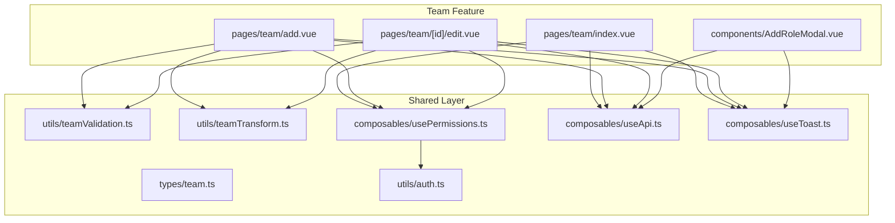
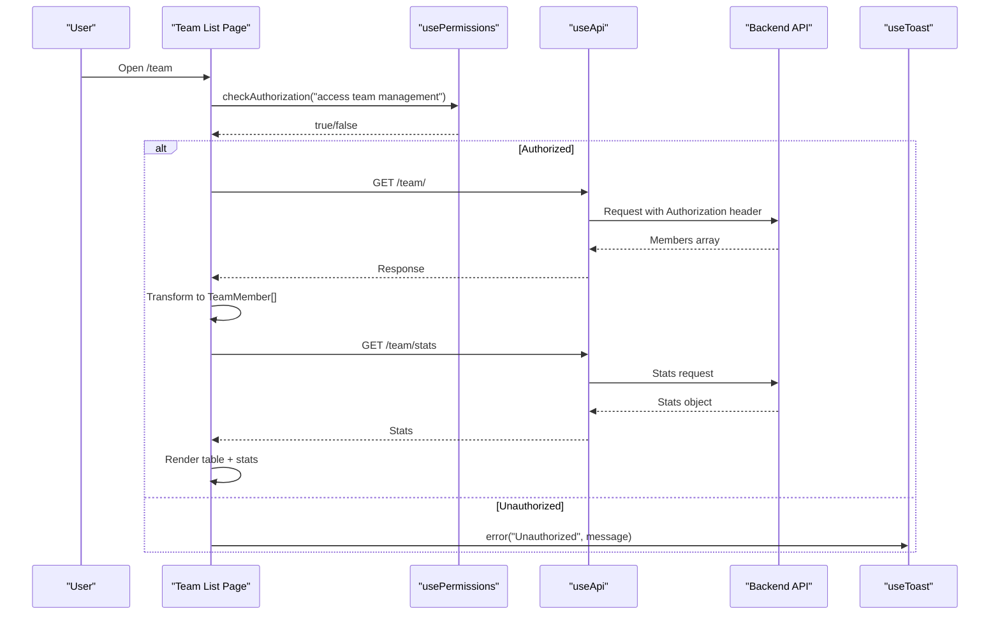
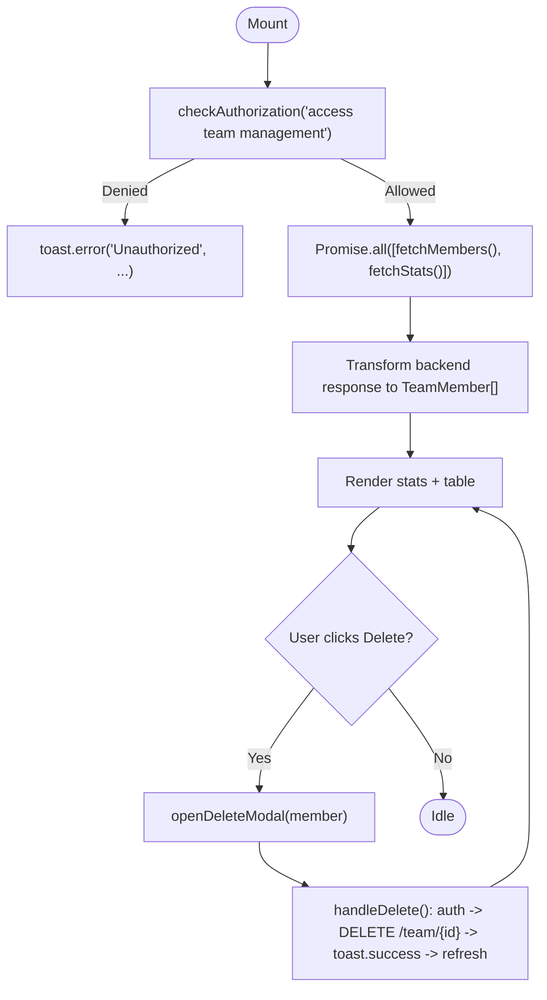
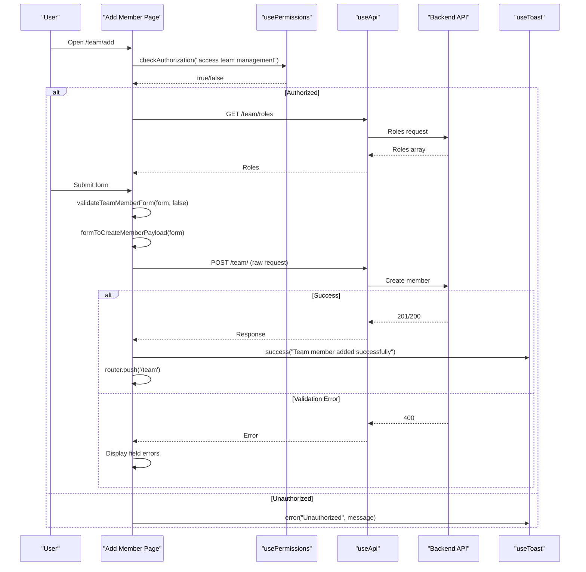
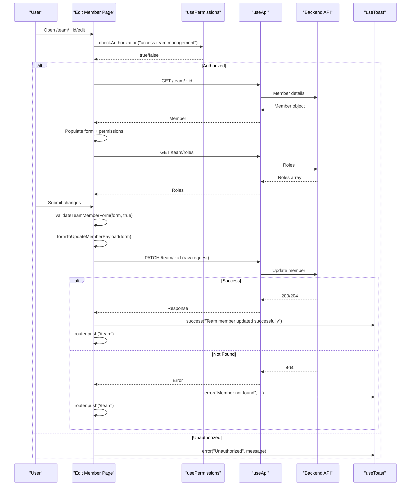
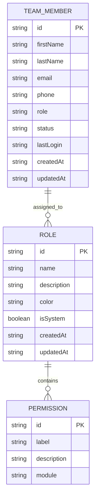
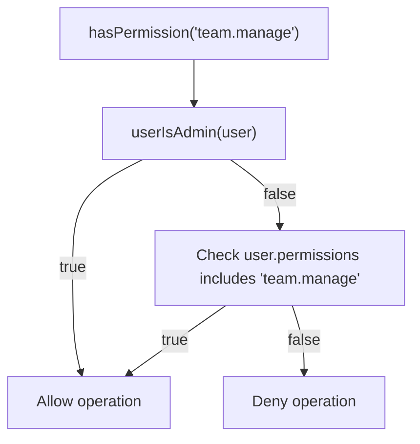
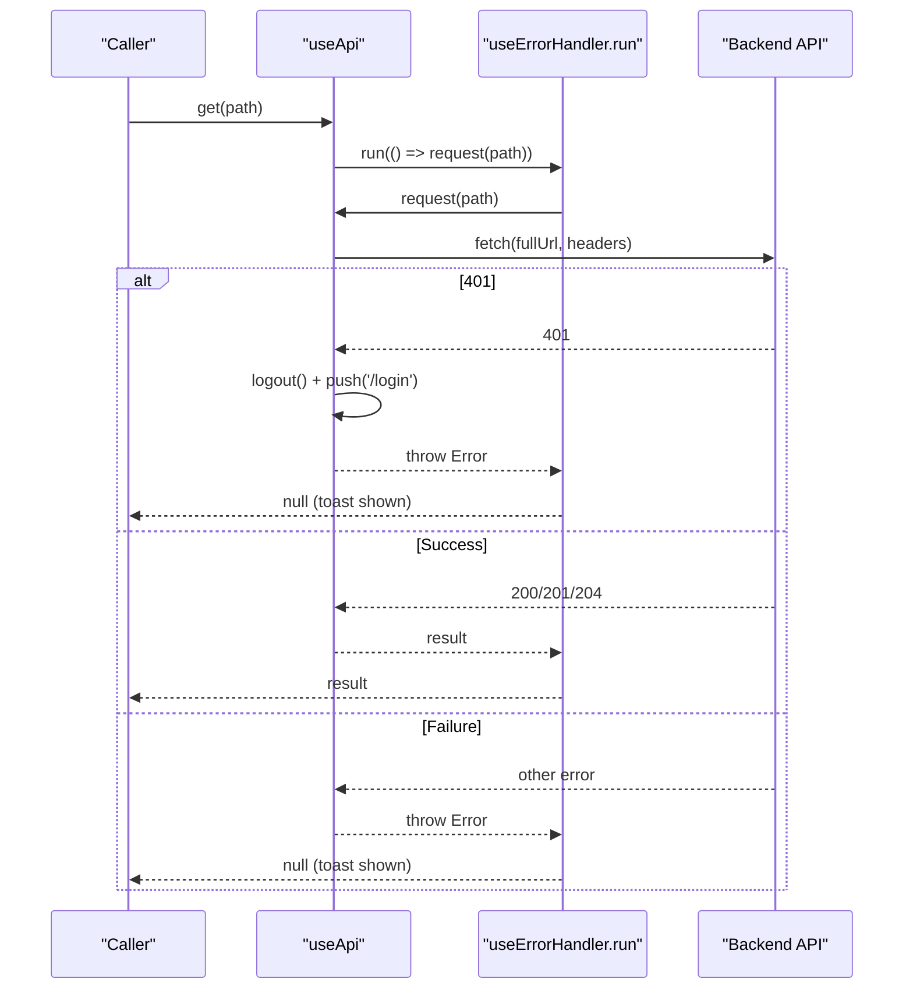
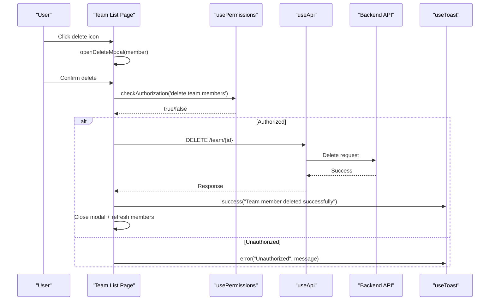
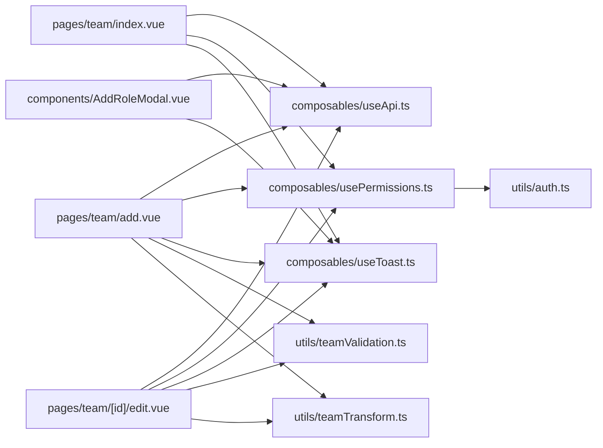

# Team Member Listing & Management

<cite>
**Referenced Files in This Document**
- [index.vue](file://app/pages/team/index.vue)
- [add.vue](file://app/pages/team/add.vue)
- [edit.vue](file://app/pages/team/[id]/edit.vue)
- [AddRoleModal.vue](file://app/components/AddRoleModal.vue)
- [team.ts](file://app/types/team.ts)
- [teamTransform.ts](file://app/utils/teamTransform.ts)
- [teamValidation.ts](file://app/utils/teamValidation.ts)
- [useApi.ts](file://app/composables/useApi.ts)
- [usePermissions.ts](file://app/composables/usePermissions.ts)
- [auth.ts](file://app/utils/auth.ts)
- [useToast.ts](file://app/composables/useToast.ts)
- [delete-member.test.ts](file://app/pages/team/__tests__/delete-member.test.ts)
- [add-member.test.ts](file://app/pages/team/__tests__/add-member.test.ts)
</cite>

## Table of Contents
1. Introduction
2. Project Structure
3. Core Components
4. Architecture Overview
5. Detailed Component Analysis
6. Dependency Analysis
7. Performance Considerations
8. Troubleshooting Guide
9. Conclusion

## Introduction
This document explains the team member listing and management interface, focusing on:
- The member table implementation and data flow
- Search and filtering capabilities (current state and recommended enhancements)
- Bulk operations (current state and recommended enhancements)
- Statistics dashboard for team metrics and role visualization
- Member deletion workflows, confirmation dialogs, and real-time updates
- Authorization checks for different operations
- Pagination handling (current state and recommendations)
- Performance optimization strategies for large member lists

## Project Structure
The team feature is implemented as a Nuxt 3 application with page components, reusable composables, utilities, and type definitions. Key files include:
- Pages: team list, add member, edit member
- Modal: Add Role modal
- Types: shared interfaces for members, roles, permissions, and payloads
- Utilities: validation and transformation helpers
- Composables: API client wrapper, permission checks, toast notifications
- Tests: unit tests for validation and delete flows



**Diagram sources**
- [index.vue](file://app/pages/team/index.vue)
- [add.vue](file://app/pages/team/add.vue)
- [edit.vue](file://app/pages/team/[id]/edit.vue)
- [AddRoleModal.vue](file://app/components/AddRoleModal.vue)
- [team.ts](file://app/types/team.ts)
- [teamValidation.ts](file://app/utils/teamValidation.ts)
- [teamTransform.ts](file://app/utils/teamTransform.ts)
- [usePermissions.ts](file://app/composables/usePermissions.ts)
- [auth.ts](file://app/utils/auth.ts)
- [useApi.ts](file://app/composables/useApi.ts)
- [useToast.ts](file://app/composables/useToast.ts)

**Section sources**
- [index.vue](file://app/pages/team/index.vue)
- [add.vue](file://app/pages/team/add.vue)
- [edit.vue](file://app/pages/team/[id]/edit.vue)
- [AddRoleModal.vue](file://app/components/AddRoleModal.vue)
- [team.ts](file://app/types/team.ts)
- [teamValidation.ts](file://app/utils/teamValidation.ts)
- [teamTransform.ts](file://app/utils/teamTransform.ts)
- [usePermissions.ts](file://app/composables/usePermissions.ts)
- [auth.ts](file://app/utils/auth.ts)
- [useApi.ts](file://app/composables/useApi.ts)
- [useToast.ts](file://app/composables/useToast.ts)

## Core Components
- Team List Page (index.vue): Displays stats cards, member table, actions (edit/delete), and an “Add Role” modal trigger. It fetches members and stats concurrently and transforms backend responses into frontend models.
- Add Member Page (add.vue): Form to create a new member with validation and payload transformation before submission.
- Edit Member Page (edit.vue): Loads existing member details, displays read-only permissions grouped by module, and updates profile fields via PATCH.
- Add Role Modal (AddRoleModal.vue): Fetches available permissions, groups them by module, and submits a new role creation request.
- Shared Types (team.ts): Defines TeamMember, Role, Permission, and payload interfaces used across pages and modals.
- Validation (teamValidation.ts): Validates required fields, email format, phone format, and role selection.
- Transformation (teamTransform.ts): Normalizes form inputs to API payloads (trimming, lowercasing emails, mapping fields).
- API Client (useApi.ts): Centralized HTTP client with auth header injection, error handling, and convenience methods (get/post/put/patch/del).
- Permissions (usePermissions.ts + auth.ts): Provides hasPermission, hasAnyPermission, hasAllPermissions, hasRole, hasAnyRole, and isSuperAdmin checks.
- Toasts (useToast.ts): Global notification system for success/error/warning/info messages.

**Section sources**
- [index.vue](file://app/pages/team/index.vue)
- [add.vue](file://app/pages/team/add.vue)
- [edit.vue](file://app/pages/team/[id]/edit.vue)
- [AddRoleModal.vue](file://app/components/AddRoleModal.vue)
- [team.ts](file://app/types/team.ts)
- [teamValidation.ts](file://app/utils/teamValidation.ts)
- [teamTransform.ts](file://app/utils/teamTransform.ts)
- [useApi.ts](file://app/composables/useApi.ts)
- [usePermissions.ts](file://app/composables/usePermissions.ts)
- [auth.ts](file://app/utils/auth.ts)
- [useToast.ts](file://app/composables/useToast.ts)

## Architecture Overview
High-level architecture shows how pages interact with the API client, permission system, and UI feedback mechanisms.



**Diagram sources**
- [index.vue](file://app/pages/team/index.vue)
- [useApi.ts](file://app/composables/useApi.ts)
- [usePermissions.ts](file://app/composables/usePermissions.ts)
- [auth.ts](file://app/utils/auth.ts)
- [useToast.ts](file://app/composables/useToast.ts)

## Detailed Component Analysis

### Team List Page (index.vue)
Responsibilities:
- Authorization gate at mount time
- Concurrent fetching of members and stats
- Data transformation from backend to TeamMember model
- Rendering stats cards and member table
- Opening delete confirmation modal and performing deletion
- Triggering Add Role modal

Key behaviors:
- Authorization: Uses hasAdminPrivileges() which combines isSuperAdmin and hasPermission('team.manage').
- Data fetching:
  - GET /team/ returns an array; mapped to TeamMember with derived firstName/lastName from user.name, role display name, status, lastLoginAt, etc.
  - GET /team/stats returns totalMembers, activeMembers, superAdmins, onlineNow.
- Delete workflow:
  - openDeleteModal(member) sets selected member and shows modal
  - handleDelete() performs authorization, sends DELETE /team/{id}, shows success toast, closes modal, refreshes members
- Real-time updates:
  - No WebSocket or polling currently; refresh occurs after successful delete.

Search and filtering:
- Not implemented in current codebase.

Bulk operations:
- Not implemented in current codebase.

Pagination:
- Not implemented; entire list is rendered.

Performance considerations:
- Skeleton loaders for initial load and stats loading states are present.
- For large datasets, consider server-side pagination and virtualization.



**Diagram sources**
- [index.vue](file://app/pages/team/index.vue)

**Section sources**
- [index.vue](file://app/pages/team/index.vue)

### Add Member Page (add.vue)
Responsibilities:
- Authorization gate
- Load roles from /team/roles
- Validate form using validateTeamMemberForm
- Transform form to CreateTeamMemberPayload via formToCreateMemberPayload
- Submit via POST /team/ using raw api.request to handle 400 errors in form
- Navigate back to /team on success

Key behaviors:
- Client-side validation enforces required fields, email format, phone format, and role selection.
- Payload normalization trims whitespace and lowercases email.
- Error handling:
  - Duplicate email or validation errors displayed inline
  - Other errors shown via toast



**Diagram sources**
- [add.vue](file://app/pages/team/add.vue)
- [teamValidation.ts](file://app/utils/teamValidation.ts)
- [teamTransform.ts](file://app/utils/teamTransform.ts)
- [useApi.ts](file://app/composables/useApi.ts)
- [usePermissions.ts](file://app/composables/usePermissions.ts)
- [useToast.ts](file://app/composables/useToast.ts)

**Section sources**
- [add.vue](file://app/pages/team/add.vue)
- [teamValidation.ts](file://app/utils/teamValidation.ts)
- [teamTransform.ts](file://app/utils/teamTransform.ts)
- [useApi.ts](file://app/composables/useApi.ts)
- [usePermissions.ts](file://app/composables/usePermissions.ts)
- [useToast.ts](file://app/composables/useToast.ts)

### Edit Member Page (edit.vue)
Responsibilities:
- Authorization gate
- Load member details from /team/{id}
- Populate form fields and read-only permissions grouped by module
- Load roles from /team/roles
- Validate partial updates using validateTeamMemberForm(form, true)
- Transform to UpdateTeamMemberPayload via formToUpdateMemberPayload
- Submit via PATCH /team/{id} using raw api.request
- Navigate back to /team on success

Key behaviors:
- Permissions are read-only and derived from the selected role.
- Partial updates only include provided fields.
- Error handling:
  - 404 not found navigates back to /team
  - Other errors show toast



**Diagram sources**
- [edit.vue](file://app/pages/team/[id]/edit.vue)
- [teamValidation.ts](file://app/utils/teamValidation.ts)
- [teamTransform.ts](file://app/utils/teamTransform.ts)
- [useApi.ts](file://app/composables/useApi.ts)
- [usePermissions.ts](file://app/composables/usePermissions.ts)
- [useToast.ts](file://app/composables/useToast.ts)

**Section sources**
- [edit.vue](file://app/pages/team/[id]/edit.vue)
- [teamValidation.ts](file://app/utils/teamValidation.ts)
- [teamTransform.ts](file://app/utils/teamTransform.ts)
- [useApi.ts](file://app/composables/useApi.ts)
- [usePermissions.ts](file://app/composables/usePermissions.ts)
- [useToast.ts](file://app/composables/useToast.ts)

### Add Role Modal (AddRoleModal.vue)
Responsibilities:
- Fetch permissions from /team/permissions
- Group permissions by module
- Allow selecting individual permissions or toggling groups
- Validate role name and at least one permission
- Emit submit event with CreateRolePayload

Key behaviors:
- Loading and error states for permissions fetch
- Group select-all/partial indicators
- Submission triggers role creation flow handled by parent

```mermaid
classDiagram
class AddRoleModal {
+props submitting? : boolean
+emits close, submit(CreateRolePayload)
-form {name, description, permissions[]}
-loading, loadError
-allPermissions Permission[]
+permissionGroups computed
+fetchPermissions()
+validate() bool
+submit()
+togglePermission(id)
+toggleGroup(group)
+isGroupSelected(group) bool
+isGroupPartial(group) bool
}
class Permission {
+string id
+string label
+string description
+string module
}
AddRoleModal --> Permission : "uses"
```

**Diagram sources**
- [AddRoleModal.vue](file://app/components/AddRoleModal.vue)
- [team.ts](file://app/types/team.ts)

**Section sources**
- [AddRoleModal.vue](file://app/components/AddRoleModal.vue)
- [team.ts](file://app/types/team.ts)

### Data Models and Utilities
- Types (team.ts):
  - TeamMember: id, names, email, phone, role, roleDetails, status, permissions, timestamps
  - Role: id, name, description, permissions, color, isSystem, timestamps
  - Permission: id, label, description, module
  - Payloads: CreateTeamMemberPayload, UpdateTeamMemberPayload, CreateRolePayload
- Validation (teamValidation.ts):
  - Non-empty checks, email regex, phone digit count, role presence
  - Differentiates create vs update validation rules
- Transformation (teamTransform.ts):
  - Trims strings, lowercases email, maps phone to phoneNumber, maps role to roleId



**Diagram sources**
- [team.ts](file://app/types/team.ts)

**Section sources**
- [team.ts](file://app/types/team.ts)
- [teamValidation.ts](file://app/utils/teamValidation.ts)
- [teamTransform.ts](file://app/utils/teamTransform.ts)

### Authorization System
- usePermissions provides:
  - hasPermission(permission)
  - hasAnyPermission(permissions[])
  - hasAllPermissions(permissions[])
  - hasRole(roleName)
  - hasAnyRole(roles[])
  - isSuperAdmin (computed)
- auth.ts implements:
  - normalizeRole(role)
  - isAdminRole(normalizedRole)
  - userIsAdmin(user)
  - getUserPermissions(user)
  - userHasPermission(user, permission)
  - userHasRole(user, roleName)



**Diagram sources**
- [usePermissions.ts](file://app/composables/usePermissions.ts)
- [auth.ts](file://app/utils/auth.ts)

**Section sources**
- [usePermissions.ts](file://app/composables/usePermissions.ts)
- [auth.ts](file://app/utils/auth.ts)

### API Client and Error Handling
- useApi:
  - Adds Authorization header if token exists
  - Handles 401 by logging out and redirecting to login
  - Treats 200/201/204 as success
  - Throws errors for non-success statuses
  - Provides get/post/put/patch/del wrappers that run through useErrorHandler
- useErrorHandler:
  - Wraps async functions, catches errors, shows toast, returns null on failure



**Diagram sources**
- [useApi.ts](file://app/composables/useApi.ts)
- [useErrorHandler.ts](file://app/composables/useErrorHandler.ts)

**Section sources**
- [useApi.ts](file://app/composables/useApi.ts)
- [useErrorHandler.ts](file://app/composables/useErrorHandler.ts)

### Member Deletion Workflow
- Triggered by clicking delete icon in table row
- Opens confirmation modal with member’s full name
- On confirm:
  - Authorization check for 'delete team members'
  - Sends DELETE /team/{id}
  - Shows success toast
  - Closes modal and refreshes member list



**Diagram sources**
- [index.vue](file://app/pages/team/index.vue)
- [usePermissions.ts](file://app/composables/usePermissions.ts)
- [useApi.ts](file://app/composables/useApi.ts)
- [useToast.ts](file://app/composables/useToast.ts)

**Section sources**
- [index.vue](file://app/pages/team/index.vue)
- [delete-member.test.ts](file://app/pages/team/__tests__/delete-member.test.ts)

## Dependency Analysis
Component relationships and imports:



**Diagram sources**
- [index.vue](file://app/pages/team/index.vue)
- [add.vue](file://app/pages/team/add.vue)
- [edit.vue](file://app/pages/team/[id]/edit.vue)
- [AddRoleModal.vue](file://app/components/AddRoleModal.vue)
- [useApi.ts](file://app/composables/useApi.ts)
- [usePermissions.ts](file://app/composables/usePermissions.ts)
- [auth.ts](file://app/utils/auth.ts)
- [useToast.ts](file://app/composables/useToast.ts)
- [teamValidation.ts](file://app/utils/teamValidation.ts)
- [teamTransform.ts](file://app/utils/teamTransform.ts)

**Section sources**
- [index.vue](file://app/pages/team/index.vue)
- [add.vue](file://app/pages/team/add.vue)
- [edit.vue](file://app/pages/team/[id]/edit.vue)
- [AddRoleModal.vue](file://app/components/AddRoleModal.vue)
- [useApi.ts](file://app/composables/useApi.ts)
- [usePermissions.ts](file://app/composables/usePermissions.ts)
- [auth.ts](file://app/utils/auth.ts)
- [useToast.ts](file://app/composables/useToast.ts)
- [teamValidation.ts](file://app/utils/teamValidation.ts)
- [teamTransform.ts](file://app/utils/teamTransform.ts)

## Performance Considerations
Current state:
- Entire member list is fetched and rendered without pagination
- Stats and members are loaded concurrently for faster initial render
- Skeleton placeholders improve perceived performance during loading

Recommendations for large member lists:
- Implement server-side pagination (page, pageSize) and query parameters for search/filter/sort
- Introduce virtual scrolling for long tables
- Debounce search input and filter logic
- Cache roles and permissions where appropriate
- Optimize rendering by memoizing computed properties and avoiding unnecessary re-renders

[No sources needed since this section provides general guidance]

## Troubleshooting Guide
Common issues and resolutions:
- 401 Unauthorized:
  - useApi automatically logs out and redirects to login when receiving 401
  - Ensure token is present and valid
- 403 Forbidden:
  - Authorization checks in pages prevent unauthorized operations
  - Verify user has team.manage permission or is super admin
- 404 Not Found:
  - Edit page handles invalid member IDs by showing a toast and navigating back to /team
- Network Errors:
  - useErrorHandler wraps API calls and shows toast errors
  - Check network connectivity and API base URL configuration

Operational tips:
- Use browser dev tools console logs to trace API requests/responses
- Inspect toast messages for detailed error information
- Validate form inputs using built-in validators before submission

**Section sources**
- [useApi.ts](file://app/composables/useApi.ts)
- [useErrorHandler.ts](file://app/composables/useErrorHandler.ts)
- [edit.vue](file://app/pages/team/[id]/edit.vue)
- [index.vue](file://app/pages/team/index.vue)

## Conclusion
The team member listing and management interface provides a solid foundation for managing members, roles, and permissions with robust authorization checks, clear error handling, and user-friendly feedback. While search, filtering, bulk operations, and pagination are not yet implemented, the modular structure and composable patterns make it straightforward to extend functionality. Recommended enhancements include server-side pagination, debounced search, virtual scrolling, and optional real-time updates via WebSockets or periodic polling.

[No sources needed since this section summarizes without analyzing specific files]