# Team Member Management

<cite>
**Referenced Files in This Document**
- [index.vue](file://app/pages/team/index.vue)
- [add.vue](file://app/pages/team/add.vue)
- [edit.vue](file://app/pages/team/[id]/edit.vue)
- [team.ts](file://app/types/team.ts)
- [auth.ts](file://app/types/auth.ts)
- [teamValidation.ts](file://app/utils/teamValidation.ts)
- [teamTransform.ts](file://app/utils/teamTransform.ts)
- [useApi.ts](file://app/composables/useApi.ts)
- [usePermissions.ts](file://app/composables/usePermissions.ts)
- [AddRoleModal.vue](file://app/components/AddRoleModal.vue)
- [useToast.ts](file://app/composables/useToast.ts)
- [add-member.test.ts](file://app/pages/team/__tests__/add-member.test.ts)
- [delete-member.test.ts](file://app/pages/team/__tests__/delete-member.test.ts)
- [team-validation-email.test.ts](file://app/utils/__tests__/team-validation-email.test.ts)
</cite>

## Table of Contents
1. [Introduction](#introduction)
2. [Project Structure](#project-structure)
3. [Core Components](#core-components)
4. [Architecture Overview](#architecture-overview)
5. [Detailed Component Analysis](#detailed-component-analysis)
6. [Dependency Analysis](#dependency-analysis)
7. [Performance Considerations](#performance-considerations)
8. [Troubleshooting Guide](#troubleshooting-guide)
9. [Conclusion](#conclusion)

## Introduction
This document explains the end-to-end team member management functionality: adding new members, editing existing profiles, and removing members. It covers the data model, form validation patterns, API integration for CRUD operations, UI components (listing, role selection, status), and how roles and permissions relate to authentication and access control.

## Project Structure
Team member management is implemented as a set of Nuxt pages with supporting utilities, composables, types, and a modal component:
- Pages: list, add, edit
- Types: shared interfaces for members, roles, permissions, and payloads
- Utils: validation and payload transformation
- Composables: HTTP client wrapper, permission checks, toast notifications
- Modal: role creation with permission selection

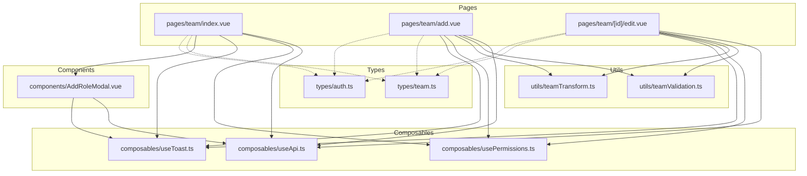

**Diagram sources**
- [index.vue:1-605](file://app/pages/team/index.vue#L1-L605)
- [add.vue:1-450](file://app/pages/team/add.vue#L1-L450)
- [edit.vue:1-470](file://app/pages/team/[id]/edit.vue#L1-L470)
- [team.ts:1-65](file://app/types/team.ts#L1-L65)
- [auth.ts:1-64](file://app/types/auth.ts#L1-L64)
- [teamValidation.ts:1-122](file://app/utils/teamValidation.ts#L1-L122)
- [teamTransform.ts:1-88](file://app/utils/teamTransform.ts#L1-L88)
- [useApi.ts:1-91](file://app/composables/useApi.ts#L1-L91)
- [usePermissions.ts:1-43](file://app/composables/usePermissions.ts#L1-L43)
- [AddRoleModal.vue:1-287](file://app/components/AddRoleModal.vue#L1-L287)
- [useToast.ts:1-37](file://app/composables/useToast.ts#L1-L37)

**Section sources**
- [index.vue:1-605](file://app/pages/team/index.vue#L1-L605)
- [add.vue:1-450](file://app/pages/team/add.vue#L1-L450)
- [edit.vue:1-470](file://app/pages/team/[id]/edit.vue#L1-L470)
- [team.ts:1-65](file://app/types/team.ts#L1-L65)
- [auth.ts:1-64](file://app/types/auth.ts#L1-L64)
- [teamValidation.ts:1-122](file://app/utils/teamValidation.ts#L1-L122)
- [teamTransform.ts:1-88](file://app/utils/teamTransform.ts#L1-L88)
- [useApi.ts:1-91](file://app/composables/useApi.ts#L1-L91)
- [usePermissions.ts:1-43](file://app/composables/usePermissions.ts#L1-L43)
- [AddRoleModal.vue:1-287](file://app/components/AddRoleModal.vue#L1-L287)
- [useToast.ts:1-37](file://app/composables/useToast.ts#L1-L37)

## Core Components
- Team listing page: displays members, stats, actions (add, edit, delete), and role creation via modal.
- Add member page: form with validation and submission to create a new member.
- Edit member page: prepopulated form to update personal details, role, and status; permissions are read-only and derived from role.
- Role creation modal: selects permissions grouped by module and submits a new role.

Key responsibilities:
- Authorization checks before rendering or performing mutations.
- Data fetching and transformation between backend responses and frontend models.
- Client-side validation and user feedback via toasts.

**Section sources**
- [index.vue:1-605](file://app/pages/team/index.vue#L1-L605)
- [add.vue:1-450](file://app/pages/team/add.vue#L1-L450)
- [edit.vue:1-470](file://app/pages/team/[id]/edit.vue#L1-L470)
- [AddRoleModal.vue:1-287](file://app/components/AddRoleModal.vue#L1-L287)

## Architecture Overview
The system follows a clear separation of concerns:
- Pages orchestrate state, authorization, and API calls.
- Utilities handle validation and payload shaping.
- Composables provide cross-cutting concerns (HTTP, permissions, toasts).
- Types define contracts for data and payloads.

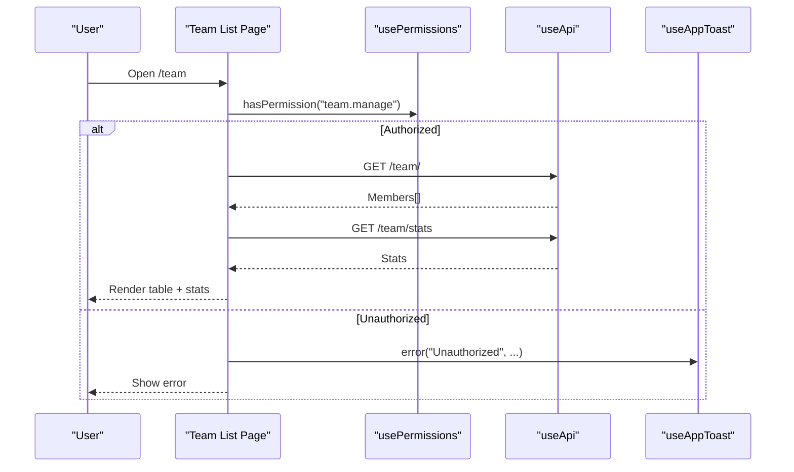

**Diagram sources**
- [index.vue:15-289](file://app/pages/team/index.vue#L15-L289)
- [usePermissions.ts:1-43](file://app/composables/usePermissions.ts#L1-L43)
- [useApi.ts:1-91](file://app/composables/useApi.ts#L1-L91)
- [useToast.ts:1-37](file://app/composables/useToast.ts#L1-L37)

## Detailed Component Analysis

### Data Model and Payloads
The core data structures define the shape of team members, roles, permissions, and API payloads.

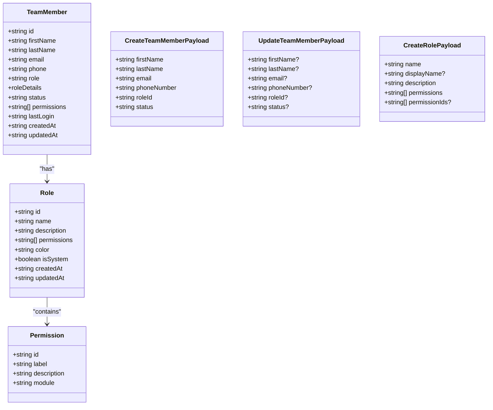

**Diagram sources**
- [team.ts:1-65](file://app/types/team.ts#L1-L65)

**Section sources**
- [team.ts:1-65](file://app/types/team.ts#L1-L65)

### Authentication and Permissions Relationship
- The current user’s identity and permissions come from the auth store and are used to gate access to team management features.
- The permission composable provides helpers to check specific permissions and super admin status.
- Auth types include both base user and augmented team member profile shapes.

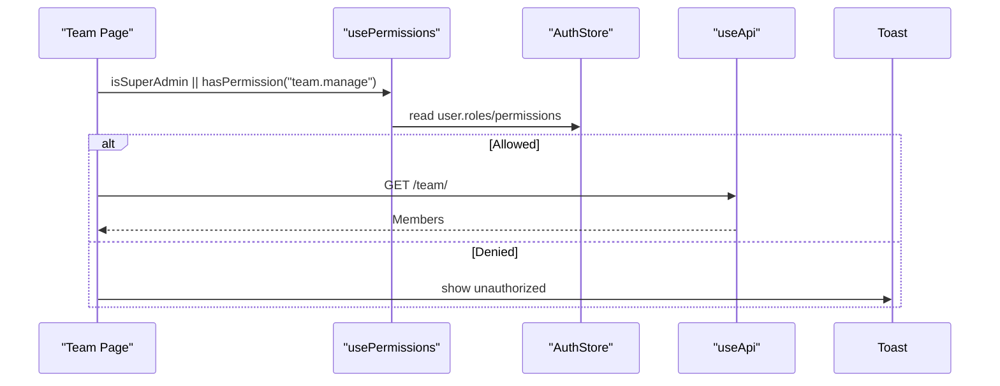

**Diagram sources**
- [usePermissions.ts:1-43](file://app/composables/usePermissions.ts#L1-L43)
- [auth.ts:1-64](file://app/types/auth.ts#L1-L64)
- [index.vue:255-289](file://app/pages/team/index.vue#L255-L289)

**Section sources**
- [usePermissions.ts:1-43](file://app/composables/usePermissions.ts#L1-L43)
- [auth.ts:1-64](file://app/types/auth.ts#L1-L64)
- [index.vue:255-289](file://app/pages/team/index.vue#L255-L289)

### Team Listing and Status Management
- Fetches members and statistics on mount after authorization checks.
- Displays a table with member initials, full name, email, role badge, status badge, last login, and action buttons.
- Provides inline delete confirmation modal and navigation to edit.

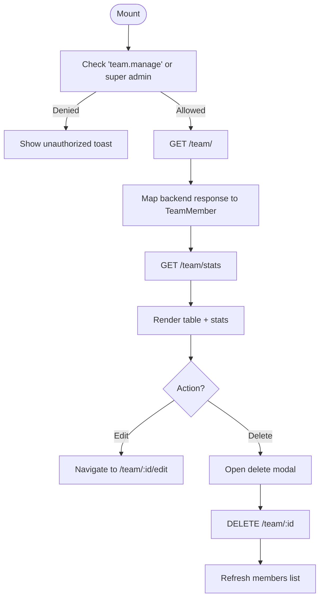

**Diagram sources**
- [index.vue:152-216](file://app/pages/team/index.vue#L152-L216)
- [index.vue:444-521](file://app/pages/team/index.vue#L444-L521)

**Section sources**
- [index.vue:1-605](file://app/pages/team/index.vue#L1-L605)

### Adding a New Team Member
- Loads available roles from the API.
- Validates form fields using centralized validators.
- Transforms form into an API-compatible payload and posts it.
- On success, shows a toast and navigates back to the team list.

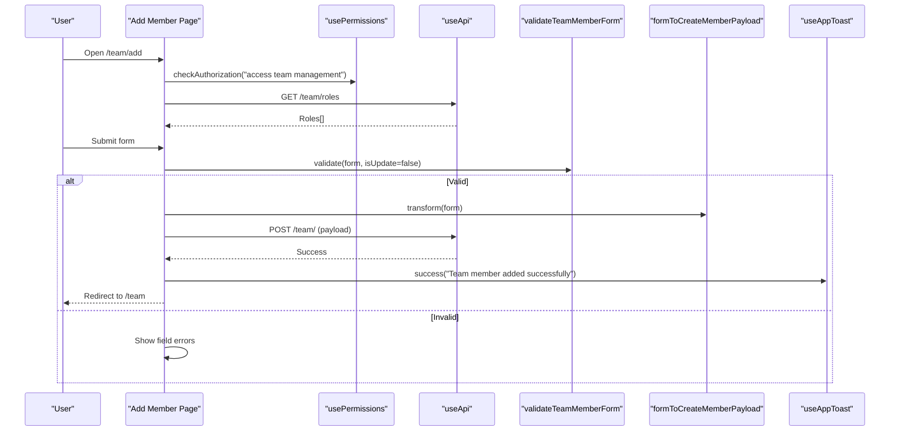

**Diagram sources**
- [add.vue:96-151](file://app/pages/team/add.vue#L96-L151)
- [teamValidation.ts:49-99](file://app/utils/teamValidation.ts#L49-L99)
- [teamTransform.ts:10-27](file://app/utils/teamTransform.ts#L10-L27)
- [useApi.ts:1-91](file://app/composables/useApi.ts#L1-L91)
- [useToast.ts:1-37](file://app/composables/useToast.ts#L1-L37)

**Section sources**
- [add.vue:1-450](file://app/pages/team/add.vue#L1-L450)
- [teamValidation.ts:1-122](file://app/utils/teamValidation.ts#L1-L122)
- [teamTransform.ts:1-88](file://app/utils/teamTransform.ts#L1-L88)
- [useApi.ts:1-91](file://app/composables/useApi.ts#L1-L91)
- [useToast.ts:1-37](file://app/composables/useToast.ts#L1-L37)

### Editing a Team Member Profile
- Loads member details and available roles concurrently.
- Populates form with first/last name split from full name, email, phone, role, and status.
- Permissions are displayed read-only and grouped by module based on the member’s permissions.
- Updates only provided fields via PATCH.

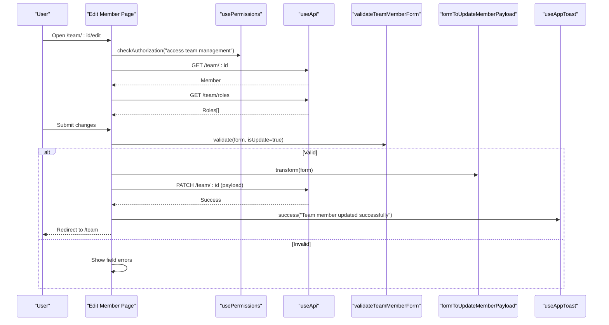

**Diagram sources**
- [edit.vue:71-126](file://app/pages/team/[id]/edit.vue#L71-L126)
- [edit.vue:195-247](file://app/pages/team/[id]/edit.vue#L195-L247)
- [teamValidation.ts:49-99](file://app/utils/teamValidation.ts#L49-L99)
- [teamTransform.ts:35-70](file://app/utils/teamTransform.ts#L35-L70)
- [useApi.ts:1-91](file://app/composables/useApi.ts#L1-L91)
- [useToast.ts:1-37](file://app/composables/useToast.ts#L1-L37)

**Section sources**
- [edit.vue:1-470](file://app/pages/team/[id]/edit.vue#L1-L470)
- [teamValidation.ts:1-122](file://app/utils/teamValidation.ts#L1-L122)
- [teamTransform.ts:1-88](file://app/utils/teamTransform.ts#L1-L88)
- [useApi.ts:1-91](file://app/composables/useApi.ts#L1-L91)
- [useToast.ts:1-37](file://app/composables/useToast.ts#L1-L37)

### Deleting a Team Member
- Opens a confirmation modal showing the member’s full name.
- Performs DELETE request and refreshes the list on success.

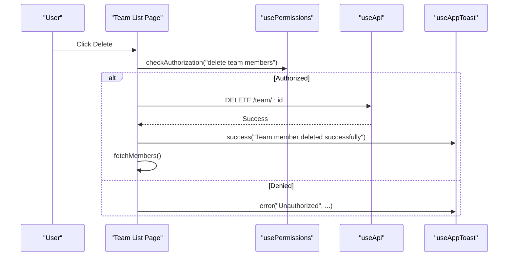

**Diagram sources**
- [index.vue:111-142](file://app/pages/team/index.vue#L111-L142)
- [usePermissions.ts:1-43](file://app/composables/usePermissions.ts#L1-L43)
- [useApi.ts:1-91](file://app/composables/useApi.ts#L1-L91)
- [useToast.ts:1-37](file://app/composables/useToast.ts#L1-L37)

**Section sources**
- [index.vue:1-605](file://app/pages/team/index.vue#L1-L605)

### Role Creation Workflow
- Opens a modal that loads all permissions grouped by module.
- Allows selecting multiple permissions per group and submitting a new role.

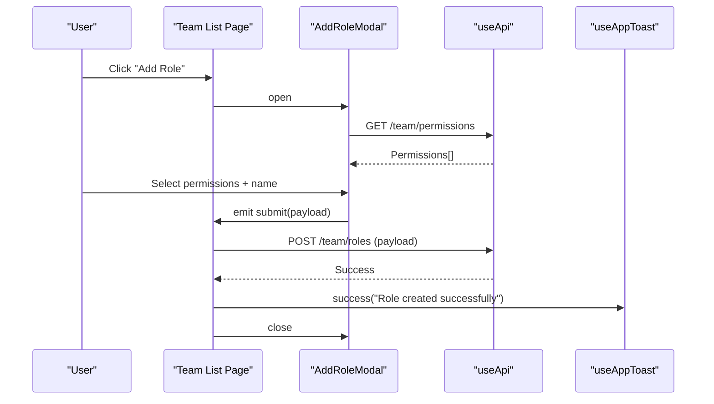

**Diagram sources**
- [index.vue:46-90](file://app/pages/team/index.vue#L46-L90)
- [AddRoleModal.vue:58-93](file://app/components/AddRoleModal.vue#L58-L93)
- [useApi.ts:1-91](file://app/composables/useApi.ts#L1-L91)
- [useToast.ts:1-37](file://app/composables/useToast.ts#L1-L37)

**Section sources**
- [index.vue:1-605](file://app/pages/team/index.vue#L1-L605)
- [AddRoleModal.vue:1-287](file://app/components/AddRoleModal.vue#L1-L287)

### Form Validation Patterns
- Centralized validators enforce non-empty fields, email format, phone format, and role selection.
- For updates, only provided fields are validated; for creates, all fields are required.
- Tests cover required fields, email format, phone format, and payload transformations.

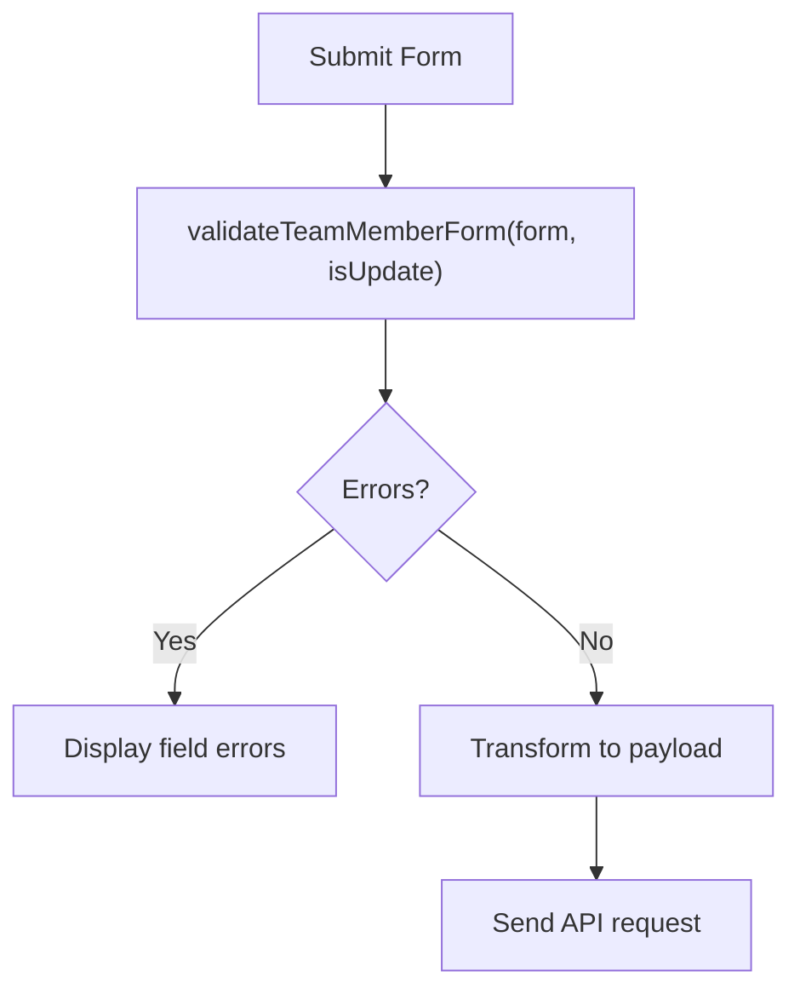

**Diagram sources**
- [teamValidation.ts:49-99](file://app/utils/teamValidation.ts#L49-L99)
- [teamTransform.ts:10-70](file://app/utils/teamTransform.ts#L10-L70)
- [add-member.test.ts:1-123](file://app/pages/team/__tests__/add-member.test.ts#L1-L123)
- [team-validation-email.test.ts:1-166](file://app/utils/__tests__/team-validation-email.test.ts#L1-L166)

**Section sources**
- [teamValidation.ts:1-122](file://app/utils/teamValidation.ts#L1-L122)
- [teamTransform.ts:1-88](file://app/utils/teamTransform.ts#L1-L88)
- [add-member.test.ts:1-123](file://app/pages/team/__tests__/add-member.test.ts#L1-L123)
- [team-validation-email.test.ts:1-166](file://app/utils/__tests__/team-validation-email.test.ts#L1-L166)

### API Integration Summary
- Base HTTP client adds Authorization header, handles 401 redirects, and normalizes success/error responses.
- Endpoints used:
  - GET /team/ — list members
  - GET /team/stats — team statistics
  - GET /team/roles — list roles
  - GET /team/:id — get member details
  - POST /team/ — create member
  - PATCH /team/:id — update member
  - DELETE /team/:id — delete member
  - GET /team/permissions — list permissions (for role creation)
  - POST /team/roles — create role

**Section sources**
- [useApi.ts:1-91](file://app/composables/useApi.ts#L1-L91)
- [index.vue:152-216](file://app/pages/team/index.vue#L152-L216)
- [add.vue:36-50](file://app/pages/team/add.vue#L36-L50)
- [edit.vue:71-126](file://app/pages/team/[id]/edit.vue#L71-L126)
- [AddRoleModal.vue:58-93](file://app/components/AddRoleModal.vue#L58-L93)

## Dependency Analysis
- Pages depend on composables for HTTP, permissions, and toasts.
- Utilities encapsulate validation and transformation logic.
- Types centralize contracts across pages and utils.
- Modal depends on permissions endpoint and emits role creation events.

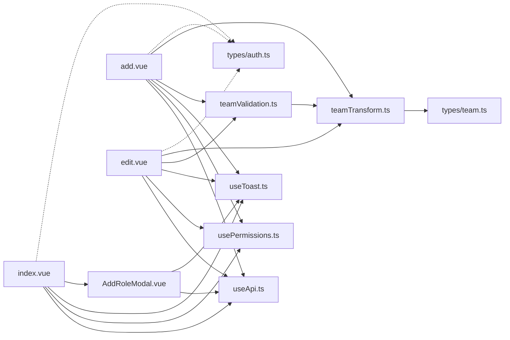

**Diagram sources**
- [index.vue:1-605](file://app/pages/team/index.vue#L1-L605)
- [add.vue:1-450](file://app/pages/team/add.vue#L1-L450)
- [edit.vue:1-470](file://app/pages/team/[id]/edit.vue#L1-L470)
- [teamValidation.ts:1-122](file://app/utils/teamValidation.ts#L1-L122)
- [teamTransform.ts:1-88](file://app/utils/teamTransform.ts#L1-L88)
- [useApi.ts:1-91](file://app/composables/useApi.ts#L1-L91)
- [usePermissions.ts:1-43](file://app/composables/usePermissions.ts#L1-L43)
- [AddRoleModal.vue:1-287](file://app/components/AddRoleModal.vue#L1-L287)
- [team.ts:1-65](file://app/types/team.ts#L1-L65)
- [auth.ts:1-64](file://app/types/auth.ts#L1-L64)

**Section sources**
- [index.vue:1-605](file://app/pages/team/index.vue#L1-L605)
- [add.vue:1-450](file://app/pages/team/add.vue#L1-L450)
- [edit.vue:1-470](file://app/pages/team/[id]/edit.vue#L1-L470)
- [teamValidation.ts:1-122](file://app/utils/teamValidation.ts#L1-L122)
- [teamTransform.ts:1-88](file://app/utils/teamTransform.ts#L1-L88)
- [useApi.ts:1-91](file://app/composables/useApi.ts#L1-L91)
- [usePermissions.ts:1-43](file://app/composables/usePermissions.ts#L1-L43)
- [AddRoleModal.vue:1-287](file://app/components/AddRoleModal.vue#L1-L287)
- [team.ts:1-65](file://app/types/team.ts#L1-L65)
- [auth.ts:1-64](file://app/types/auth.ts#L1-L64)

## Performance Considerations
- Parallel data loading: The list and edit pages load independent resources concurrently (e.g., members and stats, member and roles) to reduce perceived latency.
- Minimal re-renders: Local reactive state is updated precisely where needed; lists are refreshed only after mutations.
- Lightweight transforms: Payload transformers trim and normalize inputs once before sending requests.

[No sources needed since this section provides general guidance]

## Troubleshooting Guide
Common issues and resolutions:
- Unauthorized access: Ensure the current user has the “team.manage” permission or is a super admin. The permission checks occur before rendering and mutating data.
- Session expired: A 401 response triggers logout and redirect to login automatically.
- Duplicate email on create: The add page maps server messages indicating duplicates to a field-level error for the email input.
- Not found on edit: If the member ID is invalid, the edit page shows an error toast and redirects to the team list.
- Network failures: All HTTP wrappers log errors and surface user-friendly toasts.

Operational references:
- Authorization checks and error toasts in list, add, and edit pages.
- 401 handling and error normalization in the HTTP client.
- Field-specific error mapping for duplicate emails during creation.

**Section sources**
- [index.vue:255-289](file://app/pages/team/index.vue#L255-L289)
- [add.vue:96-151](file://app/pages/team/add.vue#L96-L151)
- [edit.vue:195-247](file://app/pages/team/[id]/edit.vue#L195-L247)
- [useApi.ts:39-67](file://app/composables/useApi.ts#L39-L67)
- [useToast.ts:1-37](file://app/composables/useToast.ts#L1-L37)

## Conclusion
The team member management feature provides a complete lifecycle for managing users within the application. It enforces robust authorization, validates inputs consistently, integrates cleanly with the backend through typed payloads, and offers clear user feedback. Roles and permissions drive access control and are surfaced appropriately in the UI, while the architecture keeps concerns separated for maintainability and testability.