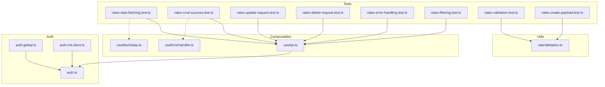
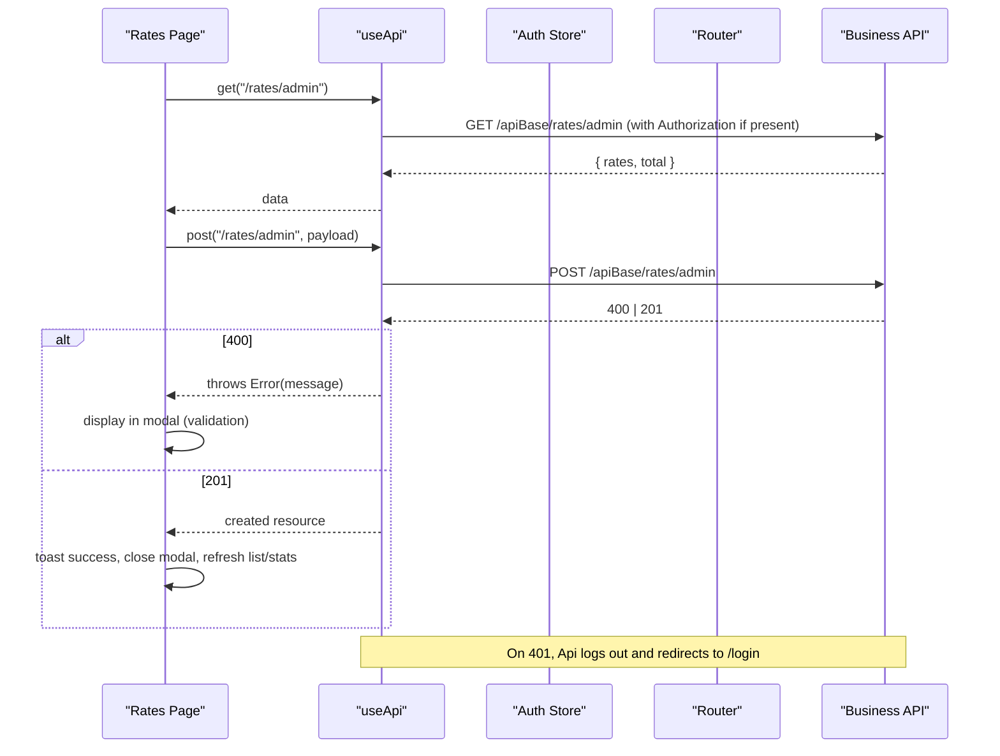
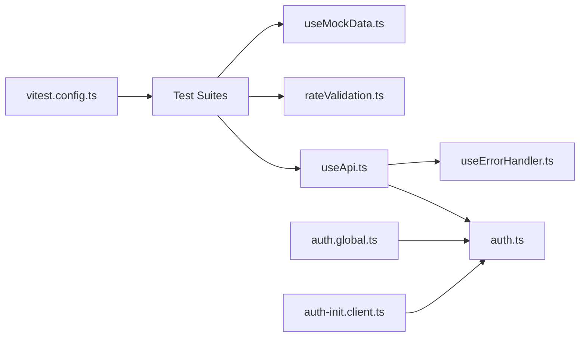

# API Integration Testing

<cite>
**Referenced Files in This Document**
- [rates-data-fetching.test.ts](file://app/pages/management/__tests__/rates-data-fetching.test.ts)
- [rates-crud-success.test.ts](file://app/pages/management/__tests__/rates-crud-success.test.ts)
- [rates-update-request.test.ts](file://app/pages/management/__tests__/rates-update-request.test.ts)
- [rates-delete-request.test.ts](file://app/pages/management/__tests__/rates-delete-request.test.ts)
- [rates-error-handling.test.ts](file://app/pages/management/__tests__/rates-error-handling.test.ts)
- [rates-filtering.test.ts](file://app/pages/management/__tests__/rates-filtering.test.ts)
- [rates-validation.test.ts](file://app/pages/management/__tests__/rates-validation.test.ts)
- [rates-create-payload.test.ts](file://app/pages/management/__tests__/rates-create-payload.test.ts)
- [useApi.ts](file://app/composables/useApi.ts)
- [useMockData.ts](file://app/composables/useMockData.ts)
- [rateValidation.ts](file://app/utils/rateValidation.ts)
- [useErrorHandler.ts](file://app/composables/useErrorHandler.ts)
- [auth.global.ts](file://app/middleware/auth.global.ts)
- [auth-init.client.ts](file://app/plugins/auth-init.client.ts)
- [auth.ts](file://app/stores/auth.ts)
- [vitest.config.ts](file://vitest.config.ts)
</cite>

## Table of Contents
1. Introduction
2. Project Structure
3. Core Components
4. Architecture Overview
5. Detailed Component Analysis
6. Dependency Analysis
7. Performance Considerations
8. Troubleshooting Guide
9. Conclusion

## Introduction
This document provides comprehensive API integration testing documentation for the rates management feature, focusing on HTTP request/response patterns, CRUD operations, error handling, and data validation. It explains how to test authentication flows, validate response schemas, and implement robust property-based tests using fast-check with Vitest. It also includes guidance for mocking HTTP clients, testing pagination/filtering, and preparing for bulk operations.

## Project Structure
The project uses Vitest with a happy-dom environment and path aliases for app imports. Tests are co-located under the page’s __tests__ directory and leverage fast-check for property-based assertions. The core API client is implemented as a composable that centralizes headers, 401 handling, and success/error normalization.

**Diagram sources**
- [vitest.config.ts:1-18](file://vitest.config.ts#L1-L18)
- [useApi.ts:1-91](file://app/composables/useApi.ts#L1-L91)
- [useMockData.ts:1-61](file://app/composables/useMockData.ts#L1-L61)
- [useErrorHandler.ts:1-29](file://app/composables/useErrorHandler.ts#L1-L29)
- [rateValidation.ts:1-69](file://app/utils/rateValidation.ts#L1-L69)
- [auth.global.ts:1-32](file://app/middleware/auth.global.ts#L1-L32)
- [auth-init.client.ts:1-24](file://app/plugins/auth-init.client.ts#L1-L24)
- [auth.ts:31-177](file://app/stores/auth.ts#L31-L177)

**Section sources**
- [vitest.config.ts:1-18](file://vitest.config.ts#L1-L18)

## Core Components
- useApi composable: Central HTTP client with automatic Authorization header injection, 401 handling (logout + redirect), success status normalization, and typed wrappers (get/post/put/patch/del). Also exposes a raw request method for custom error handling.
- useErrorHandler composable: Wraps async functions to show toast errors and return null on failure, simplifying caller logic.
- rateValidation utilities: Form validation and payload transformation for create/update flows.
- Mock reference data: Shared static arrays for dropdowns and reference lists used by UI and tests.
- Auth middleware and plugin: Route-level guards and session checks; global auth initialization.

Key responsibilities:
- Authentication flow: Attach Bearer token, handle 401 by logging out and redirecting.
- Error handling: Normalize non-2xx responses into user-friendly messages; route validation errors to modal vs toast based on operation type.
- Data fetching: Typed helpers for GET endpoints; consistent error reporting via useErrorHandler.

**Section sources**
- [useApi.ts:1-91](file://app/composables/useApi.ts#L1-L91)
- [useErrorHandler.ts:1-29](file://app/composables/useErrorHandler.ts#L1-L29)
- [rateValidation.ts:1-69](file://app/utils/rateValidation.ts#L1-L69)
- [useMockData.ts:1-61](file://app/composables/useMockData.ts#L1-L61)
- [auth.global.ts:1-32](file://app/middleware/auth.global.ts#L1-L32)
- [auth-init.client.ts:1-24](file://app/plugins/auth-init.client.ts#L1-L24)
- [auth.ts:31-177](file://app/stores/auth.ts#L31-L177)

## Architecture Overview
The integration layer centers around useApi, which standardizes requests and error behavior. Pages call useApi methods to fetch or mutate data. Validation utilities ensure payloads conform to server expectations before sending. Middleware ensures authenticated access and redirects on invalid sessions.

**Diagram sources**
- [useApi.ts:1-91](file://app/composables/useApi.ts#L1-L91)
- [auth.global.ts:1-32](file://app/middleware/auth.global.ts#L1-L32)
- [auth-init.client.ts:1-24](file://app/plugins/auth-init.client.ts#L1-L24)

## Detailed Component Analysis

### HTTP Client and Authentication Flow
- Header injection: Adds Content-Type and Authorization when token exists.
- Success criteria: Treats 200, 201, 204 as success; otherwise extracts message from JSON body or returns generic text.
- 401 handling: Logs out and redirects to login; throws a descriptive error.
- Wrapper methods: get/post/put/patch/del wrap request with default titles and use run() to surface errors via toast.

Testing implications:
- Verify Authorization header presence/absence based on token state.
- Assert 401 triggers logout and navigation.
- Validate non-2xx responses throw normalized errors.
- Confirm wrapper methods return null on failure due to run().

**Section sources**
- [useApi.ts:1-91](file://app/composables/useApi.ts#L1-L91)
- [auth.global.ts:1-32](file://app/middleware/auth.global.ts#L1-L32)
- [auth-init.client.ts:1-24](file://app/plugins/auth-init.client.ts#L1-L24)
- [auth.ts:31-177](file://app/stores/auth.ts#L31-L177)

### Create Rate Payload and Validation
- Validation rules: Required customer type (for add), required estimated quantity, positive pickup rate, effective date required.
- Transformation: Maps form fields to API payload, converts strings to numbers where needed, trims note, preserves booleans and ISO dates.

Testing patterns:
- Property-based generation of valid/invalid forms.
- Assertions on payload shape, types, and transformations.
- Ensure validation prevents API calls and surfaces first error.

**Section sources**
- [rateValidation.ts:1-69](file://app/utils/rateValidation.ts#L1-L69)
- [rates-create-payload.test.ts:1-194](file://app/pages/management/__tests__/rates-create-payload.test.ts#L1-L194)
- [rates-validation.test.ts:1-427](file://app/pages/management/__tests__/rates-validation.test.ts#L1-L427)

### Update Rate Request Structure
- Endpoint pattern: PATCH /api/rates/admin/payg/{id} (as validated by tests).
- Payload: Only mutable fields included; note trimmed; correct types maintained.

Testing patterns:
- Generate random IDs and payloads; assert endpoint structure and payload keys/types.
- Ensure immutable fields are excluded.

**Section sources**
- [rates-update-request.test.ts:1-188](file://app/pages/management/__tests__/rates-update-request.test.ts#L1-L188)

### Delete Rate Request Structure
- Endpoint pattern: DELETE /api/rates/admin/payg/{id}.
- No request body; ID embedded in URL.

Testing patterns:
- Random ID generation; assert path segments and integrity.
- Confirm no body is expected for delete.

**Section sources**
- [rates-delete-request.test.ts:1-130](file://app/pages/management/__tests__/rates-delete-request.test.ts#L1-L130)

### CRUD Success Flow
- Post-operation UX: Show success toast, close modal, refresh relevant data (list and/or stats depending on operation).
- Operation-specific behaviors: Update refreshes list only; create/delete refresh both list and stats.

Testing patterns:
- Property-based simulation of success responses across operations.
- Assertions on toast messages, modal closure, and data refresh flags.

**Section sources**
- [rates-crud-success.test.ts:1-450](file://app/pages/management/__tests__/rates-crud-success.test.ts#L1-L450)

### Error Handling Scenarios
- 401: Redirect to login.
- 400 validation errors on form submissions: Display in modal.
- Other 400/403/404/500/network: Display as toast via error handler.

Testing patterns:
- Enumerate statuses and operation types; assert exactly one handling path is taken.
- Validate message preservation and special-case 401 redirection.

**Section sources**
- [rates-error-handling.test.ts:1-433](file://app/pages/management/__tests__/rates-error-handling.test.ts#L1-L433)
- [useErrorHandler.ts:1-29](file://app/composables/useErrorHandler.ts#L1-L29)

### Data Fetching and Rendering Completeness
- Statistics rendering completeness: All metrics present and values match inputs.
- Rate data rendering completeness: All required fields present and values preserved.
- Customer type dropdown population: Correct mapping from source to options.
- Customer type display in rate list: Name and color correctly associated.

Testing patterns:
- Fast-check arbitraries for stats, rates, and customer types.
- Assertions on field presence, value equality, and empty-state handling.

**Section sources**
- [rates-data-fetching.test.ts:1-277](file://app/pages/management/__tests__/rates-data-fetching.test.ts#L1-L277)

### Filtering and Status Computation
- Customer type filter: Returns subset matching selected type or all when “all”.
- Status filter: Computes active/upcoming/inactive based on isActive and effectiveDate.
- Combined filters: Intersection of type and status filters; counts match expected.

Testing patterns:
- Property-based filtering functions and assertions on result sets and counts.
- Edge cases: Non-existent IDs, empty datasets, boundary dates.

**Section sources**
- [rates-filtering.test.ts:1-444](file://app/pages/management/__tests__/rates-filtering.test.ts#L1-L444)

### Mocking HTTP Clients and Reference Data
- useMockData provides shared static arrays for zones, trucks, customer types, and subscription plans.
- For API mocking in tests, prefer intercepting fetch or replacing useApi.request with a stub returning controlled responses.

Recommended approach:
- Stub useApi.request to return deterministic payloads for each scenario.
- Use useMockData for dropdown/reference data without network dependencies.

**Section sources**
- [useMockData.ts:1-61](file://app/composables/useMockData.ts#L1-L61)
- [useApi.ts:1-91](file://app/composables/useApi.ts#L1-L91)

### Validating Response Schemas
- Enforce presence of required fields in responses (e.g., stats object fields, rate fields).
- Use property-based tests to assert schema invariants across many generated samples.

Example patterns:
- Check toHaveProperty for all required keys.
- Validate types and formats (e.g., ISO date strings).

**Section sources**
- [rates-data-fetching.test.ts:1-277](file://app/pages/management/__tests__/rates-data-fetching.test.ts#L1-L277)
- [rates-create-payload.test.ts:1-194](file://app/pages/management/__tests__/rates-create-payload.test.ts#L1-L194)

### Pagination, Filtering, and Bulk Operations
- Pagination: Current tests focus on filtering and counts; extend by asserting page size, offset, and total counts when endpoints support them.
- Filtering: Already covered by property-based tests for type and status filters.
- Bulk operations: Not currently tested; propose adding batch endpoints and corresponding tests for success and partial failures.

[No sources needed since this section provides general guidance]

## Dependency Analysis

**Diagram sources**
- [vitest.config.ts:1-18](file://vitest.config.ts#L1-L18)
- [useApi.ts:1-91](file://app/composables/useApi.ts#L1-L91)
- [rateValidation.ts:1-69](file://app/utils/rateValidation.ts#L1-L69)
- [useMockData.ts:1-61](file://app/composables/useMockData.ts#L1-L61)
- [useErrorHandler.ts:1-29](file://app/composables/useErrorHandler.ts#L1-L29)
- [auth.global.ts:1-32](file://app/middleware/auth.global.ts#L1-L32)
- [auth-init.client.ts:1-24](file://app/plugins/auth-init.client.ts#L1-L24)
- [auth.ts:31-177](file://app/stores/auth.ts#L31-L177)

**Section sources**
- [vitest.config.ts:1-18](file://vitest.config.ts#L1-L18)

## Performance Considerations
- Prefer property-based tests with bounded ranges to keep execution time predictable.
- Avoid heavy DOM interactions in unit-style tests; isolate business logic and API contracts.
- Batch independent assertions and reuse arbitraries to reduce duplication.

[No sources needed since this section provides general guidance]

## Troubleshooting Guide
Common issues and resolutions:
- 401 redirects not occurring: Ensure useApi handles 401 and router push is invoked; verify auth store logout clears token.
- Validation errors not shown in modal: Confirm form submission catches thrown errors and inspects message keywords to decide modal vs toast.
- Toasts not appearing: Verify useErrorHandler.run wraps async calls and that callers check for null returns.
- Incorrect payload types: Double-check formToApiPayload mappings and number conversions; ensure notes are trimmed and dates remain ISO format.

**Section sources**
- [useApi.ts:1-91](file://app/composables/useApi.ts#L1-L91)
- [useErrorHandler.ts:1-29](file://app/composables/useErrorHandler.ts#L1-L29)
- [rateValidation.ts:1-69](file://app/utils/rateValidation.ts#L1-L69)
- [rates-error-handling.test.ts:1-433](file://app/pages/management/__tests__/rates-error-handling.test.ts#L1-L433)

## Conclusion
The rates management integration tests comprehensively cover data fetching, CRUD success flows, update/delete request structures, error handling, validation, and filtering. By leveraging property-based testing with fast-check and a centralized API client, the suite ensures robustness against varied inputs and edge cases. Extending these patterns to pagination and bulk operations will further strengthen confidence in the system’s reliability.