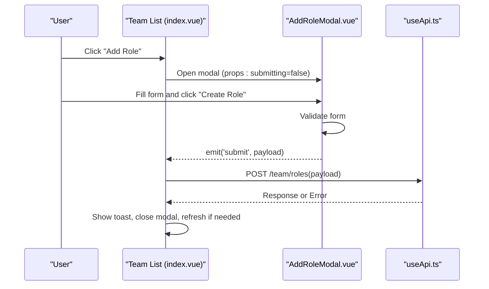
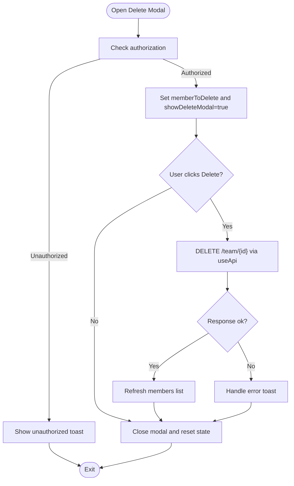
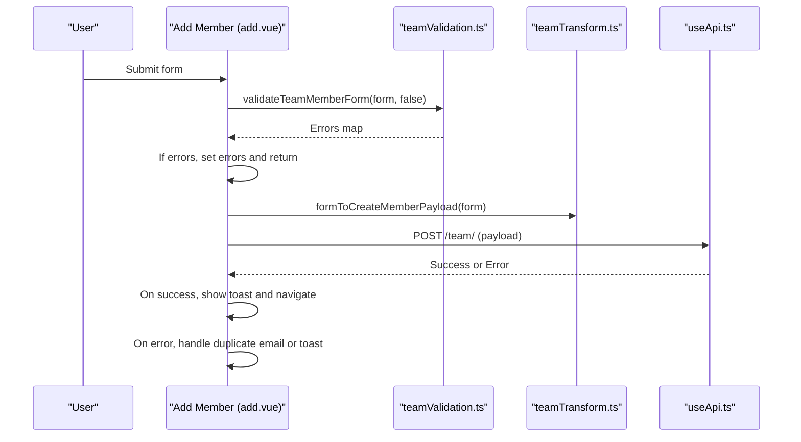
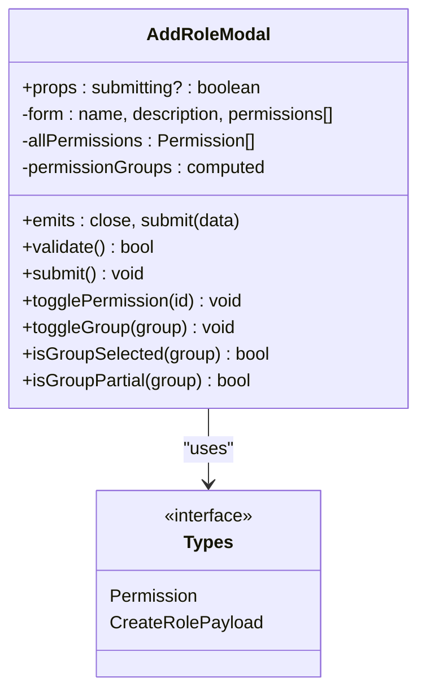
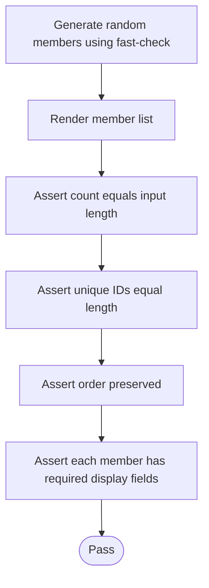
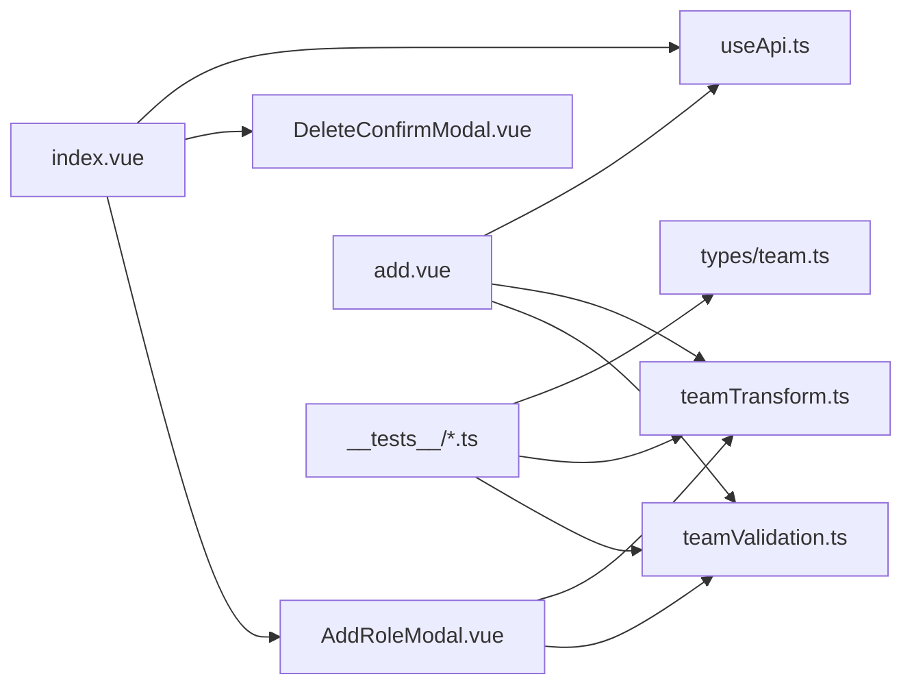

# Component Testing

<cite>
**Referenced Files in This Document**
- [index.vue](file://app/pages/team/index.vue)
- [add.vue](file://app/pages/team/add.vue)
- [AddRoleModal.vue](file://app/components/AddRoleModal.vue)
- [DeleteConfirmModal.vue](file://app/components/DeleteConfirmModal.vue)
- [team.ts](file://app/types/team.ts)
- [teamValidation.ts](file://app/utils/teamValidation.ts)
- [teamTransform.ts](file://app/utils/teamTransform.ts)
- [useApi.ts](file://app/composables/useApi.ts)
- [vitest.config.ts](file://vitest.config.ts)
- [package.json](file://package.json)
- [add-member.test.ts](file://app/pages/team/__tests__/add-member.test.ts)
- [add-role.test.ts](file://app/pages/team/__tests__/add-role.test.ts)
- [delete-member.test.ts](file://app/pages/team/__tests__/delete-member.test.ts)
- [team-list-property.test.ts](file://app/pages/team/__tests__/team-list-property.test.ts)
</cite>

## Table of Contents
1. [Introduction](#introduction)
2. [Project Structure](#project-structure)
3. [Core Components](#core-components)
4. [Architecture Overview](#architecture-overview)
5. [Detailed Component Analysis](#detailed-component-analysis)
6. [Dependency Analysis](#dependency-analysis)
7. [Performance Considerations](#performance-considerations)
8. [Troubleshooting Guide](#troubleshooting-guide)
9. [Conclusion](#conclusion)
10. [Appendices](#appendices)

## Introduction
This document provides a comprehensive guide to component testing for Vue-based team management features, focusing on member addition, role assignment, and deletion workflows. It explains how to mount components, simulate events, test props, verify reactive state, and assert UI behavior for modals, forms, and reactive updates. The guidance is grounded in the existing codebase and tests, with concrete references to source files and line ranges.

## Project Structure
The team management feature spans pages, reusable modals, utilities, types, composables, and tests:
- Pages: Team list and add member form
- Modals: Add role and delete confirmation
- Utilities: Validation and data transformation
- Types: Shared interfaces for members, roles, permissions, and payloads
- Composables: API client wrapper with error handling
- Tests: Unit and property-based tests for validation, transformation, and rendering properties

```mermaid
graph TB
subgraph "Pages"
TList["Team List (index.vue)"]
TAdd["Add Member (add.vue)"]
end
subgraph "Components"
RoleModal["AddRoleModal.vue"]
DelModal["DeleteConfirmModal.vue"]
end
subgraph "Utilities"
VUtils["teamValidation.ts"]
TUtils["teamTransform.ts"]
end
subgraph "Types"
Types["types/team.ts"]
end
subgraph "Composables"
Api["useApi.ts"]
end
subgraph "Tests"
TMTest["add-member.test.ts"]
TRTest["add-role.test.ts"]
TDTest["delete-member.test.ts"]
TLProp["team-list-property.test.ts"]
end
TList --> RoleModal
TList --> DelModal
TAdd --> VUtils
TAdd --> TUtils
RoleModal --> VUtils
RoleModal --> TUtils
TList --> Api
TAdd --> Api
TMTest --> VUtils
TMTest --> TUtils
TRTest --> VUtils
TRTest --> TUtils
TLProp --> Types
```

**Diagram sources**
- [index.vue:1-605](file://app/pages/team/index.vue#L1-L605)
- [add.vue:1-450](file://app/pages/team/add.vue#L1-L450)
- [AddRoleModal.vue:1-287](file://app/components/AddRoleModal.vue#L1-L287)
- [DeleteConfirmModal.vue:1-39](file://app/components/DeleteConfirmModal.vue#L1-L39)
- [teamValidation.ts:1-122](file://app/utils/teamValidation.ts#L1-L122)
- [teamTransform.ts:1-88](file://app/utils/teamTransform.ts#L1-L88)
- [team.ts:1-65](file://app/types/team.ts#L1-L65)
- [useApi.ts:1-91](file://app/composables/useApi.ts#L1-L91)
- [add-member.test.ts:1-123](file://app/pages/team/__tests__/add-member.test.ts#L1-L123)
- [add-role.test.ts:1-107](file://app/pages/team/__tests__/add-role.test.ts#L1-L107)
- [delete-member.test.ts:1-96](file://app/pages/team/__tests__/delete-member.test.ts#L1-L96)
- [team-list-property.test.ts:1-242](file://app/pages/team/__tests__/team-list-property.test.ts#L1-L242)

**Section sources**
- [index.vue:1-605](file://app/pages/team/index.vue#L1-L605)
- [add.vue:1-450](file://app/pages/team/add.vue#L1-L450)
- [AddRoleModal.vue:1-287](file://app/components/AddRoleModal.vue#L1-L287)
- [DeleteConfirmModal.vue:1-39](file://app/components/DeleteConfirmModal.vue#L1-L39)
- [teamValidation.ts:1-122](file://app/utils/teamValidation.ts#L1-L122)
- [teamTransform.ts:1-88](file://app/utils/teamTransform.ts#L1-L88)
- [team.ts:1-65](file://app/types/team.ts#L1-L65)
- [useApi.ts:1-91](file://app/composables/useApi.ts#L1-L91)
- [add-member.test.ts:1-123](file://app/pages/team/__tests__/add-member.test.ts#L1-L123)
- [add-role.test.ts:1-107](file://app/pages/team/__tests__/add-role.test.ts#L1-L107)
- [delete-member.test.ts:1-96](file://app/pages/team/__tests__/delete-member.test.ts#L1-L96)
- [team-list-property.test.ts:1-242](file://app/pages/team/__tests__/team-list-property.test.ts#L1-L242)

## Core Components
- Team List page: Displays members, stats, and actions; opens modals for adding roles and deleting members; fetches data on mount.
- Add Member page: Presents a form with validation and transforms data before submission; navigates on success.
- Add Role Modal: Loads permissions, groups them by module, validates selection, and emits submit/close events.
- Delete Confirmation Modal: Simple modal that emits close/confirm events.
- Utilities: Validation functions for team member and role forms; payload transformers for create/update operations.
- Types: Shared interfaces for members, roles, permissions, and payloads.
- API Composable: Centralized HTTP client with auth headers, error handling, and convenience methods.

Key testing targets:
- Form validation and transformation logic
- Modal interactions (open/close, submit, cancel)
- Reactive state changes (loading, submitting, errors)
- Event emission and prop-driven behavior
- Property-based assertions for rendering completeness

**Section sources**
- [index.vue:1-605](file://app/pages/team/index.vue#L1-L605)
- [add.vue:1-450](file://app/pages/team/add.vue#L1-L450)
- [AddRoleModal.vue:1-287](file://app/components/AddRoleModal.vue#L1-L287)
- [DeleteConfirmModal.vue:1-39](file://app/components/DeleteConfirmModal.vue#L1-L39)
- [teamValidation.ts:1-122](file://app/utils/teamValidation.ts#L1-L122)
- [teamTransform.ts:1-88](file://app/utils/teamTransform.ts#L1-L88)
- [team.ts:1-65](file://app/types/team.ts#L1-L65)
- [useApi.ts:1-91](file://app/composables/useApi.ts#L1-L91)

## Architecture Overview
The team management flows involve user interactions triggering composable calls and emitting events between parent pages and child modals.



**Diagram sources**
- [index.vue:46-90](file://app/pages/team/index.vue#L46-L90)
- [AddRoleModal.vue:95-107](file://app/components/AddRoleModal.vue#L95-L107)
- [useApi.ts:73-74](file://app/composables/useApi.ts#L73-L74)

**Section sources**
- [index.vue:46-90](file://app/pages/team/index.vue#L46-L90)
- [AddRoleModal.vue:95-107](file://app/components/AddRoleModal.vue#L95-L107)
- [useApi.ts:73-74](file://app/composables/useApi.ts#L73-L74)

## Detailed Component Analysis

### Team List Page (Member Deletion Workflow)
Focus areas for testing:
- Mounting and initial data fetching
- Opening/closing delete confirmation modal
- Authorization checks and error toasts
- Deleting a member and refreshing the list
- Reactive states (deleting, showDeleteModal, memberToDelete)



**Diagram sources**
- [index.vue:95-142](file://app/pages/team/index.vue#L95-L142)
- [index.vue:263-270](file://app/pages/team/index.vue#L263-L270)
- [useApi.ts:79-80](file://app/composables/useApi.ts#L79-L80)

Testing patterns:
- Mount the page and assert initial loading states
- Simulate clicking delete button and assert modal visibility
- Emit confirm event and assert API call path construction
- Assert list refresh after successful deletion
- Verify buttons disabled during deletion

**Section sources**
- [index.vue:95-142](file://app/pages/team/index.vue#L95-L142)
- [index.vue:263-270](file://app/pages/team/index.vue#L263-L270)
- [delete-member.test.ts:1-96](file://app/pages/team/__tests__/delete-member.test.ts#L1-L96)

### Add Member Page (Form Submission and Navigation)
Focus areas for testing:
- Client-side validation rules and error display
- Data transformation to API payload
- Authorization checks and navigation on success
- Loading and submitting states
- Handling duplicate email and other server errors



**Diagram sources**
- [add.vue:96-151](file://app/pages/team/add.vue#L96-L151)
- [teamValidation.ts:49-99](file://app/utils/teamValidation.ts#L49-L99)
- [teamTransform.ts:10-27](file://app/utils/teamTransform.ts#L10-L27)
- [useApi.ts:73-74](file://app/composables/useApi.ts#L73-L74)

Testing patterns:
- Provide invalid forms and assert specific field errors
- Provide valid forms and assert transformed payload fields
- Mock API responses to simulate success and error scenarios
- Assert navigation and toast messages on success/error
- Verify submitting state toggles correctly

**Section sources**
- [add.vue:96-151](file://app/pages/team/add.vue#L96-L151)
- [teamValidation.ts:49-99](file://app/utils/teamValidation.ts#L49-L99)
- [teamTransform.ts:10-27](file://app/utils/teamTransform.ts#L10-L27)
- [add-member.test.ts:1-123](file://app/pages/team/__tests__/add-member.test.ts#L1-L123)

### Add Role Modal (Permissions Selection and Group Controls)
Focus areas for testing:
- Props binding (submitting) and event emission (close, submit)
- Permissions loading and grouping by module
- Validation requiring at least one permission
- Group select-all/partial selection behaviors
- Reactive error messages and disabled states



**Diagram sources**
- [AddRoleModal.vue:4-11](file://app/components/AddRoleModal.vue#L4-L11)
- [AddRoleModal.vue:32-53](file://app/components/AddRoleModal.vue#L32-L53)
- [AddRoleModal.vue:95-107](file://app/components/AddRoleModal.vue#L95-L107)
- [team.ts:33-38](file://app/types/team.ts#L33-L38)
- [team.ts:58-64](file://app/types/team.ts#L58-L64)

Testing patterns:
- Mount modal with submitting prop and assert disabled controls
- Simulate permission toggles and group selections
- Validate required fields and assert error messages
- Emit submit with correct payload shape
- Test loading and error states when fetching permissions

**Section sources**
- [AddRoleModal.vue:4-11](file://app/components/AddRoleModal.vue#L4-L11)
- [AddRoleModal.vue:32-53](file://app/components/AddRoleModal.vue#L32-L53)
- [AddRoleModal.vue:95-107](file://app/components/AddRoleModal.vue#L95-L107)
- [team.ts:33-38](file://app/types/team.ts#L33-L38)
- [team.ts:58-64](file://app/types/team.ts#L58-L64)
- [add-role.test.ts:1-107](file://app/pages/team/__tests__/add-role.test.ts#L1-L107)

### Delete Confirmation Modal (Generic Reusable Pattern)
Focus areas for testing:
- Props title/message binding
- Emits close and confirm events
- Click outside to close behavior

Testing patterns:
- Mount with props and assert text content
- Simulate click on Cancel and assert close emitted
- Simulate click on Delete and assert confirm emitted
- Simulate backdrop click and assert close emitted

**Section sources**
- [DeleteConfirmModal.vue:1-39](file://app/components/DeleteConfirmModal.vue#L1-L39)

### Property-Based Rendering Tests (Team List Completeness)
Focus areas for testing:
- Ensure all generated members are rendered
- Preserve order from dataset
- Handle empty lists
- Display fields completeness and formatting



**Diagram sources**
- [team-list-property.test.ts:36-92](file://app/pages/team/__tests__/team-list-property.test.ts#L36-L92)
- [team-list-property.test.ts:94-242](file://app/pages/team/__tests__/team-list-property.test.ts#L94-L242)
- [team.ts:3-20](file://app/types/team.ts#L3-L20)

Testing patterns:
- Use fast-check arbitraries to generate diverse datasets
- Assert structural invariants (completeness, uniqueness, order)
- Assert display formatting (name concatenation, role fallback)

**Section sources**
- [team-list-property.test.ts:36-92](file://app/pages/team/__tests__/team-list-property.test.ts#L36-L92)
- [team-list-property.test.ts:94-242](file://app/pages/team/__tests__/team-list-property.test.ts#L94-L242)
- [team.ts:3-20](file://app/types/team.ts#L3-L20)

## Dependency Analysis
Component-level dependencies and relationships:
- Team List depends on AddRoleModal and DeleteConfirmModal
- Add Member page depends on validation and transform utilities
- Add Role Modal depends on permissions API and emits events to parent
- All pages use useApi for network requests and error handling
- Tests depend on utilities and types for assertions



**Diagram sources**
- [index.vue:1-605](file://app/pages/team/index.vue#L1-L605)
- [add.vue:1-450](file://app/pages/team/add.vue#L1-L450)
- [AddRoleModal.vue:1-287](file://app/components/AddRoleModal.vue#L1-L287)
- [teamValidation.ts:1-122](file://app/utils/teamValidation.ts#L1-L122)
- [teamTransform.ts:1-88](file://app/utils/teamTransform.ts#L1-L88)
- [useApi.ts:1-91](file://app/composables/useApi.ts#L1-L91)
- [team.ts:1-65](file://app/types/team.ts#L1-L65)

**Section sources**
- [index.vue:1-605](file://app/pages/team/index.vue#L1-L605)
- [add.vue:1-450](file://app/pages/team/add.vue#L1-L450)
- [AddRoleModal.vue:1-287](file://app/components/AddRoleModal.vue#L1-L287)
- [teamValidation.ts:1-122](file://app/utils/teamValidation.ts#L1-L122)
- [teamTransform.ts:1-88](file://app/utils/teamTransform.ts#L1-L88)
- [useApi.ts:1-91](file://app/composables/useApi.ts#L1-L91)
- [team.ts:1-65](file://app/types/team.ts#L1-L65)

## Performance Considerations
- Avoid unnecessary re-renders by memoizing computed values (e.g., permission groups).
- Debounce heavy operations like filtering large member lists.
- Prefer incremental updates (e.g., filter out deleted members) instead of full list reloads where feasible.
- Keep API calls minimal; batch requests when possible.

[No sources needed since this section provides general guidance]

## Troubleshooting Guide
Common issues and resolutions:
- Unauthorized redirects: useApi handles 401 by logging out and redirecting; ensure tests mock auth store appropriately.
- Network errors: useApi throws descriptive errors; wrap calls in try/catch and assert toast messages.
- Duplicate email handling: Add Member page maps server errors to form-specific messages; assert error mapping in tests.
- Modal not closing: Ensure emits are bound correctly and parent state resets after actions.

**Section sources**
- [useApi.ts:39-44](file://app/composables/useApi.ts#L39-L44)
- [useApi.ts:49-58](file://app/composables/useApi.ts#L49-L58)
- [add.vue:138-151](file://app/pages/team/add.vue#L138-L151)

## Conclusion
By combining unit tests for validation/transformation, property-based tests for rendering invariants, and focused component tests for modals and forms, you can achieve robust coverage of team management workflows. The patterns demonstrated here—mounting components, simulating events, asserting props and reactive state, and verifying API interactions—provide a solid foundation for scalable and maintainable Vue component testing.

[No sources needed since this section summarizes without analyzing specific files]

## Appendices

### Testing Setup and Configuration
- Vitest environment configured with happy-dom and global helpers
- Aliases resolve ~ and @ to app directory
- Scripts include test and watch modes

**Section sources**
- [vitest.config.ts:1-18](file://vitest.config.ts#L1-L18)
- [package.json:1-33](file://package.json#L1-L33)