# Property-Based Testing

<cite>
**Referenced Files in This Document**
- [package.json](file://package.json)
- [vitest.config.ts](file://vitest.config.ts)
- [subscriptions-property.test.ts](file://app/pages/management/__tests__/subscriptions-property.test.ts)
- [subscriptions.property.test.ts](file://app/pages/management/__tests__/subscriptions.property.test.ts)
- [subscriptions-payload.test.ts](file://app/pages/management/__tests__/subscriptions-payload.test.ts)
- [team-list-property.test.ts](file://app/pages/team/__tests__/team-list-property.test.ts)
- [rates-validation.test.ts](file://app/pages/management/__tests__/rates-validation.test.ts)
- [team-validation-email.test.ts](file://app/utils/__tests__/team-validation-email.test.ts)
- [teamValidation.ts](file://app/utils/teamValidation.ts)
- [rateValidation.ts](file://app/utils/rateValidation.ts)
</cite>

## Table of Contents
1. [Introduction](#introduction)
2. [Project Structure](#project-structure)
3. [Core Components](#core-components)
4. [Architecture Overview](#architecture-overview)
5. [Detailed Component Analysis](#detailed-component-analysis)
6. [Dependency Analysis](#dependency-analysis)
7. [Performance Considerations](#performance-considerations)
8. [Troubleshooting Guide](#troubleshooting-guide)
9. [Conclusion](#conclusion)

## Introduction
This document explains how the project uses property-based testing with Fast-check to validate subscription payloads, form validation rules, and data integrity across a wide range of inputs. It focuses on:
- Defining properties as invariants over generated inputs
- Generating realistic and edge-case data using arbitraries
- Verifying transformations, API payload structures, and business rules
- Covering scenarios difficult to test with traditional unit tests (e.g., boundary conditions, invalid formats, and state transitions)

The repository already includes multiple property-based tests for subscriptions, team management, and rate management features. These examples demonstrate robust strategies for ensuring correctness under diverse input distributions.

## Project Structure
Property-based tests are colocated near their domain areas:
- Subscription feature tests: app/pages/management/__tests__
- Team management tests: app/pages/team/__tests__ and app/utils/__tests__
- Rate management tests: app/pages/management/__tests__

Fast-check is configured via Vitest and happy-dom environment. The package manifest declares fast-check as a dev dependency.

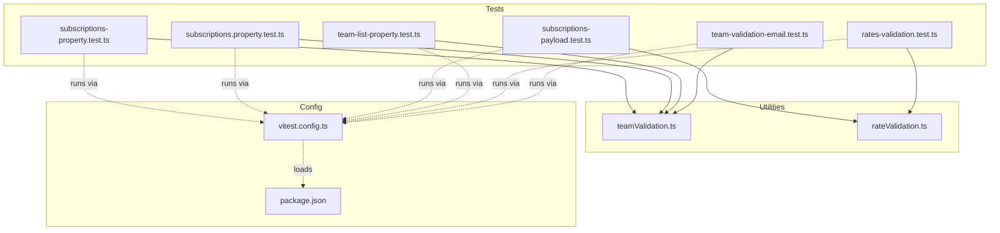

**Diagram sources**
- [subscriptions-property.test.ts:1-100](file://app/pages/management/__tests__/subscriptions-property.test.ts#L1-L100)
- [subscriptions.property.test.ts:1-120](file://app/pages/management/__tests__/subscriptions.property.test.ts#L1-L120)
- [subscriptions-payload.test.ts:1-80](file://app/pages/management/__tests__/subscriptions-payload.test.ts#L1-L80)
- [team-list-property.test.ts:1-120](file://app/pages/team/__tests__/team-list-property.test.ts#L1-L120)
- [rates-validation.test.ts:1-120](file://app/pages/management/__tests__/rates-validation.test.ts#L1-L120)
- [team-validation-email.test.ts:1-60](file://app/utils/__tests__/team-validation-email.test.ts#L1-L60)
- [teamValidation.ts:1-40](file://app/utils/teamValidation.ts#L1-L40)
- [rateValidation.ts:1-40](file://app/utils/rateValidation.ts#L1-L40)
- [vitest.config.ts:1-18](file://vitest.config.ts#L1-L18)
- [package.json:26-32](file://package.json#L26-L32)

**Section sources**
- [package.json:1-33](file://package.json#L1-L33)
- [vitest.config.ts:1-18](file://vitest.config.ts#L1-L18)

## Core Components
Key components validated by property-based tests include:
- Subscription plan transformation from API shape to UI shape
- Statistics object completeness and non-negativity invariants
- Form validation functions for subscriptions and rates
- Payload mapping from form to API request structure
- Team member list rendering invariants and display field formatting
- Email and phone validation utilities

These components are exercised with randomized inputs to assert invariants such as:
- All required fields present after transformation
- Non-negative statistics and relational constraints (e.g., active <= total)
- Validation errors triggered for invalid inputs and not triggered for valid ones
- Correct API payload shapes regardless of billing type or operation mode

**Section sources**
- [subscriptions-property.test.ts:1-120](file://app/pages/management/__tests__/subscriptions-property.test.ts#L1-L120)
- [subscriptions.property.test.ts:1-120](file://app/pages/management/__tests__/subscriptions.property.test.ts#L1-L120)
- [subscriptions-payload.test.ts:1-80](file://app/pages/management/__tests__/subscriptions-payload.test.ts#L1-L80)
- [team-list-property.test.ts:1-120](file://app/pages/team/__tests__/team-list-property.test.ts#L1-L120)
- [rates-validation.test.ts:1-120](file://app/pages/management/__tests__/rates-validation.test.ts#L1-L120)
- [teamValidation.ts:1-40](file://app/utils/teamValidation.ts#L1-L40)
- [rateValidation.ts:1-40](file://app/utils/rateValidation.ts#L1-L40)

## Architecture Overview
The property-based testing architecture centers around:
- Arbitraries that generate structured inputs (strings, numbers, enums, arrays, records)
- Properties that assert invariants over transformed outputs or function results
- Assertions integrated with Vitest’s expect interface
- Optional filtering and mapping to constrain inputs to valid domains

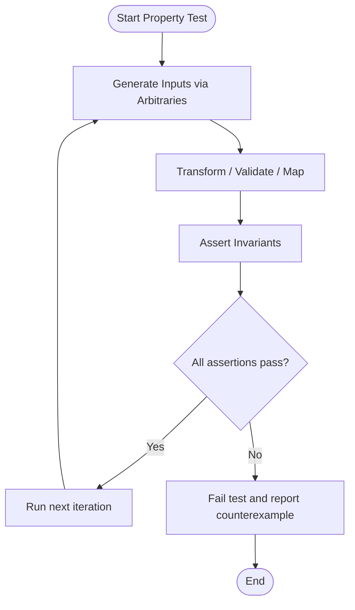

[No sources needed since this diagram shows conceptual workflow, not actual code structure]

## Detailed Component Analysis

### Subscription Plan Transformation and Rendering
This component maps an API plan object into a UI plan object and asserts that all fields are preserved and correctly mapped. It also validates array transformations and type invariants.

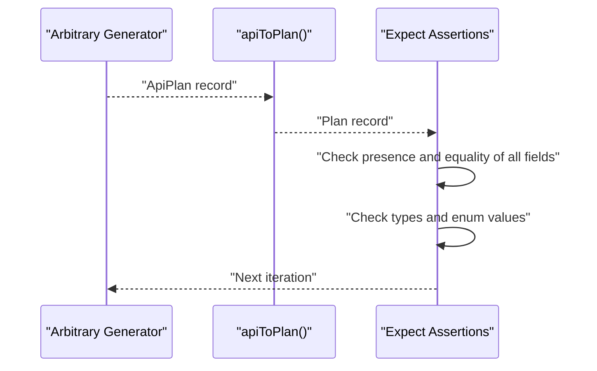

**Diagram sources**
- [subscriptions.property.test.ts:37-50](file://app/pages/management/__tests__/subscriptions.property.test.ts#L37-L50)
- [subscriptions.property.test.ts:80-120](file://app/pages/management/__tests__/subscriptions.property.test.ts#L80-L120)

**Section sources**
- [subscriptions.property.test.ts:1-120](file://app/pages/management/__tests__/subscriptions.property.test.ts#L1-L120)

### Statistics Completeness and Relational Invariants
Properties ensure statistics objects contain required numeric fields and satisfy business constraints like non-negative values and active plans less than or equal to total plans.

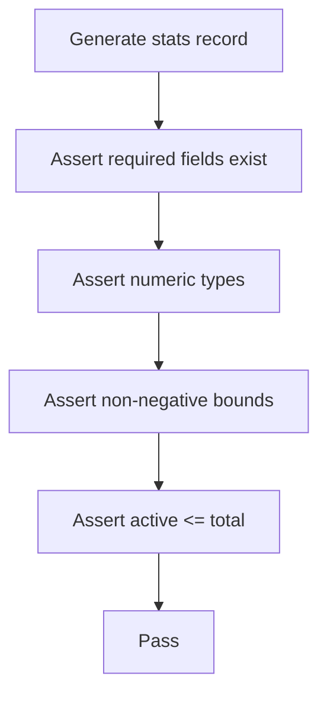

**Diagram sources**
- [subscriptions.property.test.ts:157-213](file://app/pages/management/__tests__/subscriptions.property.test.ts#L157-L213)

**Section sources**
- [subscriptions.property.test.ts:157-213](file://app/pages/management/__tests__/subscriptions.property.test.ts#L157-L213)

### API Request Payload Structure for Subscriptions
Properties verify that form data is mapped to API payloads with correct field names, types, and consistent behavior across create and update operations. They also assert that internal-only fields do not leak into the payload.

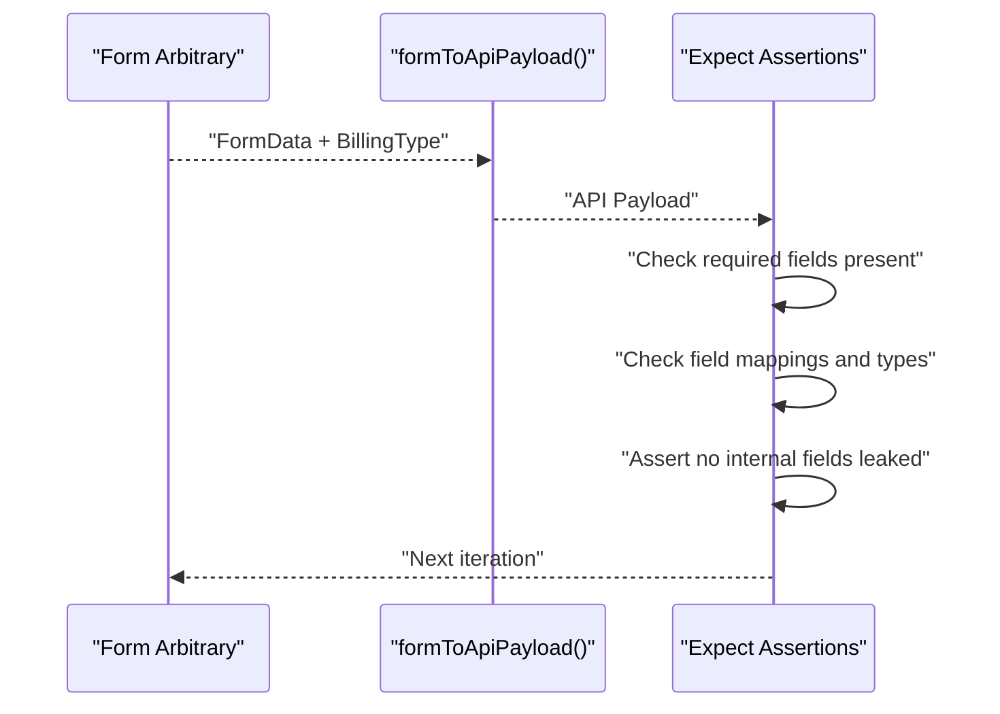

**Diagram sources**
- [subscriptions-payload.test.ts:18-30](file://app/pages/management/__tests__/subscriptions-payload.test.ts#L18-L30)
- [subscriptions-payload.test.ts:32-73](file://app/pages/management/__tests__/subscriptions-payload.test.ts#L32-L73)

**Section sources**
- [subscriptions-payload.test.ts:1-168](file://app/pages/management/__tests__/subscriptions-payload.test.ts#L1-L168)

### Form Validation Completeness and Error Handling (Subscriptions)
Properties cover both positive and negative cases:
- Valid forms produce no errors and proceed
- Invalid forms trigger specific error messages and prevent submission
- Edge cases include empty strings, whitespace-only, zero/negative integers, floats, and non-numeric strings

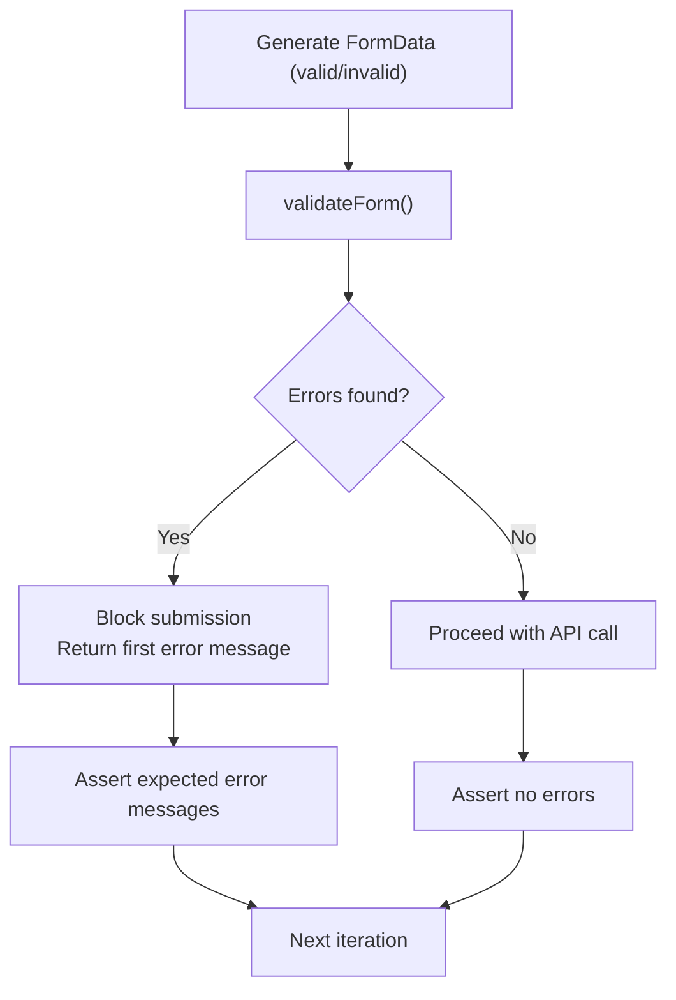

**Diagram sources**
- [subscriptions-property.test.ts:168-186](file://app/pages/management/__tests__/subscriptions-property.test.ts#L168-L186)
- [subscriptions-property.test.ts:324-461](file://app/pages/management/__tests__/subscriptions-property.test.ts#L324-L461)

**Section sources**
- [subscriptions-property.test.ts:156-321](file://app/pages/management/__tests__/subscriptions-property.test.ts#L156-L321)
- [subscriptions-property.test.ts:324-461](file://app/pages/management/__tests__/subscriptions-property.test.ts#L324-L461)

### CRUD Success Flow Invariants
Properties assert that successful create/update/delete operations consistently show success toasts, close modals, and refresh data.

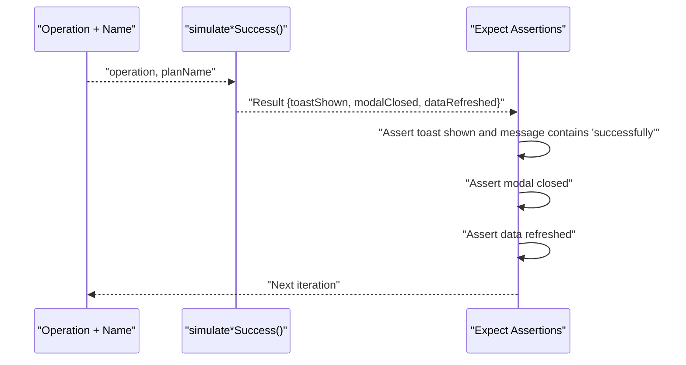

**Diagram sources**
- [subscriptions-property.test.ts:584-754](file://app/pages/management/__tests__/subscriptions-property.test.ts#L584-L754)

**Section sources**
- [subscriptions-property.test.ts:584-754](file://app/pages/management/__tests__/subscriptions-property.test.ts#L584-L754)

### Delete Operation Endpoint Construction
Properties assert that delete requests use the correct HTTP method and endpoint pattern with any valid plan ID.

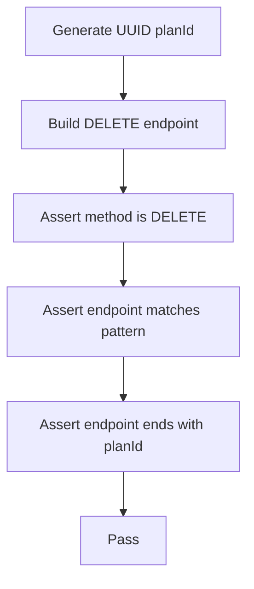

**Diagram sources**
- [subscriptions-property.test.ts:757-800](file://app/pages/management/__tests__/subscriptions-property.test.ts#L757-L800)

**Section sources**
- [subscriptions-property.test.ts:757-800](file://app/pages/management/__tests__/subscriptions-property.test.ts#L757-L800)

### Team Member List Rendering and Display Fields
Properties ensure:
- All members appear exactly once in rendered lists
- Order is preserved
- Empty lists render without members
- Display fields are complete and correctly formatted (name concatenation, role fallback, status, lastLogin)

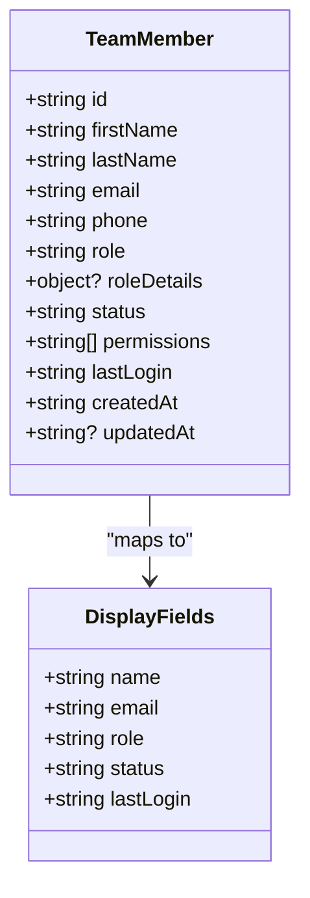

**Diagram sources**
- [team-list-property.test.ts:16-33](file://app/pages/team/__tests__/team-list-property.test.ts#L16-L33)
- [team-list-property.test.ts:96-110](file://app/pages/team/__tests__/team-list-property.test.ts#L96-L110)

**Section sources**
- [team-list-property.test.ts:1-242](file://app/pages/team/__tests__/team-list-property.test.ts#L1-L242)

### Email and Phone Validation Utilities
Properties validate:
- Email format acceptance/rejection based on presence of @, domain part, and absence of spaces
- Phone number digit count constraints (10–15 digits) and tolerance for various separators
- Whitespace trimming behavior

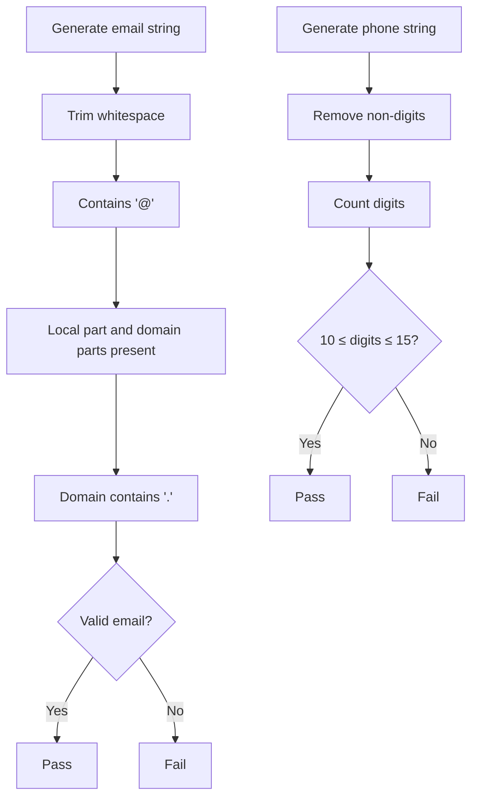

**Diagram sources**
- [teamValidation.ts:17-41](file://app/utils/teamValidation.ts#L17-L41)
- [team-validation-email.test.ts:17-165](file://app/utils/__tests__/team-validation-email.test.ts#L17-L165)

**Section sources**
- [teamValidation.ts:1-122](file://app/utils/teamValidation.ts#L1-L122)
- [team-validation-email.test.ts:1-166](file://app/utils/__tests__/team-validation-email.test.ts#L1-L166)

### Rate Management Validation and Payload Mapping
Properties assert:
- Required fields for add vs edit operations
- Positive numeric pickup rate
- Effective date presence
- Successful transformation to API payload with correct types and trimmed note

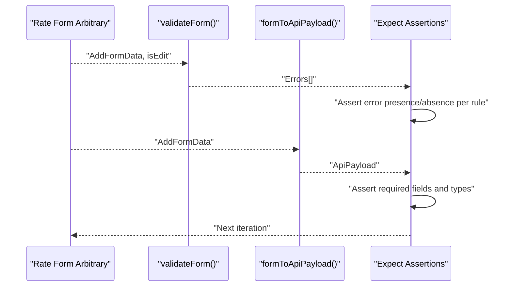

**Diagram sources**
- [rates-validation.test.ts:27-52](file://app/pages/management/__tests__/rates-validation.test.ts#L27-L52)
- [rates-validation.test.ts:59-68](file://app/pages/management/__tests__/rates-validation.test.ts#L59-L68)

**Section sources**
- [rates-validation.test.ts:1-427](file://app/pages/management/__tests__/rates-validation.test.ts#L1-L427)
- [rateValidation.ts:1-69](file://app/utils/rateValidation.ts#L1-L69)

## Dependency Analysis
Fast-check is used extensively across test files to generate inputs and assert invariants. Tests depend on utility modules for validation logic and payload mapping.

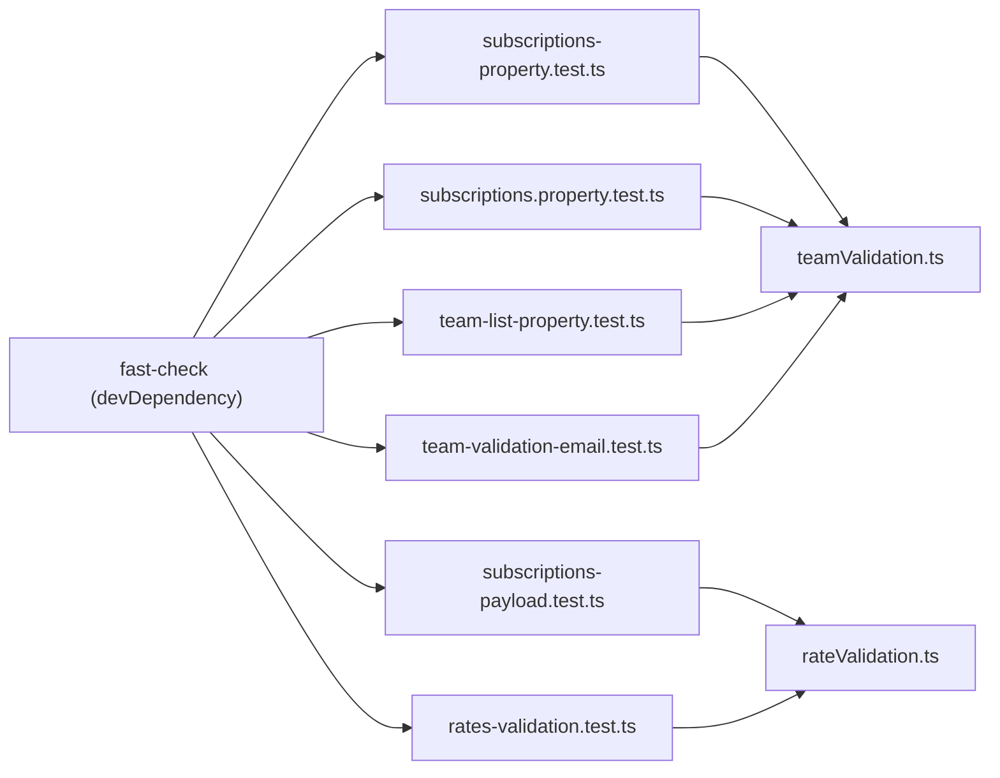

**Diagram sources**
- [package.json:26-32](file://package.json#L26-L32)
- [subscriptions-property.test.ts:1-10](file://app/pages/management/__tests__/subscriptions-property.test.ts#L1-L10)
- [subscriptions.property.test.ts:1-10](file://app/pages/management/__tests__/subscriptions.property.test.ts#L1-L10)
- [subscriptions-payload.test.ts:1-10](file://app/pages/management/__tests__/subscriptions-payload.test.ts#L1-L10)
- [team-list-property.test.ts:1-10](file://app/pages/team/__tests__/team-list-property.test.ts#L1-L10)
- [rates-validation.test.ts:1-10](file://app/pages/management/__tests__/rates-validation.test.ts#L1-L10)
- [team-validation-email.test.ts:1-15](file://app/utils/__tests__/team-validation-email.test.ts#L1-L15)
- [teamValidation.ts:1-10](file://app/utils/teamValidation.ts#L1-L10)
- [rateValidation.ts:1-10](file://app/utils/rateValidation.ts#L1-L10)

**Section sources**
- [package.json:26-32](file://package.json#L26-L32)

## Performance Considerations
- Use fc.filter to constrain inputs to valid domains when necessary; be mindful of rejection rates to avoid slow tests.
- Prefer fc.constantFrom for small enumerations to reduce search space.
- Limit array sizes with minLength/maxLength to keep tests responsive.
- Adjust numRuns per property based on complexity; typical ranges are 50–200.
- Avoid heavy async operations inside properties; keep them deterministic and fast.

[No sources needed since this section provides general guidance]

## Troubleshooting Guide
Common issues and resolutions:
- Flaky tests due to high filter rejection: Replace filters with constrained arbitraries or combine with oneof to increase hit rate.
- Counterexamples too large: Reduce integer ranges and string lengths to simplify debugging.
- Unexpected failures on locale-dependent generators: Use explicit patterns (e.g., fc.integer().map(String)) instead of implicit conversions.
- Slow tests: Decrease numRuns or split complex properties into smaller focused ones.

[No sources needed since this section provides general guidance]

## Conclusion
The project demonstrates a comprehensive approach to property-based testing using Fast-check:
- Robust arbitraries generate realistic and edge-case inputs
- Properties assert critical invariants across transformations, validations, and payload mappings
- Coverage extends beyond happy paths to include failure handling and consistency checks

Adopting these patterns ensures higher confidence in data integrity, business rule enforcement, and API contract compliance across evolving features.