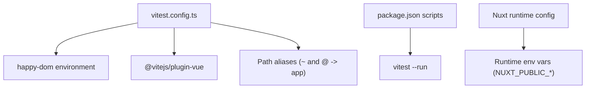
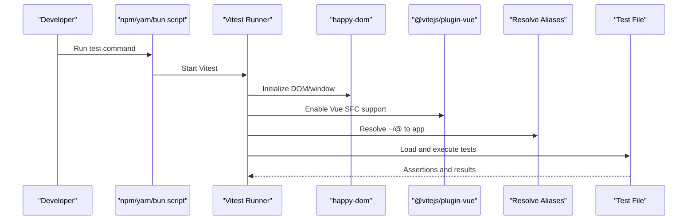
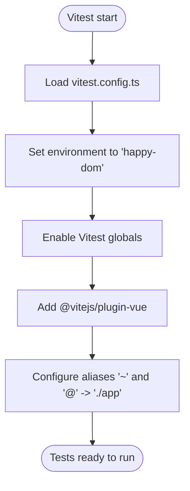
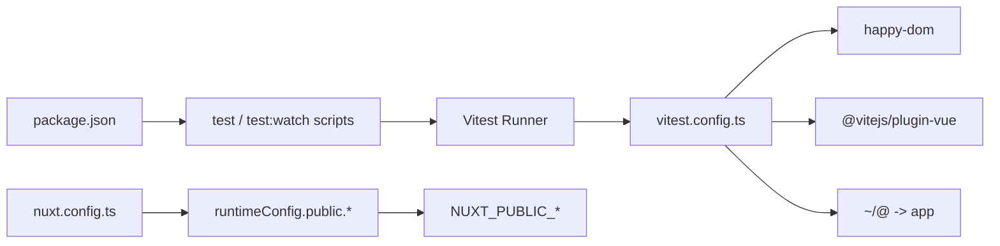

# Testing Configuration & Setup

<cite>
**Referenced Files in This Document**
- [vitest.config.ts](file://vitest.config.ts)
- [package.json](file://package.json)
- [nuxt.config.ts](file://nuxt.config.ts)
- [rates-create-payload.test.ts](file://app/pages/management/__tests__/rates-create-payload.test.ts)
- [team-validation-email.test.ts](file://app/utils/__tests__/team-validation-email.test.ts)
- [add-member.test.ts](file://app/pages/team/__tests__/add-member.test.ts)
- [rateValidation.ts](file://app/utils/rateValidation.ts)
</cite>

## Table of Contents
1. [Introduction](#introduction)
2. [Project Structure](#project-structure)
3. [Core Components](#core-components)
4. [Architecture Overview](#architecture-overview)
5. [Detailed Component Analysis](#detailed-component-analysis)
6. [Dependency Analysis](#dependency-analysis)
7. [Performance Considerations](#performance-considerations)
8. [Troubleshooting Guide](#troubleshooting-guide)
9. [Conclusion](#conclusion)
10. [Appendices](#appendices)

## Introduction
This document explains the Vitest testing configuration and setup for this Nuxt/Vue project. It covers:
- Test environment configuration using happy-dom
- Global test utilities and globals
- Path alias resolution for imports
- Vue plugin integration for component tests
- Extending configuration for different scenarios, custom matchers, and coverage
- Examples of configuring test files, mocking strategies, and environment variables for testing

The goal is to help you understand how tests are run, how to extend the setup, and how to integrate with Vue components and utilities effectively.

## Project Structure
At a high level, tests live alongside the features they validate under __tests__ directories within feature folders (for example, pages and utils). The Vitest configuration is centralized in a single file that wires up the DOM environment, global APIs, path aliases, and the Vue plugin.

**Diagram sources**
- [vitest.config.ts:1-17](file://vitest.config.ts#L1-L17)
- [package.json:1-33](file://package.json#L1-L33)
- [nuxt.config.ts:21-26](file://nuxt.config.ts#L21-L26)

**Section sources**
- [vitest.config.ts:1-17](file://vitest.config.ts#L1-L17)
- [package.json:1-33](file://package.json#L1-L33)
- [nuxt.config.ts:21-26](file://nuxt.config.ts#L21-L26)

## Core Components
- Test runner and scripts:
  - Scripts define running tests once and watching mode.
- Environment:
  - happy-dom provides a browser-like DOM and window/document APIs.
- Globals:
  - Vitest globals (describe, it, expect, vi, beforeEach) are enabled globally.
- Vue support:
  - The Vue plugin is included so .vue SFCs can be imported and tested.
- Path aliases:
  - Aliases ~ and @ resolve to the app directory, matching Nuxt conventions.

Practical implications:
- You can import from ~/... in tests without relative paths.
- You can write tests using describe/it/expect directly without importing them.
- You can mount or render Vue components if needed by leveraging the Vue plugin.

**Section sources**
- [package.json:5-13](file://package.json#L5-L13)
- [vitest.config.ts:5-16](file://vitest.config.ts#L5-L16)

## Architecture Overview
The test execution flow integrates Vitest, happy-dom, and the Vue plugin to provide a browser-like environment for unit and component tests.

**Diagram sources**
- [vitest.config.ts:1-17](file://vitest.config.ts#L1-L17)
- [package.json:5-13](file://package.json#L5-L13)

## Detailed Component Analysis

### Vitest Configuration
Key aspects:
- Environment: happy-dom
- Globals: enabled
- Plugins: Vue plugin
- Aliases: ~ and @ map to ./app

**Diagram sources**
- [vitest.config.ts:1-17](file://vitest.config.ts#L1-L17)

**Section sources**
- [vitest.config.ts:1-17](file://vitest.config.ts#L1-L17)

### Test Utilities and Patterns
- Property-based testing with fast-check is used extensively to assert behavior across many inputs.
- Unit tests validate utility functions and transformations.
- Tests import from ~/... thanks to configured aliases.

Examples in this repository:
- Rate payload transformation and validation assertions
- Team member form validation and transformation
- Email validation property tests

These patterns demonstrate:
- Generating valid/invalid inputs
- Asserting output shapes and types
- Ensuring edge cases like empty strings, whitespace, and boundary values are handled

**Section sources**
- [rates-create-payload.test.ts:1-194](file://app/pages/management/__tests__/rates-create-payload.test.ts#L1-L194)
- [team-validation-email.test.ts:1-166](file://app/utils/__tests__/team-validation-email.test.ts#L1-L166)
- [add-member.test.ts:1-123](file://app/pages/team/__tests__/add-member.test.ts#L1-L123)
- [rateValidation.ts:1-69](file://app/utils/rateValidation.ts#L1-L69)

### Vue Plugin Integration
With the Vue plugin enabled, you can:
- Import .vue components directly in tests
- Use Vue Test Utils to mount/render components
- Leverage the same alias resolution for component imports

If you need to add additional Vue plugins or composables for tests, configure them via Vitest’s setupFiles or per-test bootstrap logic.

[No sources needed since this section provides general guidance]

### Path Aliases Resolution
- Aliases ~ and @ both point to the app directory.
- This aligns with Nuxt conventions and simplifies imports in tests.

When extending:
- Keep aliases consistent with your build tooling to avoid mismatches between dev/build and tests.

**Section sources**
- [vitest.config.ts:11-16](file://vitest.config.ts#L11-L16)

### Mocking Strategies
Common approaches in this codebase:
- Pure function tests: Validate input/output without side effects.
- Property-based tests: Generate large sets of inputs to verify invariants.
- For network calls or external services:
  - Use vi.fn() and vi.spyOn() to stub modules or methods.
  - Replace fetch/XMLHttpRequest implementations if needed.
  - Provide mock data objects instead of real API responses.

Guidance:
- Prefer deterministic mocks over random ones for stability.
- Clear and reset mocks between tests to avoid cross-test pollution.

[No sources needed since this section provides general guidance]

### Environment Variables for Testing
- Runtime public configuration is defined in Nuxt and reads from NUXT_PUBLIC_* variables.
- In tests, set these variables before running tests to control behavior (e.g., base URLs, keys).

How to set:
- Use an environment file loaded by your test runner or pass variables via the shell when invoking Vitest.

**Section sources**
- [nuxt.config.ts:21-26](file://nuxt.config.ts#L21-L26)

## Dependency Analysis
The following diagram shows key dependencies among configuration, scripts, and runtime settings.

**Diagram sources**
- [package.json:5-13](file://package.json#L5-L13)
- [vitest.config.ts:1-17](file://vitest.config.ts#L1-L17)
- [nuxt.config.ts:21-26](file://nuxt.config.ts#L21-L26)

**Section sources**
- [package.json:5-13](file://package.json#L5-L13)
- [vitest.config.ts:1-17](file://vitest.config.ts#L1-L17)
- [nuxt.config.ts:21-26](file://nuxt.config.ts#L21-L26)

## Performance Considerations
- Use property-based tests judiciously; tune numRuns to balance coverage and speed.
- Avoid heavy initialization in top-level scope; use beforeEach/afterEach to isolate state.
- Prefer pure functions and small units to keep tests fast and parallelizable.
- Minimize DOM interactions where possible; only mount components when necessary.

[No sources needed since this section provides general guidance]

## Troubleshooting Guide
Common issues and resolutions:
- Missing DOM APIs: Ensure environment is set to happy-dom.
- Cannot import .vue files: Verify the Vue plugin is present in the Vitest config.
- Import errors with ~/@: Confirm aliases resolve to the correct app directory.
- Unexpected global not found: Check that globals are enabled in the test config.
- Flaky tests due to shared state: Reset mocks and clear timers in afterEach.

[No sources needed since this section provides general guidance]

## Conclusion
The project uses a minimal but effective Vitest setup:
- happy-dom for a browser-like environment
- Global APIs for convenience
- Vue plugin for component testing readiness
- Aliases aligned with Nuxt conventions
- Strong use of property-based testing for robustness

You can extend this foundation by adding setup files, custom matchers, and coverage reporting as your needs grow.

[No sources needed since this section summarizes without analyzing specific files]

## Appendices

### How to Extend the Configuration

- Different testing scenarios
  - Create separate configs for unit vs. component tests and select via CLI flags.
  - Use setupFiles to initialize framework-specific bootstraps.

- Custom matchers
  - Define custom matchers in a setup file and register them via Vitest’s configuration.

- Coverage settings
  - Enable coverage reporters and thresholds in the test configuration.

- Additional plugins
  - Register extra Vite/Vitest plugins for specialized needs (e.g., CSS handling, asset mocking).

- Environment variables
  - Load a .env.test file or pass variables through the shell to control runtime behavior.

[No sources needed since this section provides general guidance]