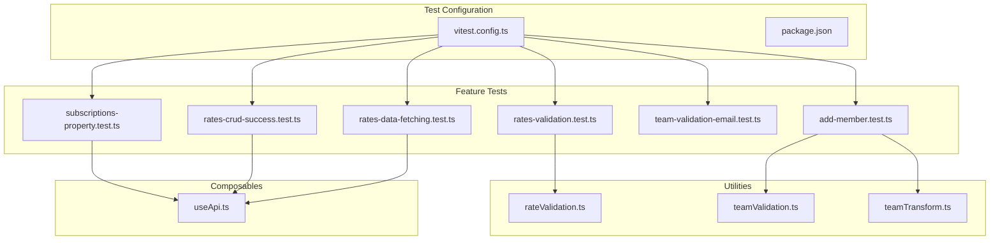
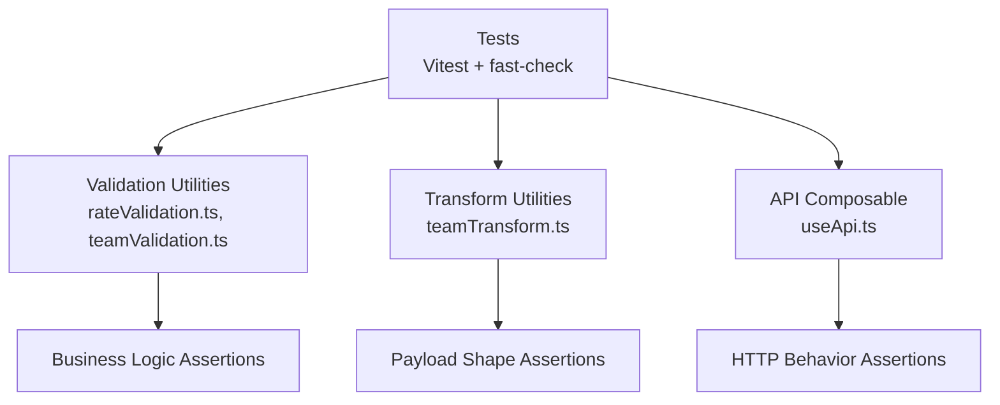
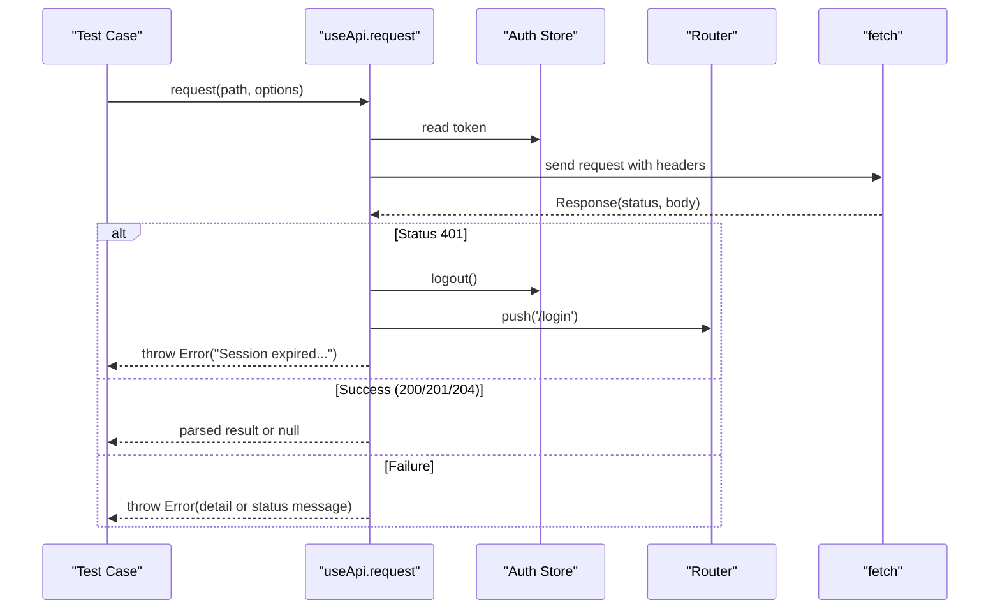
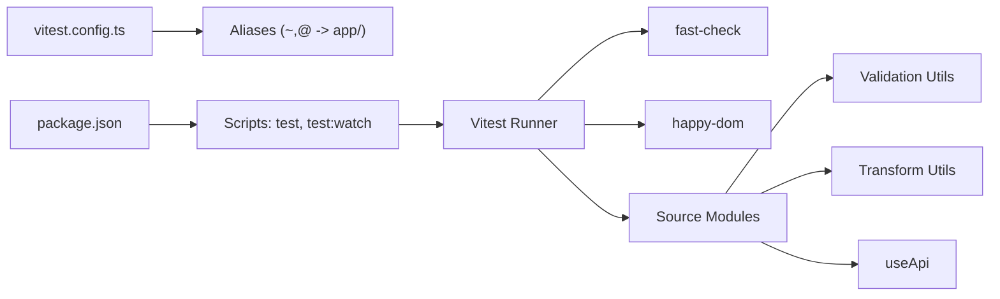

# Testing Strategy & Implementation

<cite>
**Referenced Files in This Document**
- [vitest.config.ts](file://vitest.config.ts)
- [package.json](file://package.json)
- [rateValidation.ts](file://app/utils/rateValidation.ts)
- [teamValidation.ts](file://app/utils/teamValidation.ts)
- [teamTransform.ts](file://app/utils/teamTransform.ts)
- [useApi.ts](file://app/composables/useApi.ts)
- [rates-validation.test.ts](file://app/pages/management/__tests__/rates-validation.test.ts)
- [subscriptions-property.test.ts](file://app/pages/management/__tests__/subscriptions-property.test.ts)
- [rates-crud-success.test.ts](file://app/pages/management/__tests__/rates-crud-success.test.ts)
- [rates-data-fetching.test.ts](file://app/pages/management/__tests__/rates-data-fetching.test.ts)
- [team-validation-email.test.ts](file://app/utils/__tests__/team-validation-email.test.ts)
- [add-member.test.ts](file://app/pages/team/__tests__/add-member.test.ts)
</cite>

## Table of Contents
1. Introduction
2. Project Structure
3. Core Components
4. Architecture Overview
5. Detailed Component Analysis
6. Dependency Analysis
7. Performance Considerations
8. Troubleshooting Guide
9. Conclusion

## Introduction
This document explains the project’s testing strategy and implementation, focusing on Vitest configuration, unit testing patterns for utilities and composables, property-based testing with fast-check, test organization, API integration testing approaches, form validation tests, business logic verification, component interaction patterns, best practices, mocking strategies, and continuous integration setup.

The codebase uses:
- Vitest as the test runner and assertion framework
- happy-dom as the DOM environment
- Vue plugin to support Vue SFCs in tests
- fast-check for property-based testing
- @vue/test-utils for component-level interactions (installed but not used in the analyzed tests)

## Project Structure
Tests are colocated near their source under dedicated __tests__ directories:
- app/utils/__tests__: utility validation tests
- app/pages/management/__tests__: feature-focused tests for management pages (rates, subscriptions)
- app/pages/team/__tests__: team page tests

**Diagram sources**
- [vitest.config.ts:1-18](file://vitest.config.ts#L1-L18)
- [package.json:1-33](file://package.json#L1-L33)
- [rateValidation.ts:1-69](file://app/utils/rateValidation.ts#L1-L69)
- [teamValidation.ts:1-122](file://app/utils/teamValidation.ts#L1-L122)
- [teamTransform.ts:1-88](file://app/utils/teamTransform.ts#L1-L88)
- [useApi.ts:1-91](file://app/composables/useApi.ts#L1-L91)
- [rates-validation.test.ts:1-427](file://app/pages/management/__tests__/rates-validation.test.ts#L1-L427)
- [subscriptions-property.test.ts:1-800](file://app/pages/management/__tests__/subscriptions-property.test.ts#L1-L800)
- [rates-crud-success.test.ts:1-450](file://app/pages/management/__tests__/rates-crud-success.test.ts#L1-L450)
- [rates-data-fetching.test.ts:1-277](file://app/pages/management/__tests__/rates-data-fetching.test.ts#L1-L277)
- [team-validation-email.test.ts:1-166](file://app/utils/__tests__/team-validation-email.test.ts#L1-L166)
- [add-member.test.ts:1-123](file://app/pages/team/__tests__/add-member.test.ts#L1-L123)

**Section sources**
- [vitest.config.ts:1-18](file://vitest.config.ts#L1-L18)
- [package.json:1-33](file://package.json#L1-33)

## Core Components
- Vitest configuration sets up a happy-dom environment, global test APIs, and path aliases (~ and @) pointing to the app directory. The Vue plugin is included to enable Vue SFC support in tests.
- Package scripts define test execution commands:
  - test: run all tests once
  - test:watch: run tests in watch mode

Key implications:
- Path aliases allow importing from ~/utils/* and ~/composables/* in tests without relative paths.
- Global test functions (describe, it, expect) are available without explicit imports in some files.

**Section sources**
- [vitest.config.ts:1-18](file://vitest.config.ts#L1-L18)
- [package.json:1-33](file://package.json#L1-33)

## Architecture Overview
The testing architecture centers around pure functions and composables that encapsulate business logic and API calls. Tests verify:
- Validation rules via property-based tests
- Data transformation correctness
- CRUD success flows and UI side effects (toast, modal close, data refresh)
- Data fetching and rendering completeness

[No sources needed since this diagram shows conceptual workflow, not actual code structure]

## Detailed Component Analysis

### Vitest Configuration and Environment
- Environment: happy-dom provides a lightweight DOM implementation suitable for unit tests.
- Globals: true enables describe, it, expect globally.
- Aliases: ~ and @ map to the app directory, simplifying imports in tests.
- Vue plugin: Enables Vue SFC parsing for component tests if needed.

Best practices observed:
- Keep tests isolated using happy-dom.
- Use aliases consistently across tests and source.

**Section sources**
- [vitest.config.ts:1-18](file://vitest.config.ts#L1-L18)

### Unit Testing Patterns for Utilities
- Rate validation tests exercise validateForm and formToApiPayload with random inputs generated by fast-check. They assert:
  - Required fields behavior (e.g., customer type required only for add operations)
  - Numeric constraints (positive numbers)
  - Date presence
  - Payload shape and type conversions
- Team validation tests cover email and phone formats, non-empty checks, and error mapping.
- Transform tests ensure whitespace trimming, lowercasing emails, and correct field mapping to API payloads.

Patterns:
- Define arbitraries for valid and invalid inputs.
- Use fc.property or fc.assert with fc.record and fc.oneof to generate diverse cases.
- Assert both negative and positive behaviors.

**Section sources**
- [rates-validation.test.ts:1-427](file://app/pages/management/__tests__/rates-validation.test.ts#L1-L427)
- [rateValidation.ts:1-69](file://app/utils/rateValidation.ts#L1-L69)
- [team-validation-email.test.ts:1-166](file://app/utils/__tests__/team-validation-email.test.ts#L1-L166)
- [teamValidation.ts:1-122](file://app/utils/teamValidation.ts#L1-L122)
- [add-member.test.ts:1-123](file://app/pages/team/__tests__/add-member.test.ts#L1-L123)
- [teamTransform.ts:1-88](file://app/utils/teamTransform.ts#L1-L88)

### Property-Based Testing Approaches
- Extensive use of fast-check to generate large input spaces and assert invariants:
  - Form validation completeness and failure/success handling
  - Data rendering completeness (statistics, rate fields)
  - Dropdown population and display consistency
  - CRUD success flow invariants (toast shown, modal closed, list refreshed)
- Typical structure:
  - Define arbitraries for domain types (e.g., rates, plans, stats)
  - Wrap assertions in fc.property with numRuns set to at least 100
  - Combine arbitraries with filters and oneof to simulate realistic edge cases

Examples:
- Rate validation properties covering multiple fields and edit vs add scenarios
- Subscription plan transformation and statistics completeness
- CRUD success flow ensuring consistent user feedback and state updates

**Section sources**
- [rates-validation.test.ts:1-427](file://app/pages/management/__tests__/rates-validation.test.ts#L1-L427)
- [subscriptions-property.test.ts:1-800](file://app/pages/management/__tests__/subscriptions-property.test.ts#L1-L800)
- [rates-data-fetching.test.ts:1-277](file://app/pages/management/__tests__/rates-data-fetching.test.ts#L1-L277)
- [rates-crud-success.test.ts:1-450](file://app/pages/management/__tests__/rates-crud-success.test.ts#L1-L450)

### API Integration Testing Strategies
- The composable useApi centralizes HTTP requests, token injection, error handling, and redirects on 401.
- Tests can assert:
  - Request headers include Authorization when a token exists
  - Success status codes (200, 201, 204) return parsed JSON or null
  - Non-success responses throw errors with messages
  - 401 triggers logout and redirect behavior
- For mocking:
  - Replace fetch with a spy or mock to control responses
  - Mock runtime config values (apiBase) and auth store token
  - Optionally use MSW for request interception in more complex flows

**Diagram sources**
- [useApi.ts:1-91](file://app/composables/useApi.ts#L1-L91)

**Section sources**
- [useApi.ts:1-91](file://app/composables/useApi.ts#L1-L91)

### Business Logic and Data Flow Tests
- Rates data fetching tests assert:
  - Statistics rendering completeness
  - Rate fields rendering completeness
  - Customer type dropdown population and display
- Subscriptions property tests assert:
  - Plan data transformation from API to UI model
  - Statistics fields presence and types
  - Tab change behavior (data refresh triggers)
- These tests focus on invariants over arbitrary inputs rather than specific UI interactions.

**Section sources**
- [rates-data-fetching.test.ts:1-277](file://app/pages/management/__tests__/rates-data-fetching.test.ts#L1-L277)
- [subscriptions-property.test.ts:1-800](file://app/pages/management/__tests__/subscriptions-property.test.ts#L1-L800)

### Component Interaction Tests
- Team add member tests validate:
  - Required fields and format checks
  - Transformation to API payload (trimming, lowercasing, field mapping)
- While these tests do not mount components directly, they verify the same logic that would drive component behavior.

**Section sources**
- [add-member.test.ts:1-123](file://app/pages/team/__tests__/add-member.test.ts#L1-L123)
- [teamValidation.ts:1-122](file://app/utils/teamValidation.ts#L1-L122)
- [teamTransform.ts:1-88](file://app/utils/teamTransform.ts#L1-L88)

### Form Validation Best Practices
- Separate validation from transformation:
  - Validate first; transform only when valid
- Provide clear error messages per field
- Support different modes (create vs update) where requirements differ
- Normalize inputs (trim, lowercase) before sending to API

**Section sources**
- [rateValidation.ts:1-69](file://app/utils/rateValidation.ts#L1-L69)
- [teamValidation.ts:1-122](file://app/utils/teamValidation.ts#L1-L122)
- [teamTransform.ts:1-88](file://app/utils/teamTransform.ts#L1-L88)

### Mocking Strategies
- For HTTP:
  - Spy/mock fetch to assert endpoints, methods, headers, and response handling
  - Mock runtime config and auth store to control base URL and tokens
- For UI:
  - Use @vue/test-utils to mount components and assert interactions (not present in analyzed tests)
- For external services:
  - Replace real integrations with deterministic stubs or fast-check-generated fixtures

[No sources needed since this section provides general guidance]

### Continuous Integration Setup
- Add CI steps to:
  - Install dependencies
  - Run tests with vitest --run
  - Fail the pipeline on any test failure
- Optional:
  - Cache node_modules for faster builds
  - Collect coverage reports

**Section sources**
- [package.json:1-33](file://package.json#L1-33)

## Dependency Analysis
The tests depend on:
- Vitest runtime and globals
- fast-check for property generation
- Source modules under app/* via path aliases

**Diagram sources**
- [vitest.config.ts:1-18](file://vitest.config.ts#L1-L18)
- [package.json:1-33](file://package.json#L1-33)

**Section sources**
- [vitest.config.ts:1-18](file://vitest.config.ts#L1-L18)
- [package.json:1-33](file://package.json#L1-33)

## Performance Considerations
- Property-based tests can be expensive; keep numRuns reasonable (e.g., 100) and avoid heavy I/O.
- Prefer pure function tests over full component mounts for speed.
- Use selective test runs (e.g., file-specific) during development.
- Avoid network calls in unit tests; mock fetch or use MSW.

[No sources needed since this section provides general guidance]

## Troubleshooting Guide
Common issues and resolutions:
- Missing globals: Ensure globals: true in Vitest config or import describe/it/expect explicitly.
- Path alias failures: Verify ~ and @ resolve to app/ in vitest.config.ts.
- DOM-related errors: Confirm environment is happy-dom and Vue plugin is enabled.
- API call failures in tests: Mock fetch or intercept requests; assert error messages and redirects.

**Section sources**
- [vitest.config.ts:1-18](file://vitest.config.ts#L1-L18)
- [useApi.ts:1-91](file://app/composables/useApi.ts#L1-L91)

## Conclusion
The project employs a robust testing strategy combining Vitest, happy-dom, and fast-check to validate validation logic, transformations, data rendering, and API interactions through property-based tests. Tests are organized co-located with features and utilities, emphasizing invariants and broad input coverage. Following the outlined best practices—clear separation of concerns, deterministic mocks, and focused assertions—ensures maintainable and reliable tests.