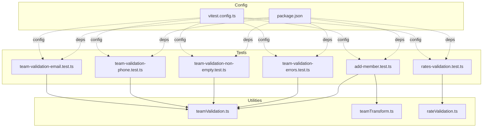
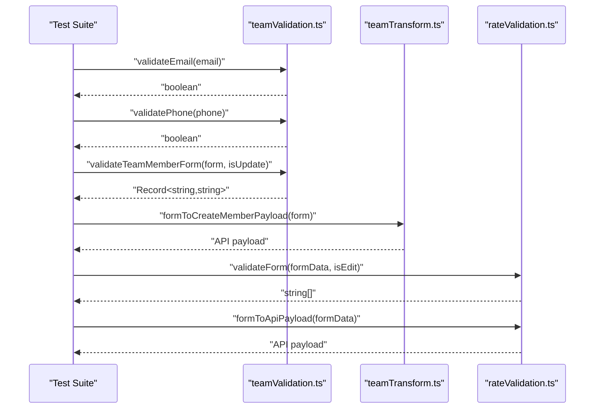
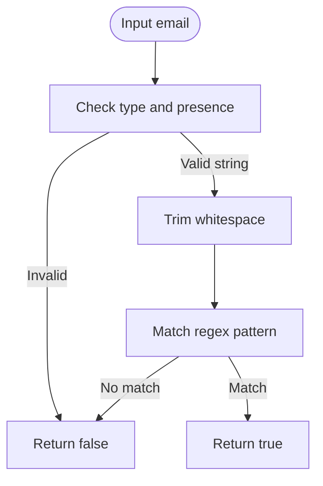
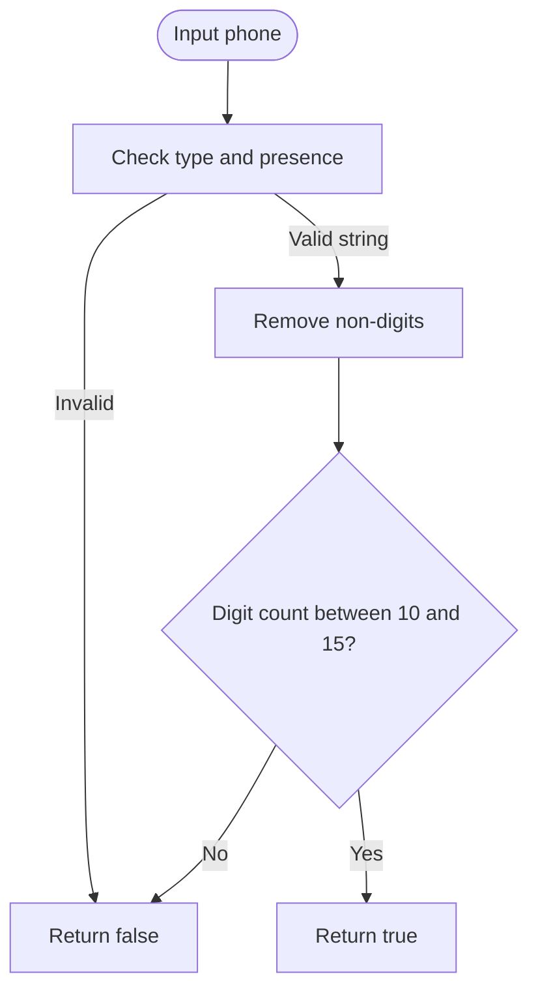
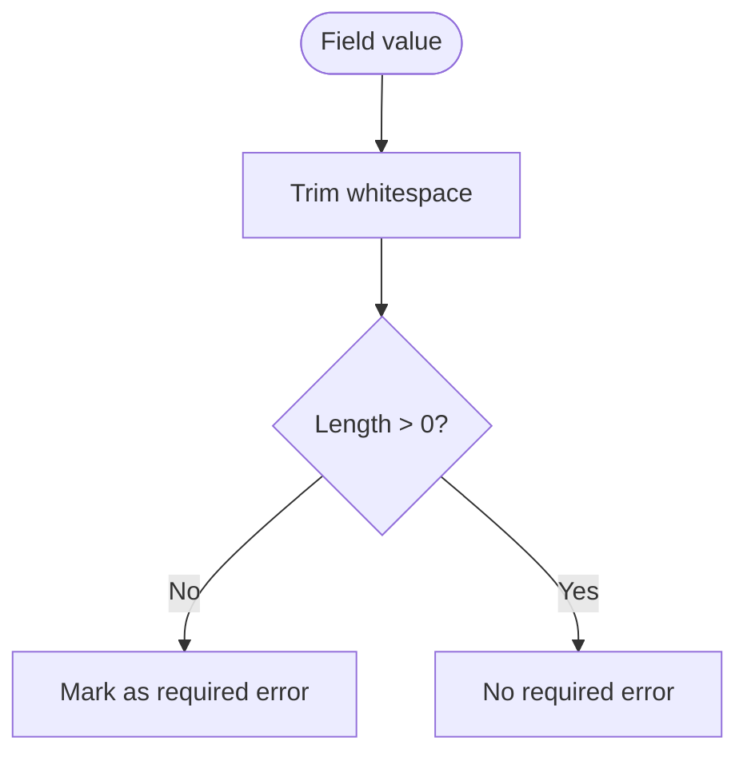
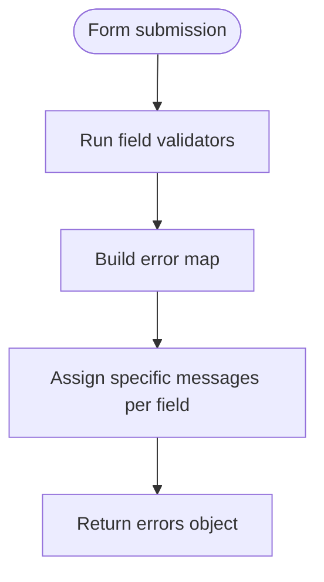
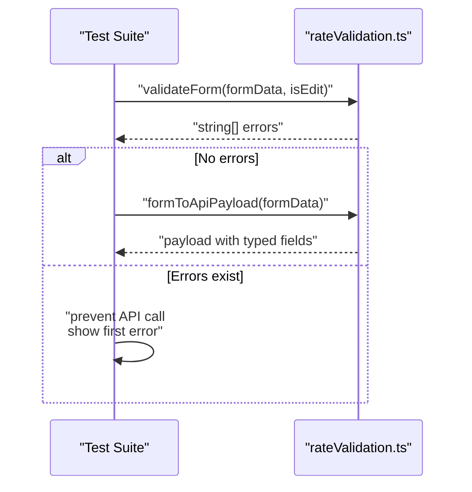
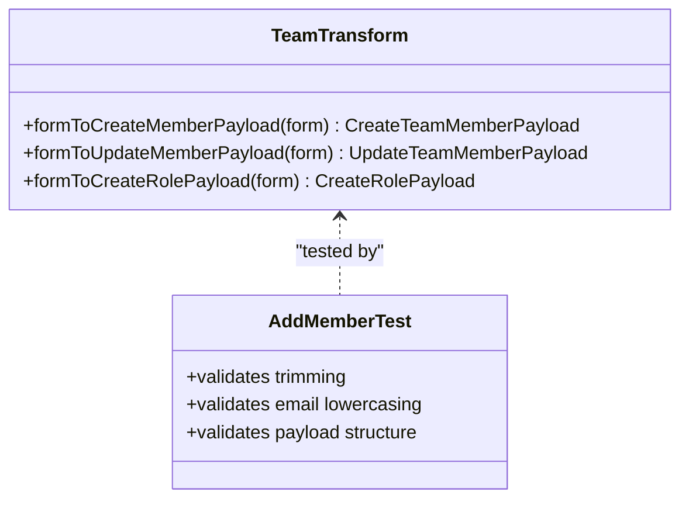

# Unit Testing Patterns

<cite>
**Referenced Files in This Document**
- [teamValidation.ts](file://app/utils/teamValidation.ts)
- [teamTransform.ts](file://app/utils/teamTransform.ts)
- [rateValidation.ts](file://app/utils/rateValidation.ts)
- [team-validation-email.test.ts](file://app/utils/__tests__/team-validation-email.test.ts)
- [team-validation-phone.test.ts](file://app/utils/__tests__/team-validation-phone.test.ts)
- [team-validation-non-empty.test.ts](file://app/utils/__tests__/team-validation-non-empty.test.ts)
- [team-validation-errors.test.ts](file://app/utils/__tests__/team-validation-errors.test.ts)
- [rates-validation.test.ts](file://app/pages/management/__tests__/rates-validation.test.ts)
- [add-member.test.ts](file://app/pages/team/__tests__/add-member.test.ts)
- [vitest.config.ts](file://vitest.config.ts)
- [package.json](file://package.json)
</cite>

## Table of Contents
1. [Introduction](#introduction)
2. [Project Structure](#project-structure)
3. [Core Components](#core-components)
4. [Architecture Overview](#architecture-overview)
5. [Detailed Component Analysis](#detailed-component-analysis)
6. [Dependency Analysis](#dependency-analysis)
7. [Performance Considerations](#performance-considerations)
8. [Troubleshooting Guide](#troubleshooting-guide)
9. [Conclusion](#conclusion)
10. [Appendices](#appendices)

## Introduction
This document explains the unit testing patterns used across utility functions, validation logic, and business rules in the project. It focuses on:
- Form validations (email, phone, non-empty fields)
- Data transformations for API payloads
- Helper function testing strategies
- Assertion patterns, mock implementations, and edge case coverage
- Property-based testing with fast-check to increase robustness

The repository uses Vitest as the test runner, happy-dom for DOM-like environment, and fast-check for property-based tests. Tests are colocated near their source under __tests__ directories or alongside feature pages.

## Project Structure
Testing is organized by feature and utility:
- Utility-level tests live under app/utils/__tests__
- Feature page tests live under app/pages/<feature>/__tests__
- Configuration for Vitest is centralized at vitest.config.ts
- Dependencies including Vitest and fast-check are declared in package.json

**Diagram sources**
- [vitest.config.ts:1-18](file://vitest.config.ts#L1-L18)
- [package.json:1-33](file://package.json#L1-L33)
- [teamValidation.ts:1-122](file://app/utils/teamValidation.ts#L1-L122)
- [teamTransform.ts:1-88](file://app/utils/teamTransform.ts#L1-L88)
- [rateValidation.ts:1-69](file://app/utils/rateValidation.ts#L1-L69)
- [team-validation-email.test.ts:1-166](file://app/utils/__tests__/team-validation-email.test.ts#L1-L166)
- [team-validation-phone.test.ts:1-183](file://app/utils/__tests__/team-validation-phone.test.ts#L1-L183)
- [team-validation-non-empty.test.ts:1-251](file://app/utils/__tests__/team-validation-non-empty.test.ts#L1-L251)
- [team-validation-errors.test.ts:1-261](file://app/utils/__tests__/team-validation-errors.test.ts#L1-L261)
- [rates-validation.test.ts:1-427](file://app/pages/management/__tests__/rates-validation.test.ts#L1-L427)
- [add-member.test.ts:1-123](file://app/pages/team/__tests__/add-member.test.ts#L1-L123)

**Section sources**
- [vitest.config.ts:1-18](file://vitest.config.ts#L1-L18)
- [package.json:1-33](file://package.json#L1-L33)

## Core Components
This section summarizes the validated utilities and their responsibilities:
- teamValidation.ts: Non-empty checks, email format, phone format, form validators for team members and roles
- teamTransform.ts: Transform UI forms into API payloads (trimming, lowercasing emails, mapping field names)
- rateValidation.ts: Validation and transformation for rate management forms

Key testing targets:
- Email validation: accept valid formats, reject invalid ones, handle whitespace trimming
- Phone validation: accept 10–15 digits with various formatting characters, reject too few/too many digits
- Non-empty validation: reject empty and whitespace-only strings; ensure required fields are enforced
- Error messages: return specific, descriptive, consistent error strings per field
- Data transformations: trim inputs, normalize emails, map to backend field names

**Section sources**
- [teamValidation.ts:1-122](file://app/utils/teamValidation.ts#L1-L122)
- [teamTransform.ts:1-88](file://app/utils/teamTransform.ts#L1-L88)
- [rateValidation.ts:1-69](file://app/utils/rateValidation.ts#L1-L69)

## Architecture Overview
The testing architecture centers around pure utility functions that are exercised by both deterministic and property-based tests. The flow from UI form to API payload is validated through dedicated transform functions.

**Diagram sources**
- [teamValidation.ts:1-122](file://app/utils/teamValidation.ts#L1-L122)
- [teamTransform.ts:1-88](file://app/utils/teamTransform.ts#L1-L88)
- [rateValidation.ts:1-69](file://app/utils/rateValidation.ts#L1-L69)

## Detailed Component Analysis

### Email Validation Testing
Patterns:
- Property-based acceptance of valid emails using a generator
- Rejection of missing @ symbol, missing domain part, multiple @ symbols, spaces inside
- Acceptance of leading/trailing whitespace via trimming behavior

**Diagram sources**
- [teamValidation.ts:17-25](file://app/utils/teamValidation.ts#L17-L25)
- [team-validation-email.test.ts:1-166](file://app/utils/__tests__/team-validation-email.test.ts#L1-L166)

**Section sources**
- [teamValidation.ts:17-25](file://app/utils/teamValidation.ts#L17-L25)
- [team-validation-email.test.ts:1-166](file://app/utils/__tests__/team-validation-email.test.ts#L1-L166)

### Phone Validation Testing
Patterns:
- Accept numbers with 10–15 digits regardless of formatting characters
- Reject fewer than 10 or more than 15 digits
- Accept common formats (dashes, parentheses, dots, plus sign)
- Reject strings without digits

**Diagram sources**
- [teamValidation.ts:33-41](file://app/utils/teamValidation.ts#L33-L41)
- [team-validation-phone.test.ts:1-183](file://app/utils/__tests__/team-validation-phone.test.ts#L1-L183)

**Section sources**
- [teamValidation.ts:33-41](file://app/utils/teamValidation.ts#L33-L41)
- [team-validation-phone.test.ts:1-183](file://app/utils/__tests__/team-validation-phone.test.ts#L1-L183)

### Non-Empty Field Validation Testing
Patterns:
- Reject empty and whitespace-only strings
- Ensure required fields trigger “required” errors in form validation
- Differentiate create vs update modes for optional fields

**Diagram sources**
- [teamValidation.ts:8-10](file://app/utils/teamValidation.ts#L8-L10)
- [teamValidation.ts:49-99](file://app/utils/teamValidation.ts#L49-L99)
- [team-validation-non-empty.test.ts:1-251](file://app/utils/__tests__/team-validation-non-empty.test.ts#L1-L251)

**Section sources**
- [teamValidation.ts:8-10](file://app/utils/teamValidation.ts#L8-L10)
- [teamValidation.ts:49-99](file://app/utils/teamValidation.ts#L49-L99)
- [team-validation-non-empty.test.ts:1-251](file://app/utils/__tests__/team-validation-non-empty.test.ts#L1-L251)

### Error Handling and Message Consistency
Patterns:
- Each invalid field returns a distinct, descriptive error message
- Empty vs format-specific failures produce different messages
- Consistent messages for identical validation failures across runs

**Diagram sources**
- [teamValidation.ts:49-99](file://app/utils/teamValidation.ts#L49-L99)
- [team-validation-errors.test.ts:1-261](file://app/utils/__tests__/team-validation-errors.test.ts#L1-L261)

**Section sources**
- [teamValidation.ts:49-99](file://app/utils/teamValidation.ts#L49-L99)
- [team-validation-errors.test.ts:1-261](file://app/utils/__tests__/team-validation-errors.test.ts#L1-L261)

### Rate Management Validation and Transformation
Patterns:
- Required fields: customer type (for add), estimated quantity, pickup rate (positive number), effective date
- Validation returns an array of error messages
- Successful validation leads to payload transformation with correct types and trimmed values

**Diagram sources**
- [rateValidation.ts:27-69](file://app/utils/rateValidation.ts#L27-L69)
- [rates-validation.test.ts:1-427](file://app/pages/management/__tests__/rates-validation.test.ts#L1-L427)

**Section sources**
- [rateValidation.ts:27-69](file://app/utils/rateValidation.ts#L27-L69)
- [rates-validation.test.ts:1-427](file://app/pages/management/__tests__/rates-validation.test.ts#L1-L427)

### Team Member Data Transformation
Patterns:
- Trim all text fields
- Lowercase email addresses
- Map UI field names to backend names (e.g., phone → phoneNumber, role → roleId)
- Include status field as-is

**Diagram sources**
- [teamTransform.ts:10-27](file://app/utils/teamTransform.ts#L10-L27)
- [add-member.test.ts:68-121](file://app/pages/team/__tests__/add-member.test.ts#L68-L121)

**Section sources**
- [teamTransform.ts:10-27](file://app/utils/teamTransform.ts#L10-L27)
- [add-member.test.ts:1-123](file://app/pages/team/__tests__/add-member.test.ts#L1-L123)

## Dependency Analysis
- Utilities are pure functions with no external side effects, making them straightforward to test deterministically.
- Tests import utilities directly and assert outputs.
- Fast-check arbitraries generate large sets of valid/invalid inputs to stress-test validators.
- Vitest configuration provides aliasing for ~ and @ to the app directory, enabling clean imports in tests.

```mermaid
graph LR
A["teamValidation.ts"] --> B["team-validation-email.test.ts"]
A --> C["team-validation-phone.test.ts"]
A --> D["team-validation-non-empty.test.ts"]
A --> E["team-validation-errors.test.ts"]
F["rateValidation.ts"] --> G["rates-validation.test.ts"]
H["teamTransform.ts"] --> I["add-member.test.ts"]
J["vitest.config.ts"] -. config .-> B
J -. config .-> C
J -. config .-> D
J -. config .-> E
J -. config .-> G
J -. config .-> I
K["package.json"] -. deps .-> B
K -. deps .-> C
K -. deps .-> D
K -. deps .-> E
K -. deps .-> G
K -. deps .-> I
```

**Diagram sources**
- [vitest.config.ts:1-18](file://vitest.config.ts#L1-L18)
- [package.json:1-33](file://package.json#L1-L33)
- [teamValidation.ts:1-122](file://app/utils/teamValidation.ts#L1-L122)
- [rateValidation.ts:1-69](file://app/utils/rateValidation.ts#L1-L69)
- [teamTransform.ts:1-88](file://app/utils/teamTransform.ts#L1-L88)
- [team-validation-email.test.ts:1-166](file://app/utils/__tests__/team-validation-email.test.ts#L1-L166)
- [team-validation-phone.test.ts:1-183](file://app/utils/__tests__/team-validation-phone.test.ts#L1-L183)
- [team-validation-non-empty.test.ts:1-251](file://app/utils/__tests__/team-validation-non-empty.test.ts#L1-L251)
- [team-validation-errors.test.ts:1-261](file://app/utils/__tests__/team-validation-errors.test.ts#L1-L261)
- [rates-validation.test.ts:1-427](file://app/pages/management/__tests__/rates-validation.test.ts#L1-L427)
- [add-member.test.ts:1-123](file://app/pages/team/__tests__/add-member.test.ts#L1-L123)

**Section sources**
- [vitest.config.ts:1-18](file://vitest.config.ts#L1-L18)
- [package.json:1-33](file://package.json#L1-L33)

## Performance Considerations
- Property-based tests run multiple iterations (e.g., numRuns: 100). Keep generators efficient and avoid heavy computations inside arbitraries.
- Prefer simple regexes for validation to minimize CPU overhead during large-scale generation.
- For data transformation tests, focus on correctness rather than performance; these are typically small datasets.

[No sources needed since this section provides general guidance]

## Troubleshooting Guide
Common issues and how to address them:
- Import path resolution: Ensure aliases (~ and @) resolve correctly in tests; verify vitest.config.ts settings.
- Environment setup: Tests use happy-dom; confirm it is installed and configured if DOM APIs are needed.
- Property-based flakiness: If random inputs cause unexpected failures, refine filters in arbitraries to exclude pathological cases.
- Error message mismatches: When asserting exact messages, ensure they match implementation; prefer checking presence of keywords when appropriate.

**Section sources**
- [vitest.config.ts:1-18](file://vitest.config.ts#L1-L18)
- [package.json:1-33](file://package.json#L1-L33)

## Conclusion
The project demonstrates robust unit testing practices for validation and transformation utilities:
- Clear separation of concerns with pure functions
- Comprehensive coverage using both deterministic and property-based tests
- Strong assertion patterns focusing on correctness, consistency, and edge cases
- Straightforward configuration and dependency management for test execution

[No sources needed since this section summarizes without analyzing specific files]

## Appendices

### Testing Patterns Summary
- Email validation: Use built-in email arbitraries and custom filters to cover edge cases like missing domain parts and extra @ symbols.
- Phone validation: Generate digit sequences within allowed ranges and mix formatting characters to ensure flexible parsing.
- Non-empty checks: Combine whitespace-only generators with content-containing strings to validate trimming behavior.
- Error handling: Assert presence and uniqueness of error messages per field; ensure consistency across repeated runs.
- Data transformations: Verify trimming, normalization (lowercasing emails), and field name mapping to backend expectations.

[No sources needed since this section provides general guidance]