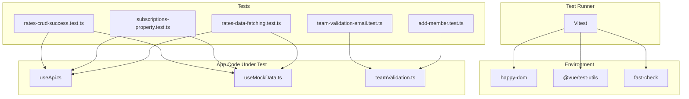
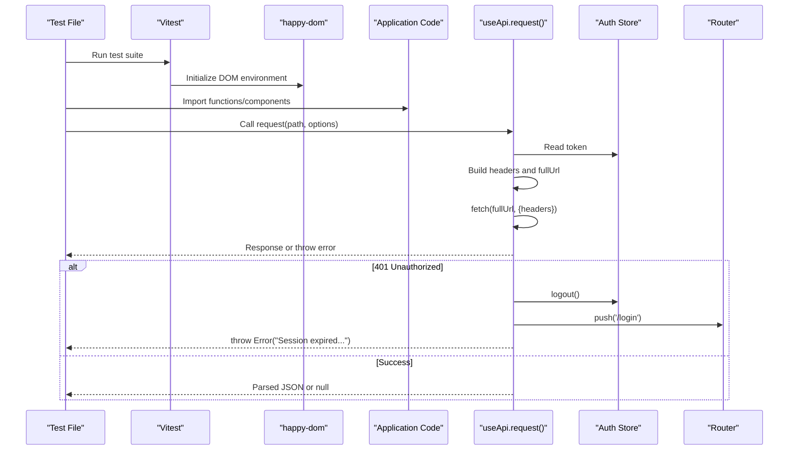
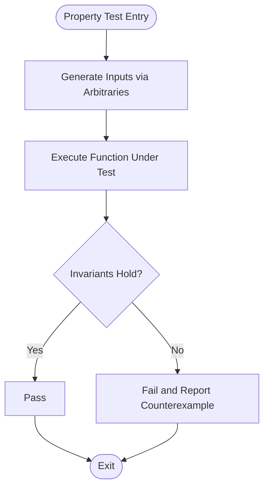
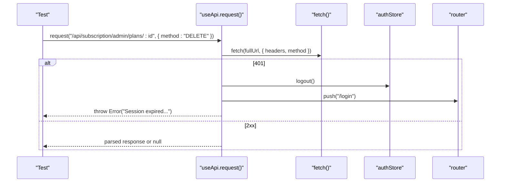
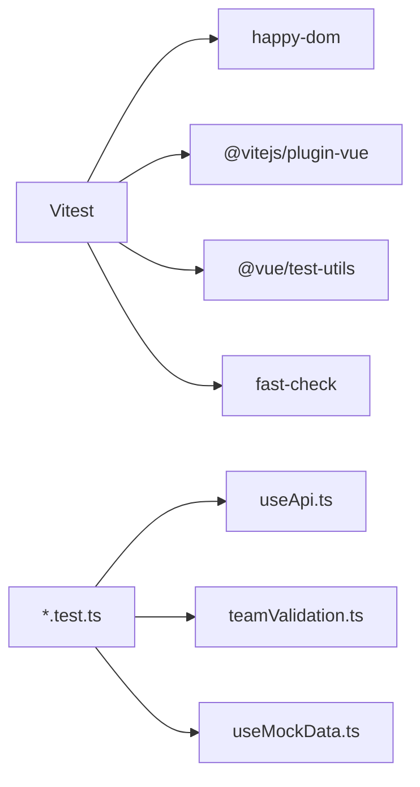

# Testing Strategy

<cite>
**Referenced Files in This Document**
- [vitest.config.ts](file://vitest.config.ts)
- [package.json](file://package.json)
- [nuxt.config.ts](file://nuxt.config.ts)
- [useApi.ts](file://app/composables/useApi.ts)
- [useMockData.ts](file://app/composables/useMockData.ts)
- [teamValidation.ts](file://app/utils/teamValidation.ts)
- [rates-crud-success.test.ts](file://app/pages/management/__tests__/rates-crud-success.test.ts)
- [subscriptions-property.test.ts](file://app/pages/management/__tests__/subscriptions-property.test.ts)
- [rates-data-fetching.test.ts](file://app/pages/management/__tests__/rates-data-fetching.test.ts)
- [team-validation-email.test.ts](file://app/utils/__tests__/team-validation-email.test.ts)
- [add-member.test.ts](file://app/pages/team/__tests__/add-member.test.ts)
</cite>

## Table of Contents
1. [Introduction](#introduction)
2. [Project Structure](#project-structure)
3. [Core Components](#core-components)
4. [Architecture Overview](#architecture-overview)
5. [Detailed Component Analysis](#detailed-component-analysis)
6. [Dependency Analysis](#dependency-analysis)
7. [Performance Considerations](#performance-considerations)
8. [Troubleshooting Guide](#troubleshooting-guide)
9. [Conclusion](#conclusion)
10. [Appendices](#appendices)

## Introduction
This document explains the testing strategy and implementation for the project, focusing on:
- Unit testing with Vitest
- Property-based testing using fast-check
- Component testing patterns (Vue Test Utils integration via Vitest)
- Mock data utilities and API mocking strategies
- Configuration, organization, and assertion strategies
- Practical examples for API integrations, business logic validation, component interactions, and external dependency mocking
- Coverage expectations, CI setup guidance, debugging techniques, and best practices

The repository uses a modern Nuxt 3 stack with TypeScript, Vitest as the test runner, happy-dom for DOM simulation, Vue Test Utils for component tests, and fast-check for property-based tests.

## Project Structure
Tests are colocated near their source under dedicated __tests__ directories:
- Feature pages: app/pages/<feature>/__tests__/*.test.ts
- Utilities: app/utils/__tests__/*.test.ts

Configuration is centralized:
- vitest.config.ts: environment, globals, aliases
- package.json: scripts and devDependencies
- nuxt.config.ts: runtime config used by application code (including API base URL)

**Diagram sources**
- [vitest.config.ts:1-17](file://vitest.config.ts#L1-L17)
- [package.json:26-31](file://package.json#L26-L31)
- [useApi.ts:1-91](file://app/composables/useApi.ts#L1-L91)
- [useMockData.ts:1-61](file://app/composables/useMockData.ts#L1-L61)
- [teamValidation.ts:1-122](file://app/utils/teamValidation.ts#L1-L122)
- [rates-crud-success.test.ts:1-450](file://app/pages/management/__tests__/rates-crud-success.test.ts#L1-L450)
- [subscriptions-property.test.ts:1-800](file://app/pages/management/__tests__/subscriptions-property.test.ts#L1-L800)
- [rates-data-fetching.test.ts:1-277](file://app/pages/management/__tests__/rates-data-fetching.test.ts#L1-L277)
- [team-validation-email.test.ts:1-166](file://app/utils/__tests__/team-validation-email.test.ts#L1-L166)
- [add-member.test.ts:1-123](file://app/pages/team/__tests__/add-member.test.ts#L1-L123)

**Section sources**
- [vitest.config.ts:1-17](file://vitest.config.ts#L1-L17)
- [package.json:1-33](file://package.json#L1-L33)
- [nuxt.config.ts:21-26](file://nuxt.config.ts#L21-L26)

## Core Components
- Test runner and environment
  - Vitest configured with happy-dom and global APIs enabled; Vue plugin included to support .vue SFCs in tests.
  - Aliases ~ and @ resolve to the app directory for consistent imports across tests and source.
- Scripts and dependencies
  - npm scripts: test and test:watch run Vitest.
  - DevDependencies include Vitest, happy-dom, Vue Test Utils, and fast-check.
- Runtime configuration
  - Nuxt runtimeConfig.public.apiBase provides the API base URL used by useApi.

Key responsibilities:
- Vitest orchestrates discovery and execution of *.test.ts files.
- happy-dom simulates browser APIs for DOM-dependent tests.
- fast-check generates random inputs to validate properties across many cases.
- Vue Test Utils enables mounting and interacting with Vue components.

**Section sources**
- [vitest.config.ts:1-17](file://vitest.config.ts#L1-L17)
- [package.json:5-12](file://package.json#L5-L12)
- [package.json:26-31](file://package.json#L26-L31)
- [nuxt.config.ts:21-26](file://nuxt.config.ts#L21-L26)

## Architecture Overview
The testing architecture layers unit, property-based, and component tests around shared utilities and composables. The API composable centralizes HTTP calls and error handling, while mock data provides deterministic fixtures for UI features.

**Diagram sources**
- [useApi.ts:9-67](file://app/composables/useApi.ts#L9-L67)
- [useApi.ts:39-44](file://app/composables/useApi.ts#L39-L44)
- [useApi.ts:46-66](file://app/composables/useApi.ts#L46-L66)
- [nuxt.config.ts:21-26](file://nuxt.config.ts#L21-L26)

## Detailed Component Analysis

### Unit Testing with Vitest
- Organization: Tests live next to features and utilities under __tests__.
- Patterns:
  - Direct function assertions for pure logic (e.g., validation).
  - Input/output verification for transformations (e.g., payload building).
  - Isolation of side effects via mocks where needed.

Examples:
- Team validation email format tested against valid and invalid strings.
- Team member form validation and transformation verified for required fields, trimming, and lowercasing.

**Section sources**
- [team-validation-email.test.ts:1-166](file://app/utils/__tests__/team-validation-email.test.ts#L1-L166)
- [add-member.test.ts:1-123](file://app/pages/team/__tests__/add-member.test.ts#L1-L123)
- [teamValidation.ts:1-122](file://app/utils/teamValidation.ts#L1-L122)

### Property-Based Testing with fast-check
- Purpose: Validate invariants over large input spaces and edge cases.
- Common patterns:
  - Define arbitraries for domain types (e.g., dates, IDs, enums).
  - Compose complex records and tuples.
  - Assert invariants like completeness, consistency, and idempotence.

Examples:
- CRUD success flow invariants: toast shown, modal closed, list refreshed, stats updated conditionally.
- Subscription plan rendering and transformation invariants.
- Statistics and dropdown population invariants.

**Diagram sources**
- [rates-crud-success.test.ts:109-449](file://app/pages/management/__tests__/rates-crud-success.test.ts#L109-L449)
- [subscriptions-property.test.ts:78-106](file://app/pages/management/__tests__/subscriptions-property.test.ts#L78-L106)
- [rates-data-fetching.test.ts:63-116](file://app/pages/management/__tests__/rates-data-fetching.test.ts#L63-L116)

**Section sources**
- [rates-crud-success.test.ts:1-450](file://app/pages/management/__tests__/rates-crud-success.test.ts#L1-450)
- [subscriptions-property.test.ts:1-800](file://app/pages/management/__tests__/subscriptions-property.test.ts#L1-800)
- [rates-data-fetching.test.ts:1-277](file://app/pages/management/__tests__/rates-data-fetching.test.ts#L1-L277)

### Component Testing Patterns
- Environment: Vitest + happy-dom + Vue Test Utils.
- Typical workflow:
  - Mount component with shallow or full mount depending on needs.
  - Provide composables/stores via local overrides or wrappers when necessary.
  - Interact with DOM elements and assert rendered output and behavior.
- Current usage:
  - While most tests focus on utilities and business logic, the environment supports component-level tests.

Best practices:
- Keep component tests focused on user-visible behavior.
- Stub external dependencies (API, router, stores) to isolate component logic.
- Prefer stable selectors and avoid brittle CSS class assertions.

[No sources needed since this section provides general guidance]

### Mock Data Utilities
- useMockData provides deterministic reference datasets (zones, trucks, customer types, subscription plans).
- Use these fixtures in tests to ensure stable UI rendering and filtering scenarios without network calls.

Usage patterns:
- Replace dynamic lists with static arrays from useMockData.
- Combine with fast-check to generate additional variations when needed.

**Section sources**
- [useMockData.ts:1-61](file://app/composables/useMockData.ts#L1-L61)

### API Integration Testing Strategies
- Centralized HTTP client: useApi.request handles headers, auth, status codes, and error formatting.
- Recommended approaches:
  - For pure integration-like tests, mock fetch at the module level to simulate responses and errors.
  - For behavioral tests, assert that correct endpoints and methods are constructed.
  - For authentication flows, verify 401 handling triggers logout and redirect.

Example flows:
- Constructing DELETE requests with UUIDs for plan deletion.
- Validating create/update/delete payloads and success flows.

**Diagram sources**
- [useApi.ts:9-67](file://app/composables/useApi.ts#L9-L67)
- [useApi.ts:39-44](file://app/composables/useApi.ts#L39-L44)
- [subscriptions-property.test.ts:756-800](file://app/pages/management/__tests__/subscriptions-property.test.ts#L756-L800)

**Section sources**
- [useApi.ts:1-91](file://app/composables/useApi.ts#L1-L91)
- [subscriptions-property.test.ts:756-800](file://app/pages/management/__tests__/subscriptions-property.test.ts#L756-L800)

### Business Logic Validation Examples
- Email validation: accepts standard formats, rejects malformed inputs, trims whitespace.
- Phone validation: ensures digit count within acceptable range after stripping non-digits.
- Form validation: enforces required fields and type constraints; returns structured errors.

**Section sources**
- [teamValidation.ts:1-122](file://app/utils/teamValidation.ts#L1-L122)
- [team-validation-email.test.ts:1-166](file://app/utils/__tests__/team-validation-email.test.ts#L1-L166)

### Mocking External Dependencies
- Options:
  - Module-level fetch mocking for API tests.
  - vi.fn/vi.mock for spies and stubs on composables or stores.
  - Wrapper components to inject test doubles into mounted components.
- When to mock:
  - Network calls, timers, random values, and third-party SDKs.

[No sources needed since this section provides general guidance]

## Dependency Analysis
Testing dependencies and relationships:
- Vitest depends on happy-dom for DOM APIs and integrates Vue plugin for SFC support.
- fast-check is used extensively for property tests.
- Vue Test Utils is available for component tests.
- Application code under test includes useApi, teamValidation, and useMockData.

**Diagram sources**
- [vitest.config.ts:1-17](file://vitest.config.ts#L1-L17)
- [package.json:26-31](file://package.json#L26-L31)
- [useApi.ts:1-91](file://app/composables/useApi.ts#L1-L91)
- [teamValidation.ts:1-122](file://app/utils/teamValidation.ts#L1-L122)
- [useMockData.ts:1-61](file://app/composables/useMockData.ts#L1-L61)

**Section sources**
- [vitest.config.ts:1-17](file://vitest.config.ts#L1-L17)
- [package.json:26-31](file://package.json#L26-L31)

## Performance Considerations
- Keep property tests efficient:
  - Limit numRuns to a reasonable number (e.g., 100) unless deeper coverage is needed.
  - Avoid heavy computations inside arbitraries; precompute where possible.
- Minimize DOM operations in unit tests; prefer shallow mounts and targeted assertions.
- Cache expensive fixtures outside of test loops.
- Parallelize independent suites; avoid shared mutable state between tests.

[No sources needed since this section provides general guidance]

## Troubleshooting Guide
Common issues and resolutions:
- Missing DOM APIs: Ensure happy-dom is configured and globals are enabled.
- Alias resolution failures: Confirm ~ and @ point to app directory in Vitest config.
- API call flakiness: Mock fetch or intercept requests; assert endpoint construction rather than relying on real networks.
- Authentication redirects: Verify 401 handling paths and router navigation in tests.
- Slow tests: Reduce iterations, isolate heavy logic, and avoid unnecessary re-renders.

Debugging techniques:
- Use Vitest watch mode for rapid feedback.
- Add descriptive logs around critical branches (avoid logging secrets).
- Narrow failing property tests by reducing numRuns and isolating arbitraries.

**Section sources**
- [vitest.config.ts:1-17](file://vitest.config.ts#L1-L17)
- [useApi.ts:39-44](file://app/composables/useApi.ts#L39-L44)

## Conclusion
The project’s testing strategy combines Vitest-driven unit tests, robust property-based testing with fast-check, and a foundation ready for component tests. Centralized API handling and deterministic mock data enable reliable, maintainable tests. Following the outlined patterns and best practices will keep tests fast, readable, and effective at catching regressions.

[No sources needed since this section summarizes without analyzing specific files]

## Appendices

### Configuration Summary
- Vitest environment: happy-dom, globals enabled, Vue plugin active.
- Aliases: ~ and @ map to app directory.
- Scripts: test and test:watch invoke Vitest.
- Runtime config: public.apiBase defines API base URL.

**Section sources**
- [vitest.config.ts:1-17](file://vitest.config.ts#L1-L17)
- [package.json:5-12](file://package.json#L5-L12)
- [nuxt.config.ts:21-26](file://nuxt.config.ts#L21-L26)

### Assertion Strategies
- Equality and presence checks for data shapes.
- Type guards and value ranges for numeric/date fields.
- Invariant assertions for business rules (e.g., always refresh list after mutations).
- Negative testing for invalid inputs and error paths.

[No sources needed since this section provides general guidance]

### Continuous Integration Setup Guidance
- Add a CI job to run npm test with a headless environment.
- Cache node_modules and Vitest cache to speed up runs.
- Publish test results and artifacts if needed.
- Enforce passing tests before merging.

[No sources needed since this section provides general guidance]