# Utilities & Helpers

<cite>
**Referenced Files in This Document**
- [useCurrency.ts](file://app/composables/useCurrency.ts)
- [useMockData.ts](file://app/composables/useMockData.ts)
- [teamTransform.ts](file://app/utils/teamTransform.ts)
- [rateValidation.ts](file://app/utils/rateValidation.ts)
- [teamValidation.ts](file://app/utils/teamValidation.ts)
- [auth.ts](file://app/utils/auth.ts)
- [useErrorHandler.ts](file://app/composables/useErrorHandler.ts)
- [usePermissions.ts](file://app/composables/usePermissions.ts)
- [useToast.ts](file://app/composables/useToast.ts)
- [useApi.ts](file://app/composables/useApi.ts)
- [team.ts](file://app/types/team.ts)
- [auth.ts](file://app/types/auth.ts)
- [team-validation-email.test.ts](file://app/utils/__tests__/team-validation-email.test.ts)
- [rates-validation.test.ts](file://app/pages/management/__tests__/rates-validation.test.ts)
- [rates-create-payload.test.ts](file://app/pages/management/__tests__/rates-create-payload.test.ts)
- [add-member.test.ts](file://app/pages/team/__tests__/add-member.test.ts)
</cite>

## Table of Contents
1. [Introduction](#introduction)
2. [Project Structure](#project-structure)
3. [Core Components](#core-components)
4. [Architecture Overview](#architecture-overview)
5. [Detailed Component Analysis](#detailed-component-analysis)
6. [Dependency Analysis](#dependency-analysis)
7. [Performance Considerations](#performance-considerations)
8. [Troubleshooting Guide](#troubleshooting-guide)
9. [Conclusion](#conclusion)
10. [Appendices](#appendices)

## Introduction
This document provides comprehensive documentation for the utility functions and helper modules used across the application. It focuses on:
- Currency formatting and localization
- Mock data generation for testing and development
- Data transformation helpers for team management and rate configuration
- Validation utilities for forms and business rules
- Composable functions that encapsulate shared behavior (error handling, permissions, API access, toasts)
It also includes reusability patterns, testing strategies, and integration guidelines for extending the utility library.

## Project Structure
The utilities are organized into two main areas:
- composables: Vue 3 composables that encapsulate reusable logic with reactive state or side effects
- utils: Pure functions for validation, transformation, and domain-specific helpers

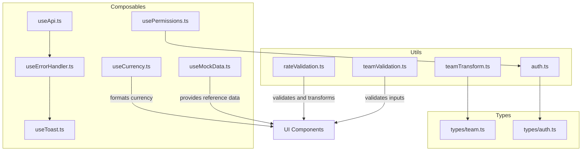

**Diagram sources**
- [useCurrency.ts:1-12](file://app/composables/useCurrency.ts#L1-L12)
- [useMockData.ts:1-61](file://app/composables/useMockData.ts#L1-L61)
- [useErrorHandler.ts:1-29](file://app/composables/useErrorHandler.ts#L1-L29)
- [usePermissions.ts:1-43](file://app/composables/usePermissions.ts#L1-L43)
- [useToast.ts:1-37](file://app/composables/useToast.ts#L1-L37)
- [useApi.ts:1-91](file://app/composables/useApi.ts#L1-L91)
- [teamTransform.ts:1-88](file://app/utils/teamTransform.ts#L1-L88)
- [rateValidation.ts:1-69](file://app/utils/rateValidation.ts#L1-L69)
- [teamValidation.ts:1-122](file://app/utils/teamValidation.ts#L1-L122)
- [auth.ts:1-58](file://app/utils/auth.ts#L1-L58)
- [team.ts:1-65](file://app/types/team.ts#L1-L65)
- [auth.ts:1-64](file://app/types/auth.ts#L1-L64)

**Section sources**
- [useCurrency.ts:1-12](file://app/composables/useCurrency.ts#L1-L12)
- [useMockData.ts:1-61](file://app/composables/useMockData.ts#L1-L61)
- [teamTransform.ts:1-88](file://app/utils/teamTransform.ts#L1-L88)
- [rateValidation.ts:1-69](file://app/utils/rateValidation.ts#L1-L69)
- [teamValidation.ts:1-122](file://app/utils/teamValidation.ts#L1-L122)
- [auth.ts:1-58](file://app/utils/auth.ts#L1-L58)
- [useErrorHandler.ts:1-29](file://app/composables/useErrorHandler.ts#L1-L29)
- [usePermissions.ts:1-43](file://app/composables/usePermissions.ts#L1-L43)
- [useToast.ts:1-37](file://app/composables/useToast.ts#L1-L37)
- [useApi.ts:1-91](file://app/composables/useApi.ts#L1-L91)
- [team.ts:1-65](file://app/types/team.ts#L1-L65)
- [auth.ts:1-64](file://app/types/auth.ts#L1-L64)

## Core Components
- Currency formatting composable: Provides a simple function to format amounts using a localized currency formatter.
- Mock data composable: Supplies static reference datasets for zones, trucks, customer types, and subscription plans.
- Team transformation utilities: Convert form payloads into API-compatible structures for creating/updating members and roles.
- Rate validation and transformation: Validates rate form inputs and converts them to API payloads.
- Team validation utilities: Reusable validators for non-empty fields, email, phone, and composite form validation.
- Auth utilities: Normalize roles, check admin status, extract permissions, and compare roles.
- Error handler composable: Wraps async operations with automatic toast notifications and null returns on failure.
- Permissions composable: High-level checks for permissions and roles backed by auth utilities.
- Toast composable: Global toast store with typed methods for success/error/warning/info.
- API composable: Centralized HTTP client with authentication headers, error handling, and convenience methods.

**Section sources**
- [useCurrency.ts:1-12](file://app/composables/useCurrency.ts#L1-L12)
- [useMockData.ts:1-61](file://app/composables/useMockData.ts#L1-L61)
- [teamTransform.ts:1-88](file://app/utils/teamTransform.ts#L1-L88)
- [rateValidation.ts:1-69](file://app/utils/rateValidation.ts#L1-L69)
- [teamValidation.ts:1-122](file://app/utils/teamValidation.ts#L1-L122)
- [auth.ts:1-58](file://app/utils/auth.ts#L1-L58)
- [useErrorHandler.ts:1-29](file://app/composables/useErrorHandler.ts#L1-L29)
- [usePermissions.ts:1-43](file://app/composables/usePermissions.ts#L1-L43)
- [useToast.ts:1-37](file://app/composables/useToast.ts#L1-L37)
- [useApi.ts:1-91](file://app/composables/useApi.ts#L1-L91)

## Architecture Overview
The utilities layer sits between UI components and external services. Composables orchestrate cross-cutting concerns (errors, toasts, permissions), while pure utils handle deterministic transformations and validations.

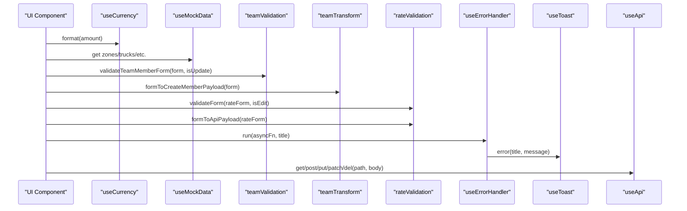

**Diagram sources**
- [useCurrency.ts:1-12](file://app/composables/useCurrency.ts#L1-L12)
- [useMockData.ts:1-61](file://app/composables/useMockData.ts#L1-L61)
- [teamValidation.ts:1-122](file://app/utils/teamValidation.ts#L1-L122)
- [teamTransform.ts:1-88](file://app/utils/teamTransform.ts#L1-L88)
- [rateValidation.ts:1-69](file://app/utils/rateValidation.ts#L1-L69)
- [useErrorHandler.ts:1-29](file://app/composables/useErrorHandler.ts#L1-L29)
- [useToast.ts:1-37](file://app/composables/useToast.ts#L1-L37)
- [useApi.ts:1-91](file://app/composables/useApi.ts#L1-L91)

## Detailed Component Analysis

### Currency Formatting and Localization
- Purpose: Provide a consistent way to display monetary values using a locale-aware formatter.
- Behavior: Formats numbers as currency with fixed fraction digits; uses a specific locale and currency code.
- Usage example: Call the returned format function with a numeric amount to obtain a formatted string.

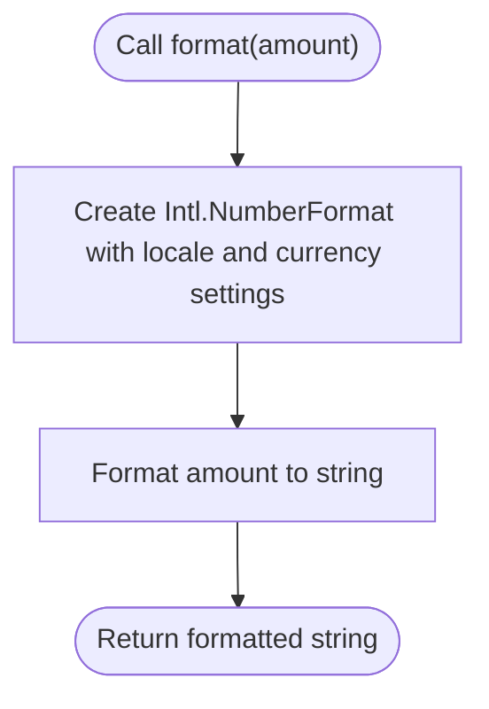

**Diagram sources**
- [useCurrency.ts:1-12](file://app/composables/useCurrency.ts#L1-L12)

**Section sources**
- [useCurrency.ts:1-12](file://app/composables/useCurrency.ts#L1-L12)

### Mock Data Generation for Testing
- Purpose: Supply stable reference datasets for features like zones, trucks, customer types, and subscription plans.
- Design: Module-level arrays act as singletons; the composable returns these references so all consumers share the same data.
- Extensibility: Replace static arrays with API calls when endpoints are available without changing consumers.

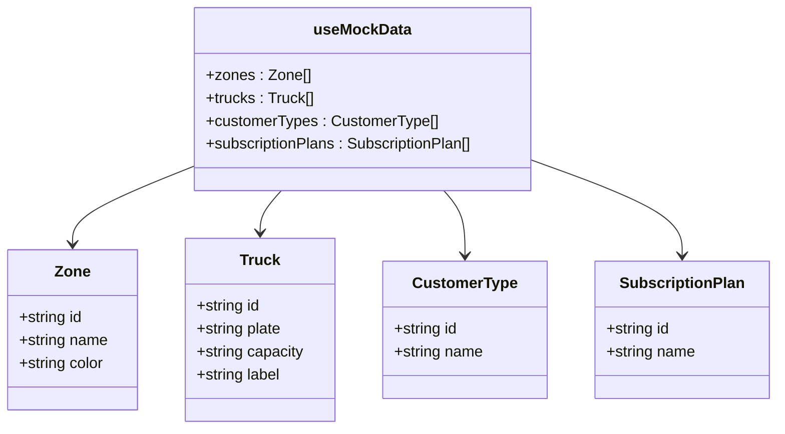

**Diagram sources**
- [useMockData.ts:1-61](file://app/composables/useMockData.ts#L1-L61)

**Section sources**
- [useMockData.ts:1-61](file://app/composables/useMockData.ts#L1-L61)

### Data Transformation Helpers (Team Management)
- Purpose: Convert UI form shapes into backend-compatible payloads for creating and updating team members and roles.
- Key behaviors:
  - Trim whitespace from text fields
  - Normalize emails to lowercase
  - Map UI field names to API field names (e.g., phone -> phoneNumber, role -> roleId)
  - For updates, include only provided fields

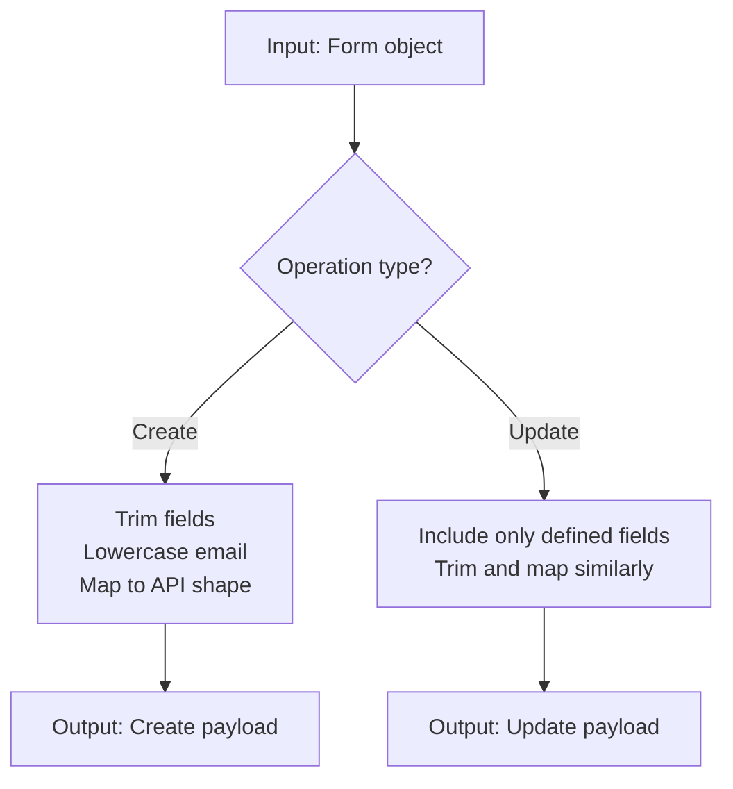

**Diagram sources**
- [teamTransform.ts:1-88](file://app/utils/teamTransform.ts#L1-L88)
- [team.ts:1-65](file://app/types/team.ts#L1-L65)

**Section sources**
- [teamTransform.ts:1-88](file://app/utils/teamTransform.ts#L1-L88)
- [team.ts:1-65](file://app/types/team.ts#L1-L65)

### Validation Utilities (Team Management)
- Purpose: Provide reusable validators for common input constraints and composite form validation.
- Validators:
  - Non-empty string check
  - Email format validation
  - Phone number length validation after stripping non-digits
  - Composite validation for team member and role forms, supporting create vs update semantics

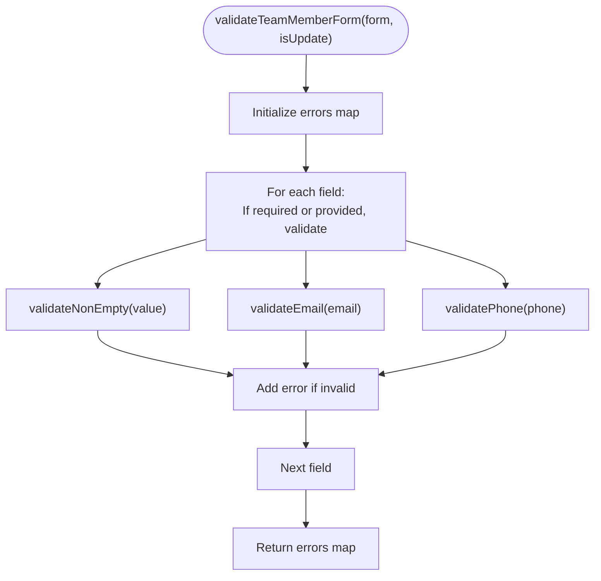

**Diagram sources**
- [teamValidation.ts:1-122](file://app/utils/teamValidation.ts#L1-L122)

**Section sources**
- [teamValidation.ts:1-122](file://app/utils/teamValidation.ts#L1-L122)

### Rate Configuration Validation and Transformation
- Purpose: Validate rate form inputs and convert them to API payloads.
- Validation rules:
  - Customer type selection required for add operations
  - Estimated quantity selection required
  - Pickup rate must be a positive number
  - Effective date must be provided
- Transformation:
  - Convert string inputs to numbers where needed
  - Trim note text
  - Preserve boolean flags and date strings

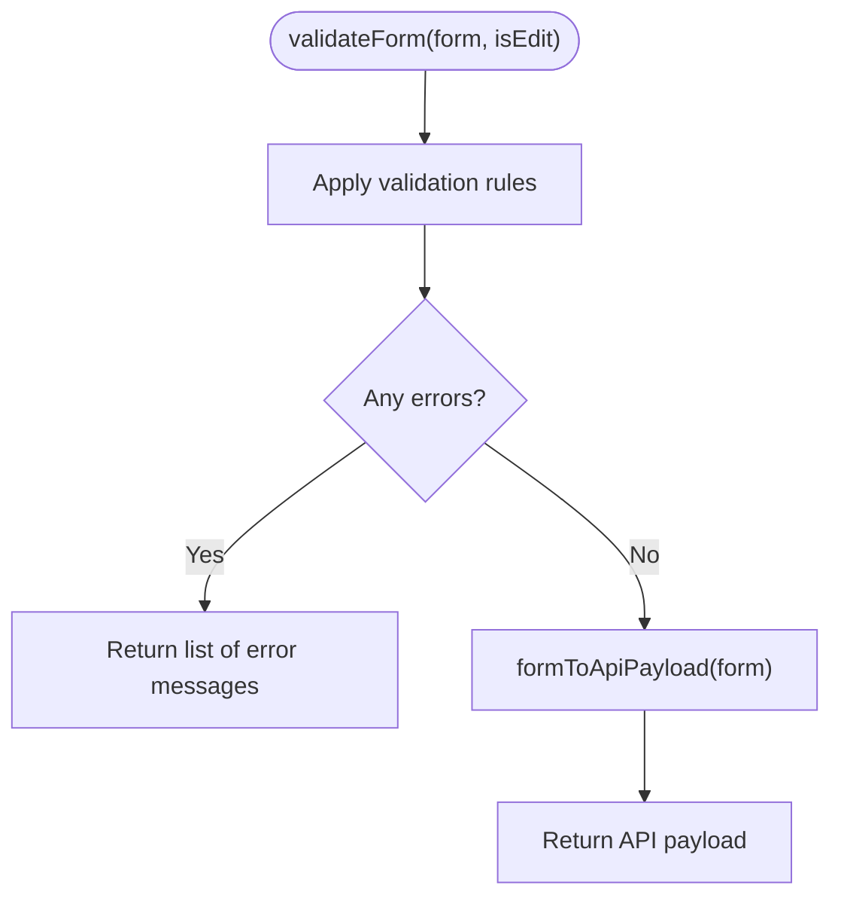

**Diagram sources**
- [rateValidation.ts:1-69](file://app/utils/rateValidation.ts#L1-L69)

**Section sources**
- [rateValidation.ts:1-69](file://app/utils/rateValidation.ts#L1-L69)

### Authentication Utilities
- Purpose: Normalize and evaluate user roles and permissions consistently across the app.
- Capabilities:
  - Normalize role strings or objects to a canonical form
  - Determine admin status based on normalized roles
  - Extract permission lists and check for specific permissions
  - Compare roles case-insensitively and normalize underscores

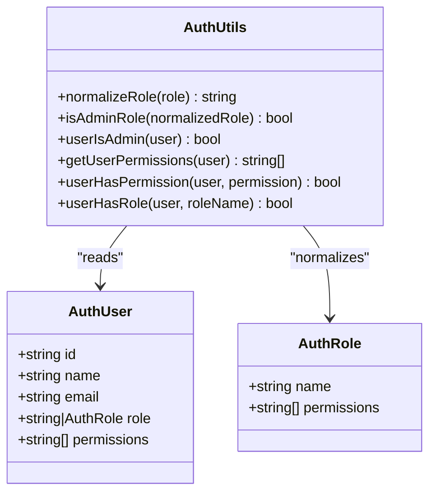

**Diagram sources**
- [auth.ts:1-58](file://app/utils/auth.ts#L1-L58)
- [auth.ts:1-64](file://app/types/auth.ts#L1-L64)

**Section sources**
- [auth.ts:1-58](file://app/utils/auth.ts#L1-L58)
- [auth.ts:1-64](file://app/types/auth.ts#L1-L64)

### Error Handling Composable
- Purpose: Wrap asynchronous operations to automatically show toast errors and return null on failure.
- Behavior:
  - Executes provided async function
  - On exception, shows an error toast with a customizable title and optional message
  - Returns null to simplify caller-side guards

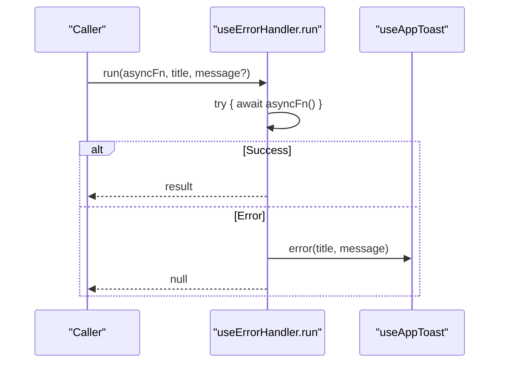

**Diagram sources**
- [useErrorHandler.ts:1-29](file://app/composables/useErrorHandler.ts#L1-L29)
- [useToast.ts:1-37](file://app/composables/useToast.ts#L1-L37)

**Section sources**
- [useErrorHandler.ts:1-29](file://app/composables/useErrorHandler.ts#L1-L29)
- [useToast.ts:1-37](file://app/composables/useToast.ts#L1-L37)

### Permissions Composable
- Purpose: Provide high-level permission and role checks backed by auth utilities.
- Features:
  - Single permission check
  - Any/all checks over multiple permissions
  - Role checks including any-of set
  - Admin shortcut

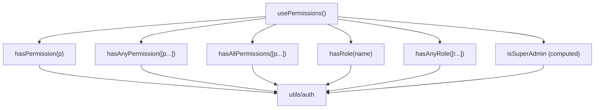

**Diagram sources**
- [usePermissions.ts:1-43](file://app/composables/usePermissions.ts#L1-L43)
- [auth.ts:1-58](file://app/utils/auth.ts#L1-L58)

**Section sources**
- [usePermissions.ts:1-43](file://app/composables/usePermissions.ts#L1-L43)
- [auth.ts:1-58](file://app/utils/auth.ts#L1-L58)

### Toast Composable
- Purpose: Manage global toast notifications with typed methods and auto-dismiss.
- Behavior:
  - Maintains a reactive list of toasts
  - Assigns unique IDs
  - Auto-dismisses after a configurable duration
  - Exposes methods for different severity levels

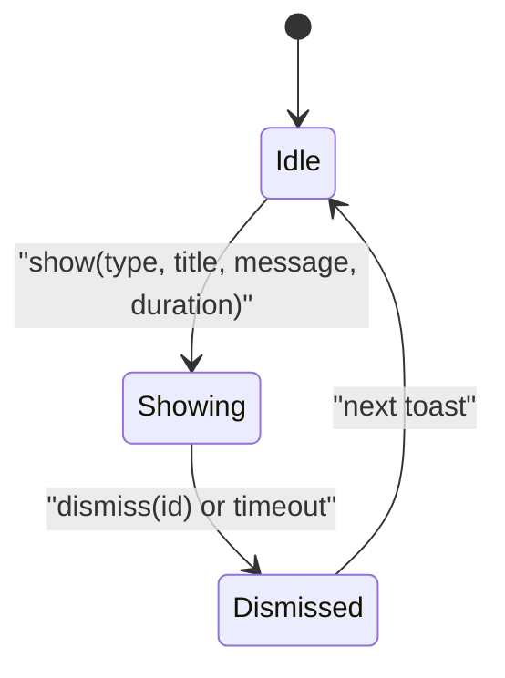

**Diagram sources**
- [useToast.ts:1-37](file://app/composables/useToast.ts#L1-L37)

**Section sources**
- [useToast.ts:1-37](file://app/composables/useToast.ts#L1-L37)

### API Composable
- Purpose: Centralize HTTP requests with authentication, logging, and unified error handling.
- Highlights:
  - Adds Authorization header when token exists
  - Handles 401 by logging out and redirecting
  - Treats 200/201/204 as success
  - Convenience methods for GET/POST/PUT/PATCH/DELETE wrapped with error handling
  - Raw request method for custom handling

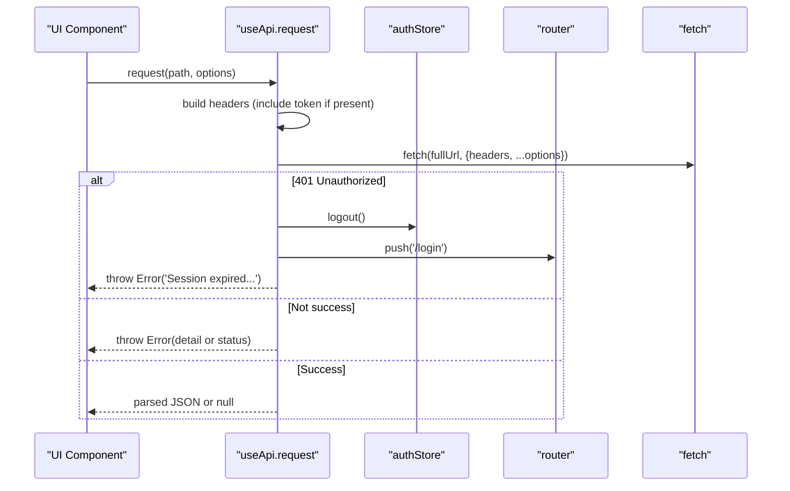

**Diagram sources**
- [useApi.ts:1-91](file://app/composables/useApi.ts#L1-L91)

**Section sources**
- [useApi.ts:1-91](file://app/composables/useApi.ts#L1-L91)

## Dependency Analysis
- Composables depend on:
  - useErrorHandler depends on useToast
  - usePermissions depends on utils/auth
  - useApi depends on useErrorHandler and runtime config
- Utils depend on:
  - teamTransform depends on types/team
  - auth depends on types/auth
- Tests validate:
  - Email validation behavior
  - Rate form validation and payload transformation
  - Team member creation flow (validation + transformation)

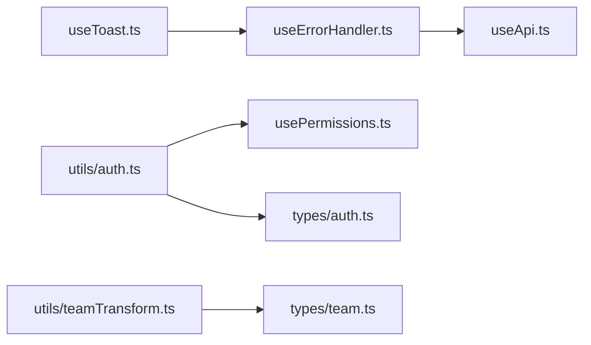

**Diagram sources**
- [useToast.ts:1-37](file://app/composables/useToast.ts#L1-L37)
- [useErrorHandler.ts:1-29](file://app/composables/useErrorHandler.ts#L1-L29)
- [usePermissions.ts:1-43](file://app/composables/usePermissions.ts#L1-L43)
- [auth.ts:1-58](file://app/utils/auth.ts#L1-L58)
- [useApi.ts:1-91](file://app/composables/useApi.ts#L1-L91)
- [teamTransform.ts:1-88](file://app/utils/teamTransform.ts#L1-L88)
- [team.ts:1-65](file://app/types/team.ts#L1-L65)
- [auth.ts:1-64](file://app/types/auth.ts#L1-L64)

**Section sources**
- [useToast.ts:1-37](file://app/composables/useToast.ts#L1-L37)
- [useErrorHandler.ts:1-29](file://app/composables/useErrorHandler.ts#L1-L29)
- [usePermissions.ts:1-43](file://app/composables/usePermissions.ts#L1-L43)
- [auth.ts:1-58](file://app/utils/auth.ts#L1-L58)
- [useApi.ts:1-91](file://app/composables/useApi.ts#L1-L91)
- [teamTransform.ts:1-88](file://app/utils/teamTransform.ts#L1-L88)
- [team.ts:1-65](file://app/types/team.ts#L1-L65)
- [auth.ts:1-64](file://app/types/auth.ts#L1-L64)

## Performance Considerations
- Currency formatting: Creating an Intl.NumberFormat per call has minimal overhead but can be memoized at higher layers if formatting many values frequently.
- Mock data: Shared module-level arrays avoid repeated allocations; ensure immutability when consumed to prevent accidental mutations.
- Validation: Regex-based checks are lightweight; consider caching compiled regexes if performance becomes critical.
- API composable: Centralized logging aids debugging but may impact performance in high-throughput scenarios; consider gating logs behind a feature flag.

[No sources needed since this section provides general guidance]

## Troubleshooting Guide
- Common issues:
  - Invalid currency formatting: Ensure the amount is a finite number before calling the formatter.
  - Unexpected empty fields: Verify trimming and lowercasing steps in transformation utilities.
  - Validation failures: Confirm required fields are provided and formats match expectations (email, phone).
  - API 401 redirects: If users are unexpectedly redirected to login, verify token presence and session validity.
- Debugging tips:
  - Use the API composable’s console logs to inspect request/response details.
  - Inspect toast messages produced by the error handler to identify failing operations.
  - Run unit tests for validation and transformation utilities to catch regressions early.

**Section sources**
- [useApi.ts:1-91](file://app/composables/useApi.ts#L1-L91)
- [useErrorHandler.ts:1-29](file://app/composables/useErrorHandler.ts#L1-L29)
- [teamValidation.ts:1-122](file://app/utils/teamValidation.ts#L1-L122)
- [teamTransform.ts:1-88](file://app/utils/teamTransform.ts#L1-L88)
- [rateValidation.ts:1-69](file://app/utils/rateValidation.ts#L1-L69)

## Conclusion
The utilities and helpers provide a robust foundation for consistent formatting, validation, transformation, and cross-cutting concerns. By centralizing logic in composables and pure utils, the codebase improves reusability, testability, and maintainability. The included tests demonstrate strong coverage of validation and transformation paths, ensuring reliability as the system evolves.

[No sources needed since this section summarizes without analyzing specific files]

## Appendices

### Concrete Usage Examples

- Currency formatting
  - Example: Format a numeric amount using the currency formatter to produce a localized string.
  - Reference: [useCurrency.ts:1-12](file://app/composables/useCurrency.ts#L1-L12)

- Generating test data
  - Example: Retrieve zones, trucks, customer types, and subscription plans from the mock data composable for UI tests or development.
  - Reference: [useMockData.ts:1-61](file://app/composables/useMockData.ts#L1-L61)

- Transforming team data structures
  - Example: Convert a team member form to a create payload, then send it via the API composable.
  - References:
    - [teamTransform.ts:1-88](file://app/utils/teamTransform.ts#L1-L88)
    - [useApi.ts:1-91](file://app/composables/useApi.ts#L1-L91)

- Validating rate configurations
  - Example: Validate a rate form and transform it to an API payload before submission.
  - References:
    - [rateValidation.ts:1-69](file://app/utils/rateValidation.ts#L1-L69)
    - [useApi.ts:1-91](file://app/composables/useApi.ts#L1-L91)

### Reusability Patterns
- Composables encapsulate side effects and shared state (toasts, error handling, permissions).
- Pure utils implement deterministic transformations and validations, making them easy to test and reuse.
- Type definitions centralize contracts between UI and API layers.

[No sources needed since this section provides general guidance]

### Testing Strategies for Utilities
- Property-based testing with fast-check validates broad input spaces and edge cases.
- Unit tests assert expected outputs for representative inputs.
- Integration-style tests combine validation and transformation to simulate real flows.

References:
- [team-validation-email.test.ts:1-166](file://app/utils/__tests__/team-validation-email.test.ts#L1-L166)
- [rates-validation.test.ts:1-427](file://app/pages/management/__tests__/rates-validation.test.ts#L1-L427)
- [rates-create-payload.test.ts:1-192](file://app/pages/management/__tests__/rates-create-payload.test.ts#L1-L192)
- [add-member.test.ts:1-123](file://app/pages/team/__tests__/add-member.test.ts#L1-L123)

### Integration Guidelines for Extending the Utility Library
- Add new validators as pure functions under utils and compose them into form validators.
- Introduce new transformations under utils with clear input/output types.
- Encapsulate new cross-cutting behavior in composables, leveraging existing ones (e.g., useErrorHandler, useToast).
- Keep types centralized under types to ensure consistency across UI and API boundaries.

[No sources needed since this section provides general guidance]